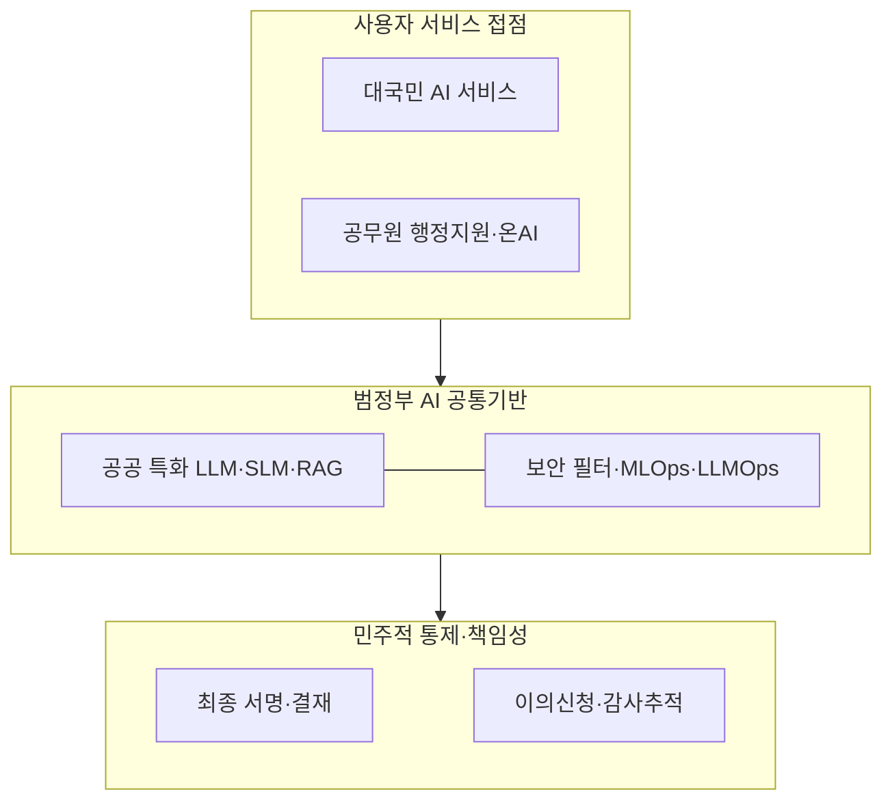
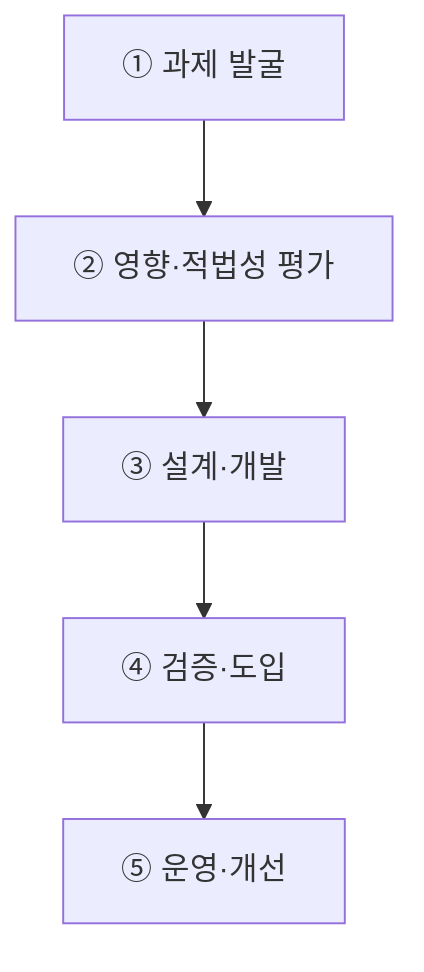
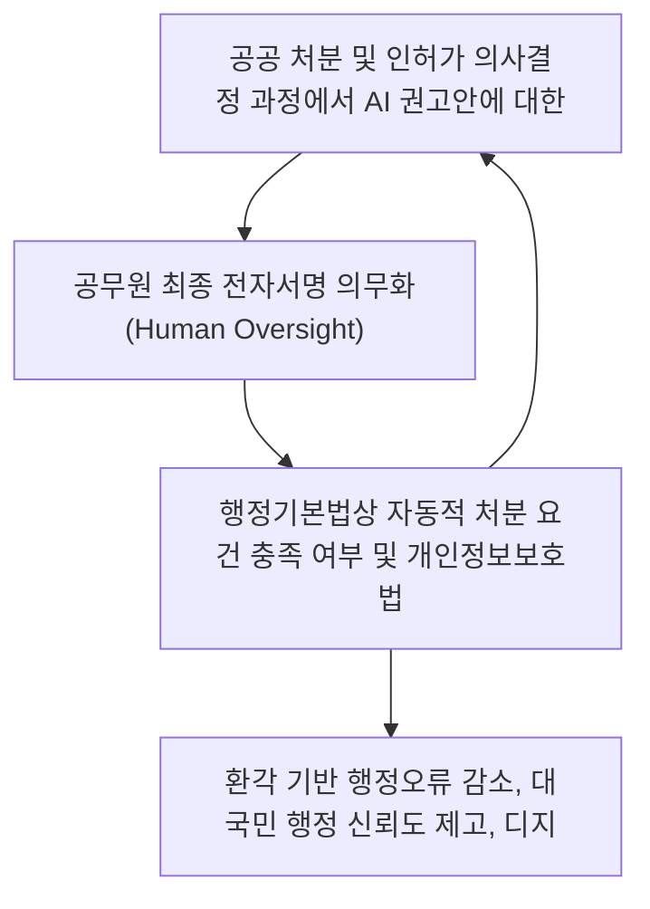

## 지식 로드맵 내 현재 위치
현재 위치: IT 전략·관리 → AI 민주정부·온AI

## 30초 인출

- 본질: 생성형 AI와 공통 플랫폼을 결합하여 대국민 선제 서비스와 공무원 행정(온AI)을 지능화하되, 민주적 통제와 책임성을 유지하는 공공 AX 모델이다.
- 메커니즘: 과제 발굴 → 적법성·영향평가 → 공통기반 연계 개발 → 인간 감독·승인 → 이의신청·사후 감사로 공공 AI 책임성을 통제한다.
- 판정 기준: 공무원의 독립적 검토와 시민의 이의제기·처리 기록이 의사결정 과정에 남는지 확인한다.

핵심 용어

- **온AI**: 공무원의 법령 검토·문서 작성·협업 등을 AI로 지원하는 지능형 업무관리 플랫폼이다.
- **RAG(Retrieval-Augmented Generation)**: 외부 자료에서 검색한 근거를 생성모델의 입력에 넣어 답변을 생성하는 방식이다.
- **Human Oversight**: AI 결과를 사람이 검토·승인·중단할 수 있도록 한 통제이다.
- **Contestability**: AI의 판단으로 영향을 받은 사람이 근거 설명을 요구하고 결과에 이의를 제기할 수 있는 성질이다.
- **DPG(Digital Platform Government)**: 데이터와 서비스를 연계해 국민 중심 서비스를 제공하는 디지털플랫폼정부이다.
- **LLM(Large Language Model)**: 대규모 텍스트로 학습한 범용 생성 언어모델이다.
- **SLM(Small Language Model)**: 특정 용도에 맞춰 경량화한 소형 언어모델이다.
- **MLOps(Machine Learning Operations)**: ML 모델의 개발·배포·운영을 연결하는 실무체계이다.
- **LLMOps(Large Language Model Operations)**: LLM 서비스의 프롬프트·평가·배포·운영을 관리하는 실무체계이다.

## 예상문제

> AI 민주정부의 개념과 구성체계를 설명하고, 공공부문 AI 서비스의 추진절차 및 문제점·대응책을 제시하시오. **(미출제 예상·25점)**

## Ⅰ. 국민서비스와 행정업무를 AI로 혁신하는 정부 모델

> AI 민주정부는 자동처분 정부가 아니라, 공공서비스의 접근성과 행정 생산성을 높이면서 민주적 책임을 유지하는 정부 모델임.

- 정의: AI를 활용하여 **국민서비스**·**정책참여**·공무원 업무를 개선하고 공공 의사결정의 책임성과 투명성을 강화하는 정부 운영모델
- 목적: **선제 안내**·**행정 생산성**·**정책 대응성**·**국민 신뢰** 향상

## Ⅱ. AI 민주정부 구성체계

| 계층 | 핵심 기능 | 책임 통제 |
|---|---|---|
| 대국민 | 맞춤 안내·민원·안전·참여 | 고지·접근성·이의제기 |
| 공무원 | 검색·법령검토·초안·업무지원 | 사용자 확인·최종책임 |
| 공통기반 | 모델·RAG·데이터·API·관제 | 평가·권한·기록·보안 |
| 거버넌스 | 정책·위험등급·조달·감사 | 책임자·승인·사고대응 |

## Ⅲ. 공공 AI 서비스 추진절차

> 서비스 편의보다 법적 근거와 국민 권리에 미치는 영향을 먼저 확인해야 함.

## Ⅳ. 전자정부·DPG·AI 민주정부 비교

| 기준 | 전자정부 | DPG | AI 민주정부 |
|---|---|---|---|
| 초점 | 업무·민원 전산화 | 데이터·서비스 연계 | AI 기반 서비스·업무 혁신 |
| 제공방식 | 온라인 신청 | 통합·맞춤 서비스 | 선제 안내·지능형 지원 |
| 기반 | 정보시스템·포털 | API·Cloud·데이터 | AI 공통기반·RAG·Agent |
| 핵심통제 | 보안·개인정보 | 데이터 책임·상호운용 | 영향평가·인적감독·이의제기 |

## Ⅴ. 문제점·대응책

| 위험 | 대책 | 효과 |
|---|---|---|
| 부정확한 안내·초안 | 근거검색·출처표시·사용자 확인 | 오사용 감소 |
| 편향·서비스 배제 | 영향평가·대표성 검토·대체채널 | 접근권 보호 |
| 자동결정 책임 불명확 | Human Oversight·승인기록 | 책임소재 확보 |
| 개인정보 과다결합 | 목적제한·최소처리·접근통제 | 침해위험 완화 |
| 기관별 중복구축 | 범정부 공통기반 우선 검토 | 비용·파편화 감소 |

## Ⅵ. 설명·이의제기 가능한 행정 Quality Gate

### 학습자 통찰 메모 — 답안 밖

`[핵심 통찰]` 공공 AI의 품질은 답변 정확도만으로 결정되지 않으며, 국민이 AI 사용 사실과 근거를 알고 오류를 정정하거나 이의를 제기할 수 있어야 완성됨.

`나라면` 권리·의무에 영향을 주는 서비스에는 AI 역할·근거·담당자를 표시하고, 인간 재검토와 대체 절차가 확인되어야 운영을 승인하는 Quality Gate를 적용하겠음.

### 실전 답안용 기술사적 제언

- **판정 기준 (Trigger)**: 공공 처분 및 인허가 의사결정 과정에서 AI 권고안에 대한 공무원의 무비판적 수용(Automation Bias) 비율이 목표 기준 이상이거나 이의제기 절차 미안내 시 행정 무효 판정.
- **대응 방안 (Action)**: 공무원 최종 전자서명 의무화(Human Oversight), 법령 조항별 원문 인용 RAG 시스템 강제, 대국민 'AI 결정 사실 및 이의제기(Contestability) 신청권' 명문화.
- **검증 체계 (Verification)**: 행정기본법상 자동적 처분 요건 충족 여부 및 개인정보보호법상 자동화된 결정 거부권 처리 로그를 행정안전부 주관 정기 감찰을 통해 검증함.
- **기대 효과 (Impact)**: 환각 기반 행정오류 감소, 대국민 행정 신뢰도 제고, 디지털 취약계층 권익 보호 및 책임행정 구현을 달성함.

## 1교시 10점 답안 발췌

### 1. 정의·목적

- 정의: AI로 국민서비스·정책참여·공무원 업무를 개선하고 공공 의사결정의 책임성과 투명성을 강화하는 정부 운영모델
- 목적: **선제 안내·행정 생산성·정책 대응성·국민 신뢰** 향상

### 2. 구성 체계

### 3. 핵심 통제

- **Grounded Assistance**: 근거검색·출처표시·사용자 확인
- **Contestability**: 통지·정정·이의제기·인간 재검토

## 출제 이력과 검증 출처

- 공식 문제지 원문으로 확인한 직접 기출 없음
- [행정안전부, AI 민주정부 실현 본격 추진](https://mois.go.kr/frt/bbs/type010/commonSelectBoardArticle.do?bbsId=BBSMSTR_000000000008&nttId=128980)
- [NIA, 공공부문 AI 도입·활용 가이드](https://www.nia.or.kr/site/nia_kor/ex/bbs/View.do?bcIdx=29526&cbIdx=37989)
- [행정안전부, 온AI 모바일 서비스](https://www.mois.go.kr/video/bbs/type019/commonSelectBoardArticle.do?bbsId=BBSMSTR_000000000255&nttId=125757)

## 학습 체크

- [ ] Ⅰ: AI 민주정부의 정의·목적을 설명할 수 있는가?
- [ ] Ⅱ: 대국민·공무원·공통기반·거버넌스 계층을 구분할 수 있는가?
- [ ] Ⅲ: 과제 발굴부터 운영까지 활동과 산출물을 연결할 수 있는가?
- [ ] Ⅳ: 전자정부·DPG·AI 민주정부를 비교할 수 있는가?
- [ ] Ⅴ: 정확성·편향·책임·개인정보 위험의 대응책을 제시할 수 있는가?
- [ ] Ⅵ: 설명·이의제기 가능한 Quality Gate를 제언할 수 있는가?

## 연결 토픽

- 이전 토픽: [AI 고속도로](./051_ai_highway.md)
- 연관 토픽: [범정부 AI 공통기반](./025_pan_government_ai_common_infrastructure.md), [공공 클라우드 전환](./021_public_cloud_native_transition.md)
- 다음 토픽: [AI 프라이버시 위험관리 모델](./054_ai_privacy_risk_management_model.md)
