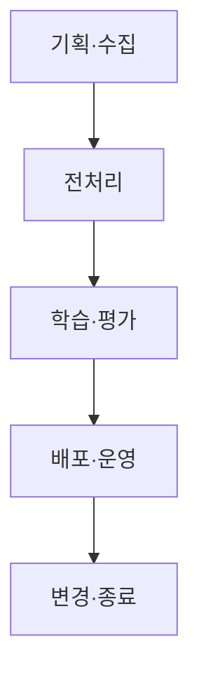
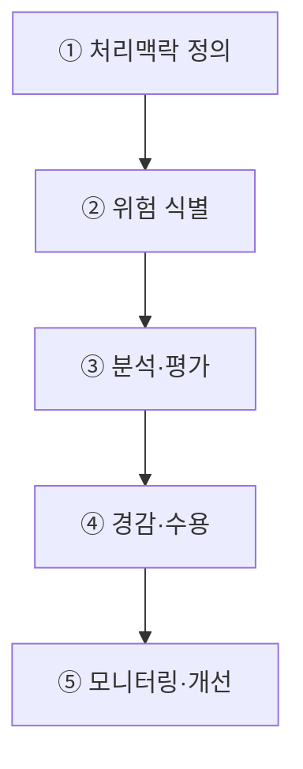

## 지식 로드맵 내 현재 위치
현재 위치: IT 전략·관리 → AI 프라이버시 리스크 관리 모델

## 30초 인출

- 본질: **AI 프라이버시 리스크 관리 모델**: AI의 개인정보 처리에서 위험을 식별하고 줄이는 절차.
- 메커니즘: 처리 맥락 정의 → 위험 식별·평가 → 비례적 경감조치 → 잔여위험 수용 → 운영 모니터링의 반복.
- 판정 기준: 추론 과정의 PII 노출 위험과 멤버십 추론 공격 대응 결과의 사전 정의 검증.

핵심 용어

- **AI 프라이버시 위험관리 모델** : AI 수명주기의 개인정보 처리 위험을 식별·평가·완화하는 관리 절차
- **PbD(Privacy by Design)** : 기획·설계 초기 단계부터 개인정보 보호 기능을 기본값으로 내재화하는 설계 원칙
- **PIA(Privacy Impact Assessment)** : 개인정보 파일 운용이 정보주체에게 미치는 침해 위험을 사전 분석하는 영향평가 제도
- **DPIA(Data Protection Impact Assessment)** : 고위험 데이터 처리의 필요성·비례성·위험 경감 조치를 종합 평가하는 절차(GDPR 기준)
- **Differential Privacy** : 통계적 노이즈를 주입하여 특정 개인 데이터의 포함 여부를 수학적으로 은닉하는 차분 프라이버시 기법
- **Machine Unlearning** : 특정 학습자료의 영향을 줄이거나 제거하도록 모델을 조정하는 방법으로, 제거 범위와 효과는 구현·검증에 따라 달라짐
- **Membership Inference Attack** : 모델 출력값의 신뢰도를 분석하여 특정 데이터가 학습에 사용되었는지 여부를 역추적하는 공격 기법

---

## 1교시 예상문제 (10점)

> AI 프라이버시 리스크 관리 모델의 생애주기별 위험·경감 통제를 설명하시오. (예상·10점)

---

## 1교시 10점 답안

### Ⅰ. **AI 프라이버시 위험관리 모델** 개요

| 구분 | 핵심 |
|---|---|
| 정의 | **AI 프라이버시 위험관리 모델**: AI 수명주기의 개인정보 처리 위험을 식별·평가·대응하는 관리 절차 |
| 목적 | 정보주체 권리 보호와 적법한 데이터 활용 지원 |

### Ⅱ. 생애주기별 경감 통제

### Ⅲ. 핵심 통제

- **Risk-proportionate Control** : 위험수준에 맞춘 기술·관리·절차 통제 조합
- **Residual Risk Accountability** : 잔여위험·수용기준·승인책임·증적 연결

제언: 단계별 개인정보 위험 조치와 잔여위험 승인 책임의 기록.

---

## 2~4교시 예상문제 (25점)

> AI 프라이버시 리스크 관리 모델의 개념과 절차를 설명하고, AI 생애주기별 위험 및 경감방안을 제시하시오. **(미출제 예상·25점)**

---

## 2~4교시 25점 답안

## Ⅰ. **AI 프라이버시 위험관리 모델** 개요

> AI 프라이버시 관리범위: 학습데이터뿐 아니라 모델·입출력에서의 개인정보 노출과 AI 수명주기 전반.

| 구분 | 핵심 |
|---|---|
| 정의 | **AI 프라이버시 위험관리 모델**: AI 수명주기의 개인정보 처리 위험을 식별·평가·대응하는 관리 절차 |
| 목적 | 정보주체 권리 보호와 적법한 데이터 활용 지원 |

## Ⅱ. AI 프라이버시 리스크 유형

| 영역 | 주요 위험 | 판단 관점 |
|---|---|---|
| 데이터 | 과잉수집·목적 외 이용·재식별 | 처리근거·최소처리·출처 |
| 모델 | 암기·추출·Membership Inference | 민감도·노출가능성 |
| 서비스 | Prompt·Output·RAG 개인정보 노출 | 권한·필터·사용맥락 |
| 권리 | 고지·열람·정정·삭제 곤란 | 권리행사 가능성 |
| 관리 | 개발자·제공자·이용자 책임 불명 | 역할·계약·증적 |

## Ⅲ. AI 프라이버시 리스크 관리절차

## Ⅳ. 생애주기별 경감방안

> 보호기술 선정기준: 일률 적용이 아닌 처리목적·데이터 민감도·모델 구조·위험수준에 따른 조합.

| 단계 | 위험 | 경감방안 |
|---|---|---|
| 기획·수집 | 처리근거 부재·과잉수집 | **PbD**·목적명확화·최소수집·**PIA** |
| 전처리 | 식별자 잔존·재식별 | 가명처리·접근통제·합성데이터 검토 |
| 학습·평가 | 암기·추론·추출 | 데이터 정제·정규화·**Differential Privacy (DP)** 적용 검토·공격평가 |
| 배포·운영 | 입출력·**RAG** 개인정보 노출 | 권한검사·필터·로그·신고채널 |
| 변경·종료 | 삭제·책임 단절 | 재학습·**Machine Unlearning** 적용성 검토·증적 관리 |

## Ⅴ. 문제점·대응책

| 위험 | 대책 | 효과 |
|---|---|---|
| 공개정보의 무분별한 학습 | 출처·처리근거·기대가능성 검토 | 적법성 강화 |
| 비정형정보 탐지 누락 | 다중 탐지·표본검수·잔여위험 평가 | 누출가능성 완화 |
| 보호기술로 인한 성능저하 | 위험기반 적용·Utility-Privacy 검증 | 비례성 확보 |
| 삭제요청 이행 곤란 | 데이터·모델 Lineage·재학습 전략 | 권리 대응 |
| 공급망 책임 불명 | 역할·처리조건·사고통지 계약 | 책임 추적 |

## Ⅵ. 잔여위험 승인·재검토 제언

| 문제 | 해결 방안 |
|---|---|
| 잔여위험의 수용 책임자·근거 기록 누락에 따른 시스템·데이터 변경 후 기존 판단 유지 가능성 | 잔여위험별 수용 책임자·근거·보완통제·재검토일 기록과 데이터·모델·사용목적 변경 시 재평가 |

차등프라이버시·언러닝의 위치: 위험 완화를 위한 선택지이며 모든 처리에 적용되는 법정 의무는 아님.

## 출제 이력과 검증 출처

- 공식 문제지 원문으로 확인한 직접 기출 없음
- [개인정보보호위원회, AI 프라이버시 리스크 관리 모델](https://pipc.go.kr/np/cop/bbs/selectBoardArticle.do?bbsId=BS212&mCode=C040020000&nttId=10888)
- [개인정보보호위원회, 생성형 AI 개발·활용을 위한 개인정보 처리 안내서](https://pipc.go.kr/np/cop/bbs/selectBoardArticle.do?bbsId=BS074&mCode=C020010000&nttId=11410)

## 연결 토픽

- 이전 토픽: [AI 민주정부·온AI](./052_ai_democratic_government_on_ai.md)
- 연관 토픽: [NIST AI RMF](./036_nist_ai_rmf.md), [AI 거버넌스 플랫폼](./050_ai_governance_platform.md)
- 다음 토픽: [기술 주권](./058_technology_sovereignty.md)
