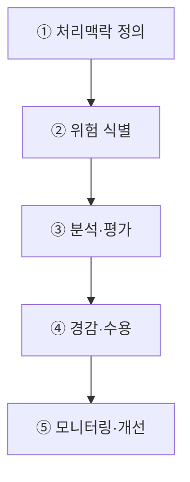
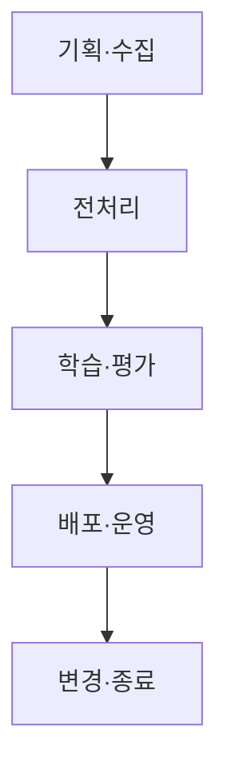
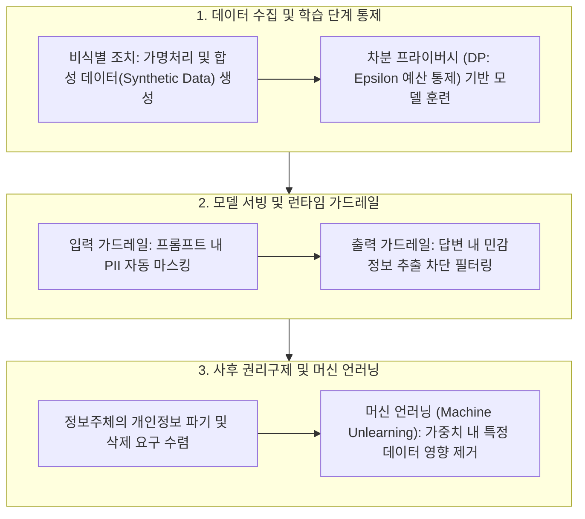

## 지식 로드맵 내 현재 위치
현재 위치: IT 전략·관리 → AI 프라이버시 리스크 관리 모델

## 30초 인출

- 본질: AI 데이터 처리 특성에서 발생하는 프라이버시 위험을 생애주기 전반에 걸쳐 식별·분석·평가하고 비례적 경감조치를 취하는 위험관리 프레임워크이다.
- 메커니즘: 처리 맥락 정의 → 프라이버시 위험 식별·평가 → 비례적 경감조치 → 잔여위험 수용 → 운영 모니터링을 반복한다.
- 판정 기준: 추론 과정의 PII 노출 위험과 멤버십 추론 공격 대응 결과를 사전 정의한 검증 절차로 확인한다.

핵심 용어

- **PbD(Privacy by Design)** : 기획·설계 초기 단계부터 개인정보 보호 기능을 기본값으로 내재화하는 설계 원칙
- **PIA(Privacy Impact Assessment)** : 개인정보 파일 운용이 정보주체에게 미치는 침해 위험을 사전 분석하는 영향평가 제도
- **DPIA(Data Protection Impact Assessment)** : 고위험 데이터 처리의 필요성·비례성·위험 경감 조치를 종합 평가하는 절차(GDPR 기준)
- **Differential Privacy** : 통계적 노이즈를 주입하여 특정 개인 데이터의 포함 여부를 수학적으로 은닉하는 차분 프라이버시 기법
- **Machine Unlearning** : 모델 전체 재학습 없이 특정 데이터셋의 학습 기여분을 선별적으로 제거하는 머신 언러닝 기술
- **Membership Inference Attack** : 모델 출력값의 신뢰도를 분석하여 특정 데이터가 학습에 사용되었는지 여부를 역추적하는 공격 기법

## 예상문제

> AI 프라이버시 리스크 관리 모델의 개념과 절차를 설명하고, AI 생애주기별 위험 및 경감방안을 제시하시오. **(미출제 예상·25점)**

## Ⅰ. AI 데이터 처리 특성에 맞춘 프라이버시 위험관리의 개요

> AI는 학습데이터뿐 아니라 모델과 입출력에서도 개인정보가 노출될 수 있으므로 생애주기 전체를 관리해야 함.

- 정의: AI 데이터 처리의 특성과 맥락을 바탕으로 **프라이버시 위험** 을 식별·분석·평가하고 비례적 경감조치를 적용하는 관리모델
- 목적: **정보주체 권리** · **적법한 데이터 활용** · **책임성** · **지속적 위험관리** 확보

## Ⅱ. AI 프라이버시 리스크 유형

| 영역 | 주요 위험 | 판단 관점 |
|---|---|---|
| 데이터 | 과잉수집·목적 외 이용·재식별 | 처리근거·최소처리·출처 |
| 모델 | 암기·추출·Membership Inference | 민감도·노출가능성 |
| 서비스 | Prompt·Output·RAG 개인정보 노출 | 권한·필터·사용맥락 |
| 권리 | 고지·열람·정정·삭제 곤란 | 권리행사 가능성 |
| 관리 | 개발자·제공자·이용자 책임 불명 | 역할·계약·증적 |

## Ⅲ. AI 프라이버시 리스크 관리절차

## Ⅳ. 생애주기별 경감방안

> 특정 보호기술을 일률 적용하지 않고 처리목적·데이터 민감도·모델 구조·위험수준에 맞게 조합함.

| 단계 | 위험 | 경감방안 |
|---|---|---|
| 기획·수집 | 처리근거 부재·과잉수집 | PbD·목적명확화·최소수집·PIA |
| 전처리 | 식별자 잔존·재식별 | 가명처리·접근통제·합성데이터 검토 |
| 학습·평가 | 암기·추론·추출 | 데이터 정제·정규화·DP·공격평가 |
| 배포·운영 | 입출력·RAG 노출 | 권한검사·필터·로그·신고채널 |
| 변경·종료 | 삭제·책임 단절 | 재학습·Unlearning 검토·증적 폐기 |

## Ⅴ. 문제점·대응책

| 위험 | 대책 | 효과 |
|---|---|---|
| 공개정보의 무분별한 학습 | 출처·처리근거·기대가능성 검토 | 적법성 강화 |
| 비정형정보 탐지 누락 | 다중 탐지·표본검수·잔여위험 평가 | 누출가능성 완화 |
| 보호기술로 인한 성능저하 | 위험기반 적용·Utility-Privacy 검증 | 비례성 확보 |
| 삭제요청 이행 곤란 | 데이터·모델 Lineage·재학습 전략 | 권리 대응 |
| 공급망 책임 불명 | 역할·처리조건·사고통지 계약 | 책임 추적 |

## Ⅵ. Privacy Risk Acceptance Gate 제언

### 실전 답안용 기술사적 제언

- 문제: LLM 등 초거대 AI 모델의 학습 데이터 내 개인정보(PII) 암기(Memorization) 및 인버전 공격을 통한 개인정보 무단 유출 위험이 심화됨.
- 해결 방안: 데이터 수집 단계 가명화 및 차분 프라이버시(DP) 적용, 모델 입출력단 실시간 PII 탐지 가드레일, 정보주체의 삭제 요구권 보장을 위한 머신 언러닝(Machine Unlearning) 프레임워크를 가동함.

## 1교시 10점 답안 발췌

### 1. 정의·목적

- 정의: AI 처리맥락을 바탕으로 프라이버시 위험을 식별·분석·평가하고 비례적 경감조치를 적용하는 관리모델
- 목적: **정보주체 권리·적법한 활용·책임성·지속적 위험관리** 확보

### 2. 생애주기별 경감 통제

### 3. 핵심 통제

- **Risk-proportionate Control** : 위험수준에 맞춘 기술·관리·절차 통제 조합
- **Residual Risk Accountability** : 잔여위험·수용기준·승인책임·증적 연결

## 출제 이력과 검증 출처

- 공식 문제지 원문으로 확인한 직접 기출 없음
- [개인정보보호위원회, AI 프라이버시 리스크 관리 모델](https://pipc.go.kr/np/cop/bbs/selectBoardArticle.do?bbsId=BS212&mCode=C040020000&nttId=10888)
- [개인정보보호위원회, 생성형 AI 개발·활용을 위한 개인정보 처리 안내서](https://pipc.go.kr/np/cop/bbs/selectBoardArticle.do?bbsId=BS074&mCode=C020010000&nttId=11410)

## 학습 체크

- [ ] Ⅰ: 정의·목적을 설명할 수 있는가?
- [ ] Ⅱ: 데이터·모델·서비스·권리·관리 위험을 구분할 수 있는가?
- [ ] Ⅲ: 맥락 정의부터 모니터링까지 활동과 산출물을 연결할 수 있는가?
- [ ] Ⅳ: 생애주기별 위험과 경감방안을 매핑할 수 있는가?
- [ ] Ⅴ: 적법성·탐지·성능·삭제·공급망 문제의 대응책을 제시할 수 있는가?
- [ ] Ⅵ: 잔여위험 승인 Gate를 제언할 수 있는가?

## 연결 토픽

- 이전 토픽: [AI 민주정부·온AI](./052_ai_democratic_government_on_ai.md)
- 연관 토픽: [NIST AI RMF](./036_nist_ai_rmf.md), [AI 거버넌스 플랫폼](./050_ai_governance_platform.md)
- 다음 토픽: [기술 주권](./058_technology_sovereignty.md)
