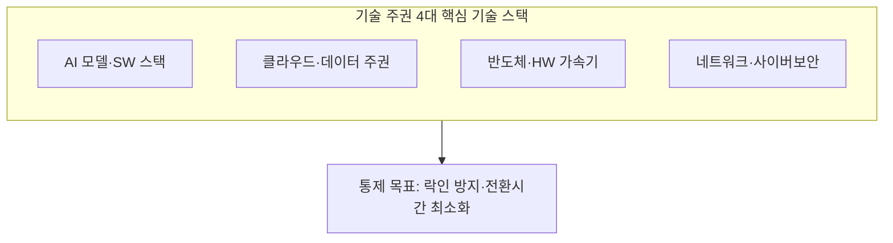
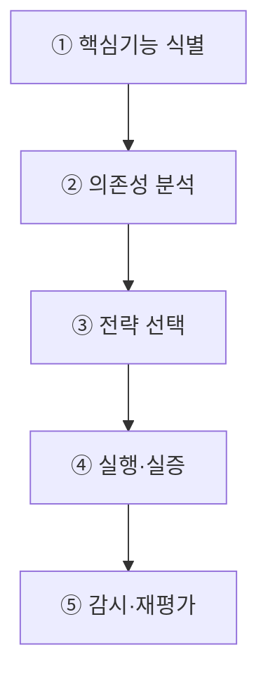
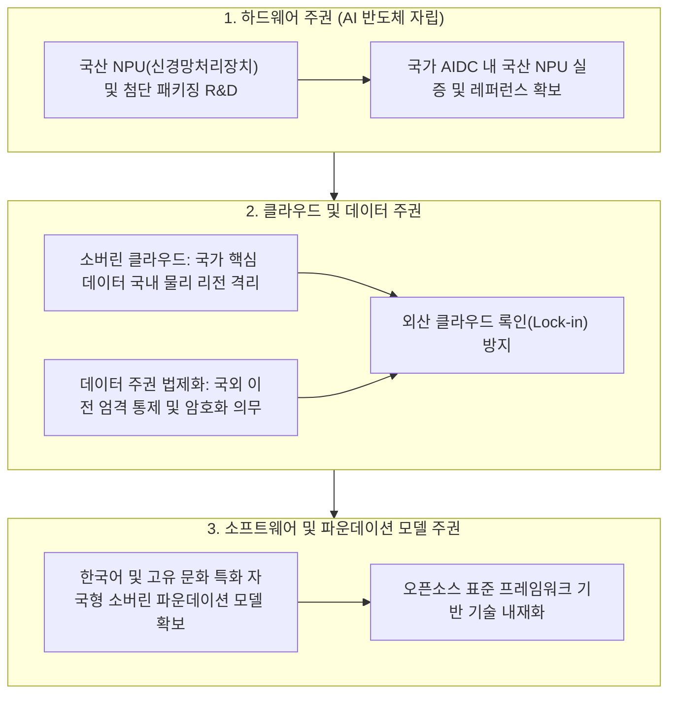

## 지식 로드맵 내 현재 위치
현재 위치: IT 전략·관리 → 기술 주권

## 30초 인출

- 본질: 핵심기술을 직접 개발하거나 신뢰 가능한 경로로 조달할 선택권·통제력·회복력이다.
- 메커니즘: 핵심기능 식별 → 의존성 분석 → 전략 선택(내재화/다변화/비축) → 실행·실증 → 감시·재평가한다.
- 판정 기준: 핵심 기술의 공급 의존성과 대체 경로를 점검하고 전환 훈련 결과로 복원 가능성을 검증한다.

핵심 용어

- **Technology Sovereignty**: 핵심기술의 개발·조달·운영을 특정 외부 공급자에 일방적으로 의존하지 않고 수행할 수 있는 역량이다.
- **Strategic Autonomy**: 외부 충격 속에서도 국가가 필요한 행동을 선택·지속할 수 있는 능력이다.
- **GVC(Global Value Chain)**: 연구·부품·생산·서비스가 국가 간 분업되는 가치사슬이다.
- **Friend-shoring**: 공급망을 신뢰 가능한 국가·지역 중심으로 재편하는 전략이다.
- **Open Strategic Autonomy**: 개방성과 국제협력을 유지하면서 핵심 의존 위험을 줄이는 접근이다.
- **SBOM(Software Bill of Materials)**: SW 구성요소·버전·의존관계를 기록한 명세이다.

## 예상문제

> 기술 주권의 개념과 확보전략을 설명하고, 디지털 기술 공급망의 문제점과 대응책을 제시하시오. **(미출제 예상·25점)**

## Ⅰ. 일방적 기술 의존을 줄이는 전략적 역량

> 기술 주권은 모든 기술을 국산화하는 폐쇄전략이 아니라, 핵심 기능을 스스로 선택·통제·복구할 수 있도록 의존구조를 관리하는 역량임.

- 정의: 국가가 복지·경쟁력·안보에 중요한 **전략기술**을 개발하거나 일방적 구조 의존 없이 조달·운용할 수 있는 역량
- 목적: **공급망 회복력**·**전략적 자율성**·**산업경쟁력**·**공공서비스 연속성** 확보

## Ⅱ. 기술 주권 대상과 통제수단

| 대상 | 주요 의존위험 | 통제수단 |
|---|---|---|
| 반도체·가속기 | 특정 공급자·장비·소재 | 다변화·비축·대체설계·공동 R&D |
| Cloud·Data | 관할권·Lock-in·역외이전 | Portability·암호화·계약·Exit Plan |
| AI·SW | 모델·Library·API 종속 | Open Standard·SBOM·대체모델·평가 |
| Network·보안 | 장비·업데이트·취약점 | 다중공급·인증·패치권한·관제 |
| 인재·지식재산 | 핵심인력·특허 집중 | 인재양성·공동연구·IP 전략 |

## Ⅲ. 기술 주권 확보 절차

## Ⅳ. 효율성 중심 조달과 기술 주권 조달 비교

| 기준 | 효율성 중심 | 기술 주권 중심 |
|---|---|---|
| 우선가치 | 단기 비용·성능 | 연속성·통제력·대체가능성 |
| 공급구조 | 최적 단일공급 | 다중공급·동맹·내재화 |
| 계약 | 구매·SLA 중심 | Portability·Escrow·Exit 포함 |
| 평가 | 가격·기능 | TCO·집중도·전환시간·회복력 |
| 위험 | 외부충격 취약 | 비용증가·보호주의·고립 |

## Ⅴ. 문제점·대응책

| 위험 | 대책 | 효과 |
|---|---|---|
| 전면 국산화로 자원 분산 | 핵심기능·병목 중심 선택과 집중 | 투자 효율 향상 |
| 독자규격·갈라파고스화 | 국제표준·Open Source·상호운용 시험 | 생태계 호환 |
| 보조금 의존·시장성 부족 | 공공실증 후 민간 경쟁·성과평가 | 자생력 강화 |
| 공급자 Lock-in | Portability·SBOM·Exit Plan | 전환 가능성 확보 |
| 보호주의·통상마찰 | 위험기반·기술중립·국제공조 | 정책 정당성 강화 |

## Ⅵ. Dependency Budget 기반 제언

### 실전 답안용 기술사적 제언

- 문제: 해외 특정 빅테크 기업에 대한 하드웨어(GPU), 클라우드 인프라, 초거대 AI 모델 종속으로 국가 데이터 유출 및 공급망 차단 시 디지털 마비 위험이 초래됨.
- 해결 방안: 국가 차원의 소버린 AI(Sovereign AI) 및 국산 AI 반도체(NPU) 독자 생태계를 집중 육성하고, 공공·안보 핵심 데이터는 국가 소버린 클라우드 내 저장을 의무화하며 개방형 표준 파이프라인을 구축함.

## 1교시 10점 답안 발췌

### 1. 정의·목적

- 정의: 핵심기술을 개발하거나 일방적 구조 의존 없이 조달·운용할 수 있는 국가 역량
- 목적: **공급망 회복력·전략적 자율성·산업경쟁력·서비스 연속성** 확보

### 2. 핵심 기술 스택 및 통제 아키텍처

### 3. 핵심 통제

- **Dependency Map**: 공급자·국가·기술·계약 의존 가시화
- **Dependency Budget**: 허용 집중도·목표 전환시간 기반 완화 투자

## 출제 이력과 검증 출처

- 공식 문제지 원문으로 확인한 직접 기출 없음
- [OECD, Strategic autonomy and promotion of critical technologies](https://stip.oecd.org/stip/interactive-dashboards/themes/TH111)
- [OECD, Science, technology and innovation policy in times of strategic competition](https://www.oecd.org/en/publications/oecd-science-technology-and-innovation-outlook-2023_0b55736e-en/full-report/component-6.html)
- [OECD, Digital public goods: Enablers of digital sovereignty](https://www.oecd.org/en/publications/development-co-operation-report-2021_ce08832f-en/full-report/component-41.html)

## 학습 체크

- [ ] Ⅰ: 기술 주권의 정의·목적을 설명할 수 있는가?
- [ ] Ⅱ: 반도체·Cloud·AI·Network·인재의 의존위험을 구분할 수 있는가?
- [ ] Ⅲ: 핵심기능 식별부터 재평가까지 활동과 산출물을 연결할 수 있는가?
- [ ] Ⅳ: 효율성 중심 조달과 기술 주권 조달을 비교할 수 있는가?
- [ ] Ⅴ: 자원분산·고립·Lock-in 위험의 대응책을 제시할 수 있는가?
- [ ] Ⅵ: Dependency Budget을 제언할 수 있는가?

## 연결 토픽

- 이전 토픽: [AI 프라이버시 리스크 관리 모델](./054_ai_privacy_risk_management_model.md)
- 연관 토픽: [AI 고속도로](./051_ai_highway.md), [AI 에너지 인프라](./060_ai_energy_infrastructure.md)
- 다음 토픽: [시스템 운영 감리](./059_system_operation_audit.md)
