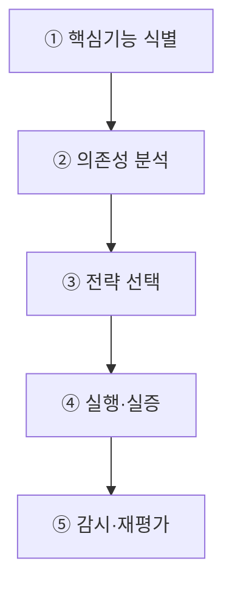

## 지식 로드맵 내 현재 위치
현재 위치: IT 전략·관리 → 기술 주권

## 30초 인출

- 본질: **기술 주권**: 핵심기술을 직접 개발하거나 신뢰할 수 있는 곳에서 조달할 선택권과 통제력.
- 메커니즘: 핵심기능 식별 → 의존성 분석 → 내재화·다변화·비축 중 전략 선택 → 실행·실증 → 감시·재평가.
- 판정 기준: 핵심기술의 공급의존성·대체경로와 전환훈련을 통한 복원 가능성.

핵심 용어

- **기술 주권(Technology Sovereignty)** : 핵심 기술·서비스의 선택과 운영, 의존 위험을 자주적으로 관리하는 역량
- **Technology Sovereignty** : 핵심 기술의 개발·조달·운영을 특정 공급자에 종속되지 않고 자주적으로 통제하는 전략적 역량
- **Strategic Autonomy** : 공급망 충격이나 지정학적 위기 속에서도 국가가 필요한 전략을 자율적으로 선택·지속하는 능력
- **GVC(Global Value Chain)** : 연구개발·생산·유통·서비스가 국가 간 분업으로 연결된 글로벌 가치 사슬
- **Friend-shoring** : 공급망 단절 위험을 완화하기 위해 가치를 공유하는 동맹·우방국 중심으로 공급망을 재편하는 전략
- **Open Strategic Autonomy** : 다자간 개방 무역을 유지하면서도 핵심 기술의 대외 의존 위험을 완화하는 개방형 전략적 자율성
- **SBOM(Software Bill of Materials)** : 소프트웨어를 구성하는 컴포넌트·오픈소스·버전·종속성을 명시한 소프트웨어 자재명세서

---

## 1교시 예상문제 (10점)

> 기술 주권의 핵심 기술 스택과 공급망 의존 위험 통제를 설명하시오. (예상·10점)

---

## 1교시 10점 답안

### Ⅰ. **기술 주권** 개요

| 구분 | 핵심 |
|---|---|
| 정의 | **기술 주권**: 핵심기술·서비스를 선택·운영하고 의존위험을 관리할 수 있는 역량 |
| 목적 | 핵심기능 연속성과 기술 선택권의 유지 |

### Ⅱ. 핵심 기술 스택 및 통제 아키텍처

| 대상 | 주요 의존위험 | 통제 예시 |
|---|---|---|
| 반도체·가속기 | 특정 공급자·장비·소재 | 다변화·대체설계·공동 연구 |
| 클라우드·데이터 | 관할권·Lock-in·이전 제한 | Portability·계약상 Exit Plan |
| AI·소프트웨어 | 모델·라이브러리·API 종속 | 개방형 표준·**SBOM**·대체수단 평가 |
| 네트워크·보안 | 장비·업데이트·취약점 | 공급망 점검·패치권한·관제 |

### Ⅲ. 핵심 통제

- **Dependency Map** : 공급자·국가·기술·계약에 대한 의존관계를 표시한 구조도
- **Dependency Budget** : 공급 집중도 허용치와 전환시간 목표를 기준으로 정한 의존위험 완화 기준

제언: 대체경로가 필요한 핵심기능을 먼저 정하고 공급망 의존관계 점검.

---

## 2~4교시 예상문제 (25점)

> 기술 주권의 개념과 확보전략을 설명하고, 디지털 기술 공급망의 문제점과 대응책을 제시하시오. **(미출제 예상·25점)**

---

## 2~4교시 25점 답안

## Ⅰ. **기술 주권** 개요

> 기술 주권은 모든 기술을 국산화하는 폐쇄전략이 아니라, 핵심 기능을 스스로 선택·통제·복구할 수 있도록 의존구조를 관리하는 역량임.

| 구분 | 핵심 |
|---|---|
| 정의 | **기술 주권**: 핵심기술·서비스를 선택·운영하고 의존위험을 관리할 수 있는 역량 |
| 목적 | 핵심기능 연속성과 기술 선택권의 유지 |

## Ⅱ. 기술 주권 대상과 통제수단

| 대상 | 주요 의존위험 | 통제수단 |
|---|---|---|
| 반도체·가속기 | 특정 공급자·장비·소재 | 다변화·비축·대체설계·공동 R&D |
| Cloud·Data | 관할권·Lock-in·역외이전 | Portability·암호화·계약·Exit Plan |
| AI·SW | 모델·Library·API 종속 | Open Standard·**SBOM**·대체모델·평가 |
| Network·보안 | 장비·업데이트·취약점 | 다중공급·인증·패치권한·관제 |
| 인재·지식재산 | 핵심인력·특허 집중 | 인재양성·공동연구·IP 전략 |

## Ⅲ. 기술 주권 확보 절차

## Ⅳ. 효율성 중심 조달과 기술 주권 조달 비교

| 기준 | 효율성 중심 | 기술 주권 중심 |
|---|---|---|
| 우선가치 | 단기 비용·성능 | 연속성·통제력·대체가능성 |
| 공급구조 | 최적 단일공급 | 다중공급·동맹·내재화 |
| 계약 | 구매·SLA 중심 | Portability·Escrow·Exit 포함 |
| 평가 | 가격·기능 | TCO·집중도·전환시간·회복력 |
| 위험 | 외부충격 취약 | 비용증가·보호주의·고립 |

## Ⅴ. 문제점·대응책

| 위험 | 대책 | 효과 |
|---|---|---|
| 전면 국산화로 자원 분산 | 핵심기능·병목 중심 선택과 집중 | 투자 효율 향상 |
| 독자규격·갈라파고스화 | 국제표준·Open Source·상호운용 시험 | 생태계 호환 |
| 보조금 의존·시장성 부족 | 공공실증 후 민간 경쟁·성과평가 | 자생력 강화 |
| 공급자 Lock-in | Portability·SBOM·Exit Plan | 전환 가능성 확보 |
| 보호주의·통상마찰 | 위험기반·기술중립·국제공조 | 정책 정당성 강화 |

## Ⅵ. 공급중단 대비 전환훈련 제언

| 문제 | 해결 방안 |
|---|---|
| 계약서의 이전조항·구성목록만으로는 확인하기 어려운 핵심서비스의 실제 대체환경 이전 가능성 | 중요서비스의 데이터 내보내기·대체환경 배포·접속전환 시험과 발견된 의존성·소요시간의 다음 조달·개선계획 반영 |

제안의 범위: 선택권을 실제 복구능력으로 확인하기 위한 시험. 전면 국산화·국내 저장의 일률적 요구는 아님.

## 출제 이력과 검증 출처

- 공식 문제지 원문으로 확인한 직접 기출 없음
- [OECD, Strategic autonomy and promotion of critical technologies](https://stip.oecd.org/stip/interactive-dashboards/themes/TH111)
- [OECD, Science, technology and innovation policy in times of strategic competition](https://www.oecd.org/en/publications/oecd-science-technology-and-innovation-outlook-2023_0b55736e-en/full-report/component-6.html)
- [OECD, Digital public goods: Enablers of digital sovereignty](https://www.oecd.org/en/publications/development-co-operation-report-2021_ce08832f-en/full-report/component-41.html)

## 연결 토픽

- 이전 토픽: [AI 프라이버시 리스크 관리 모델](./054_ai_privacy_risk_management_model.md)
- 연관 토픽: [AI 고속도로](./051_ai_highway.md), [AI 에너지 인프라](./060_ai_energy_infrastructure.md)
- 다음 토픽: [시스템 운영 감리](./059_system_operation_audit.md)
