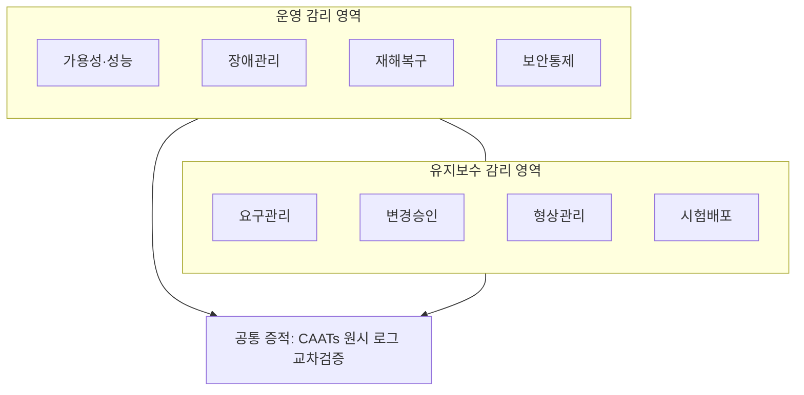
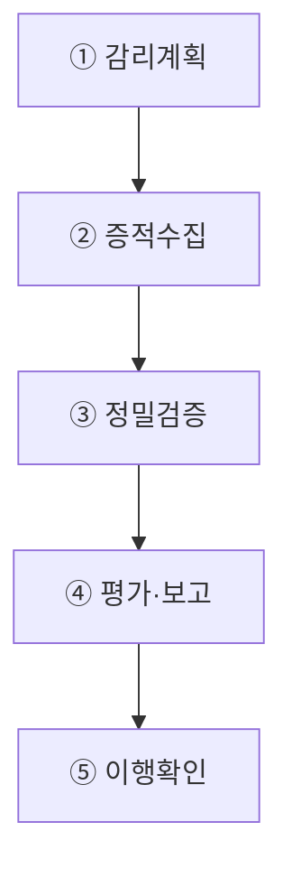
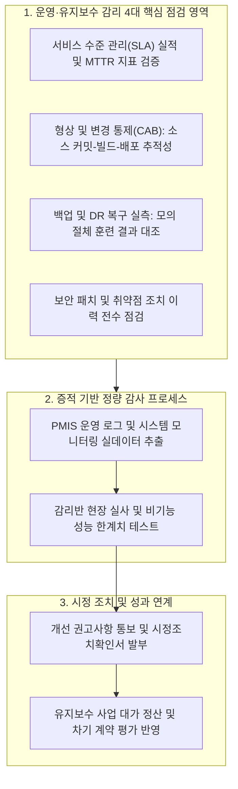

## 지식 로드맵 내 현재 위치
현재 위치: IT 전략·관리 → 시스템 운영·유지보수 감리

## 30초 인출

- 본질: 시스템 운영·유지보수 감리는 독립된 제3자가 운영과 유지보수가 기준에 맞게 이뤄지는지 증거로 점검하는 활동이다.
- 메커니즘: 감리계획 수립 → 증적 수집(원시 로그·티켓) → 표본·재수행 검증 → 영향도 평가·보고 → 시정조치 이행확인한다.
- 판정 기준: **SLA** 보고값이 원시 로그와 일치하고 서비스 요청부터 배포까지 변경 추적성이 확보되는지 확인한다.

핵심 용어

- **SLA(Service Level Agreement)** : 서비스 수준 목표와 측정·보고·위반 페널티를 규정한 계약 협약
- **ITSM(IT Service Management)** : IT 서비스의 기획·운영·개선을 지원하는 Best Practice 기반 관리 체계
- **SR(Service Request)** : 시스템 아키텍처 변경 없이 정보 제공·계정 권한 등을 처리하는 표준 서비스 요청
- **RTO(Recovery Time Objective)** : 장애 발생 시 서비스 정상 가동까지 허용되는 최대 목표 복구 시간
- **RPO(Recovery Point Objective)** : 서비스 복원 시 데이터 유실을 감내할 수 있는 최대 목표 복구 시점
- **CAATs(Computer-Assisted Audit Techniques)** : 대용량 로그와 트랜잭션을 전산 도구로 추출·검증하는 컴퓨터 기반 감사 기법

---

## 1교시 예상문제 (10점)

> 시스템 운영·유지보수 감리의 점검영역과 증적 검증 방식을 설명하시오. (예상·10점)

---

## 1교시 10점 답안

### 1. 정의·목적

- 정의: 독립된 제3자가 정보시스템 운영·유지보수의 효율성·안전성·계약이행을 점검하고 개선을 권고하는 활동
- 목적: **서비스 연속성·통제 실효성·변경 품질·계약 투명성** 확보

### 2. 점검영역 및 핵심 검증 프레임워크

### 3. 핵심 통제

- **Evidence Cross-check** : 보고서와 원시 Log·설정·Ticket 교차검증
- **End-to-end Traceability** : SR → 승인 → Commit → Test → 배포 → 종결

---

## 2~4교시 예상문제 (25점)

> 시스템 운영 감리와 유지보수 감리의 개념·점검영역을 비교하고, 증적 기반 감리절차 및 문제점·대응책을 설명하시오. **(미출제 예상·25점)**

---

## 2~4교시 25점 답안

## Ⅰ. 가동 후 효율성·안전성·계약이행을 검증하는 독립 활동의 개요

> 운영·유지보수 감리는 체크리스트 확인이 아니라 통제가 실제 작동하고 결과가 추적되는지 증적으로 판단하는 활동임.

- 정의: **독립된 제3자** 가 정보시스템 운영·유지보수의 효율성·안전성·계약이행을 종합 점검하고 개선을 권고하는 활동
- 목적: **서비스 연속성** · **운영통제 실효성** · **변경 품질** · **계약 투명성** 확보

## Ⅱ. 운영 감리와 유지보수 감리 비교

| 기준 | 운영 감리 | 유지보수 감리 |
|---|---|---|
| 대상 | 운영기획·관제·지원·인프라 | 기능변경·추가·보완·폐기 |
| 초점 | 가용성·성능·보안·연속성 | 요구·변경·결함·형상·계약 |
| 증적 | SLA·Log·Ticket·백업·훈련 | SR·승인·Commit·시험·배포 |
| 시험 | 표본복원·장애기록 재수행 | 변경 추적·회귀시험·형상감사 |
| 결과 | 운영통제 개선 | 변경품질·과업이행 개선 |

## Ⅲ. 핵심 점검영역

| 영역 | 점검사항 | 증적 |
|---|---|---|
| 서비스 | SLA·Incident·Problem·사용자지원 | SLA 보고·Ticket·RCA |
| 성능·용량 | 병목·추세·임계치·증설 | APM·용량계획 |
| 연속성 | 백업·복구·DR·RTO·RPO | 복원기록·훈련결과 |
| 보안 | 계정·변경·취약점·Log | 권한목록·패치·감사로그 |
| 유지보수 | SR·영향분석·시험·배포·형상 | 승인·Commit·Test Result |
| 계약 | 범위·인력·성과·검수·변경 | 계약·작업내역·검수결과 |

## Ⅳ. 증적 기반 감리절차

## Ⅴ. 문제점·대응책

| 위험 | 대책 | 효과 |
|---|---|---|
| 문서와 실제 운영 불일치 | Log·설정·Ticket 교차대조 | 증적 신뢰성 향상 |
| 백업 성공만 확인 | 격리환경 표본복원·복구시간 측정 | 복구 가능성 확인 |
| SLA 평균값의 장애 은폐 | 구간·서비스별 SLI 재계산 | 품질 왜곡 감소 |
| 구두 변경·무상과업 | SR-승인-Commit-배포 추적 | 범위·책임 명확화 |
| 운영계 시험 위험 | 사전 승인·격리·Rollback·관찰자 | 서비스 영향 통제 |

## Ⅵ. Evidence Traceability 기반 제언

### 실전 답안용 기술사적 제언

- 문제: 정보시스템 운영 감리가 단순 체크리스트 기반 문서 확인에 그쳐 운영 중 발생하는 누적 결함, 성능 저하, SLA 미달 및 백업·복구 불가 위험을 사전에 방지하지 못함.
- 해결 방안: 행안부 감리기준에 따른 운영 점검 4대 영역(서비스 수준, 변경·형상 통제, 재해복구 실측, 보안 취약점 패치)을 실데이터 기반으로 정량 점검하고, 감리 시정조치 이행을 서비스 대가 지급과 연계함.

## 출제 이력과 검증 출처

- 제137회 정보관리기술사: 시스템 운영 및 유지보수 감리 관련 문제
- [국가법령정보센터, 정보시스템 감리기준](https://www.law.go.kr/LSW/admRulLsInfoP.do?admRulSeq=2100000243290)
- [국가법령정보센터, 정보시스템 구축·운영 지침](https://www.law.go.kr/LSW/admRulInfoP.do?admRulSeq=2000000063674)

## 연결 토픽

- 이전 토픽: [기술 주권](./058_technology_sovereignty.md)
- 연관 토픽: [정보시스템 감리](./008_it_audit.md), [SLA](./006_sla.md), [DRS](./042_drs.md)
- 다음 토픽: [AI 에너지 인프라](./060_ai_energy_infrastructure.md)
