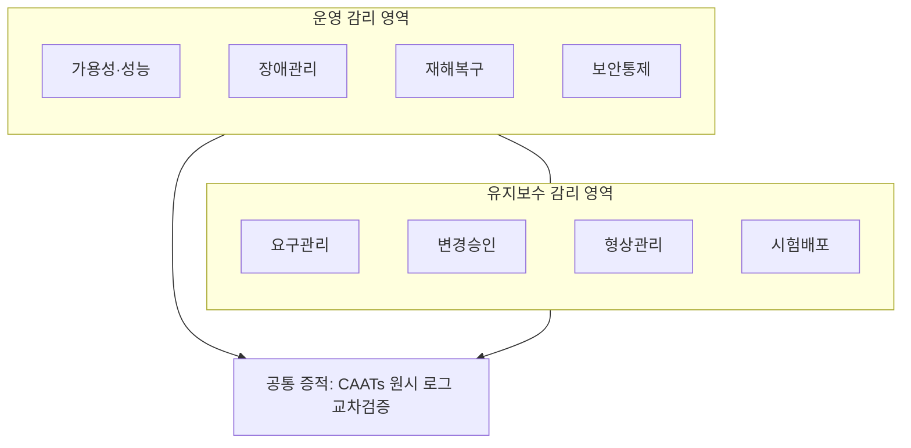
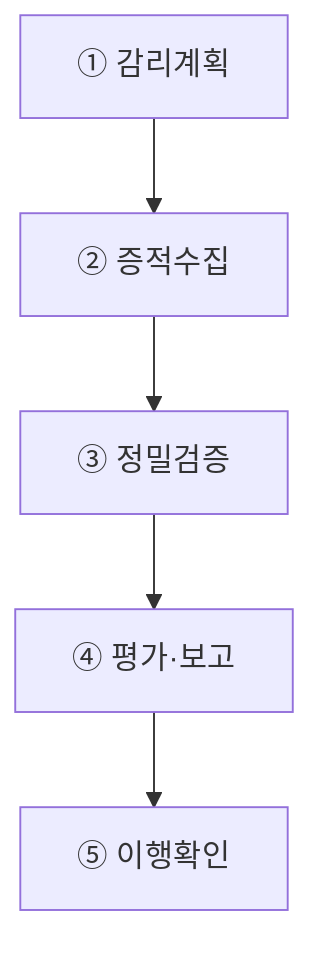
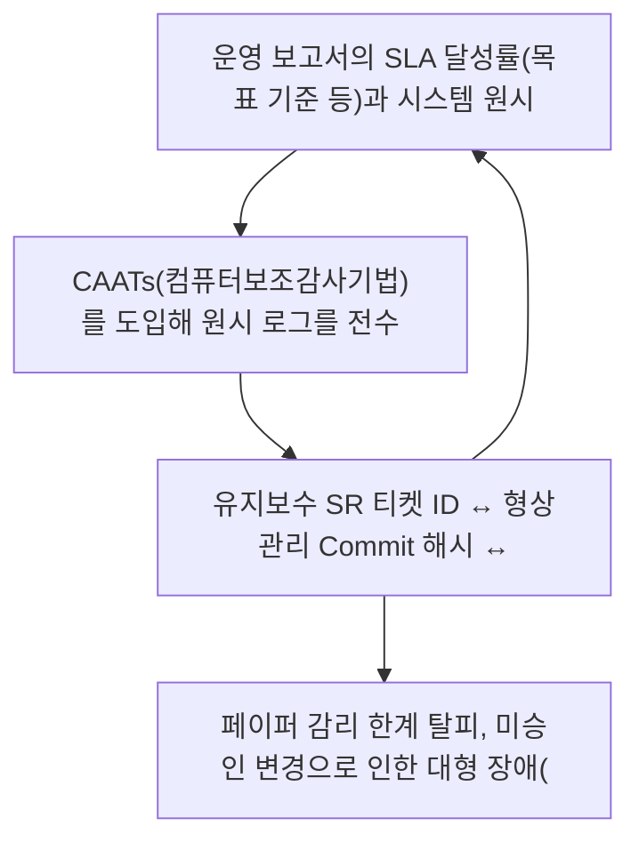

## 지식 로드맵 내 현재 위치
현재 위치: IT 전략·관리 → 시스템 운영·유지보수 감리

## 30초 인출

- 본질: 독립된 제3자가 운영·유지보수의 효율성·안전성·계약이행을 원시 증적 기반으로 종합 점검하는 활동이다.
- 메커니즘: 감리계획 수립 → 증적 수집(원시 로그·티켓) → 표본·재수행 검증 → 영향도 평가·보고 → 시정조치 이행확인한다.
- 판정 기준: SLA 보고값이 원시 로그와 일치하고 서비스 요청부터 배포까지 변경 추적성이 확보되는지 확인한다.

핵심 용어

- **SLA(Service Level Agreement)**: 서비스 수준과 측정·보고·책임을 합의한 문서이다.
- **ITSM(IT Service Management)**: IT 서비스를 계획·제공·운영·개선하는 관리체계이다.
- **SR(Service Request)**: 사용자 또는 운영자가 공식 절차로 등록한 서비스 요청이다.
- **RTO(Recovery Time Objective)**: 중단 후 서비스를 복구해야 하는 목표시간이다.
- **RPO(Recovery Point Objective)**: 복구 시 허용 가능한 데이터 손실 시점이다.
- **CAATs(Computer-Assisted Audit Techniques)**: 데이터·Log 분석 등에 사용하는 컴퓨터 기반 감사기법이다.

## 예상문제

> 시스템 운영 감리와 유지보수 감리의 개념·점검영역을 비교하고, 증적 기반 감리절차 및 문제점·대응책을 설명하시오. **(미출제 예상·25점)**

## Ⅰ. 가동 후 효율성·안전성·계약이행을 검증하는 독립 활동

> 운영·유지보수 감리는 체크리스트 확인이 아니라 통제가 실제 작동하고 결과가 추적되는지 증적으로 판단하는 활동임.

- 정의: **독립된 제3자**가 정보시스템 운영·유지보수의 효율성·안전성·계약이행을 종합 점검하고 개선을 권고하는 활동
- 목적: **서비스 연속성**·**운영통제 실효성**·**변경 품질**·**계약 투명성** 확보

## Ⅱ. 운영 감리와 유지보수 감리 비교

| 기준 | 운영 감리 | 유지보수 감리 |
|---|---|---|
| 대상 | 운영기획·관제·지원·인프라 | 기능변경·추가·보완·폐기 |
| 초점 | 가용성·성능·보안·연속성 | 요구·변경·결함·형상·계약 |
| 증적 | SLA·Log·Ticket·백업·훈련 | SR·승인·Commit·시험·배포 |
| 시험 | 표본복원·장애기록 재수행 | 변경 추적·회귀시험·형상감사 |
| 결과 | 운영통제 개선 | 변경품질·과업이행 개선 |

## Ⅲ. 핵심 점검영역

| 영역 | 점검사항 | 증적 |
|---|---|---|
| 서비스 | SLA·Incident·Problem·사용자지원 | SLA 보고·Ticket·RCA |
| 성능·용량 | 병목·추세·임계치·증설 | APM·용량계획 |
| 연속성 | 백업·복구·DR·RTO·RPO | 복원기록·훈련결과 |
| 보안 | 계정·변경·취약점·Log | 권한목록·패치·감사로그 |
| 유지보수 | SR·영향분석·시험·배포·형상 | 승인·Commit·Test Result |
| 계약 | 범위·인력·성과·검수·변경 | 계약·작업내역·검수결과 |

## Ⅳ. 증적 기반 감리절차

## Ⅴ. 문제점·대응책

| 위험 | 대책 | 효과 |
|---|---|---|
| 문서와 실제 운영 불일치 | Log·설정·Ticket 교차대조 | 증적 신뢰성 향상 |
| 백업 성공만 확인 | 격리환경 표본복원·복구시간 측정 | 복구 가능성 확인 |
| SLA 평균값의 장애 은폐 | 구간·서비스별 SLI 재계산 | 품질 왜곡 감소 |
| 구두 변경·무상과업 | SR-승인-Commit-배포 추적 | 범위·책임 명확화 |
| 운영계 시험 위험 | 사전 승인·격리·Rollback·관찰자 | 서비스 영향 통제 |

## Ⅵ. Evidence Traceability 기반 제언

### 학습자 통찰 메모 — 답안 밖

`[핵심 통찰]` 운영 감리의 품질은 자료량이 아니라 하나의 장애·변경 사건이 승인부터 조치·시험·종결까지 끊김 없이 추적되는가에 달려 있음.

`나라면` 위험기반 표본을 선정해 SLA 보고값을 원시 Log로 재계산하고, 백업은 격리환경에서 복원하며, SR은 Commit·Test·배포기록까지 연결해 통제의 실효성을 판정하겠음.

### 실전 답안용 기술사적 제언

- **판정 기준 (Trigger)**: 운영 보고서의 SLA 달성률(목표 기준 등)과 시스템 원시 로그(APM, 웹서버 로그) 간 장애 시간 불일치가 5분 이상 발생 시 허위 보고로 판정.
- **대응 방안 (Action)**: CAATs(컴퓨터보조감사기법)를 도입해 원시 로그를 전수 대조하고, 정기 백업본에 대해 격리된 스테이징 환경에서 무작위 표본 복구 실증(Mock Restore)을 의무화함.
- **검증 체계 (Verification)**: 유지보수 SR 티켓 ID ↔ 형상관리 Commit 해시 ↔ 테스트 결과서 ↔ 배포 승인서(CAB)를 1:1 체결한 변경 추적성 매트릭스로 검증함.
- **기대 효과 (Impact)**: 페이퍼 감리 한계 탈피, 미승인 변경으로 인한 대형 장애(전산망 먹통) 예방, 유지보수 사업자와 발주기관 간 과업범위 분쟁 감소을 달성함.

## 1교시 10점 답안 발췌

### 1. 정의·목적

- 정의: 독립된 제3자가 정보시스템 운영·유지보수의 효율성·안전성·계약이행을 점검하고 개선을 권고하는 활동
- 목적: **서비스 연속성·통제 실효성·변경 품질·계약 투명성** 확보

### 2. 점검영역 및 핵심 검증 프레임워크

### 3. 핵심 통제

- **Evidence Cross-check**: 보고서와 원시 Log·설정·Ticket 교차검증
- **End-to-end Traceability**: SR → 승인 → Commit → Test → 배포 → 종결

## 출제 이력과 검증 출처

- 제137회 정보관리기술사: 시스템 운영 및 유지보수 감리 관련 문제
- [국가법령정보센터, 정보시스템 감리기준](https://www.law.go.kr/LSW/admRulLsInfoP.do?admRulSeq=2100000243290)
- [국가법령정보센터, 정보시스템 구축·운영 지침](https://www.law.go.kr/LSW/admRulInfoP.do?admRulSeq=2000000063674)

## 학습 체크

- [ ] Ⅰ: 운영·유지보수 감리의 정의·목적을 설명할 수 있는가?
- [ ] Ⅱ: 운영 감리와 유지보수 감리를 대상·초점·증적으로 비교할 수 있는가?
- [ ] Ⅲ: 서비스·성능·연속성·보안·유지보수·계약 점검사항을 제시할 수 있는가?
- [ ] Ⅳ: 계획부터 이행확인까지 활동과 산출물을 연결할 수 있는가?
- [ ] Ⅴ: 문서불일치·백업·SLA·구두변경 위험의 대응책을 제시할 수 있는가?
- [ ] Ⅵ: Evidence Traceability를 제언할 수 있는가?

## 연결 토픽

- 이전 토픽: [기술 주권](./058_technology_sovereignty.md)
- 연관 토픽: [정보시스템 감리](./008_it_audit.md), [SLA](./006_sla.md), [DRS](./042_drs.md)
- 다음 토픽: [AI 에너지 인프라](./060_ai_energy_infrastructure.md)
