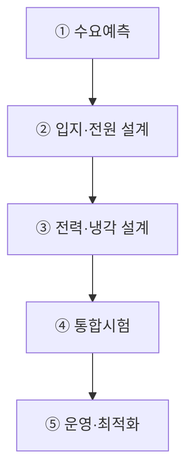

## 지식 로드맵 내 현재 위치

  IT 전략·관리AI 인프라·Data Center<strong>AI 에너지 인프라</strong>

## 30초 인출

- 본질: AI Workload의 전력·열·물·탄소 제약을 전원부터 IT 장비까지 통합 관리하는 물리 인프라 체계
- 메커니즘: 전력조달(PPA·Grid) → 수배전·UPS → AI 랙 전력할당 → 고효율 냉각(D2C/액침) → 계측·스케줄링
- 판정 기준: PUE <= 1.3 통제 및 GPU 랙 온도 <= 85℃ 이하 임계치 유지

핵심 용어

- **PUE(Power Usage Effectiveness)**: 데이터센터 총 전력량을 IT 장비 전력량으로 나눈 지표
- **WUE(Water Usage Effectiveness)**: IT 에너지 사용량 대비 물 사용량 지표
- **CUE(Carbon Usage Effectiveness)**: IT 에너지 사용량 대비 탄소배출 지표
- **PPA(Power Purchase Agreement)**: 전력 생산자와 수요자가 체결하는 전력구매계약
- **D2C(Direct-to-Chip)**: 발열 칩에 Cold Plate를 접촉해 액체로 열을 제거하는 방식
- **Immersion Cooling**: 전자장비를 비전도성 유체에 침지해 열을 제거하는 방식
- **BESS(Battery Energy Storage System)**: 전력을 저장·방전하는 배터리 기반 설비

## 예상문제

> AI 데이터센터 에너지 인프라의 구성체계를 설명하고, 전력·냉각·환경 문제점과 대응책을 제시하시오. **(미출제 예상·25점)**

## Ⅰ. 전력·열·물·탄소를 통합하는 AI 물리 인프라

> AI 에너지 인프라는 전력 확보만이 아니라 변동하는 AI 부하와 고밀도 발열을 안정적으로 수용하는 전원·설비·운영체계임.

- 정의: AI 컴퓨팅의 전력수요와 발열을 안정적으로 수용하기 위한 전원·계통·배전·냉각·계측의 통합 인프라
- 목적: **용량 적기확보·서비스 연속성·에너지 효율·환경 지속가능성** 달성

## Ⅱ. 구성체계

| 계층 | 구성 | 핵심 통제 |
|---|---|---|
| 전원 | Grid·PPA·발전원·BESS | 공급성·가격·탄소·지역영향 |
| 수배전 | 변전·UPS·발전기·배전 | 이중화·전력품질·보호협조 |
| IT | GPU·NPU·Network·Storage | 전력 Cap·Scheduler·이용률 |
| 냉각 | Air·D2C·Immersion | 열밀도·누수·수질·정비성 |
| 운영 | DCIM·EMS·관제·예측 | PUE·WUE·CUE·용량·비용 |

## Ⅲ. 용량계획·운영 절차

## Ⅳ. 냉각방식 비교

> 대상에 따라 공기, 칩 직접 냉각, 액침 냉각을 조합하여 열밀도와 PUE를 최적화함.

| 기준 | Air Cooling | D2C | Immersion |
|---|---|---|---|
| 열전달 | 공기 대류 | 칩-Coolant 전도 | 장비-유체 직접 열교환 |
| 적합 | 저·중밀도 Rack | 고밀도 GPU Rack | 초고밀도·특수환경 |
| 장점 | 범용·정비 용이 | 기존 Rack 혼용·효율 | 팬 축소·열제거 잠재력 |
| 위험 | Hotspot·팬전력 | 누수·배관·수질 | 유체·부품호환·정비 |
| 선택기준 | 밀도·기후·기존설비 | Chip TDP·Vendor 지원 | 전체 TCO·운영성·Warranty |

## Ⅴ. 문제점·대응책

| 위험 | 대책 | 효과 |
|---|---|---|
| 계통 접속 지연 | 입지-전원 공동검토·단계증설 | 용량 적기확보 |
| AI 부하 급변 | BESS·Demand Response·Scheduler | 계통충격 완화 |
| 고밀도 Hotspot | Rack별 Telemetry·D2C·격리 | 열 안정성 향상 |
| 물·탄소 부담 | WUE·CUE 계측·전원 Mix 최적화 | 환경영향 가시화 |
| 효율만 강조한 가용성 저하 | 효율-SLA-복구성 공동 Gate | 운영위험 통제 |

## Ⅵ. Carbon-aware Workload Orchestration 제언

### 학습자 통찰 메모 — 답안 밖

`[핵심 통찰]` AI 에너지 문제는 발전설비만 늘려 해결할 수 없으며, 시간·지역별 전력여건에 맞춰 학습·추론 부하 자체를 이동·제어해야 함.

`나라면` 지연 허용 학습작업은 전력여여·탄소집약도·냉각여건을 반영해 스케줄링하고, 실시간 추론은 SLA를 우선하는 이중 정책으로 비용·탄소·서비스를 함께 최적화하겠음.

### 실전 답안용 기술사적 제언

- **판정 기준 (Trigger)**: 데이터센터 PUE(전력효율지수) > 1.3 초과 또는 특정 GPU 랙(Rack) 온도가 85℃ 임계치를 초과할 시 에너지 비상 모드 가동.
- **대응 방안 (Action)**: 고밀도 GPU 랙에 D2C 액체냉각 및 액침냉각(Immersion)을 단계적 전환하고, 야간 잉여 재생에너지 시간대로 대규모 LLM 사전학습(Pre-training) 부하를 동적 배치.
- **검증 체계 (Verification)**: DCIM/EMS를 통한 실시간 전력·온도 텔레메트리 수집, PUE/WUE/CUE 지표의 국제표준(ISO/IEC 30134) 공인 인증 및 탄소배출권 거래제와 연동 검증.
- **기대 효과 (Impact)**: 냉각 소비전력 30% 이상 절감, 전력망 피크 부하 안정화, 글로벌 RE100 규제 준수 및 AI 인프라 운영 지속가능성을 달성함.

## 1교시 10점 답안 발췌

### 1. 정의·목적

- 정의: AI 컴퓨팅의 전력수요와 발열을 수용하기 위한 전원·계통·배전·냉각·계측의 통합 인프라
- 목적: **용량 적기확보·서비스 연속성·에너지 효율·환경 지속가능성**

### 2. 3대 냉각 방식 비교 아키텍처

### 3. 핵심 통제

- **Integrated Capacity Planning**: Workload·전력·열·물·입지 공동계획
- **Carbon-aware Scheduling**: 전력여건과 SLA에 따른 시간·지역·가속기 배치

## 출제 이력과 검증 출처

- 공식 문제지 원문으로 확인한 직접 기출 없음
- [IEA, Energy and AI](https://www.iea.org/reports/energy-and-ai)
- [IEA, Energy demand from AI](https://www.iea.org/reports/energy-and-ai/energy-demand-from-ai)
- [U.S. DOE, Best Practices Guide for Energy-Efficient Data Center Design](https://www.energy.gov/cmei/femp/articles/best-practices-guide-energy-efficient-data-center-design)

## 학습 체크

- [ ] Ⅰ: AI 에너지 인프라의 정의·목적을 설명할 수 있는가?
- [ ] Ⅱ: 전원·수배전·IT·냉각·운영 계층을 구분할 수 있는가?
- [ ] Ⅲ: 수요예측부터 운영최적화까지 활동과 산출물을 연결할 수 있는가?
- [ ] Ⅳ: Air·D2C·Immersion을 비교할 수 있는가?
- [ ] Ⅴ: 계통·부하·열·환경·가용성 위험의 대응책을 제시할 수 있는가?
- [ ] Ⅵ: Carbon-aware Workload Orchestration을 제언할 수 있는가?

## 연결 토픽

- 이전 토픽: [시스템 운영·유지보수 감리](./059_system_operation_audit.md)
- 연관 토픽: [AI 고속도로](./051_ai_highway.md), [기술 주권](./058_technology_sovereignty.md), [ESG](./011_esg.md)
- 다음 토픽: [프로젝트 관리 통합 체계](./065_project_management.md)
