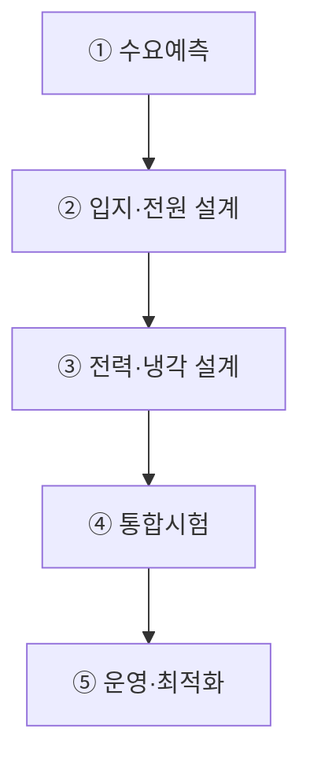

## 지식 로드맵 내 현재 위치
현재 위치: IT 전략·관리 → AI 에너지 인프라

## 30초 인출

- 본질: **AI 에너지 인프라**: AI 데이터센터의 전력·냉각·계측 설비와 변동 부하·고밀도 발열을 감당하는 운영기반.
- 메커니즘: 전력조달 → 수배전·UPS → AI 랙 → 냉각 → 계측·스케줄링의 전력·열 흐름.
- 판정 기준: 전력효율·GPU 랙 열 상태의 지속 관측과 임계 초과 시 냉각·부하 조정 여부.

핵심 용어

- **AI 에너지 인프라** : AI 데이터센터의 전력·냉각·계측과 운영을 뒷받침하는 설비·관리체계
- **PUE(Power Usage Effectiveness)** : 데이터센터 총 투입 전력을 IT 장비 소비 전력으로 나눈 에너지 효율 지표
- **WUE(Water Usage Effectiveness)** : 데이터센터 운영에 사용된 물의 양을 IT 장비 에너지 소비량으로 나눈 수자원 효율 지표
- **CUE(Carbon Usage Effectiveness)** : 데이터센터 운영에 따른 총 탄소배출량을 IT 소비 전력으로 나눈 탄소 효율 지표
- **PPA(Power Purchase Agreement)** : 전력 생산자와 수요자가 일정 기간의 전력 공급·가격·조건을 계약하는 전력구매계약
- **D2C(Direct-to-Chip)** : 고발열 칩 표면에 냉각 플레이트를 직접 부착해 액체로 열을 제거하는 직접 냉각 방식
- **Immersion Cooling** : IT 서버 장비 전체를 비전도성 유체에 완전히 담가 냉각하는 액침 냉각 기술
- **BESS(Battery Energy Storage System)** : 전력을 저장해 두었다가 피크 부하 및 비상 시 방전하는 배터리 기반 에너지 저장 시스템

---

## 1교시 예상문제 (10점)

> AI 데이터센터의 전력·냉각 구조와 에너지 통제를 설명하시오. (예상·10점)

---

## 1교시 10점 답안

### Ⅰ. **AI 에너지 인프라** 개요

| 구분 | 핵심 |
|---|---|
| 정의 | **AI 에너지 인프라**: AI 데이터센터의 전력 공급·배전·냉각·계측을 뒷받침하는 설비와 운영체계 |
| 목적 | 안정적인 AI 연산 공급과 에너지·환경 부담 관리 |

### Ⅱ. 냉각 방식 선택 기준

| 방식 | 열전달·적용 | 주요 고려사항 |
|---|---|---|
| 공랭식 | 공기 대류로 열 제거, 저·중밀도 환경에 적용 | 범용성·정비성, Hotspot·팬전력 |
| **D2C** | 냉각판을 칩에 접촉해 열 제거, 고밀도 GPU에 적용 | 칩 TDP·배관·누수·공급사 지원 |
| 액침식 | 비전도성 유체로 장비를 냉각, 특수 고밀도 환경에 검토 | 유체·부품 호환성·정비·전체 TCO |

### Ⅲ. 핵심 통제

- **Integrated Capacity Planning** : Workload·전력·열·물·입지 공동계획
- **Carbon-aware Scheduling** : 전력여건과 SLA에 따른 시간·지역·가속기 배치

---

## 2~4교시 예상문제 (25점)

> AI 데이터센터 에너지 인프라의 구성체계를 설명하고, 전력·냉각·환경 문제점과 대응책을 제시하시오. **(미출제 예상·25점)**

---

## 2~4교시 25점 답안

## Ⅰ. **AI 에너지 인프라** 개요

> AI 에너지 인프라의 범위: 전력 확보뿐 아니라 변동하는 AI 부하와 고밀도 발열을 수용하는 전원·설비·운영체계.

| 구분 | 핵심 |
|---|---|
| 정의 | **AI 에너지 인프라**: AI 데이터센터의 전력 공급·배전·냉각·계측을 뒷받침하는 설비와 운영체계 |
| 목적 | 안정적인 AI 연산 공급과 에너지·환경 부담 관리 |

## Ⅱ. 구성체계

| 계층 | 구성 | 핵심 통제 |
|---|---|---|
| 전원 | Grid·**PPA**·발전원·**BESS** | 공급성·가격·탄소·지역영향 |
| 수배전 | 변전·UPS·발전기·배전 | 이중화·전력품질·보호협조 |
| IT | GPU·NPU·Network·Storage | 전력 Cap·Scheduler·이용률 |
| 냉각 | Air·**D2C**·Immersion | 열밀도·누수·수질·정비성 |
| 운영 | DCIM·EMS·관제·예측 | **PUE**·**WUE**·**CUE**·용량·비용 |

## Ⅲ. 용량계획·운영 절차

## Ⅳ. 냉각방식 비교

> 냉각 방식의 선택축: 고정된 성능 순위가 아닌 랙 밀도·서버 호환성·입지·운영 조건.

| 기준 | Air Cooling | D2C | Immersion |
|---|---|---|---|
| 열전달 | 공기 대류 | 칩-Coolant 전도 | 장비-유체 직접 열교환 |
| 적합 | 저·중밀도 Rack | 고밀도 GPU Rack | 초고밀도·특수환경 |
| 장점 | 범용·정비 용이 | 기존 Rack 혼용·효율 | 팬 축소·열제거 잠재력 |
| 위험 | Hotspot·팬전력 | 누수·배관·수질 | 유체·부품호환·정비 |
| 선택기준 | 밀도·기후·기존설비 | Chip TDP·Vendor 지원 | 전체 TCO·운영성·Warranty |

## Ⅴ. 문제점·대응책

| 위험 | 대책 | 효과 |
|---|---|---|
| 계통 접속 지연 | 입지-전원 공동검토·단계증설 | 용량 적기확보 |
| AI 부하 급변 | BESS·Demand Response·Scheduler | 계통충격 완화 |
| 고밀도 Hotspot | Rack별 Telemetry·D2C·격리 | 열 안정성 향상 |
| 물·탄소 부담 | WUE·CUE 계측·전원 Mix 최적화 | 환경영향 가시화 |
| 효율만 강조한 가용성 저하 | 효율-SLA-복구성 공동 Gate | 운영위험 통제 |

## Ⅵ. 입지·용량 단계결정 제언

| 문제 | 해결 방안 |
|---|---|
| 계통 접속·냉각수·열배출·환경 검토보다 앞선 증설 일정 확정에 따른 가동시점·운영비 예측의 어려움 | 부지 확정 전 계통사업자 협의·냉각·용수 조건·환경 검토·단계별 수요예측의 공동평가와 확인된 공급용량에 따른 단계적 투자 |

## 출제 이력과 검증 출처

- 공식 문제지 원문으로 확인한 직접 기출 없음
- [IEA, Energy and AI](https://www.iea.org/reports/energy-and-ai)
- [IEA, Energy demand from AI](https://www.iea.org/reports/energy-and-ai/energy-demand-from-ai)
- [U.S. DOE, Best Practices Guide for Energy-Efficient Data Center Design](https://www.energy.gov/cmei/femp/articles/best-practices-guide-energy-efficient-data-center-design)

## 연결 토픽

- 이전 토픽: [시스템 운영·유지보수 감리](./059_system_operation_audit.md)
- 연관 토픽: [AI 고속도로](./051_ai_highway.md), [기술 주권](./058_technology_sovereignty.md), [ESG](./011_esg.md)
- 다음 토픽: [프로젝트 관리 통합 체계](./065_project_management.md)
