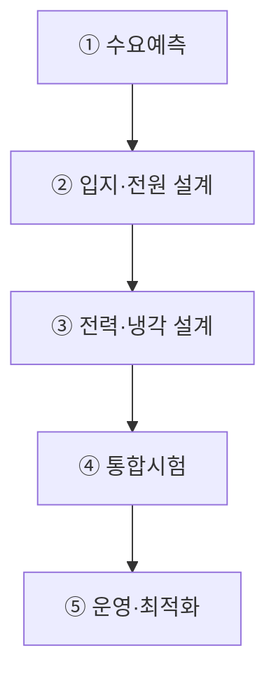
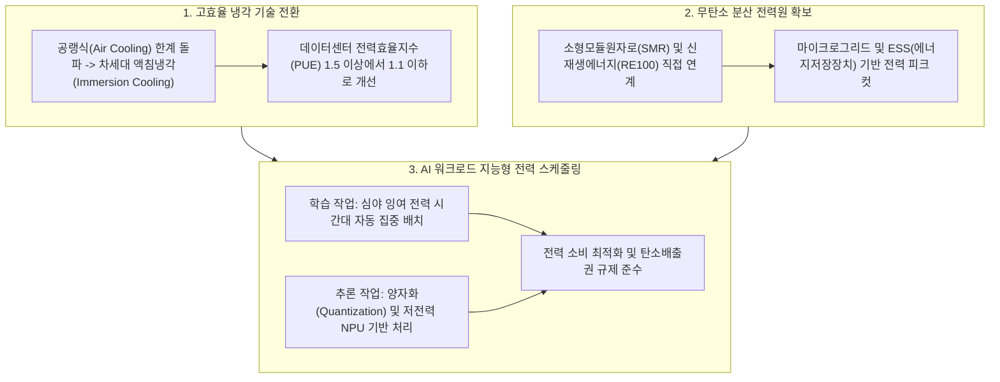

## 지식 로드맵 내 현재 위치
현재 위치: IT 전략·관리 → AI 에너지 인프라

## 30초 인출

- 본질: AI Workload의 전력·열·물·탄소 제약을 전원부터 IT 장비까지 통합 관리하는 물리 인프라 체계이다.
- 메커니즘: 전력조달에서 수배전·UPS, AI 랙, 냉각, 계측·스케줄링까지 전력과 열의 흐름을 계층적으로 연결한다.
- 판정 기준: 전력효율과 GPU 랙 열 상태를 지속 관측하고 임계 초과 시 냉각·부하 조정이 실행되는지 확인한다.

핵심 용어

- **PUE(Power Usage Effectiveness)** : 데이터센터 총 전력량을 IT 장비 전력량으로 나눈 지표이다.
- **WUE(Water Usage Effectiveness)** : 데이터센터의 IT 장비 운영에 사용한 물의 양을 IT 에너지 사용량과 비교하는 효율 지표이다.
- **CUE(Carbon Usage Effectiveness)** : IT 장비가 소비한 에너지에 대응하는 탄소배출량을 나타내는 지표이다.
- **PPA(Power Purchase Agreement)** : 전력 생산자와 수요자가 체결하는 전력구매계약이다.
- **D2C(Direct-to-Chip)** : 발열 칩에 Cold Plate를 접촉해 액체로 열을 제거하는 방식이다.
- **Immersion Cooling** : 전자장비를 비전도성 유체에 침지해 열을 제거하는 방식이다.
- **BESS(Battery Energy Storage System)** : 전력을 저장·방전하는 배터리 기반 설비이다.

## 예상문제

> AI 데이터센터 에너지 인프라의 구성체계를 설명하고, 전력·냉각·환경 문제점과 대응책을 제시하시오. **(미출제 예상·25점)**

## Ⅰ. 전력·열·물·탄소를 통합하는 AI 물리 인프라의 개요

> AI 에너지 인프라는 전력 확보만이 아니라 변동하는 AI 부하와 고밀도 발열을 안정적으로 수용하는 전원·설비·운영체계임.

- 정의: AI 컴퓨팅의 전력수요와 발열을 안정적으로 수용하기 위한 **전원** · **계통** · **배전** ·냉각·계측의 통합 인프라
- 목적: **용량 적기확보** · **서비스 연속성** · **에너지 효율** · **환경 지속가능성** 달성

## Ⅱ. 구성체계

| 계층 | 구성 | 핵심 통제 |
|---|---|---|
| 전원 | Grid·PPA·발전원·BESS | 공급성·가격·탄소·지역영향 |
| 수배전 | 변전·UPS·발전기·배전 | 이중화·전력품질·보호협조 |
| IT | GPU·NPU·Network·Storage | 전력 Cap·Scheduler·이용률 |
| 냉각 | Air·D2C·Immersion | 열밀도·누수·수질·정비성 |
| 운영 | DCIM·EMS·관제·예측 | PUE·WUE·CUE·용량·비용 |

## Ⅲ. 용량계획·운영 절차

## Ⅳ. 냉각방식 비교

> 대상에 따라 공기, 칩 직접 냉각, 액침 냉각을 조합하여 열밀도와 PUE를 최적화함.

| 기준 | Air Cooling | D2C | Immersion |
|---|---|---|---|
| 열전달 | 공기 대류 | 칩-Coolant 전도 | 장비-유체 직접 열교환 |
| 적합 | 저·중밀도 Rack | 고밀도 GPU Rack | 초고밀도·특수환경 |
| 장점 | 범용·정비 용이 | 기존 Rack 혼용·효율 | 팬 축소·열제거 잠재력 |
| 위험 | Hotspot·팬전력 | 누수·배관·수질 | 유체·부품호환·정비 |
| 선택기준 | 밀도·기후·기존설비 | Chip TDP·Vendor 지원 | 전체 TCO·운영성·Warranty |

## Ⅴ. 문제점·대응책

| 위험 | 대책 | 효과 |
|---|---|---|
| 계통 접속 지연 | 입지-전원 공동검토·단계증설 | 용량 적기확보 |
| AI 부하 급변 | BESS·Demand Response·Scheduler | 계통충격 완화 |
| 고밀도 Hotspot | Rack별 Telemetry·D2C·격리 | 열 안정성 향상 |
| 물·탄소 부담 | WUE·CUE 계측·전원 Mix 최적화 | 환경영향 가시화 |
| 효율만 강조한 가용성 저하 | 효율-SLA-복구성 공동 Gate | 운영위험 통제 |

## Ⅵ. Carbon-aware Workload Orchestration 제언

### 실전 답안용 기술사적 제언

- 문제: 초거대 AI 학습 및 추론용 데이터센터(AIDC)의 전력 소모 폭증으로 전력망(Grid) 부하가 한계에 달하고 막대한 탄소 배출로 인한 규제 위기에 직면함.
- 해결 방안: 수랭식/액침냉각(Liquid Immersion Cooling) 도입으로 PUE 1.1 달성을 추진하고, 원전(SMR) 및 재생에너지(RE100) 연계 분산 전력망 구축과 AI 지능형 전력 워크로드 분산 스케줄링을 가동함.

## 1교시 10점 답안 발췌

### 1. 정의·목적

- 정의: AI 컴퓨팅의 전력수요와 발열을 수용하기 위한 전원·계통·배전·냉각·계측의 통합 인프라
- 목적: **용량 적기확보·서비스 연속성·에너지 효율·환경 지속가능성**

### 2. 3대 냉각 방식 비교 아키텍처

### 3. 핵심 통제

- **Integrated Capacity Planning** : Workload·전력·열·물·입지 공동계획
- **Carbon-aware Scheduling** : 전력여건과 SLA에 따른 시간·지역·가속기 배치

## 출제 이력과 검증 출처

- 공식 문제지 원문으로 확인한 직접 기출 없음
- [IEA, Energy and AI](https://www.iea.org/reports/energy-and-ai)
- [IEA, Energy demand from AI](https://www.iea.org/reports/energy-and-ai/energy-demand-from-ai)
- [U.S. DOE, Best Practices Guide for Energy-Efficient Data Center Design](https://www.energy.gov/cmei/femp/articles/best-practices-guide-energy-efficient-data-center-design)

## 학습 체크

- [ ] Ⅰ: AI 에너지 인프라의 정의·목적을 설명할 수 있는가?
- [ ] Ⅱ: 전원·수배전·IT·냉각·운영 계층을 구분할 수 있는가?
- [ ] Ⅲ: 수요예측부터 운영최적화까지 활동과 산출물을 연결할 수 있는가?
- [ ] Ⅳ: Air·D2C·Immersion을 비교할 수 있는가?
- [ ] Ⅴ: 계통·부하·열·환경·가용성 위험의 대응책을 제시할 수 있는가?
- [ ] Ⅵ: Carbon-aware Workload Orchestration을 제언할 수 있는가?

## 연결 토픽

- 이전 토픽: [시스템 운영·유지보수 감리](./059_system_operation_audit.md)
- 연관 토픽: [AI 고속도로](./051_ai_highway.md), [기술 주권](./058_technology_sovereignty.md), [ESG](./011_esg.md)
- 다음 토픽: [프로젝트 관리 통합 체계](./065_project_management.md)
