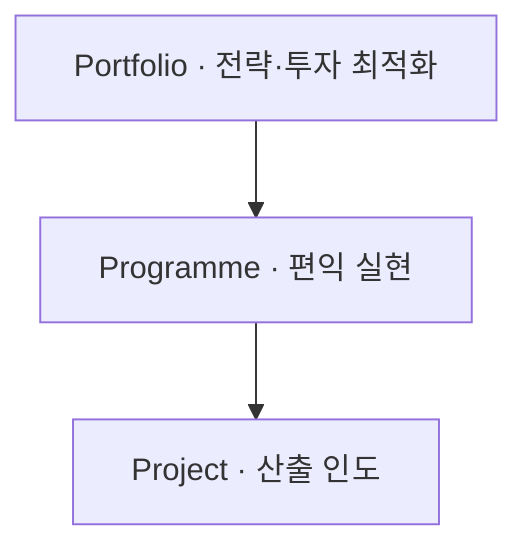
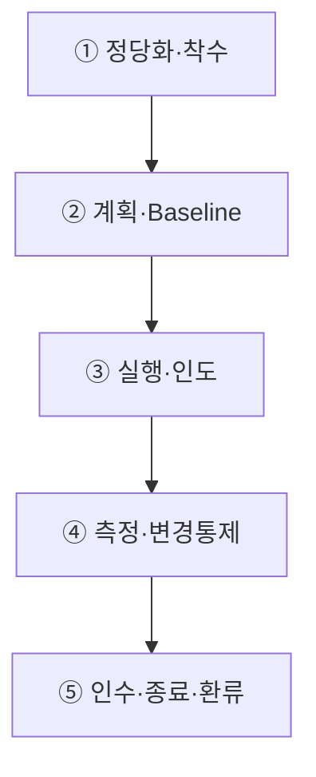
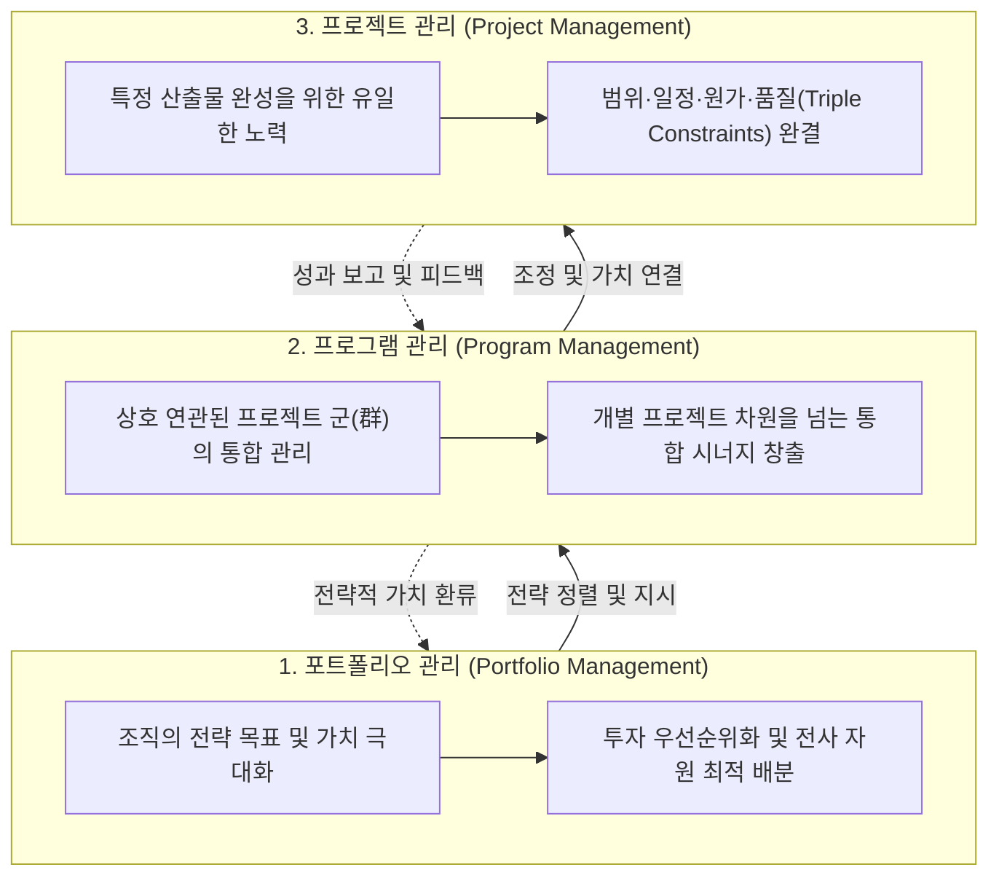

## 지식 로드맵 내 현재 위치
현재 위치: IT 전략·관리 → 프로젝트 관리 통합 체계

## 30초 인출

- 본질: 프로젝트 관리 통합 체계는 조직 전략을 포트폴리오·프로그램·프로젝트의 투자와 실행으로 이어 주는 관리 구조다.
- 메커니즘: 조직전략 → 포트폴리오(투자·선정) → 프로그램(편익·시너지) → 프로젝트(산출·통제) → 가치 실현한다.
- 판정 기준: **EVM** 성과지수와 승인된 범위 변경 기록을 비교하여 일정·원가·범위 통제를 검증한다.

핵심 용어

- **PM(Project Management)** : 프로젝트 목표 달성을 위해 지식·기량·도구·기법을 적용하는 통합 관리 활동
- **WBS(Work Breakdown Structure)** : 프로젝트 전체 범위를 인도물 중심의 하위 작업 요소로 계층 분해한 체계
- **Baseline** : 성과 측정과 공식 변경 통제의 기준이 되는 승인된 범위·일정·원가 계획 기준선
- **CCB(Change Control Board)** : 프로젝트 변경 요청의 타당성을 심의하여 승인·기각을 결정하는 의사결정 기구
- **EVM(Earned Value Management)** : 계획가치(PV)·획득가치(EV)·실제원가(AC)를 통합해 일정과 원가 성과를 통제하는 관리 기법
- **Tailoring** : 조직 규모와 프로젝트 특성에 맞추어 관리 프로세스·도구·산출물을 최적화하는 맞춤화 활동

---

## 1교시 예상문제 (10점)

> 포트폴리오·프로그램·프로젝트의 관계와 가치 인도 체계를 설명하시오. (예상·10점)

---

## 1교시 10점 답안

### 1. 정의·목적

- 정의: 제한된 기간과 자원으로 고유한 산출·성과를 만들고 가치를 인도하도록 기획·실행·통제하는 활동
- 목적: **전략 정렬·성과 인도·제약 균형·위험 통제·조직 학습**

### 2. 계층 정렬 및 가치 인도 체계

### 3. 핵심 통제

- **Baseline·CCB** : 승인계획 대비 편차와 변경의 공식 통제
- **Evidence-based Forecast** : 산출·시험·EVM·위험 기반 완료예측

---

## 2~4교시 예상문제 (25점)

> 프로젝트 관리 통합 체계와 Portfolio·Programme·Project의 관계를 설명하고, 프로젝트 수행절차 및 문제점·대응책을 제시하시오. **(미출제 예상·25점)**

---

## 2~4교시 25점 답안

## Ⅰ. 산출물을 조직 가치로 연결하는 통합 관리의 개요

> 프로젝트 성공은 납기·예산 준수만이 아니라 결과가 의도한 편익과 조직 가치로 전환되는가로 판단해야 함.

| 구분 | 핵심 |
|---|---|
| 정의 | 제한된 기간과 자원으로 고유한 **산출물** 과 **성과** 를 만들고 의도한 가치를 인도하도록 프로젝트를 기획·실행·통제하는 활동 |
| 목적 | **전략 정렬** · **성과 인도** · **제약 균형** · **위험 통제** · **조직 학습** |
PMBOK(Project Management Body of Knowledge) 8판과 ISO 21502:2020을 프로젝트 관리 기준으로 참고한다.

## Ⅱ. Portfolio·Programme·Project 비교

| 기준 | Portfolio | Programme | Project |
|---|---|---|---|
| 목적 | 전략·투자 최적화 | 공동 편익 실현 | 고유 산출·성과 인도 |
| 대상 | 사업·프로그램·프로젝트 | 연관 프로젝트·활동 | 한시적 작업 |
| 통제 | 선정·우선순위·자원균형 | 의존성·변화·편익 | 범위·일정·원가·품질 |
| 성공 | 전략 기여·투자성과 | 편익·역량 전환 | 인수·성과·가치 기여 |

## Ⅲ. 프로젝트 관리 절차

> 프로젝트의 접근법이 예측형·적응형·Hybrid 중 무엇이든 승인·인도·측정·학습의 관리흐름은 필요함.

## Ⅳ. 예측형·적응형·Hybrid 비교

| 기준 | Predictive | Adaptive | Hybrid |
|---|---|---|---|
| 요구 | 비교적 안정 | 불확실·학습 필요 | 고정·가변 혼재 |
| 계획 | 상세 선행계획 | 반복·점진 계획 | Milestone+Backlog |
| 인도 | 단계·최종 인도 | 짧은 주기 증분 | 단계별 증분 |
| 변경 | CCB·Baseline | Backlog 재우선순위 | 수준별 이원통제 |
| 적합 | 규제·물리·계약 고정 | 탐색·디지털 제품 | 대규모 IT 전환 |

## Ⅴ. 문제점·대응책

| 위험 | 대책 | 효과 |
|---|---|---|
| 전략과 무관한 착수 | Business Case·Portfolio Gate | 투자 정렬 |
| Scope Creep | 요구-WBS-Baseline·CCB 추적 | 변경 투명성 |
| 낙관적 진척 보고 | EVM·Milestone·실물 증적 | 예측력 향상 |
| 통합결함 후반 집중 | 조기통합·자동시험·Definition of Done | 재작업 감소 |
| 종료 후 편익 단절 | 편익 Owner·측정시점·이관계획 | 가치 실현 |

## Ⅵ. Evidence-based Forecast 제언

### 실전 답안용 기술사적 제언

- 문제: 개별 프로젝트 중심의 단편적 관리로 인해 전사 경영 전략과의 불일치, 프로젝트 간 핵심 자원 경합 및 중복 투자로 전사적 ROI가 저하됨.
- 해결 방안: 경영 목표 달성을 위한 포트폴리오 관리(Portfolio, 올바른 일의 선택), 복수 프로젝트 간 시너지를 극대화하는 프로그램 관리(Program, 연계 통합), 개별 납기·원가를 준수하는 프로젝트 관리(Project, 올바른 실행)의 3계층 거버넌스를 확립함.

## 출제 이력과 검증 출처

- 공식 문제지 원문으로 확인한 직접 기출 없음
- [PMI, PMBOK Guide Eighth Edition](https://www.pmi.org/standards/pmbok)
- [ISO, ISO 21502:2020 Guidance on project management](https://www.iso.org/standard/74947.html)

## 연결 토픽

- 이전 토픽: [AI 에너지 인프라](./060_ai_energy_infrastructure.md)
- 연관 토픽: [WBS](./007_wbs.md), [EVM](./032_evm.md), [PMO](./004_pmo.md), [ISO 21500](./043_iso_21500.md)
- 다음 토픽: [협상에 의한 계약 제안서 평가](./066_negotiated_contract_proposal_evaluation.md)
