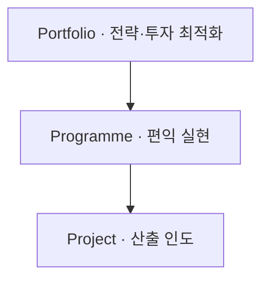
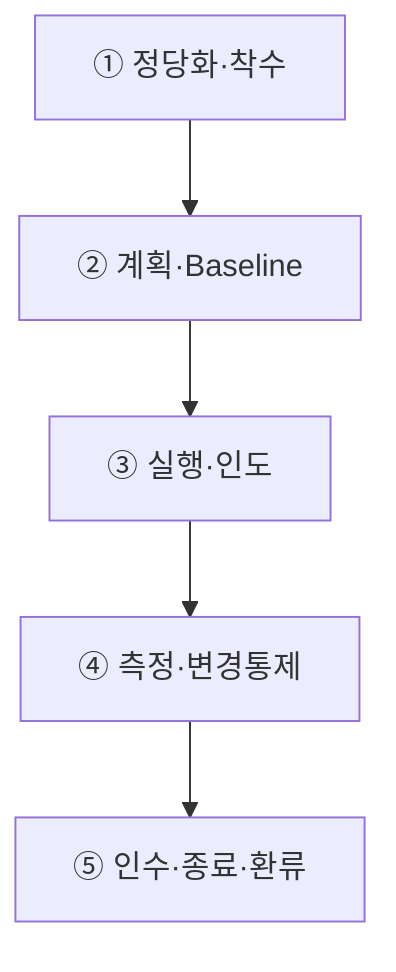

## 지식 로드맵 내 현재 위치

  IT 전략·관리Portfolio·Programme·Project<strong>프로젝트 관리</strong>

## 30초 인출

- 본질: 제한된 자원으로 고유한 결과와 의도한 전략 가치를 인도하는 계층적·통합적 관리 체계
- 메커니즘: 조직전략 → 포트폴리오(투자·선정) → 프로그램(편익·시너지) → 프로젝트(산출·통제) → 가치 실현
- 판정 기준: EVM 성과지수(SPI/CPI) >= 0.85 유지 및 비공식 범위변경(Scope Creep) <= 0건

핵심 용어

- **PM(Project Management)**: 프로젝트 목표 달성을 위해 지식·기술·도구·기법을 적용하는 활동
- **WBS(Work Breakdown Structure)**: 프로젝트 범위를 계층적으로 분할한 구조
- **Baseline**: 성과 측정과 변경통제의 기준이 되는 승인된 범위·일정·원가 계획
- **CCB(Change Control Board)**: 변경요청을 검토·승인·기각하는 의사결정기구
- **EVM(Earned Value Management)**: 계획가치·획득가치·실제원가를 통합해 성과를 측정하는 기법
- **Tailoring**: 프로젝트 맥락에 맞게 접근법·프로세스·도구·통제를 조정하는 활동

## 예상문제

> 프로젝트 관리 통합 체계와 Portfolio·Programme·Project의 관계를 설명하고, 프로젝트 수행절차 및 문제점·대응책을 제시하시오. **(미출제 예상·25점)**

## Ⅰ. 산출물을 조직 가치로 연결하는 통합 관리

> 프로젝트 성공은 납기·예산 준수만이 아니라 결과가 의도한 편익과 조직 가치로 전환되는가로 판단해야 함.

- 정의: 제한된 기간과 자원으로 고유한 산출·성과를 만들고 의도한 가치를 인도하도록 프로젝트를 기획·실행·통제하는 활동
- 목적: **전략 정렬·성과 인도·제약 균형·위험 통제·조직 학습**
- 기준: **PMBOK(Project Management Body of Knowledge) 8판**·**ISO 21502:2020**

## Ⅱ. Portfolio·Programme·Project 비교

| 기준 | Portfolio | Programme | Project |
|---|---|---|---|
| 목적 | 전략·투자 최적화 | 공동 편익 실현 | 고유 산출·성과 인도 |
| 대상 | 사업·프로그램·프로젝트 | 연관 프로젝트·활동 | 한시적 작업 |
| 통제 | 선정·우선순위·자원균형 | 의존성·변화·편익 | 범위·일정·원가·품질 |
| 성공 | 전략 기여·투자성과 | 편익·역량 전환 | 인수·성과·가치 기여 |

## Ⅲ. 프로젝트 관리 절차

> 프로젝트의 접근법이 예측형·적응형·Hybrid 중 무엇이든 승인·인도·측정·학습의 관리흐름은 필요함.

## Ⅳ. 예측형·적응형·Hybrid 비교

| 기준 | Predictive | Adaptive | Hybrid |
|---|---|---|---|
| 요구 | 비교적 안정 | 불확실·학습 필요 | 고정·가변 혼재 |
| 계획 | 상세 선행계획 | 반복·점진 계획 | Milestone+Backlog |
| 인도 | 단계·최종 인도 | 짧은 주기 증분 | 단계별 증분 |
| 변경 | CCB·Baseline | Backlog 재우선순위 | 수준별 이원통제 |
| 적합 | 규제·물리·계약 고정 | 탐색·디지털 제품 | 대규모 IT 전환 |

## Ⅴ. 문제점·대응책

| 위험 | 대책 | 효과 |
|---|---|---|
| 전략과 무관한 착수 | Business Case·Portfolio Gate | 투자 정렬 |
| Scope Creep | 요구-WBS-Baseline·CCB 추적 | 변경 투명성 |
| 낙관적 진척 보고 | EVM·Milestone·실물 증적 | 예측력 향상 |
| 통합결함 후반 집중 | 조기통합·자동시험·Definition of Done | 재작업 감소 |
| 종료 후 편익 단절 | 편익 Owner·측정시점·이관계획 | 가치 실현 |

## Ⅵ. Evidence-based Forecast 제언

### 학습자 통찰 메모 — 답안 밖

`[핵심 통찰]` 프로젝트 파행은 계획과 실제의 차이보다 그 차이를 늦게 인식하고 의사결정을 미루는 데서 커지므로, 예측 신뢰도와 변경 결정시간을 관리해야 함.

`나라면` 보고서의 주관적 완료율 대신 승인된 산출물·시험결과·EVM·Risk Exposure를 함께 보고, 기준 초과 시 범위·일정·원가 중 무엇을 조정할지 CCB가 즉시 결정하도록 하겠음.

### 실전 답안용 기술사적 제언

- **판정 기준 (Trigger)**: EVM 성과지수 SPI 또는 CPI < 0.85 하회 시 또는 비공식 요구사항 변경(Scope Creep) 누적률 > 10% 도달 시 즉시 프로젝트 비상 경보 발령.
- **대응 방안 (Action)**: 공식 형상통제위원회(CCB) 긴급 소집, 크래싱(Crashing)/패스트트래킹(Fast-tracking) 일정 압축 및 WBS Baseline 재설정(Re-baselining).
- **검증 체계 (Verification)**: 산출물 인수기준(Acceptance Criteria) 충족 여부 전수 검사 및 PMBOK 8판/ISO 21502 기반 성과 측정치(EVM 추정치 EAC, VAC)의 통계적 검증.
- **기대 효과 (Impact)**: 90% 증후군(프로젝트 후반부 지연 누적) 차단, 납기 및 예산 초과 리스크 40% 감축, 사업 종료 후 운영 부서 편익 실현률 극대화를 달성함.

## 1교시 10점 답안 발췌

### 1. 정의·목적

- 정의: 제한된 기간과 자원으로 고유한 산출·성과를 만들고 가치를 인도하도록 기획·실행·통제하는 활동
- 목적: **전략 정렬·성과 인도·제약 균형·위험 통제·조직 학습**

### 2. 계층 정렬 및 가치 인도 체계

### 3. 핵심 통제

- **Baseline·CCB**: 승인계획 대비 편차와 변경의 공식 통제
- **Evidence-based Forecast**: 산출·시험·EVM·위험 기반 완료예측

## 출제 이력과 검증 출처

- 공식 문제지 원문으로 확인한 직접 기출 없음
- [PMI, PMBOK Guide Eighth Edition](https://www.pmi.org/standards/pmbok)
- [ISO, ISO 21502:2020 Guidance on project management](https://www.iso.org/standard/74947.html)

## 학습 체크

- [ ] Ⅰ: 프로젝트 관리의 정의·목적과 현행 기준을 설명할 수 있는가?
- [ ] Ⅱ: Portfolio·Programme·Project를 목적·통제로 비교할 수 있는가?
- [ ] Ⅲ: 착수부터 종료·환류까지 활동과 산출물을 연결할 수 있는가?
- [ ] Ⅳ: Predictive·Adaptive·Hybrid를 비교할 수 있는가?
- [ ] Ⅴ: 정렬·변경·진척·통합·편익 위험의 대응책을 제시할 수 있는가?
- [ ] Ⅵ: Evidence-based Forecast를 제언할 수 있는가?

## 연결 토픽

- 이전 토픽: [AI 에너지 인프라](./060_ai_energy_infrastructure.md)
- 연관 토픽: [WBS](./007_wbs.md), [EVM](./032_evm.md), [PMO](./004_pmo.md), [ISO 21500](./043_iso_21500.md)
- 다음 토픽: [협상에 의한 계약 제안서 평가](./066_negotiated_contract_proposal_evaluation.md)
