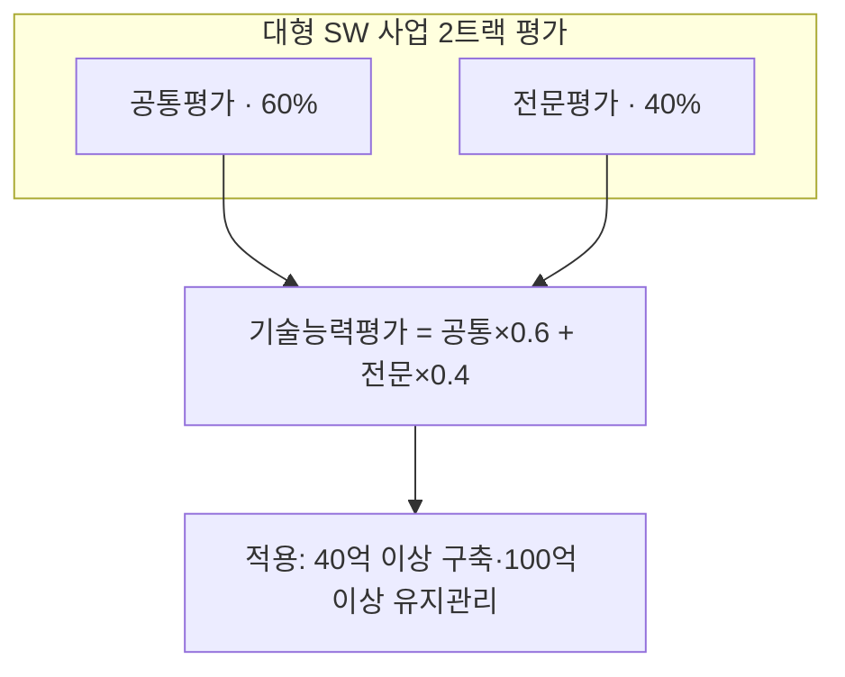
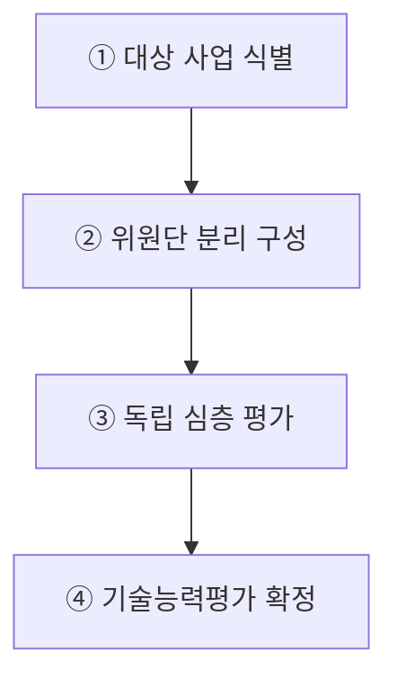
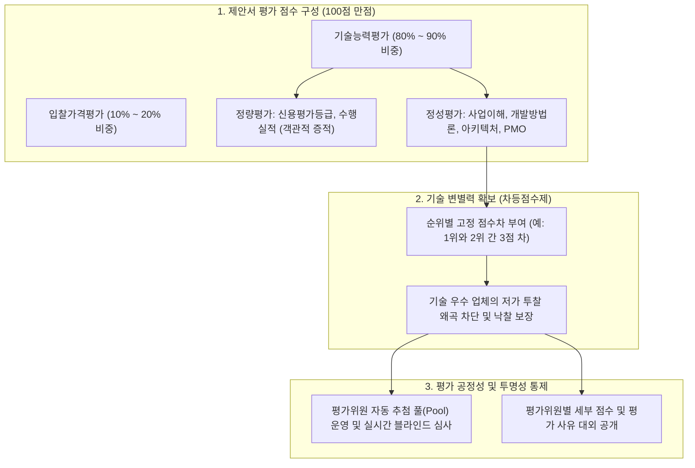

## 지식 로드맵 내 현재 위치
현재 위치: IT 전략·관리 → 협상계약 제안서 평가

## 30초 인출

- 본질: 협상계약 제안서 평가 기준은 제안서의 평가위원·항목·배점과 결과 처리 방식을 정한 조달청 규정이다.
- 메커니즘: 제안서 접수 → 공통·전문 이원 평가 → 기술능력 가중합산 → 협상적격자 선정한다.
- 판정 기준: 사업 규모에 맞는 전문 평가영역을 지정하고 공통·전문 평가항목의 중복을 검토한다.

핵심 용어

- **SW(Software)** : 정보시스템 구축 및 유지관리 사업의 기술적 핵심 산출물
- **제안서 평가** : 평가위원이 법정 기준과 배점에 따라 입찰자의 기술 능력을 종합 채점하는 절차
- **공통평가** : 프로젝트 수행계획과 관리역량 전반을 평가하여 전문평가와 합산하는 기본 평가 영역
- **전문평가** : 대형·고난도 사업에서 전문위원이 특정 핵심 기술의 적합성과 구현성을 심층 검증하는 분리 평가 영역

---

## 1교시 예상문제 (10점)

> 대형 SW 사업의 제안서 전문평가 2트랙과 공정성 통제를 설명하시오. (예상·10점)

---

## 1교시 10점 답안

### 1. 정의·목적

- 정의: **협상에 의한 계약 제안서평가 세부기준** 은 조달청이 물품·용역 제안서의 위원 구성·평가 방법·항목·배점·결과 처리를 일관되게 집행하는 기준
- 목적: 평가 전문성 보완 · 공정경쟁 · 입찰 부담 경감

### 2. 대형 SW 사업 전문평가 2트랙 구조

### 3. 핵심 통제

- **Evaluation Decoupling** : 공통역량(60%)과 핵심기술(40%)의 분리 평가
- **Requirement Traceability** : RFP 요구사항 ID ↔ 평가항목 ↔ 평가위원 의견 1:1 추적

---

## 2~4교시 예상문제 (25점)

> 대규모 중요 소프트웨어 사업 평가의 전문성을 높이고 수요기관의 전문성을 보완해 공정한 경쟁을 유도하기 위하여 '조달청 협상에 의한 계약 제안서평가 세부기준'이 2024년 9월 개정·시행되었다. 이와 관련하여 다음을 설명하시오.
> - 가. 계약 제안서평가 세부기준 개정 주요 내용
> - 나. 대형소프트웨어 사업 전문평가제도

---

## 2~4교시 25점 답안

## Ⅰ. 평가 전문성·공정경쟁을 강화한 제안서평가 기준의 개요

> 세부기준 개정은 대형 SW 사업에는 전문평가를 더하고 소규모 사업에는 발표 부담을 줄여, 사업 규모·난도에 맞는 평가 통제를 적용한 것이 핵심임.

- 정의: **제안서 평가** 의 위원 구성·방법·항목·배점·결과 처리에 필요한 세부사항을 정한 **조달청 집행 기준**
- 목적: **평가 전문성** 보완 · **입찰 분쟁** 예방 · **기업 부담** 경감
개별 입찰은 공고일 기준 현행 세부기준과 제안요청서를 우선 적용한다.

## Ⅱ. 2024년 9월 개정사항

> 개정은 전문성·수요기관 지원·공정성·입찰비용·적용영역의 다섯 문제를 각각 독립된 제도 장치로 보완함.

- 적용 시점: 아래 내용은 **2024년 9월 개정 당시의 주요 변경사항** 이며, 개별 사업에는 공고일 기준 최신 행정규칙을 재확인

| 축 | 개정 내용 | 판정 효과 |
|---|---|---|
| 전문성 | 대형 SW 사업 **전문평가제도** 도입 | 고난도 기술 심층 검증 |
| 기관 지원 | 요청 시 조달청의 **수의계약 제안서 적합성 평가** 대행 | 수요기관 평가역량 보완 |
| 공정경쟁 | 내부 심의로 허위 내용·입찰 영향 판단, 타 업체 비방 시 감점 | 분쟁·비방 억제 |
| 부담 경감 | 온라인평가 제안서 발표 기준금액을 5억 원 이상으로 상향 | 소규모 사업 발표비용 축소 |
| 적용 확대 | 엔지니어링·건설엔지니어링의 협상계약 평가기준 신설 | 기술용역 평가 근거 마련 |

## Ⅲ. 대형소프트웨어 사업 전문평가제도

> 전문평가제도는 모든 항목을 같은 위원이 평가하던 구조를 공통·전문 영역으로 분리하여, 전문영역 기술성을 전체 수행 역량과 함께 판정함.

### 1. 적용대상·전문영역

| 구분 | 기준 |
|---|---|
| 적용대상 | 사업금액 40억 원 이상 SW 사업 · 유지관리 사업 100억 원 이상 |
| 전문영역 | **정보기술개발** · **정보보호** · **데이터구축** · **디지털기술** |
| 평가조건 | 심층평가 필요 사업을 관련 분야 전문가가 전담 평가 |

### 2. 평가·합산 구조

## Ⅳ. 문제점·대응책

> 전문위원 수보다 평가할 전문분야를 제대로 정했는지, 평가 기준을 구분해 적용했는지, 평가 이유를 기록했는지가 중요하다.

| 위험 | 대책 | 효과 |
|---|---|---|
| 전문영역과 사업 핵심기술 불일치 | 제안요청서 요구사항과 4개 전문영역 매핑 | 핵심기술 평가 누락 방지 |
| 공통·전문 항목 중복 채점 | 평가항목별 책임·배점 사전 분리 | 특정 역량의 이중 반영 방지 |
| 허위·비방 판단의 자의성 | 증적 확보 · 내부 심의 · 영향도 기록 | 감점 판단의 재현성 확보 |

## Ⅴ. 요구사항 추적 기반 평가설계 결론

> 전문평가의 품질은 위원 수가 아니라 제안요청서 요구사항부터 평가항목·위원 의견·합산 결과까지의 추적 가능성으로 결정됨.

### 실전 답안용 기술사적 제언

- 문제: 정성평가 위주의 주관적 제안서 심사로 인한 평가 공정성 시비와 기술 점수 변별력 부재로 인해 저가 덤핑 업체가 낙찰되는 사업 부실화가 발생함.
- 해결 방안: 기재부 계약예규에 따라 정량(20%)과 정성(80%) 기준을 엄격화하고, 기술 우수 기업 선별을 위한 차등점수제 적용, 평가위원 무작위 추첨 및 평가 사유서 공개를 제도화함.

## 출제 이력과 검증 출처

- 제136회 정보관리기술사 2교시 3번: 위 `예상문제`에 공식 원문 수록
- [조달청, 「조달청 협상계약 평가… 기업 부담 낮추고 공정성 높인다」, 2024. 9. 11.](https://www.pps.go.kr/kor/bbs/view.do?bbsSn=2409110017&key=00318)
- [조달청, 「협상에 의한 계약 제안서평가 세부기준 주요 개정사항」, 2024. 9. 19.](https://www.pps.go.kr/kor/bbs/view.do?bbsSn=2409190019&key=00638)
- [국가법령정보센터, 「조달청 협상에 의한 계약 제안서평가 세부기준」 2024년 9월 시행 연혁](https://www.law.go.kr/LSW/admRulLsInfoP.do?admRulSeq=2100000247024)
- [국가법령정보센터, 현행 「조달청 협상에 의한 계약 제안서평가 세부기준」](https://law.go.kr/LSW/admRulLsInfoP.do?admRulSeq=2100000273638)

## 연결 토픽

- 선행 토픽: [공공 SW 사업 발주·계약](./039_public_sw_contract.md) · [제안요청서(RFP)](./049_rfp.md)
- 연관 토픽: [PMO(PMC 비교 포함)](./004_pmo.md) · [소프트웨어 사업 대가산정](./026_software_cost_estimation.md)
