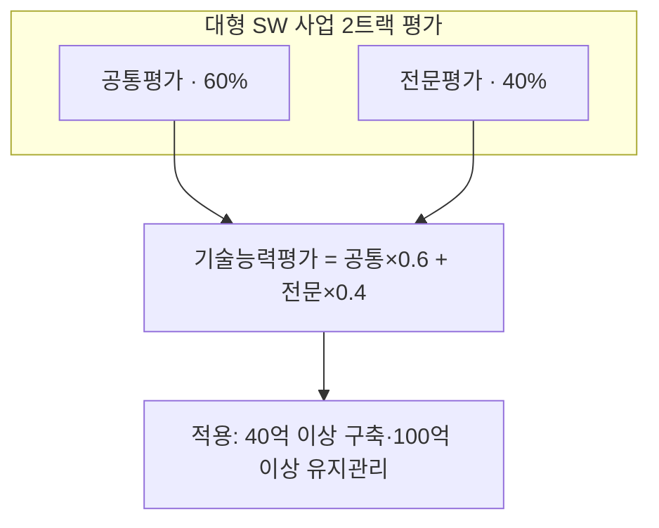
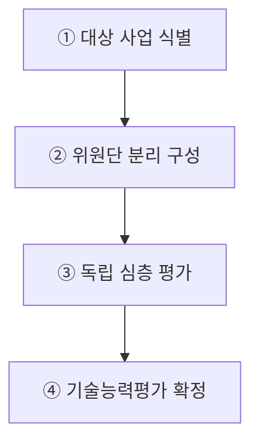
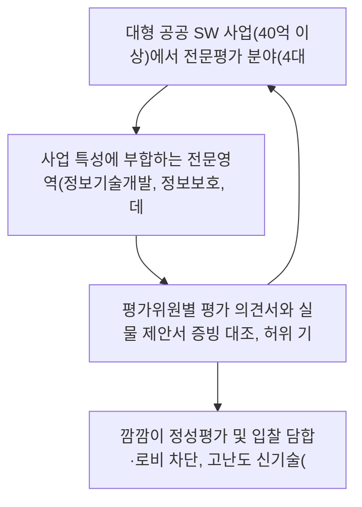

## 지식 로드맵 내 현재 위치
현재 위치: IT 전략·관리 → 협상계약 제안서 평가

## 30초 인출

- 본질: 조달청이 제안서의 위원 구성·평가 항목·배점·결과 처리를 객관적으로 집행하는 규정이다.
- 메커니즘: 제안서 접수 → 공통·전문 이원 평가 → 기술능력 가중합산 → 협상적격자 선정한다.
- 판정 기준: 사업 규모에 맞는 전문 평가영역을 지정하고 공통·전문 평가항목의 중복을 검토한다.

핵심 용어

- **SW(Software)**: 전문평가 대상 사업의 기술적 실체이며, 유지관리 사업은 별도 적용금액을 가짐이다.
- **제안서 평가**: 평가위원이 정해진 평가항목에 따라 제안서의 기술능력을 종합 평가하는 절차이다.
- **공통평가**: 모든 사업에 공통으로 적용하는 수행계획·관리역량 평가로, 전문평가 결과와 합산해 기술능력평가 점수를 산출하는 영역이다.
- **전문평가**: 전문영역별 위원이 특정 기술의 적합성과 구현 가능성을 심층 검토하여 대규모·고난도 사업의 평가 전문성을 보완하는 영역이다.

## 예상문제

> 대규모 중요 소프트웨어 사업 평가의 전문성을 높이고 수요기관의 전문성을 보완해 공정한 경쟁을 유도하기 위하여 '조달청 협상에 의한 계약 제안서평가 세부기준'이 2024년 9월 개정·시행되었다. 이와 관련하여 다음을 설명하시오.
> - 가. 계약 제안서평가 세부기준 개정 주요 내용
> - 나. 대형소프트웨어 사업 전문평가제도

## Ⅰ. 평가 전문성·공정경쟁을 강화한 제안서평가 기준

> 세부기준 개정은 대형 SW 사업에는 전문평가를 더하고 소규모 사업에는 발표 부담을 줄여, 사업 규모·난도에 맞는 평가 통제를 적용한 것이 핵심임.

- 정의: **제안서 평가**의 위원 구성·방법·항목·배점·결과 처리에 필요한 세부사항을 정한 **조달청 집행 기준**
- 목적: **평가 전문성** 보완 · **입찰 분쟁** 예방 · **기업 부담** 경감
개별 입찰은 공고일 기준 현행 세부기준과 제안요청서를 우선 적용한다.

## Ⅱ. 2024년 9월 개정사항

> 개정은 전문성·수요기관 지원·공정성·입찰비용·적용영역의 다섯 문제를 각각 독립된 제도 장치로 보완함.

- 적용 시점: 아래 내용은 **2024년 9월 개정 당시의 주요 변경사항**이며, 개별 사업에는 공고일 기준 최신 행정규칙을 재확인

| 축 | 개정 내용 | 판정 효과 |
|---|---|---|
| 전문성 | 대형 SW 사업 **전문평가제도** 도입 | 고난도 기술 심층 검증 |
| 기관 지원 | 요청 시 조달청의 **수의계약 제안서 적합성 평가** 대행 | 수요기관 평가역량 보완 |
| 공정경쟁 | 내부 심의로 허위 내용·입찰 영향 판단, 타 업체 비방 시 감점 | 분쟁·비방 억제 |
| 부담 경감 | 온라인평가 제안서 발표 기준금액을 5억 원 이상으로 상향 | 소규모 사업 발표비용 축소 |
| 적용 확대 | 엔지니어링·건설엔지니어링의 협상계약 평가기준 신설 | 기술용역 평가 근거 마련 |

## Ⅲ. 대형소프트웨어 사업 전문평가제도

> 전문평가제도는 모든 항목을 같은 위원이 평가하던 구조를 공통·전문 영역으로 분리하여, 전문영역 기술성을 전체 수행 역량과 함께 판정함.

### 1. 적용대상·전문영역

| 구분 | 기준 |
|---|---|
| 적용대상 | 사업금액 40억 원 이상 SW 사업 · 유지관리 사업 100억 원 이상 |
| 전문영역 | **정보기술개발** · **정보보호** · **데이터구축** · **디지털기술** |
| 평가조건 | 심층평가 필요 사업을 관련 분야 전문가가 전담 평가 |

### 2. 평가·합산 구조

## Ⅳ. 문제점·대응책

> 제도의 실효성은 전문위원을 추가했다는 사실보다 전문영역 선택, 평가축 분리, 판단 증적이 일관되는지로 판정함.

| 위험 | 대책 | 효과 |
|---|---|---|
| 전문영역과 사업 핵심기술 불일치 | 제안요청서 요구사항과 4개 전문영역 매핑 | 핵심기술 평가 누락 방지 |
| 공통·전문 항목 중복 채점 | 평가항목별 책임·배점 사전 분리 | 특정 역량의 이중 반영 방지 |
| 허위·비방 판단의 자의성 | 증적 확보 · 내부 심의 · 영향도 기록 | 감점 판단의 재현성 확보 |

## Ⅴ. 요구사항 추적 기반 평가설계 결론

> 전문평가의 품질은 위원 수가 아니라 제안요청서 요구사항부터 평가항목·위원 의견·합산 결과까지의 추적 가능성으로 결정됨.

### 학습자 통찰 메모 — 답안 밖

- `[핵심 통찰]`: 전문평가는 공통평가를 대체하지 않는다. 사업 전반의 수행 가능성과 특정 기술의 깊이를 서로 다른 축으로 평가한 뒤 합산하는 보완 구조다.
- `나라면`: 제안요청서 확정 때 요구사항별 공통·전문 평가 책임을 먼저 배정하고, 평가 후에는 위원 의견이 해당 요구사항과 연결되는지 점검하겠다.

### 실전 답안용 기술사적 제언

- **판정 기준 (Trigger)**: 대형 공공 SW 사업(40억 이상)에서 전문평가 분야(4대 영역)와 RFP 핵심 요구사항 불일치, 또는 공통·전문 항목 간 평가 지표 중복률이 목표 기준를 초과할 때 평가 설계 하자 판정.
- **대응 방안 (Action)**: 사업 특성에 부합하는 전문영역(정보기술개발, 정보보호, 데이터구축, 디지털기술)을 필수 지정하고, RFP 요구사항 ID ↔ 평가항목 ↔ 평가위원을 1:1 명시적으로 분리 배정.
- **검증 체계 (Verification)**: 평가위원별 평가 의견서와 실물 제안서 증빙 대조, 허위 기재 및 상대 비방 시 계약심의회를 통한 감점 근거(조달청 개정 규정)의 객관적 적법성을 검증함.
- **기대 효과 (Impact)**: 깜깜이 정성평가 및 입찰 담합·로비 차단, 고난도 신기술(AI, 클라우드 등) 제안서에 대한 기술 감별력 극대화, 탈락 업체의 이의제기 소송 리스크 원천 해소를 달성함.

## 1교시 10점 답안 발췌

### 1. 정의·목적

- 정의: **협상에 의한 계약 제안서평가 세부기준**은 조달청이 물품·용역 제안서의 위원 구성·평가 방법·항목·배점·결과 처리를 일관되게 집행하는 기준
- 목적: 평가 전문성 보완 · 공정경쟁 · 입찰 부담 경감

### 2. 대형 SW 사업 전문평가 2트랙 구조

### 3. 핵심 통제

- **Evaluation Decoupling**: 공통역량(60%)과 핵심기술(40%)의 분리 평가
- **Requirement Traceability**: RFP 요구사항 ID ↔ 평가항목 ↔ 평가위원 의견 1:1 추적

## 출제 이력과 검증 출처

- 제136회 정보관리기술사 2교시 3번: 위 `예상문제`에 공식 원문 수록
- [조달청, 「조달청 협상계약 평가… 기업 부담 낮추고 공정성 높인다」, 2024. 9. 11.](https://www.pps.go.kr/kor/bbs/view.do?bbsSn=2409110017&key=00318)
- [조달청, 「협상에 의한 계약 제안서평가 세부기준 주요 개정사항」, 2024. 9. 19.](https://www.pps.go.kr/kor/bbs/view.do?bbsSn=2409190019&key=00638)
- [국가법령정보센터, 「조달청 협상에 의한 계약 제안서평가 세부기준」 2024년 9월 시행 연혁](https://www.law.go.kr/LSW/admRulLsInfoP.do?admRulSeq=2100000247024)
- [국가법령정보센터, 현행 「조달청 협상에 의한 계약 제안서평가 세부기준」](https://law.go.kr/LSW/admRulLsInfoP.do?admRulSeq=2100000273638)

## 학습 체크

- [ ] Ⅰ 개요: 세부기준의 정의와 목적 세 가지를 재현할 수 있는가?
- [ ] Ⅱ 개정 내용: 전문성·기관 지원·공정경쟁·부담 경감·적용 확대의 다섯 축을 개정 장치와 연결할 수 있는가?
- [ ] Ⅲ 전문평가: 적용금액 두 기준, 전문영역 네 가지, 공통 60%·전문 40% 합산 구조를 그릴 수 있는가?
- [ ] Ⅳ 위험·통제: 전문영역 불일치·중복 채점·자의적 판단의 대책과 효과를 1:1로 연결할 수 있는가?
- [ ] Ⅴ 제언: RFP 요구사항 ↔ 평가항목 ↔ 담당 평가축의 추적 경로와 검증 항목을 설명할 수 있는가?

## 연결 토픽

- 선행 토픽: [공공 SW 사업 발주·계약](./039_public_sw_contract.md) · [제안요청서(RFP)](./049_rfp.md)
- 연관 토픽: [PMO(PMC 비교 포함)](./004_pmo.md) · [소프트웨어 사업 대가산정](./026_software_cost_estimation.md)
