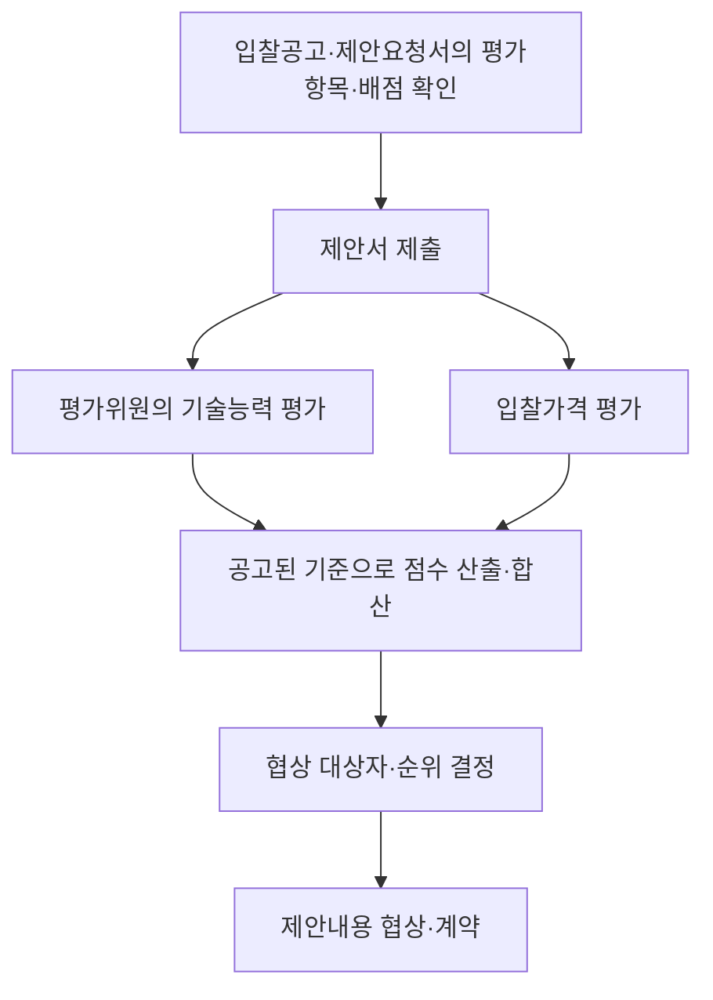
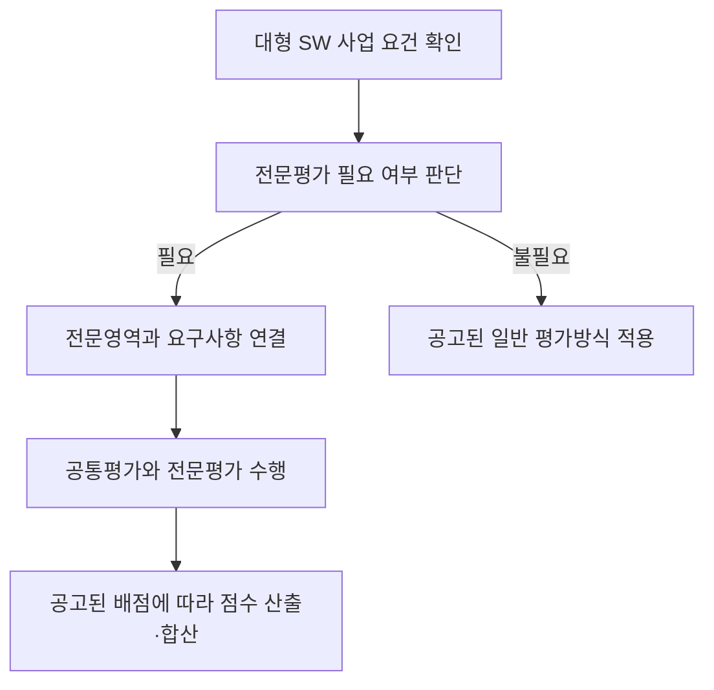

## 지식 로드맵 내 현재 위치
현재 위치: IT 전략·관리 → 협상계약 제안서 평가

## 30초 인출

- 본질: **협상계약 제안서 평가**는 공고된 기준으로 기술능력과 입찰가격을 평가해 협상 대상자를 정하는 절차.
- 메커니즘: 제안요청서·입찰공고의 요구사항과 평가항목·배점에 따라 평가하고, 점수 결과를 바탕으로 협상·계약을 진행.
- 추가 단서: 대형 SW 전문평가 등 세부 방식은 적용 규정의 시행일과 해당 입찰공고·제안요청서 확인.

핵심 용어

- **협상계약 제안서 평가 세부기준**: 조달청이 협상계약 제안서의 평가위원·방법·항목·배점·결과 처리를 정한 집행 기준.
- **협상계약**: 제안서를 평가한 뒤 우선협상대상자와 협상을 거쳐 계약하는 방식.
- **제안서 평가**: 공고된 기준에 따라 입찰자의 제안 내용을 심사·채점하는 절차.
- **공통평가**: 사업수행 전반에 공통으로 적용하는 평가영역.
- **전문평가**: 전문성이 필요한 기술영역을 관련 분야 전문가가 심층 평가하는 방식.
- **평가 배점한도**: 특정 평가영역에 부여할 수 있는 점수의 상한.

---
## 1교시 예상문제 (10점)

> 협상계약 제안서 평가의 목적과 평가항목·배점에서 협상까지의 기본 구조를 설명하시오. (예상·10점)

---
## 1교시 10점 답안

### Ⅰ. 개요

| 구분 | 핵심 |
|---|---|
| 정의 | **협상계약 제안서 평가 세부기준**은 협상계약 제안서 평가의 항목·배점·방법 등 집행 세부사항을 정한 기준 |
| 목적 | 기술능력·입찰가격 평가와 후속 협상의 일관되고 공정한 집행 기준 제공 |

### Ⅱ. 평가에서 협상까지의 구조

기술능력평가는 사업별 기준에 따라 정성·정량 평가로 나눌 수 있으며, 기술능력·입찰가격 점수의 합산 기준과 협상 절차는 적용 계약기준·입찰공고 확인.

### Ⅲ. 적용 시 확인

| 확인 항목 | 적용 기준 |
|---|---|
| 평가항목·배점 | 해당 입찰공고·제안요청서의 기준 |
| 평가방법 | 적용 세부기준의 평가 방식과 정성·정량 구분 |
| 결과 활용 | 평가점수·협상순위·협상 대상 내용의 확인 |
| 세부 특례 | 전문평가 등 해당 제도의 적용 요건과 시행 시점 확인 |

**제언:** 공고 전 평가요구사항·배점·협상 기준의 일치 여부 점검.

---
## 2~4교시 예상문제 (25점)

> 제136회 정보관리기술사 2교시 3번. 대규모 중요 소프트웨어 사업 평가의 전문성을 높이고 수요기관의 전문성을 보완해 공정한 경쟁을 유도하기 위하여 「조달청 협상에 의한 계약 제안서평가 세부기준」이 2024년 9월 개정·시행되었다. 다음을 설명하시오.
> - 가. 계약 제안서평가 세부기준 개정 주요 내용
> - 나. 대형 소프트웨어 사업 전문평가제도

---
## 2~4교시 25점 답안

## Ⅰ. 개요

| 구분 | 핵심 |
|---|---|
| 정의 | **협상계약 제안서 평가 세부기준**은 협상계약 제안서 평가의 항목·배점·방법 등 집행 세부사항을 정한 기준 |
| 목적 | 기술능력·입찰가격 평가와 후속 협상의 일관되고 공정한 집행 기준 제공 |

## Ⅱ. 평가에서 협상까지의 기본 구조

제안서 평가항목·배점에 따른 기술능력·입찰가격 평가와 점수 합산, 결과에 따른 협상 절차.

## Ⅲ. 2024년 개정의 주요 내용

| 개선 축 | 2024년 개정 내용 | 제도상 의도 |
|---|---|---|
| 기술 전문성 | 대형 SW 사업 전문평가제 도입 | 고난도 기술을 관련 전문가가 심층 평가 |
| 수요기관 지원 | 요청 시 수의계약 제안서 적합성 정성평가 대행 근거 마련 | 기관의 평가 전문성 보완 |
| 공정성 | 허위 내용은 내부 심의로 사실과 입찰 영향도를 판단하고, 타사 비방은 기술능력평가 감점 가능 | 판단 과정과 제재 근거 명확화 |
| 입찰 부담 | 온라인 평가에서 발표 기준금액을 2.2억 원에서 5억 원 이상으로 상향 | 발표 준비 부담이 큰 소규모 사업 축소 |
| 적용 영역 | 엔지니어링 및 건설엔지니어링 분야 협상계약 평가기준 신설 | 기술용역 평가 근거 마련 |

2024년 규정의 시행일은 9월 13일. 해당 개정의 역사적 요약이며, 현행 사업 적용 여부는 공고일 기준 규정으로 별도 확인.

## Ⅳ. 전문평가제의 적용과 평가 구조

2024년 도입 당시 적용 대상은 사업금액 40억 원 이상 SW 사업, 유지관리 사업은 100억 원 이상. 전문영역은 정보기술개발·정보보호·데이터구축·디지털기술로 구분되며, 심층평가가 필요한 경우 관련 분야 전문가의 평가 전담.

| 전문영역 | 평가 대상 예시 |
|---|---|
| 정보기술개발 | 시스템·응용 소프트웨어 개발 요구사항 |
| 정보보호 | 보안 설계와 보호 요구사항 |
| 데이터구축 | 데이터 구축·품질 관련 요구사항 |
| 디지털기술 | 사업에 적용하는 디지털 기술 요구사항 |

## Ⅴ. 배점 변경과 적용 시점

| 시점 | 전문평가 배점 기준 | 해석 |
|---|---|---|
| 2024년 9월 도입 | 공통평가 60% + 전문평가 40%로 각각 평가 후 합산 | 당시 도입 방식 |
| 2025년 7월 개정 | 기술능력평가 전체 최대 40%에서 정성평가 전체 배점의 최대 50%로 상향 | 전문평가 배점한도 변경 |
| 실제 입찰 | 현행 세부기준 및 입찰공고·제안요청서 확인 | 과거 비율을 현행 고정비율로 적용하지 않음 |

2024년 기출의 제도 설명에는 당시 60:40 구조를 제시하고, 현행 기준을 묻는 문제에서는 해당 공고에 적용되는 최신 배점한도 확인.

## Ⅵ. 운영상 쟁점과 통제

| 쟁점 | 운영 통제 |
|---|---|
| 전문영역과 핵심 요구사항 불일치 | 제안요청서 요구사항을 전문영역 및 평가항목에 사전 연결 |
| 공통·전문 영역의 중복채점 | 항목별 평가 책임과 배점을 공고 전에 구분 |
| 허위·비방 판단의 자의성 | 증거와 입찰 영향도를 기록하고 정해진 심의절차 적용 |

## Ⅶ. 기술사적 제언

| 문제 | 해결 방안 |
|---|---|
| 전문평가 배점 변경에 따른 과거 기준·현행 기준 혼동과 입찰자·평가위원 간 해석 차이 | 공고문에 적용 규정 시행일·전문평가 적용 여부·영역별 배점 근거를 명시하고 요구사항-평가항목-배점 연결표 공개 |

## 출제 이력과 검증 출처

- 제136회 정보관리기술사 2교시 3번: 위 25점 문제에 공식 원문 수록.
- [조달청, 2024년 9월 개정 보도자료](https://www.pps.go.kr/kor/bbs/view.do?bbsSn=2409110017&key=00634)
- [조달청, 2025년 6월 개정 보도자료](https://www.pps.go.kr/kor/bbs/view.do?bbsSn=2506260009&key=00318)
- [국가법령정보센터, 현행 「조달청 협상에 의한 계약 제안서평가 세부기준」](https://law.go.kr/LSW/admRulLsInfoP.do?admRulSeq=2100000273638)
- [국가법령정보센터, 2024년 9월 시행 연혁](https://www.law.go.kr/LSW/admRulLsInfoP.do?admRulSeq=2100000247024)

## 연결 토픽

- 선행 토픽: [공공 SW 사업 발주·계약](./039_public_sw_contract.md) · [제안요청서(RFP)](./049_rfp.md)
- 연관 토픽: [PMO(PMC 비교 포함)](./004_pmo.md) · [소프트웨어 사업 대가산정](./026_software_cost_estimation.md)
