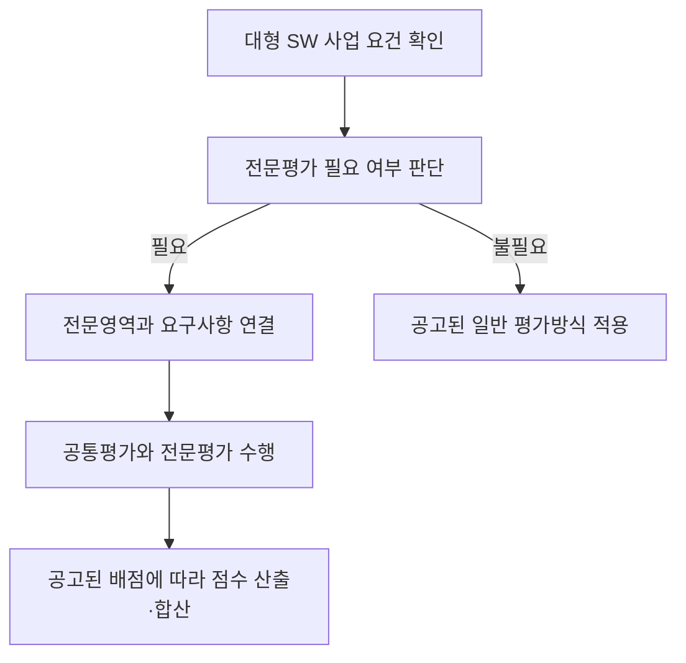

## 지식 로드맵 내 현재 위치
현재 위치: IT 전략·관리 → 협상계약 제안서 평가

## 30초 인출

- 본질: **협상계약 제안서 평가 세부기준**은 조달청이 협상계약 제안서를 평가할 때 따르는 집행 기준이다.
- 메커니즘: 제안서의 요구사항을 평가항목·배점과 연결하고, 위원 평가를 정해진 방식으로 집계해 협상 절차에 반영한다.
- 핵심: 2024년 대형 SW 전문평가 도입 내용과 2025년 배점 변경을 구분하고, 실제 입찰은 공고일에 적용되는 기준과 제안요청서를 확인한다.

핵심 용어

- **협상계약**: 제안서를 평가한 뒤 우선협상대상자와 협상을 거쳐 계약하는 방식.
- **제안서 평가**: 공고된 기준에 따라 입찰자의 제안 내용을 심사·채점하는 절차.
- **공통평가**: 사업수행 전반에 공통으로 적용하는 평가영역.
- **전문평가**: 전문성이 필요한 기술영역을 관련 분야 전문가가 심층 평가하는 방식.
- **평가 배점한도**: 특정 평가영역에 부여할 수 있는 점수의 상한.

---
## 1교시 예상문제 (10점)

> 협상계약 제안서 평가의 목적을 설명하고, 대형 소프트웨어 사업 전문평가제의 구조와 적용 시 유의사항을 서술하시오. (예상·10점)

---
## 1교시 10점 답안

### Ⅰ. 개요

| 구분 | 핵심 |
|---|---|
| 정의 | **협상계약 제안서 평가 세부기준**은 조달청이 협상계약 제안서를 평가할 때 위원·방법·항목·배점·결과 처리를 정한 집행 기준이다. |
| 목적 | 평가의 전문성과 공정성을 높이고, 입찰 절차를 예측 가능하게 운영한다. |

### Ⅱ. 전문평가 구조

2024년 제도 도입 당시 공통평가 60%와 전문평가 40%를 합산했다. 2025년 개정에서 전문평가 배점한도는 기술능력평가 전체의 최대 40%에서 **정성평가 전체 배점의 최대 50%**로 조정되었으므로, 두 수치를 현재의 고정 비율처럼 혼용하지 않는다.

### Ⅲ. 적용·확인

| 확인 항목 | 적용 기준 |
|---|---|
| 사업 범위 | 2024년 도입 기준: 사업금액 40억 원 이상 SW 사업, 유지관리 사업은 100억 원 이상 |
| 전문 영역 | 정보기술개발·정보보호·데이터구축·디지털기술 |
| 실제 평가 | 입찰공고일 기준 현행 세부기준과 개별 제안요청서 확인 |

---
## 2~4교시 예상문제 (25점)

> 제136회 정보관리기술사 2교시 3번. 대규모 중요 소프트웨어 사업 평가의 전문성을 높이고 수요기관의 전문성을 보완해 공정한 경쟁을 유도하기 위하여 「조달청 협상에 의한 계약 제안서평가 세부기준」이 2024년 9월 개정·시행되었다. 다음을 설명하시오.
> - 가. 계약 제안서평가 세부기준 개정 주요 내용
> - 나. 대형 소프트웨어 사업 전문평가제도

---
## 2~4교시 25점 답안

## Ⅰ. 개요

| 구분 | 핵심 |
|---|---|
| 정의 | **협상계약 제안서 평가 세부기준**은 조달청이 협상계약 제안서를 평가할 때 위원·방법·항목·배점·결과 처리를 정한 집행 기준이다. |
| 목적 | 평가의 전문성과 공정성을 높이고, 입찰 절차를 예측 가능하게 운영한다. |

## Ⅱ. 2024년 개정의 주요 내용

| 개선 축 | 2024년 개정 내용 | 제도상 의도 |
|---|---|---|
| 기술 전문성 | 대형 SW 사업 전문평가제 도입 | 고난도 기술을 관련 전문가가 심층 평가 |
| 수요기관 지원 | 요청 시 수의계약 제안서 적합성 정성평가 대행 근거 마련 | 기관의 평가 전문성 보완 |
| 공정성 | 허위 내용은 내부 심의로 사실과 입찰 영향도를 판단하고, 타사 비방은 기술능력평가 감점 가능 | 판단 과정과 제재 근거 명확화 |
| 입찰 부담 | 온라인 평가에서 발표 기준금액을 2.2억 원에서 5억 원 이상으로 상향 | 발표 준비 부담이 큰 소규모 사업 축소 |
| 적용 영역 | 엔지니어링 및 건설엔지니어링 분야 협상계약 평가기준 신설 | 기술용역 평가 근거 마련 |

2024년 규정은 9월 13일 시행되었다. 위 내용은 해당 개정의 역사적 요약이며 현행 사업에 그대로 적용된다고 단정하지 않는다.

## Ⅲ. 전문평가제의 적용과 평가 구조

2024년 도입 당시 적용 대상은 사업금액 40억 원 이상 SW 사업이며, 유지관리 사업은 100억 원 이상이었다. 전문영역은 정보기술개발·정보보호·데이터구축·디지털기술로 나누고, 심층평가가 필요한 경우 관련 분야 전문가가 평가를 전담한다.

| 전문영역 | 평가 대상 예시 |
|---|---|
| 정보기술개발 | 시스템·응용 소프트웨어 개발 요구사항 |
| 정보보호 | 보안 설계와 보호 요구사항 |
| 데이터구축 | 데이터 구축·품질 관련 요구사항 |
| 디지털기술 | 사업에 적용하는 디지털 기술 요구사항 |

## Ⅳ. 배점 변경과 적용 시점

| 시점 | 전문평가 배점 기준 | 해석 |
|---|---|---|
| 2024년 9월 도입 | 공통평가 60% + 전문평가 40%로 각각 평가 후 합산 | 당시 도입 방식 |
| 2025년 7월 개정 | 기술능력평가 전체 최대 40%에서 정성평가 전체 배점의 최대 50%로 상향 | 전문평가 배점한도 변경 |
| 실제 입찰 | 현행 세부기준 및 입찰공고·제안요청서 확인 | 과거 비율을 현행 고정비율로 적용하지 않음 |

따라서 2024년 기출의 제도 설명에는 당시 60:40 구조를 제시하되, 현행 기준을 묻는 문제에서는 해당 공고에 적용되는 최신 배점한도를 확인한다.

## Ⅴ. 운영상 쟁점과 통제

| 쟁점 | 운영 통제 |
|---|---|
| 전문영역과 핵심 요구사항 불일치 | 제안요청서 요구사항을 전문영역 및 평가항목에 사전 연결 |
| 공통·전문 영역의 중복채점 | 항목별 평가 책임과 배점을 공고 전에 구분 |
| 허위·비방 판단의 자의성 | 증거와 입찰 영향도를 기록하고 정해진 심의절차 적용 |

## Ⅵ. 기술사적 제언

| 문제 | 해결 방안 |
|---|---|
| 전문평가 배점 변경 때 과거 기준과 현행 기준을 혼동하면 입찰자와 평가위원의 해석 차이가 생긴다. | 발주기관은 공고문에 적용 규정의 시행일, 전문평가 적용 여부, 영역별 배점 근거를 함께 명시하고, 요구사항-평가항목-배점 연결표를 공개한다. |

## 출제 이력과 검증 출처

- 제136회 정보관리기술사 2교시 3번: 위 25점 문제에 공식 원문 수록.
- [조달청, 2024년 9월 개정 보도자료](https://www.pps.go.kr/kor/bbs/view.do?bbsSn=2409110017&key=00634)
- [조달청, 2025년 6월 개정 보도자료](https://www.pps.go.kr/kor/bbs/view.do?bbsSn=2506260009&key=00318)
- [국가법령정보센터, 현행 「조달청 협상에 의한 계약 제안서평가 세부기준」](https://law.go.kr/LSW/admRulLsInfoP.do?admRulSeq=2100000273638)
- [국가법령정보센터, 2024년 9월 시행 연혁](https://www.law.go.kr/LSW/admRulLsInfoP.do?admRulSeq=2100000247024)

## 연결 토픽

- 선행 토픽: [공공 SW 사업 발주·계약](./039_public_sw_contract.md) · [제안요청서(RFP)](./049_rfp.md)
- 연관 토픽: [PMO(PMC 비교 포함)](./004_pmo.md) · [소프트웨어 사업 대가산정](./026_software_cost_estimation.md)
