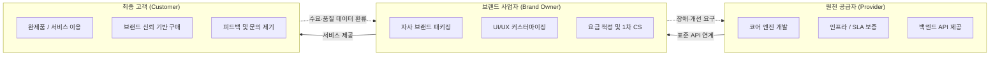

## 지식 로드맵 내 현재 위치
현재 위치: IT 전략·관리 → 화이트 레이블 마케팅

## 30초 인출

- 본질: 화이트 레이블 마케팅은 공급자의 제품·서비스를 판매자의 브랜드로 제공하는 사업 방식이다.
- 메커니즘: 원천 공급자가 API로 제품을 제공하고 브랜드 사업자가 고객에게 판매·지원하며, 문의와 품질 정보가 공급자에게 전달된다.
- 판정 기준: 표준 포맷 데이터 반출권과 계약 종료 시 전환 절차를 모의훈련으로 검증한다.

핵심 용어

- **화이트 레이블(White Label)**: 공급자가 만든 제품·서비스를 판매자 브랜드로 제공하는 방식.
- **B2B2C**: 공급 기업과 판매 기업이 협력해 최종 소비자에게 제품·서비스를 제공하는 구조.
- **SLA**: 서비스 수준과 장애 대응 책임을 당사자 간 합의한 계약.
- **API**: 서로 다른 소프트웨어가 기능이나 데이터를 주고받는 인터페이스.
- **Exit Plan**: 계약 종료나 공급자 교체 때 데이터와 서비스를 이전하는 계획.

---

## 1교시 예상문제 (10점)

> 화이트 레이블 마케팅(White Label Marketing)에 대하여 설명하시오. **(제136회 정보관리기술사 1교시 1번)**

---

## 1교시 10점 답안

### Ⅰ. 개요

| 구분 | 핵심 |
|---|---|
| 정의 | **화이트 레이블 마케팅**은 공급자의 완성 제품·서비스에 판매자 브랜드를 적용해 시장에 제공하는 **브랜드·유통 방식**이다. |
| 목적 | **제품 개발 부담** 축소 · **출시 기간** 단축 · **판매 채널** 확장 |

### Ⅱ. 화이트 레이블 B2B2C 구조

### Ⅲ. 운영 통제

| 통제 | 운영 목적 |
|---|---|
| **SLA** | 품질 수준·장애 대응·지원 책임을 합의한다. |
| **Exit Plan** | 데이터 반출·서비스 전환·종료 지원을 정해 공급자 종속을 줄인다. |

---

## 2~4교시 예상문제 (25점)

> 화이트 레이블 마케팅의 개념과 역할·계약·데이터 운영 구조·대안 비교를 설명하고 적용 방안을 제시하시오. (예상·25점)

---

## 2~4교시 25점 답안

### Ⅰ. 시장 진입 시간을 줄이는 화이트 레이블의 개요

> 생산 역량을 빌리되 시장 책임은 판매자 브랜드가 지며, 성패는 브랜드 통제권과 공급 의존 위험의 균형으로 판정함.

| 구분 | 핵심 |
|---|---|
| 정의 | **화이트 레이블 마케팅**은 공급자의 완성 제품·서비스에 판매자 브랜드를 적용해 시장에 제공하는 **브랜드·유통 방식**이다. |
| 목적 | **제품 개발 부담** 축소 · **출시 기간** 단축 · **판매 채널** 확장 |

### Ⅱ. 역할·계약·데이터 운영 구조

> 책임 경계·서비스 수준·데이터 권리를 계약과 연계 구조에 함께 고정해야 함.

| 주체 | 책임 | 통제 |
|---|---|---|
| 공급자 | 제품 개발 · 가용성 · 장애 복구 | **SLA** · 변경 통지 · 지원 종료 조건 |
| 브랜드 사업자 | 가격 · 마케팅 · 고객 응대 | 브랜드 지침 · 민원 이관 · 품질 모니터링 |
| 공동 | 연계 · 정산 · 데이터 처리 | **API** 버전 · 접근권한 · 감사로그 |

### Ⅲ. 대안 비교

> 선택 기준은 브랜드 표시가 아니라 설계 통제권·시장 진입 시간·공급자 교체 가능성임.

| 기준 | 화이트 레이블 | 자체 개발 | OEM |
|---|---|---|---|
| 통제권 | 브랜드·채널 중심 | 제품 설계·운영 전반 | 주문자 사양·검수 중심 |
| 진입 | 기존 제품 활용 | 개발·검증 선행 | 설계·생산 협의 선행 |
| 위험 | 공급자 종속 · 품질 전이 | 개발비 · 일정 지연 | 생산 품질 · 납기 의존 |

### Ⅳ. 문제점·대응책

> 공급자 장애·보안 사고도 판매자의 평판 손실로 귀결됨.

| 위험 | 대책 | 효과 |
|---|---|---|
| 공급자 종속 | 데이터 반출 형식 · 전환 지원 · 종료 절차 명시 | 교체 가능성 확보 |
| 품질 편차 | SLA 지표 · 장애 등급 · 시정 절차 합의 | 품질 일관성 확보 |
| 데이터 책임 불명확 | 처리 목적 · 접근권한 · 보유·파기 통제 | 책임 추적성 확보 |
| 제품 동질화 | 고객 여정 · 부가 서비스 · 채널 차별화 | 브랜드 가치 확보 |

### Ⅴ. 기술사적 제언

| 문제 | 해결 방안 |
|---|---|
| 계약 종료 때 데이터 이전과 서비스 전환을 준비하지 않으면 공급자 교체가 지연되고 고객 서비스가 중단될 수 있다. | 계약 전에 반출 데이터의 형식·범위, 이전 지원 책임, API 종료 통지, 전환 시험 절차를 합의하고 정기적으로 이전 가능성을 점검한다. |

## 출제 이력과 검증 출처

- 제136회 정보관리기술사 1교시 1번: “화이트 레이블 마케팅(White Label Marketing)”

## 연결 토픽

- [IT 아웃소싱](./033_it_outsourcing.md) · [SLA](./006_sla.md) · [기술 주권](./058_technology_sovereignty.md)
