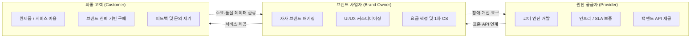
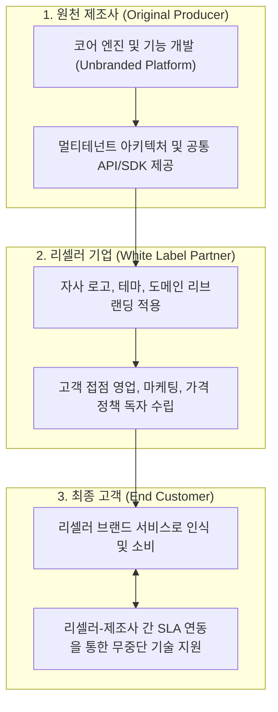

## 지식 로드맵 내 현재 위치
현재 위치: IT 전략·관리 → 화이트 레이블 마케팅

## 30초 인출

- 본질: 공급자의 완성 제품·서비스에 판매자 브랜드를 적용해 시장에 제공하는 **B2B2C** 진입 전략이다.
- 메커니즘: 원천공급자(코어엔진· **SLA** ) → 브랜드사업자(UI/UX·요금·CS) → 최종고객(이용) → 데이터 환류한다.
- 판정 기준: 표준 포맷 데이터 반출권과 계약 종료 시 전환 절차를 모의훈련으로 검증한다.

핵심 용어

- **White Label** : 공급자의 완성 제품·서비스에 판매자의 브랜드를 부착하여 시장에 유통하는 비즈니스 형태
- **B2B2C(Business-to-Business-to-Consumer)** : 공급 기업과 판매 기업 간 협업을 거쳐 최종 소비자에게 서비스를 제공하는 전달 구조
- **SLA(Service Level Agreement)** : 원천 공급자와 판매 사업자 간 서비스 수준 목표와 장애 대응 책임을 합의한 계약 협약
- **API(Application Programming Interface)** : 판매자 채널과 공급자 코어 엔진 간 기능·데이터를 연동하는 표준 인터페이스 규격

## 예상문제

> 화이트 레이블 마케팅(White Label Marketing)에 대하여 설명하시오. **(제136회 정보관리기술사 1교시 1번)**

## Ⅰ. 시장 진입 시간을 줄이는 화이트 레이블의 개요

> 생산 역량을 빌리되 시장 책임은 판매자 브랜드가 지며, 성패는 브랜드 통제권과 공급 의존 위험의 균형으로 판정함.

- 정의: 공급자의 완성 제품·서비스에 **판매자 브랜드** 를 적용해 시장에 제공하는 **브랜드·유통 방식**
- 목적: **제품 개발 부담** 축소 · **출시 기간** 단축 · **판매 채널** 확장

## Ⅱ. 역할·계약·데이터 운영 구조

> 책임 경계·서비스 수준·데이터 권리를 계약과 연계 구조에 함께 고정해야 함.

| 주체 | 책임 | 통제 |
|---|---|---|
| 공급자 | 제품 개발 · 가용성 · 장애 복구 | **SLA** · 변경 통지 · 지원 종료 조건 |
| 브랜드 사업자 | 가격 · 마케팅 · 고객 응대 | 브랜드 지침 · 민원 이관 · 품질 모니터링 |
| 공동 | 연계 · 정산 · 데이터 처리 | **API** 버전 · 접근권한 · 감사로그 |

## Ⅲ. 대안 비교

> 선택 기준은 브랜드 표시가 아니라 설계 통제권·시장 진입 시간·공급자 교체 가능성임.

| 기준 | 화이트 레이블 | 자체 개발 | OEM |
|---|---|---|---|
| 통제권 | 브랜드·채널 중심 | 제품 설계·운영 전반 | 주문자 사양·검수 중심 |
| 진입 | 기존 제품 활용 | 개발·검증 선행 | 설계·생산 협의 선행 |
| 위험 | 공급자 종속 · 품질 전이 | 개발비 · 일정 지연 | 생산 품질 · 납기 의존 |

## Ⅳ. 문제점·대응책

> 공급자 장애·보안 사고도 판매자의 평판 손실로 귀결됨.

| 위험 | 대책 | 효과 |
|---|---|---|
| 공급자 종속 | 데이터 반출 형식 · 전환 지원 · 종료 절차 명시 | 교체 가능성 확보 |
| 품질 편차 | SLA 지표 · 장애 등급 · 시정 절차 합의 | 품질 일관성 확보 |
| 데이터 책임 불명확 | 처리 목적 · 접근권한 · 보유·파기 통제 | 책임 추적성 확보 |
| 제품 동질화 | 고객 여정 · 부가 서비스 · 채널 차별화 | 브랜드 가치 확보 |

## Ⅴ. 교체 가능성을 내장하는 제언

> 경제성은 공급자를 계속 쓸 때가 아니라 바꿀 수 있을 때 지속됨.

### 실전 답안용 기술사적 제언

- 문제: 서드파티 솔루션을 자사 브랜드로 리브랜딩해 재판매할 때 원천 제품의 보안 결함과 데이터 격리 실패로 인한 브랜드 신뢰도 추락 위험이 존재함.
- 해결 방안: 멀티테넌트(Multi-Tenancy) 환경에서 완벽한 논리적 데이터 암호화 및 테넌트 격리를 보장하고, 표준 OpenAPI/SDK 기반의 커스터마이징 가이드라인 및 원천 공급사와의 엄격한 SLA/SLM 계약을 체결함.

## 1교시 10점 답안 발췌

### 1. 정의·목적

- 정의: 공급자의 완성 제품·서비스에 판매자 브랜드를 적용해 시장에 제공하는 브랜드·유통 방식
- 목적: **개발 부담 축소 · 출시기간 단축 · 판매채널 확장**

### 2. 화이트 레이블 B2B2C 아키텍처

### 3. 핵심 통제

- **SLA(Service Level Agreement)** : 품질·장애·지원 책임 명확화
- **Exit Plan** : 데이터 반출·API 전환·종료지원으로 공급자 종속 완화

## 출제 이력과 검증 출처

- 제136회 정보관리기술사 1교시 1번: “화이트 레이블 마케팅(White Label Marketing)”

## 학습 체크

- [ ] Ⅰ: 공급자·판매자·최종 고객 관계로 정의할 수 있는가?
- [ ] Ⅱ: 세 주체의 책임과 SLA·API·데이터 통제를 연결할 수 있는가?
- [ ] Ⅲ: 자체 개발·OEM과 통제권·진입·위험 3축으로 비교할 수 있는가?
- [ ] Ⅳ~Ⅴ: 위험 4개와 대책·효과를 1:1로 제시할 수 있는가?

## 연결 토픽

- [IT 아웃소싱](./033_it_outsourcing.md) · [SLA](./006_sla.md) · [기술 주권](./058_technology_sovereignty.md)
