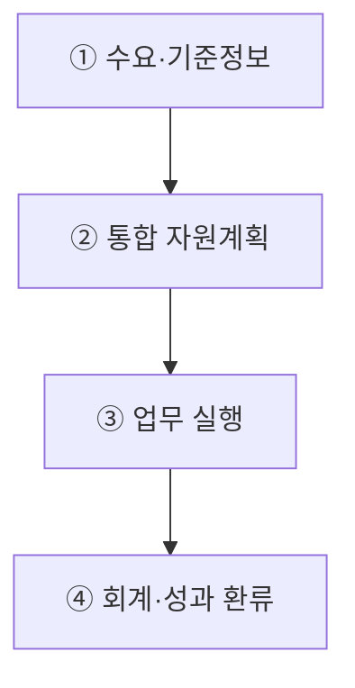
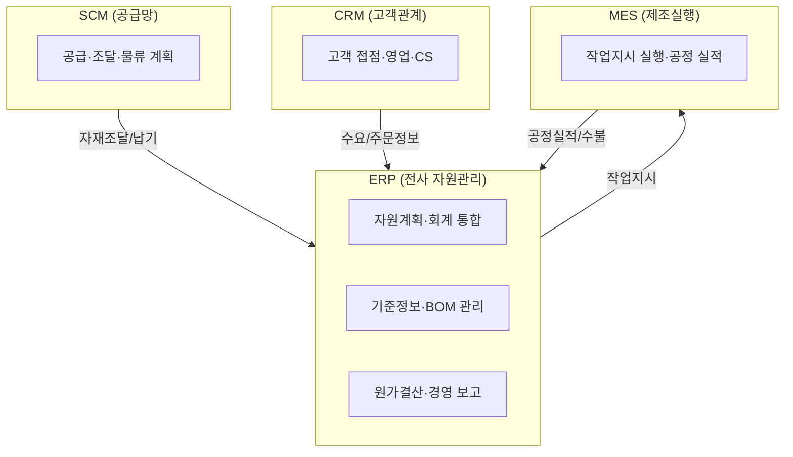
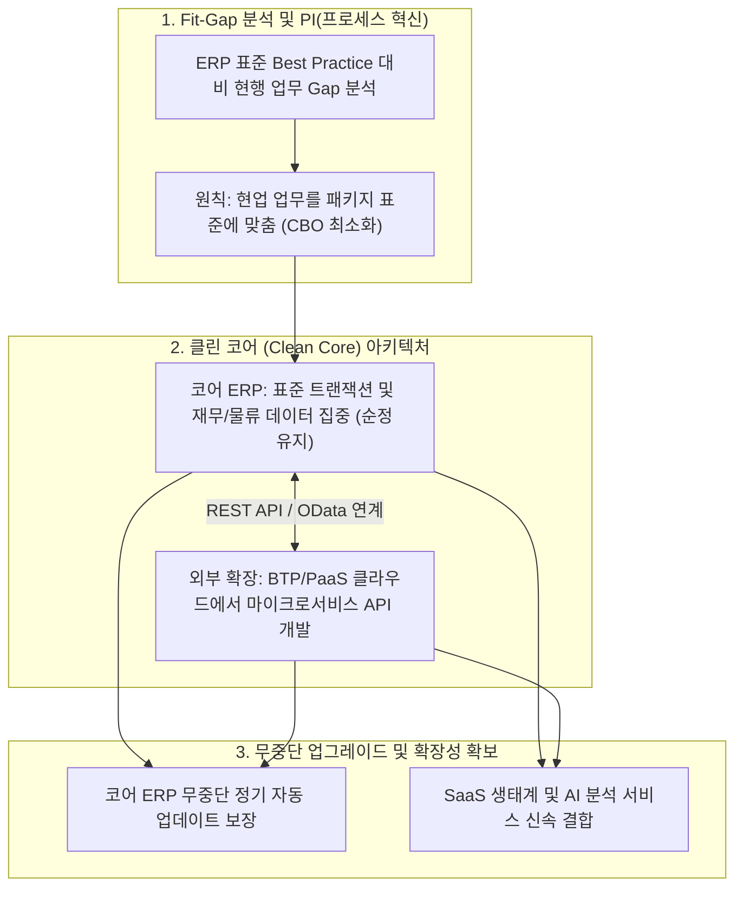

## 지식 로드맵 내 현재 위치
현재 위치: IT 전략·관리 → ERP(Enterprise Resource Planning)

## 30초 인출

- 본질: 재무·인사·구매·생산·영업을 공통 데이터와 표준 프로세스로 통합하는 전사 자원관리 시스템이다.
- 메커니즘: 수요·주문 접수 → 자재( **MRP** )·생산·인력 통합계획 → 업무 실행(구매·생산·출하) → 회계·원가 자동 반영한다.
- 판정 기준: 기준정보 정합성과 O2C·P2P 거래의 회계 대사 결과를 검증한다.

핵심 용어

- **ERP(Enterprise Resource Planning)** : 전사 업무를 단일 데이터베이스와 표준 프로세스로 통합 관리하는 자원관리 시스템
- **MRP(Material Requirements Planning)** : 생산계획과 BOM을 바탕으로 원자재의 필요 수량과 발주 시점을 산출하는 자재소요계획
- **Single Source of Truth** : 동일한 비즈니스 사실을 단일 승인 원천에서 공유하여 데이터 일관성을 보장하는 원칙
- **MDM(Master Data Management)** : 품목·거래처 등 기업 핵심 기준정보의 정의와 생애주기를 통합 통제하는 관리 체계
- **BOM(Bill of Materials)** : 완제품 제조에 필요한 모든 원자재·부품의 품목·수량·조립 계층을 명시한 자재명세서

## 예상문제

> 가치사슬 관점에서 ERP·SCM·MES·CRM을 비교하고, ERP 도입 위험과 대응책을 설명하시오. **(미출제 예상·25점)**

## Ⅰ. 전사 프로세스·데이터 통합 시스템, ERP의 개요

> ERP는 공통 데이터베이스를 중심으로 핵심 업무를 연결하며, 도입 성패는 기능 수보다 표준 프로세스와 기준정보의 정합성으로 판정함.

- 정의: 재무·인사·구매·생산·영업의 거래와 자원계획을 **공통 데이터베이스** 와 **통합 모듈** 로 처리하는 전사 정보시스템
- 목적: **중복 입력** 제거 · **전사 자원 배분** · **경영실적** 적시 파악
ERP는 프로세스 통합·기준정보 공유·모듈 간 거래정보 연계를 통해 전사 업무를 연결한다.

## Ⅱ. 계획에서 실적 반영까지 이어지는 ERP 동작 구조

> ERP는 판매·재고 정보를 자원계획으로 바꾸고 실행 거래를 재무·원가 실적으로 되돌리며, 계획과 실적의 폐루프가 끊기면 통합 효과가 사라짐.

## Ⅲ. 가치사슬 관점의 ERP·SCM·MES·CRM 비교

> 네 시스템은 경쟁 관계가 아니라 공급망·전사 자원·생산현장·고객 접점을 맡는 보완 관계이며, 경계는 관리 대상과 의사결정 시간범위로 구분함.

| 구분 | ERP | SCM | MES | CRM |
|---|---|---|---|---|
| 대상 | 전사 자원·거래 | 공급자~고객 물류·정보·자금 | 생산현장 작업·설비·품질 | 잠재·기존 고객 접점 |
| 역할 | 계획·실행·회계 통합 | 수요·공급·조달·물류 조정 | 작업지시 실행·실적 수집 | 마케팅·영업·서비스 관계 관리 |
| 시간범위 | 계획~결산 | 중장기 계획~주문이행 | 실시간 현장 실행 | 고객 생애주기 |

- 연계: SCM 수요·공급계획 → ERP 자원·거래계획 → MES 작업지시·실적 → ERP 원가·재고 반영
- 연계: CRM 수요·주문·서비스 정보 ↔ ERP 판매·출하·청구 정보

## Ⅳ. 문제점·대응책

> 기존 업무를 그대로 맞춤 개발하면 통합 기준이 다시 분열되므로, 프로세스 표준화와 데이터 통제를 먼저 확정한 뒤 예외만 제한적으로 확장해야 함.

| 위험 | 대책 | 효과 |
|---|---|---|
| 부서별 프로세스 충돌 | **BPR(Business Process Reengineering)** · 프로세스 책임자 지정 | 전사 업무 흐름 일관성 |
| 기준정보 불일치 | **MDM(Master Data Management)** · 데이터 소유자·검증 규칙 운영 | 계획·회계 오류 전파 차단 |
| 과도한 맞춤 개발 | **Fit-Gap 분석** · 표준 기능 우선·예외 승인 | 업그레이드 복잡도 감소 |

## Ⅴ. 표준 프로세스·데이터 품질 중심 도입

> ERP의 가치는 패키지 설치가 아니라 계획·실행·회계가 같은 데이터 의미를 공유할 때 발생하므로, 오픈 판정도 기능 완료보다 업무·데이터 통합 검증에 둬야 함.

### 실전 답안용 기술사적 제언

- 문제: 기업 고유 업무 관행을 고집하여 과도한 소스코드 커스터마이징(CBO)을 수행함에 따라 업그레이드 단절, 유지보수 비용 폭증 및 프로젝트 실패가 발생함.
- 해결 방안: 표준 프로세스 기반의 Fit-Gap 분석을 선행하여 업무 혁신(PI)을 추진하고, 코어 시스템을 순정 상태로 유지하며 독자 기능은 외부 클라우드 PaaS에서 API로 연계하는 Clean Core(클린 코어) 아키텍처를 도입함.

## 1교시 10점 답안 발췌

### 1. 정의·목적

- 정의: **ERP(Enterprise Resource Planning)** 는 재무·인사·구매·생산·영업의 거래와 자원계획을 공통 데이터베이스와 통합 모듈로 처리하는 전사 정보시스템
- 목적: 부서 간 중복 입력 제거 · 전사 자원 배분 · 경영실적 적시 파악

### 2. 가치사슬 연계 아키텍처

### 3. 핵심 통제

- 연계: **SCM(Supply Chain Management)** 수요계획 → ERP 자원계획 → **MES(Manufacturing Execution System)** 실행실적 → ERP 원가·재고 반영
- 판단: **CRM(Customer Relationship Management)** 의 고객 정보까지 연계하되 시스템별 책임과 기준정보 소유권 분리

## 출제 이력과 검증 출처

- 참고 문항: 제124회 KPC 기출검색 보조자료에 수록되었으나 Q-Net 정보관리 공식 문제지 원문은 미확보하여 공식 기출로 단정하지 않음
- SAP, [What is ERP?](https://www.sap.com/products/erp/what-is-erp.html)
- Oracle, [What is ERP?](https://www.oracle.com/erp/what-is-erp/)
- Oracle, [What Is Supply Chain Management?](https://www.oracle.com/scm/what-is-supply-chain-management/)
- IBM, [What is a Manufacturing Execution System?](https://www.ibm.com/think/topics/mes-system)
- Salesforce, [What Is CRM?](https://www.salesforce.com/crm/what-is-crm/)

## 학습 체크

- [ ] Ⅰ 개요: ERP의 정의·목적과 프로세스 통합·기준정보 공유·거래 연계의 세 특징을 재현할 수 있는가?
- [ ] Ⅱ 동작 구조: 수요·기준정보부터 회계·성과 환류까지 네 단계의 활동·산출을 연결할 수 있는가?
- [ ] Ⅲ 비교: ERP·SCM·MES·CRM을 대상·역할·시간범위의 세 축으로 비교하고 두 연계 관계를 그릴 수 있는가?
- [ ] Ⅳ 도입 통제: 프로세스 충돌·기준정보 불일치·과도한 맞춤 개발에 대한 대책·효과를 1:1로 제시할 수 있는가?
- [ ] Ⅴ 제언: 핵심 구간 파일럿부터 종단 간 대사·단계적 확산까지 판정 흐름을 재현할 수 있는가?

## 연결 토픽

- 이전 토픽: [화이트 레이블 마케팅](./067_white_label_marketing.md)
- 연관 토픽: [BPR](./010_bpr.md) · [SCM](./005_scm.md) · [CRM](./031_crm.md) · [PLM](./071_plm.md)
- 다음 토픽: [ISO 31000](./069_iso_31000.md)
