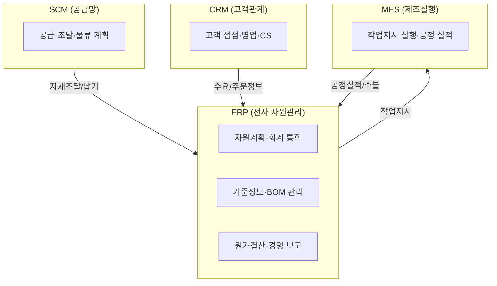
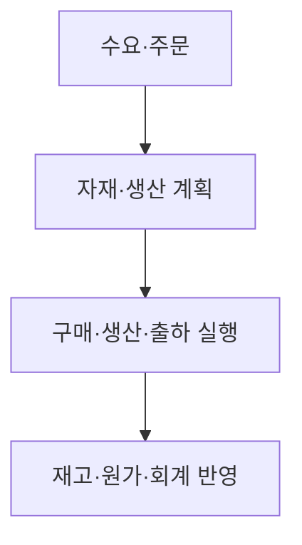

## 지식 로드맵 내 현재 위치
현재 위치: IT 전략·관리 → ERP(Enterprise Resource Planning)

## 30초 인출

- 본질: ERP는 재무·구매·생산·영업 등 주요 업무를 공통 데이터와 절차로 연결하는 전사 자원관리 시스템이다.
- 메커니즘: 수요·주문을 바탕으로 **MRP**·생산계획을 세우고, 구매·생산·출하 실적을 재고·원가·회계에 반영한다.
- 판정 기준: 기준정보 정합성과 O2C·P2P 거래의 회계 대사 결과를 검증한다.

핵심 용어

- **ERP(Enterprise Resource Planning)**: 재무·구매·생산·영업 등 전사 업무의 거래와 자원을 통합 관리하는 시스템.
- **MRP(Material Requirements Planning)**: 생산계획과 BOM을 바탕으로 자재 필요량과 조달 시점을 계산하는 계획 기능.
- **Single Source of Truth**: 같은 업무 사실을 승인된 공통 데이터로 관리하는 원칙.
- **MDM(Master Data Management)**: 품목·거래처 등 기준정보의 정의·품질·변경을 통제하는 관리.
- **BOM(Bill of Materials)**: 제품을 구성하는 부품과 수량·구조를 나타내는 자재명세서.
- **Clean Core**: ERP 표준 코어의 직접 수정을 줄이고, 확장을 분리해 업그레이드와 변경을 용이하게 하려는 접근.
- **SCM(Supply Chain Management)**: 공급자부터 고객까지의 수요·조달·물류를 조정하는 관리.
- **MES(Manufacturing Execution System)**: 생산 현장의 작업을 지시하고 실적을 수집하는 시스템.
- **CRM(Customer Relationship Management)**: 고객 접점의 영업·마케팅·서비스 정보를 관리하는 시스템.
- **API(Application Programming Interface)**: 소프트웨어 간 기능·데이터 연계를 위한 인터페이스.

---

## 1교시 예상문제 (10점)

> ERP의 가치사슬 연계 구조와 도입 시 핵심 통제를 설명하시오. (예상·10점)

---

## 1교시 10점 답안

### Ⅰ. 개요

| 구분 | 핵심 |
|---|---|
| 정의 | **ERP**는 재무·인사·구매·생산·영업의 거래와 자원계획을 공통 데이터와 통합 모듈로 처리하는 전사 정보시스템이다. |
| 목적 | **중복 입력** 제거 · **전사 자원 배분** · **경영실적** 적시 파악 |

### Ⅱ. 가치사슬 연계 아키텍처

**SCM**은 공급망 계획, **ERP**는 전사 자원과 회계, **MES**는 생산 현장 실행, **CRM**은 고객 접점을 관리한다.

### Ⅲ. 핵심 통제

- 연계: **SCM(Supply Chain Management)** 수요계획 → ERP 자원계획 → **MES(Manufacturing Execution System)** 실행실적 → ERP 원가·재고 반영
- 판단: **CRM(Customer Relationship Management)** 의 고객 정보까지 연계하되 시스템별 책임과 기준정보 소유권 분리

---

## 2~4교시 예상문제 (25점)

> 가치사슬 관점에서 ERP·SCM·MES·CRM을 비교하고, ERP 도입 위험과 대응책을 설명하시오. **(미출제 예상·25점)**

---

## 2~4교시 25점 답안

## Ⅰ. 전사 프로세스·데이터 통합 시스템, ERP의 개요

> ERP는 공통 데이터베이스를 중심으로 핵심 업무를 연결하며, 도입 성패는 기능 수보다 표준 프로세스와 기준정보의 정합성으로 판정함.

| 구분 | 핵심 |
|---|---|
| 정의 | **ERP**는 재무·인사·구매·생산·영업의 거래와 자원계획을 공통 데이터와 통합 모듈로 처리하는 전사 정보시스템이다. |
| 목적 | **중복 입력** 제거 · **전사 자원 배분** · **경영실적** 적시 파악 |
ERP는 프로세스 통합·기준정보 공유·모듈 간 거래정보 연계를 통해 전사 업무를 연결한다.

## Ⅱ. 계획에서 실적 반영까지 이어지는 ERP 동작 구조

> ERP는 판매·재고 정보를 자원계획으로 바꾸고 실행 거래를 재무·원가 실적으로 되돌리며, 계획과 실적의 폐루프가 끊기면 통합 효과가 사라짐.

## Ⅲ. 가치사슬 관점의 ERP·SCM·MES·CRM 비교

> 네 시스템은 경쟁 관계가 아니라 공급망·전사 자원·생산현장·고객 접점을 맡는 보완 관계이며, 경계는 관리 대상과 의사결정 시간범위로 구분함.

| 구분 | **ERP** (Enterprise Resource Planning) | **SCM** (Supply Chain Management) | **MES** (Manufacturing Execution System) | **CRM** (Customer Relationship Management) |
|---|---|---|---|---|
| 대상 | 전사 자원·거래 | 공급자~고객 물류·정보·자금 | 생산현장 작업·설비·품질 | 잠재·기존 고객 접점 |
| 역할 | 계획·실행·회계 통합 | 수요·공급·조달·물류 조정 | 작업지시 실행·실적 수집 | 마케팅·영업·서비스 관계 관리 |
| 시간범위 | 계획~결산 | 중장기 계획~주문이행 | 실시간 현장 실행 | 고객 생애주기 |

## Ⅳ. 문제점·대응책

> 기존 업무를 그대로 맞춤 개발하면 통합 기준이 다시 분열되므로, 프로세스 표준화와 데이터 통제를 먼저 확정한 뒤 예외만 제한적으로 확장해야 함.

| 위험 | 대책 | 효과 |
|---|---|---|
| 부서별 프로세스 충돌 | **BPR(Business Process Reengineering)** · 프로세스 책임자 지정 | 전사 업무 흐름 일관성 |
| 기준정보 불일치 | **MDM(Master Data Management)** · 데이터 소유자·검증 규칙 운영 | 계획·회계 오류 전파 차단 |
| 과도한 맞춤 개발 | **Fit-Gap 분석** · 표준 기능 우선·예외 승인 | 업그레이드 복잡도 감소 |

## Ⅴ. 기술사적 제언

> ERP의 가치는 패키지 설치가 아니라 계획·실행·회계가 같은 데이터 의미를 공유할 때 발생하므로, 오픈 판정도 기능 완료보다 업무·데이터 통합 검증에 둬야 함.

| 문제 | 해결 방안 |
|---|---|
| 기업별 업무 예외를 코어 소스 수정으로 구현하면 업그레이드와 유지보수 부담이 커질 수 있다. | Fit-Gap으로 표준 기능을 우선 적용하고, 차별화 요구는 승인된 API 기반의 분리 확장으로 구현한다. ERP와 확장 기능 사이의 연계·데이터 책임을 설계 단계에서 정하고, 배포 전 거래·회계 대사를 검증한다. |

## 출제 이력과 검증 출처

- 참고 문항: 제124회 KPC 기출검색 보조자료에 수록되었으나 Q-Net 정보관리 공식 문제지 원문은 미확보하여 공식 기출로 단정하지 않음
- SAP, [What is ERP?](https://www.sap.com/products/erp/what-is-erp.html)
- Oracle, [What is ERP?](https://www.oracle.com/erp/what-is-erp/)
- Oracle, [What Is Supply Chain Management?](https://www.oracle.com/scm/what-is-supply-chain-management/)
- IBM, [What is a Manufacturing Execution System?](https://www.ibm.com/think/topics/mes-system)
- Salesforce, [What Is CRM?](https://www.salesforce.com/crm/what-is-crm/)
- SAP Help Portal, [Clean Core Extensibility for SAP Cloud ERP](https://help.sap.com/docs/erp-transformation-with-itc/buildable-map/clean-core-extensibility-for-sap-cloud-erp)

## 연결 토픽

- 이전 토픽: [화이트 레이블 마케팅](./067_white_label_marketing.md)
- 연관 토픽: [BPR](./010_bpr.md) · [SCM](./005_scm.md) · [CRM](./031_crm.md) · [PLM](./071_plm.md)
- 다음 토픽: [ISO 31000](./069_iso_31000.md)
