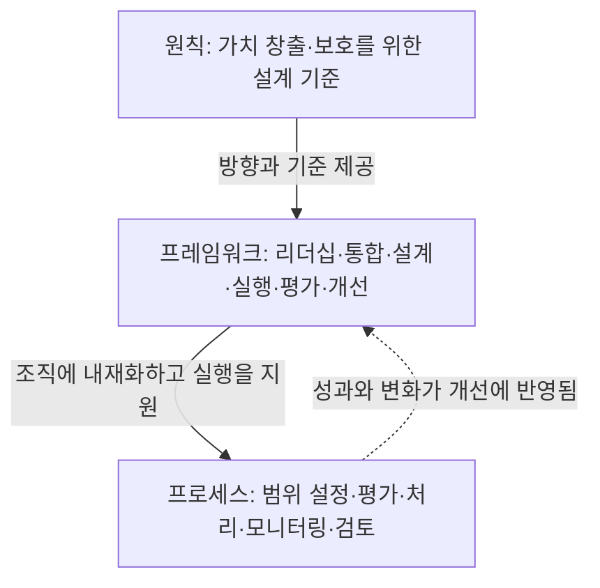
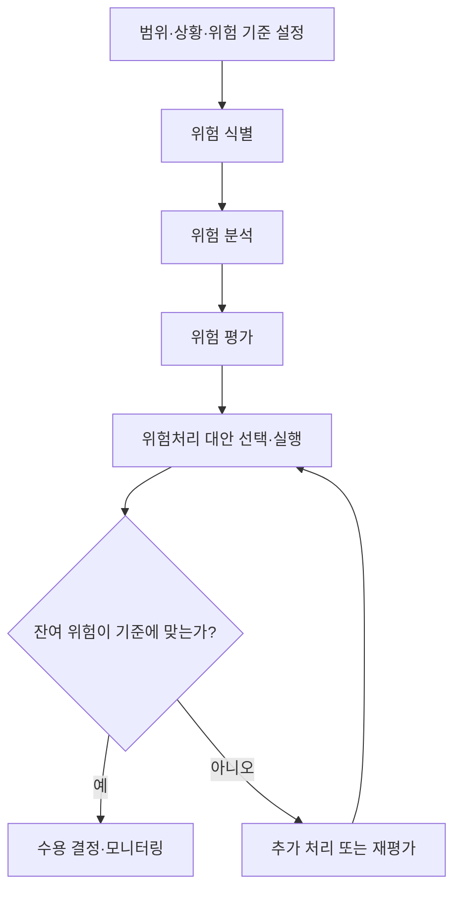

## 지식 로드맵 내 현재 위치
현재 위치: IT 전략·관리 → ISO 31000

## 30초 인출

- 본질: ISO 31000은 조직이 목표에 대한 불확실성을 관리하도록 원칙·프레임워크·프로세스를 제시하는 지침이다.
- 메커니즘: 원칙은 관리의 설계 기준을 주고, 프레임워크는 이를 조직에 내재화하며, 프로세스는 위험을 평가·처리하고 결과를 검토한다.
- 판정 기준: 조직이 정한 위험 기준에 따라 잔여 위험을 평가하고, 수용·추가 처리 결정을 기록한다.

핵심 용어

- **Risk(위험)**: 불확실성이 목표에 미치는 영향으로, 긍정적이거나 부정적인 차이를 모두 포함한다.
- **Risk Assessment(위험평가)**: 위험을 식별·분석·평가해 중요도와 처리 필요성을 판단하는 과정.
- **Risk Treatment(위험처리)**: 위험을 다루기 위한 대안을 선택하고 실행하는 과정.
- **Risk Owner(위험 책임자)**: 특정 위험의 관리와 대응을 책임지는 사람 또는 조직 단위.
- **Risk Criteria(위험 기준)**: 위험의 중요도와 수용 가능성을 비교·판단하기 위해 정한 조건.
- **Residual Risk(잔여 위험)**: 위험처리 뒤에도 남아 있는 위험.

---

## 1교시 예상문제 (10점)

> ISO 31000에 대하여 설명하시오. **(제132회 정보관리기술사 1교시 1번)**

---

## 1교시 10점 답안

### Ⅰ. 개요

| 구분 | 핵심 |
|---|---|
| 정의 | **ISO 31000**은 조직이 목표에 대한 불확실성의 영향을 관리하도록 원칙·프레임워크·프로세스를 제시하는 국제 지침이다. |
| 목적 | **목표 달성 가능성 제고 · 기회·위협 식별 · 처리 자원 배분** |

### Ⅱ. 원칙·프레임워크·프로세스의 관계

### Ⅲ. 위험평가와 처리

| 단계 | 핵심 활동 | 판단 결과 |
|---|---|---|
| **Risk Assessment(위험평가)** | 식별 → 분석 → 평가 | 위험의 특성·수준과 처리 필요성 파악 |
| **Risk Treatment(위험처리)** | 대안 선택·실행 | 처리 조치와 책임 지정 |
| **Residual Risk(잔여 위험) 검토** | 기준과 비교·재평가 | 수용 또는 추가 처리 결정 |

---

## 2~4교시 예상문제 (25점)

> ISO 31000의 원칙·프레임워크·프로세스를 설명하고, 조직에서 위험을 평가·처리하며 결과를 다시 검토하는 방안을 제시하시오. (예상·25점)

---

## 2~4교시 25점 답안

## Ⅰ. 목표와 의사결정을 연결하는 ISO 31000 개요

> ISO 31000은 리스크를 사건 목록이 아니라 목표에 미치는 불확실성의 영향으로 보며, 성패는 별도 문서의 양이 아니라 의사결정·거버넌스 통합으로 판정함.

| 구분 | 핵심 |
|---|---|
| 정의 | **ISO 31000**은 조직이 목표에 대한 불확실성의 영향을 관리하도록 원칙·프레임워크·프로세스를 제시하는 국제 지침이다. |
| 목적 | **목표 달성 가능성 제고 · 기회·위협 식별 · 처리 자원 배분** |
ISO 31000에서 리스크는 목표에 대한 불확실성의 영향이며 긍정·부정 편차를 모두 포함한다. ISO catalog에 따르면 2018판은 현재 발행판이고, 후속판은 개발 중인 위원회 초안이므로 초안과 발행판을 구분한다.

## Ⅱ. 원칙·프레임워크·프로세스의 구성체계

> 원칙은 좋은 리스크 관리의 조건, 프레임워크는 조직에 심는 기반, 프로세스는 개별 의사결정의 실행 절차이며 세 층이 끊기면 현장 판단이 경영 목표와 분리됨.

| 구분 | 역할 |
|---|---|
| **원칙** | 통합·구조화·맞춤화·포괄성·동적 대응·최선의 정보·인적·문화적 요인·지속 개선으로 관리의 방향을 제시 |
| **프레임워크** | 리더십과 의지 아래 위험관리를 조직에 통합하고 설계·실행·평가·개선 |
| **프로세스** | 범위·상황·기준 설정, 위험평가, 위험처리, 모니터링·검토, 의사소통·기록 |

- 관계: **Leadership and Commitment** 가 프레임워크의 중심에서 책임·권한·자원을 부여하고 프로세스 결과를 개선에 환류
- 적용: 조직의 목적·내외부 상황·이해관계자에 맞게 맞춤화하되, 경영·전략·계획·보고·문화와 분리하지 않음

## Ⅲ. 위험평가·처리·환류 프로세스

> 처리 대안은 분석값만으로 결정하지 않고 사전에 합의한 리스크 기준과 비교하며, 처리 뒤 잔여 리스크가 기준을 만족하는지 다시 판정해야 폐루프가 완성됨.

- 병행 통제: **Communication and Consultation** 은 이해관계자의 지식·관점을 반영하고, **Monitoring and Review** 는 변화·통제 성과를 전 단계에서 확인
- 증적 통제: **Recording and Reporting** 으로 판단 근거·책임·처리 결과를 남겨 의사결정 추적성 확보

## Ⅳ. 문제점·대응책

> 표준을 일회성 평가 절차로 축소하면 리스크 목록만 남으므로, 목표·Risk Owner·판정 기준·변화 신호를 한 통제 고리로 묶어야 함.

| 위험 | 대책 | 효과 |
|---|---|---|
| 목표와 리스크 목록 단절 | 목표별 리스크·Risk Owner 연결 | 의사결정 책임 명료화 |
| 정적 연례 평가 | 변화 신호·모니터링 주기 설정 | 신규·변동 리스크 조기 반영 |
| 처리 후 종료 간주 | 잔여 리스크 재평가·승인 | 과소 통제·과잉 통제 방지 |

## Ⅴ. 의사결정에 위험 검토를 내재화하는 기술사적 제언

| 문제 | 해결 방안 |
|---|---|
| 전략·투자·사업 승인 때 위험정보가 별도 문서로만 검토되면 의사결정자가 처리 대안과 잔여 위험을 놓칠 수 있다. | 중요 의사결정 게이트에 목표별 위험·Risk Owner·처리 대안·잔여 위험·수용 권한을 포함하고, 승인 기록을 의사결정 자료와 함께 보존한다. |

## 출제 이력과 검증 출처

- 제132회 정보관리기술사 1교시 1번: “ISO 31000”
- ISO, [ISO 31000:2018 — Risk management — Guidelines](https://www.iso.org/standard/65694.html)
- ISO, [ISO/CD 31000 — Risk management — Guidelines](https://www.iso.org/standard/88574.html)
- ISO/TC 262, [ISO 31000:2018 Risk management — Principles and Guidelines](https://committee.iso.org/sites/tc262/home/projects/published/iso-31000-2018-risk-management.html)
- ISO, [ISO 31000 family — Risk management](https://www.iso.org/standards/popular/iso-31000-family)

## 연결 토픽

- 선행 토픽: [프로젝트 위험관리](./009_project_risk_management_negative.md)
- 연관 토픽: [위험 대응 전략](./040_negative_risk_response_strategy.md), [정량적 위험분석](./073_quantitative_risk_analysis.md), [BCP](./030_bcp.md)
