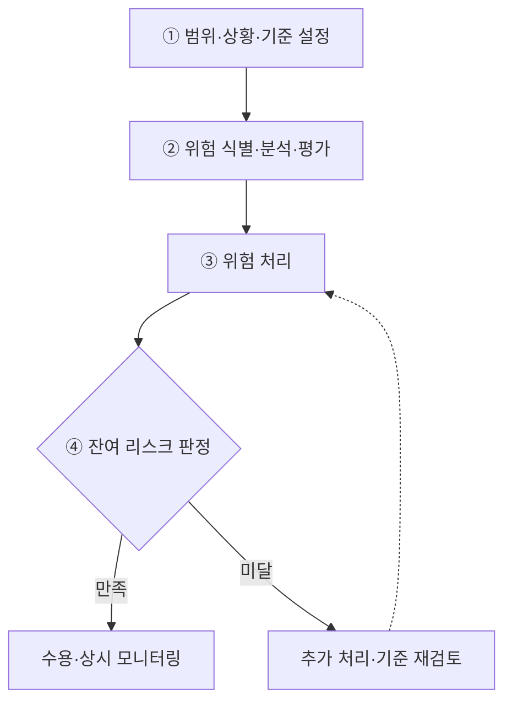
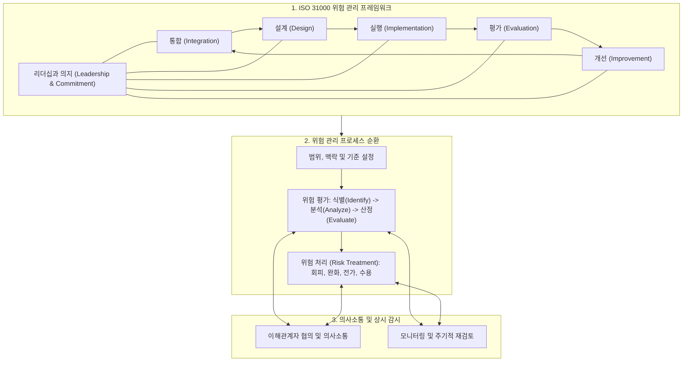

## 지식 로드맵 내 현재 위치
현재 위치: IT 전략·관리 → ISO 31000

## 30초 인출

- 본질: ISO 31000은 조직의 목표에 영향을 주는 불확실성을 관리할 때 쓰는 국제 지침이다. 원칙·프레임워크·프로세스를 제시한다.
- 메커니즘: 원칙(방향) → 프레임워크(리더십·통합) → 프로세스(범위·평가·처리·모니터링) → 잔여리스크 환류한다.
- 판정 기준: 잔여 리스크가 조직의 위험 기준을 초과하는지 평가하고 대응 승인 기록을 확인한다.

핵심 용어

- **Risk** : 불확실성이 조직 목표 달성에 미치는 영향(긍정적·부정적 편차 포괄)
- **Risk Assessment** : 리스크 식별·분석·평가를 통해 처리 우선순위를 결정하는 종합 평가 프로세스
- **Risk Treatment** : 리스크 회피·완화·공유·수용 대안을 수립하고 실행하는 처리 프로세스
- **Risk Owner** : 리스크를 관리하고 대응 조치를 실행할 공식 권한과 책임을 가진 관리 주체

---

## 1교시 예상문제 (10점)

> ISO 31000에 대하여 설명하시오. **(제132회 정보관리기술사 1교시 1번)**

---

## 1교시 10점 답안

### 1. 정의·목적

- 정의: **ISO 31000:2018 Risk management — Guidelines** 는 목표에 대한 불확실성의 영향을 관리하도록 원칙·프레임워크·프로세스를 제시하는 비인증 국제 가이드라인
- 목적: **목표 달성 가능성 제고 · 기회·위협 식별 · 처리 자원 배분**

### 2. ISO 31000 3대 핵심 체계

```mermaid
flowchart LR
    subgraph PRI["원칙 (Principles)"]
        direction TB
        P1["가치 창출 및 보호"]
        P2["통합성 · 맞춤화 · 구조화 · 포괄성"]
        P3["동적 대응 · 인적/문화 · 지속 개선"]
    end

    subgraph FRA["프레임워크 (Framework)"]
        direction TB
        F1["Leadership & Commitment"]
        F2["통합(Integration) 및 설계(Design)"]
        F3["실행(Implementation)"]
        F4["평가(Evaluation) 및 개선(Improvement)"]
    end

    subgraph PRO["프로세스 (Process)"]
        direction TB
        PR1["범위·상황·기준 설정"]
        PR2["위험평가: 식별 → 분석 → 평가"]
        PR3["위험처리(Treatment) 및 모니터링"]
    end

    PRI --> FRA --> PRO
```

### 3. 핵심 프로세스·판정

- **Risk Assessment** : 식별 → 분석 → 평가
- **Risk Treatment** : 대안 선택·실행 → 잔여 리스크 도출
- 결론: 잔여 리스크를 기준과 비교하고 Risk Owner가 수용·재처리를 결정해야 폐루프 완성

---

## 2~4교시 예상문제 (25점)

> ISO 31000의 원칙·프레임워크·프로세스를 설명하고, 조직에서 위험을 평가·처리하며 결과를 다시 검토하는 방안을 제시하시오. (예상·25점)

---

## 2~4교시 25점 답안

## 딸려 나오는 하위 토픽

| 하위 토픽 | 등급 | 연결 |
|---|:---:|---|
| 01-083 ISO 31000 리스크 관리 | B | 원칙·프레임워크·프로세스 |

## Ⅰ. 목표와 의사결정을 연결하는 ISO 31000 개요

> ISO 31000은 리스크를 사건 목록이 아니라 목표에 미치는 불확실성의 영향으로 보며, 성패는 별도 문서의 양이 아니라 의사결정·거버넌스 통합으로 판정함.

| 구분 | 핵심 |
|---|---|
| 정의 | 조직 규모·산업과 무관하게 **Risk Management** 의 **원칙·프레임워크·프로세스** 를 제시하는 비인증 국제 가이드라인 |
| 목적 | **목표 달성 가능성 제고 · 기회·위협 식별 · 처리 자원 배분** |
ISO 31000에서 리스크는 목표에 대한 불확실성의 영향이며 긍정·부정 편차를 모두 포함한다. 적용 시에는 조직이 채택한 최신 판과 공식 적용범위를 확인한다.

## Ⅱ. 원칙·프레임워크·프로세스의 구성체계

> 원칙은 좋은 리스크 관리의 조건, 프레임워크는 조직에 심는 기반, 프로세스는 개별 의사결정의 실행 절차이며 세 층이 끊기면 현장 판단이 경영 목표와 분리됨.

| 구분 | 역할 |
|---|---|
| **원칙** | 설계·평가 기준 |
| **프레임워크** | 조직 내재화 |
| **프로세스** | 반복 실행 |

- 관계: **Leadership and Commitment** 가 프레임워크의 중심에서 책임·권한·자원을 부여하고 프로세스 결과를 개선에 환류
- 적용: 조직의 목적·내외부 상황·이해관계자에 맞게 맞춤화하되, 경영·전략·계획·보고·문화와 분리하지 않음

## Ⅲ. 리스크 평가·처리·환류 프로세스

> 처리 대안은 분석값만으로 결정하지 않고 사전에 합의한 리스크 기준과 비교하며, 처리 뒤 잔여 리스크가 기준을 만족하는지 다시 판정해야 폐루프가 완성됨.

- 병행 통제: **Communication and Consultation** 은 이해관계자의 지식·관점을 반영하고, **Monitoring and Review** 는 변화·통제 성과를 전 단계에서 확인
- 증적 통제: **Recording and Reporting** 으로 판단 근거·책임·처리 결과를 남겨 의사결정 추적성 확보

## Ⅳ. 문제점·대응책

> 표준을 일회성 평가 절차로 축소하면 리스크 목록만 남으므로, 목표·Risk Owner·판정 기준·변화 신호를 한 통제 고리로 묶어야 함.

| 위험 | 대책 | 효과 |
|---|---|---|
| 목표와 리스크 목록 단절 | 목표별 리스크·Risk Owner 연결 | 의사결정 책임 명료화 |
| 정적 연례 평가 | 변화 신호·모니터링 주기 설정 | 신규·변동 리스크 조기 반영 |
| 처리 후 종료 간주 | 잔여 리스크 재평가·승인 | 과소 통제·과잉 통제 방지 |

## Ⅴ. 잔여 리스크를 계속 확인하는 기술사적 제언

> ISO 31000의 실효성은 모든 리스크 제거가 아니라 조직 목표와 기준에 맞는 처리 대안을 선택하고 잔여 리스크를 권한 있는 주체가 수용·감시하는 데서 결정됨.

### 실전 답안용 기술사적 제언

- 문제: 조직 내 부서별 위험 관리의 사일로화(Silo)로 전사 종합 위험 가시성 확보에 실패하고, 위험 관리가 일회성 규정 준수 서류 작업으로 형식화됨.
- 해결 방안: ISO 31000의 원칙(가치 창출 및 보호), 프레임워크(리더십, 설계, 실행, 평가, 개선), 프로세스(식별, 분석, 평가, 처리)를 전사 비즈니스 의사결정 프로세스에 내재화(ERM 통합)함.

## 출제 이력과 검증 출처

- 제132회 정보관리기술사 1교시 1번: “ISO 31000”
- ISO, [ISO 31000:2018 — Risk management — Guidelines](https://www.iso.org/standard/65694.html)
- ISO/TC 262, [ISO 31000:2018 Risk management — Principles and Guidelines](https://committee.iso.org/sites/tc262/home/projects/published/iso-31000-2018-risk-management.html)
- ISO, [ISO 31000 family — Risk management](https://www.iso.org/standards/popular/iso-31000-family)

## 연결 토픽

- 선행 토픽: [프로젝트 위험관리](./009_project_risk_management_negative.md)
- 연관 토픽: [위험 대응 전략](./040_negative_risk_response_strategy.md), [정량적 위험분석](./073_quantitative_risk_analysis.md), [BCP](./030_bcp.md)
