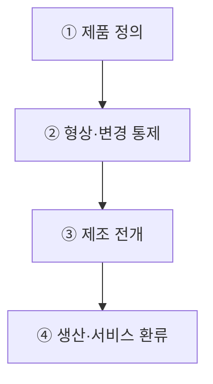
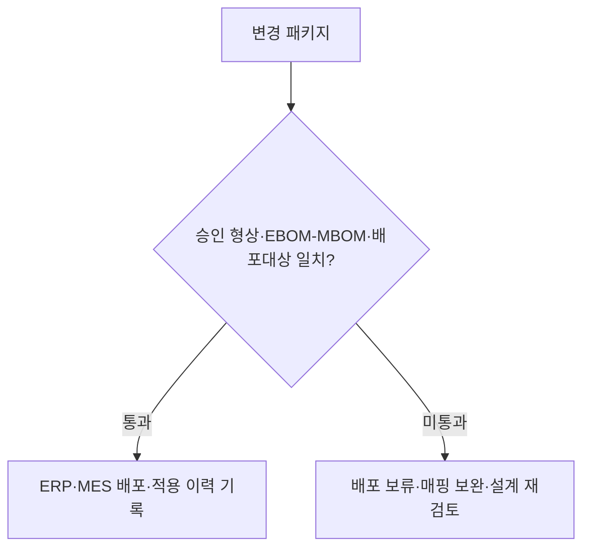
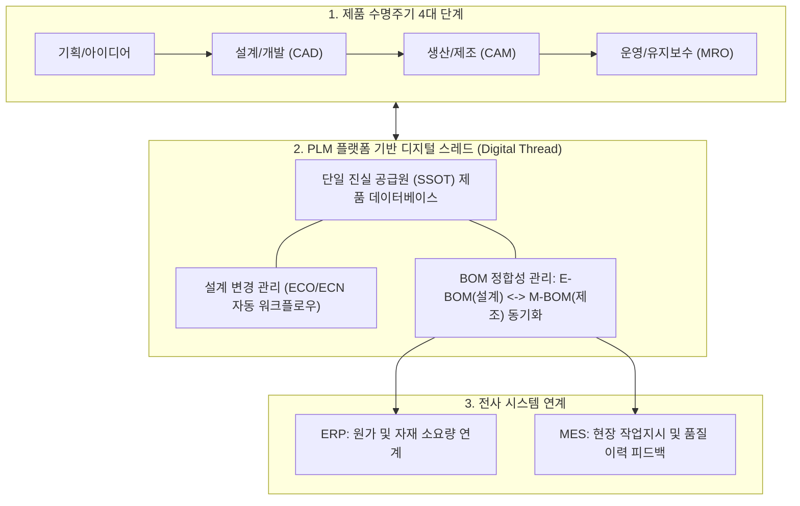

## 지식 로드맵 내 현재 위치
현재 위치: IT 전략·관리 → PLM

## 30초 인출

- 본질: 제품 기획부터 설계·생산·서비스·폐기까지 제품 정의와 변경 이력을 통합 관리하는 시스템이다.
- 메커니즘: 요구사항/CAD( **EBOM** ) → 형상·변경승인(ECO) → 제조전개( **MBOM** ) → ERP/MES 실행 → 품질/서비스 환류한다.
- 판정 기준: **EBOM** · **MBOM** 간 부품 매핑과 현장 도면의 최신 버전 적용을 추적·검증한다.

핵심 용어

- **PLM(Product Lifecycle Management)** : 제품 기획부터 설계·생산·유지보수·폐기까지 전 생애주기를 통합 관리하는 정보 체계
- **BOM(Bill of Materials)** : 제품을 구성하는 원자재·부품 목록과 조립 계층 관계를 나타낸 부품명세서
- **EBOM(Engineering Bill of Materials)** : 기능 및 설계 관점에서 정의된 설계 부품명세서
- **MBOM(Manufacturing Bill of Materials)** : 생산 공정 및 조립 순서 관점에서 정의된 제조 부품명세서
- **Digital Thread** : 설계부터 생산·운영까지 제품 데이터가 단절 없이 연결된 디지털 정보 흐름
- **Baseline** : 공식 변경 통제 절차(ECO) 없이는 수정할 수 없는 승인된 제품 형상 기준선

## 예상문제

> PLM의 개념과 생애주기 정보 흐름을 설명하고, EBOM·MBOM의 차이와 설계변경 통제·ERP·MES 연계 방안을 제시하시오. **(미출제 예상·25점)**

## Ⅰ. 제품 정보의 단절을 연결하는 PLM의 개요

> PLM은 도면 저장소가 아니라 제품 정의의 **Baseline(기준선)** 과 **Traceability(추적성)** 를 생애주기 끝까지 유지하는 정보 중추이며, 성패는 승인 형상과 현장 사용 형상의 일치로 판정함.

- 정의: **PLM(Product Lifecycle Management)** 은 개념·설계·조달·생산·서비스·폐기 전반의 사람·제품 데이터·프로세스·시스템을 통합하는 전략적 관리 체계
- 목적: 변경 누락·구버전 작업·부서 간 데이터 불일치 억제
PLM은 BOM(Bill of Materials), 문서·형상·버전·변경·협업 정보를 제품 생애주기와 연결한다.

## Ⅱ. 제품 정의를 현장 실행으로 연결하는 관리 흐름

> PLM의 핵심은 단계를 많이 나누는 데 있지 않고, 제품 정의를 승인된 형상으로 고정한 뒤 변경 영향과 배포 대상을 끝까지 추적하는 데 있음.

## Ⅲ. EBOM·MBOM의 관점 차이와 정합성

> EBOM과 MBOM은 같은 제품의 서로 다른 관점이므로 일치가 아니라 대응 관계를 통제해야 하며, 변경 시 미매핑 항목이 남으면 설계 의도가 현장 작업에 반영되지 않음.

| 축 | EBOM | MBOM |
|---|---|---|
| 목적 | 설계 의도·기능 구조 표현 | 생산·조립 구조 표현 |
| 기준 | 부품·모듈·형상 | 공정·작업·투입 자재 |
| 통제 | 설계 변경·버전 | 제조 변경·적용 시점 |

- 정합성: **EBOM ↔ MBOM** 대응표로 누락·중복·대체 부품을 검증
- 적용 시점: 승인 변경의 효력 시점과 재고·재공품·서비스 부품 처리 기준을 함께 확정

## Ⅳ. PLM·ERP·MES 연계와 변경 게이트

> PLM은 무엇을 만들지, ERP는 무엇을 조달·계획할지, MES는 현장에서 어떻게 실행했는지를 담당하며, 변경 배포 전 데이터 정합성 게이트가 구버전 작업을 차단함.

| 시스템 | 책임 | 교환 정보 |
|---|---|---|
| **PLM** | 제품 정의·형상·변경 | 승인 BOM · 도면 · 적용 시점 |
| **ERP(Enterprise Resource Planning)** | 자재·구매·원가·생산계획 | 품목 · 재고 · 조달 조건 |
| **MES(Manufacturing Execution System)** | 작업지시·공정실적·품질 | 작업 기준 · 실적 · 불량 이력 |

## Ⅴ. 문제점·대응책

> PLM 구축 실패는 기능 부족보다 품목 식별체계·변경 책임·연계 경계의 불일치에서 발생하므로 데이터와 의사결정을 함께 통제해야 함.

| 위험 | 대책 | 효과 |
|---|---|---|
| 품목·버전 중복 | 품목 식별 규칙·소유자 확정 | 제품 구조 중복·오연계 감소 |
| EBOM·MBOM 수작업 전환 | 대응표·변경 영향 검증 | 제조 누락·구버전 작업 억제 |
| 시스템 간 변경 시차 | 승인 이벤트·적용 시점 동기화 | PLM·ERP·MES 버전 일치 |

## Ⅵ. 추적 가능한 변경을 만드는 기술사적 제언

> 전사 일괄 구축보다 제품군 하나의 BOM·변경 흐름을 먼저 닫고, 승인 형상부터 현장 사용 형상까지 추적되는지 검증한 뒤 범위를 확장해야 함.

### 실전 답안용 기술사적 제언

- 문제: 제품 기획부터 설계(CAD), 생산(BOM), 사후 유지보수 간 데이터 단절로 인해 설계 변경(ECO) 반영 오류, 불량 발생 및 출시 지연이 초래됨.
- 해결 방안: 제품 전 생애주기의 단일 진실 공급원(SSOT)으로서 PLM을 구축하고, E-BOM(설계)과 M-BOM(제조)을 실시간 동기화하는 디지털 스레드(Digital Thread) 및 ERP/MES 연동을 구현함.

## 1교시 10점 답안 발췌

### 1. 정의·목적

- 정의: **PLM(Product Lifecycle Management)** 은 개념·설계·조달·생산·서비스·폐기 전반의 사람·제품 데이터·프로세스·시스템을 통합하는 전략적 관리 체계
- 목적: 변경 누락·구버전 작업·부서 간 데이터 불일치 억제

### 2. 핵심 관리 메커니즘

### 3. 핵심 통제·결론

- 통제: EBOM ↔ MBOM 대응, 승인 형상 ↔ 현장 형상 추적
- 결론: PLM 성패는 저장 문서 수가 아니라 변경의 영향 분석·승인·배포·현장 적용을 잇는 **Digital Thread** 로 판정

## 출제 이력과 검증 출처

- 공식 기출: 확인 가능한 공개 문제지 범위에서 제조 PLM 문항 미확인
- [IBM, What is product lifecycle management (PLM)?](https://www.ibm.com/think/topics/product-lifecycle-management)
- [ISO 10303-1:2024, Product data representation and exchange — Overview and fundamental principles](https://www.iso.org/standard/83105.html)
- [ISO 10303-21:2016, Clear text encoding of the exchange structure](https://www.iso.org/standard/63141.html)

## 학습 체크

- [ ] Ⅰ 개요: PLM 정의·목적·관리 범위를 각각 한 줄로 재현할 수 있는가?
- [ ] Ⅱ 관리 흐름: 제품 정의 → 형상·변경 통제 → 제조 전개 → 생산·서비스 환류의 활동·산출을 연결할 수 있는가?
- [ ] Ⅲ BOM 정합성: EBOM·MBOM을 목적·기준·통제의 세 축으로 비교하고 대응표의 필요성을 설명할 수 있는가?
- [ ] Ⅳ 연계·게이트: PLM·ERP·MES의 책임과 변경 게이트의 통과·미통과 조치를 그릴 수 있는가?
- [ ] Ⅴ~Ⅵ 대책·제언: 세 가지 위험·대책·효과와 제품군 파일럿의 판정 기준을 재현할 수 있는가?

## 연결 토픽

- 선행: [ERP](./068_erp.md), [SCM](./005_scm.md)
- 연관: [POP](./038_pop.md), [가치사슬](./072_value_chain.md)
