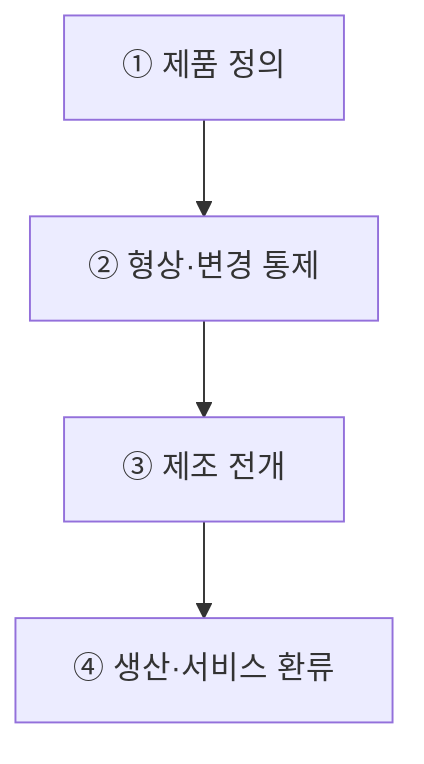
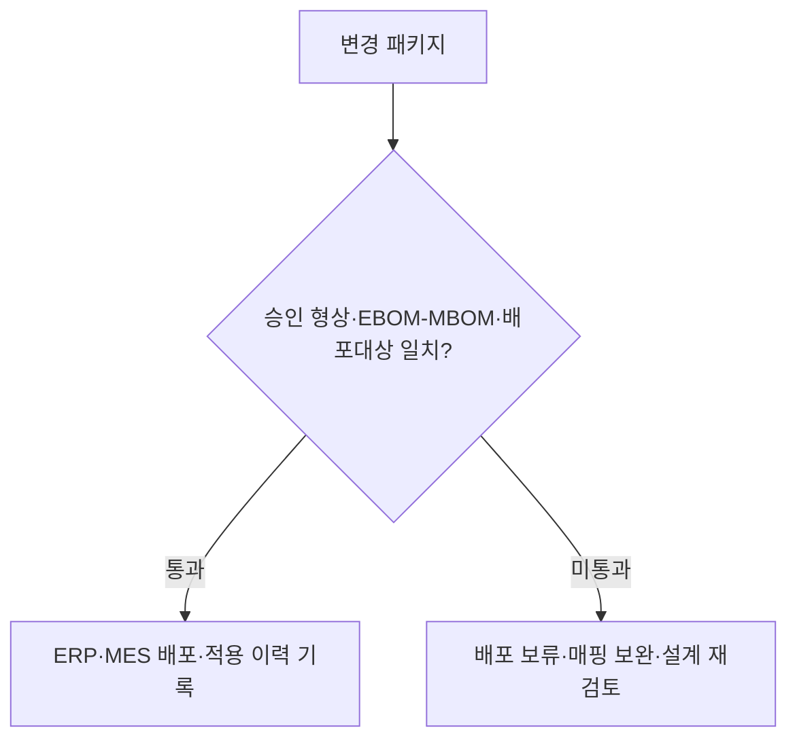

## 지식 로드맵 내 현재 위치
현재 위치: IT 전략·관리 → PLM

## 30초 인출

- 본질: PLM은 제품 기획부터 폐기까지 설계·제조·서비스 정보를 함께 관리하고 설계변경 이력을 추적하는 시스템.
- 메커니즘: 설계 구조(EBOM)의 승인 변경을 제조 구조(MBOM)에 반영하고 ERP·MES에 배포해 생산·서비스 이력과 연결.
- 판정 기준: **EBOM** · **MBOM** 간 부품 매핑과 현장 도면의 최신 버전 적용 여부 확인.

핵심 용어

- **PLM(Product Lifecycle Management)**: 제품의 기획·설계·생산·서비스·폐기 정보를 연결해 관리하는 접근.
- **BOM(Bill of Materials)** : 제품을 구성하는 원자재·부품 목록과 조립 계층 관계를 나타낸 부품명세서
- **EBOM(Engineering Bill of Materials)** : 기능 및 설계 관점에서 정의된 설계 부품명세서
- **MBOM(Manufacturing Bill of Materials)** : 생산 공정 및 조립 순서 관점에서 정의된 제조 부품명세서
- **Digital Thread** : 설계부터 생산·운영까지 제품 데이터가 단절 없이 연결된 디지털 정보 흐름
- **Baseline** : 공식 변경 통제 절차(ECO) 없이는 수정할 수 없는 승인된 제품 형상 기준선
- **ECO(Engineering Change Order)**: 설계 변경을 검토·승인하고 실행하도록 기록하는 변경 지시.
- **ERP(Enterprise Resource Planning)**: 구매·자재·원가·생산계획 등 전사 자원을 관리하는 시스템.
- **MES(Manufacturing Execution System)**: 작업지시와 생산현장 실적을 관리하는 시스템.

---

## 1교시 예상문제 (10점)

> PLM의 제품정보 흐름과 설계변경 통제를 설명하시오. (예상·10점)

---

## 1교시 10점 답안

### Ⅰ. 개요

| 구분 | 핵심 |
|---|---|
| 정의 | **PLM(Product Lifecycle Management)** 은 제품의 기획·설계·조달·생산·서비스·폐기 데이터를 사람·프로세스·시스템과 연결해 관리하는 접근 |
| 목적 | 변경 누락·구버전 작업·부서 간 데이터 불일치 억제 |

### Ⅱ. 제품정보·변경 관리 흐름

### Ⅲ. 변경 통제

| 통제 대상 | 확인 내용 |
|---|---|
| **EBOM(Engineering Bill of Materials)** ↔ **MBOM(Manufacturing Bill of Materials)** | 설계 부품의 제조 구조 매핑과 변경 영향 |
| 승인 형상 ↔ 현장 형상 | 최신 개정의 승인·배포·적용 이력 |
| **Digital Thread** | 기획·설계에서 생산·서비스까지의 데이터 추적 |

**제언:** 설계변경의 효력 시점을 정하고 현장 도면·작업기준서의 적용 버전 대조.

---

## 2~4교시 예상문제 (25점)

> PLM의 개념과 생애주기 정보 흐름을 설명하고, EBOM·MBOM의 차이와 설계변경 통제·ERP·MES 연계 방안을 제시하시오. **(미출제 예상·25점)**

---

## 2~4교시 25점 답안

## Ⅰ. 제품 정보의 단절을 연결하는 PLM의 개요

> 도면 저장소를 넘어 제품 정의의 **Baseline(기준선)** 과 **Traceability(추적성)** 를 생애주기 내내 유지하는 정보 기반, 승인 형상·현장 사용 형상의 일치 여부.

| 구분 | 핵심 |
|---|---|
| 정의 | **PLM(Product Lifecycle Management)** 은 제품의 기획·설계·조달·생산·서비스·폐기 데이터를 사람·프로세스·시스템과 연결해 관리하는 접근 |
| 목적 | 변경 누락·구버전 작업·부서 간 데이터 불일치 억제 |
제품 생애주기와 연결되는 정보: **BOM(Bill of Materials)**, 문서·형상·버전·변경·협업 정보.

## Ⅱ. 제품 정의를 현장 실행으로 연결하는 관리 흐름

> 제품 정의의 승인 형상 고정, 변경 영향·배포 대상의 전 과정 추적.

## Ⅲ. EBOM·MBOM의 관점 차이와 정합성

> 같은 제품을 다루는 EBOM·MBOM의 관점 차이와 대응 관계, 변경 후 미매핑 항목에 따른 설계 의도의 현장 미반영 위험.

**EBOM(Engineering Bill of Materials)** 은 설계 의도, **MBOM(Manufacturing Bill of Materials)** 은 생산·조립 구조를 나타내는 명세. **ECO(Engineering Change Order)** 는 변경 영향·적용 시점을 정해 관련 구조에 반영하는 통제 절차.

| 축 | EBOM | MBOM |
|---|---|---|
| 목적 | 설계 의도·기능 구조 표현 | 생산·조립 구조 표현 |
| 기준 | 부품·모듈·형상 | 공정·작업·투입 자재 |
| 통제 | 설계 변경·버전 | 제조 변경·적용 시점 |

- 정합성: **EBOM ↔ MBOM** 대응표를 통한 누락·중복·대체 부품 확인
- 적용 시점: 승인 변경의 효력 시점과 재고·재공품·서비스 부품 처리 기준의 동시 확정

## Ⅳ. PLM·ERP·MES 연계와 변경 게이트

> PLM의 제품 정의, ERP의 조달·계획, MES의 현장 실행이라는 시스템별 책임과 변경 배포 전 데이터 정합성 확인.

| 시스템 | 책임 | 교환 정보 |
|---|---|---|
| **PLM** | 제품 정의·형상·변경 | 승인 BOM · 도면 · 적용 시점 |
| **ERP(Enterprise Resource Planning)** | 자재·구매·원가·생산계획 | 품목 · 재고 · 조달 조건 |
| **MES(Manufacturing Execution System)** | 작업지시·공정실적·품질 | 작업 기준 · 실적 · 불량 이력 |

## Ⅴ. 문제점·대응책

> 기능 부족보다 품목 식별체계·변경 책임·연계 경계의 불일치에 따른 PLM 구축 위험, 데이터·의사결정의 동시 관리.

| 위험 | 대책 | 효과 |
|---|---|---|
| 품목·버전 중복 | 품목 식별 규칙·소유자 확정 | 제품 구조 중복·오연계 위험 감소 |
| EBOM·MBOM 수작업 전환 | 대응표·변경 영향 확인 | 제조 누락·구버전 작업 방지 |
| 시스템 간 변경 시차 | 승인 이벤트·적용 시점 동기화 | PLM·ERP·MES 버전의 일치 |

## Ⅵ. 기술사적 제언

| 문제 | 해결 방안 |
|---|---|
| 전사 동시 적용에 따른 품목 매핑·변경 절차 오류의 생산 전반 확산 위험 | 제품군 하나를 선정해 승인 EBOM→MBOM→ERP·MES 배포 이력을 우선 확인하고, 매핑 완전성·현장 적용·되돌림 절차 점검 후 적용 범위 확대 |

## 출제 이력과 검증 출처

- 공식 기출: 확인 가능한 공개 문제지 범위에서 제조 PLM 문항 미확인
- [IBM, What is product lifecycle management (PLM)?](https://www.ibm.com/think/topics/product-lifecycle-management)
- [ISO 10303-1:2024, Product data representation and exchange — Overview and fundamental principles](https://www.iso.org/standard/83105.html)
- [ISO 10303-21:2016, Clear text encoding of the exchange structure](https://www.iso.org/standard/63141.html)

## 연결 토픽

- 선행: [ERP](./068_erp.md), [SCM](./005_scm.md)
- 연관: [POP](./038_pop.md), [가치사슬](./072_value_chain.md)
