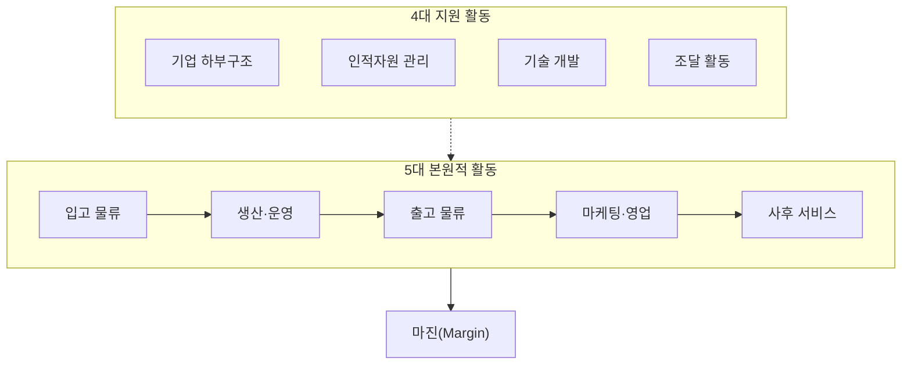

## 지식 로드맵 내 현재 위치

  IT 전략·관리
  경영 전략·비즈니스 아키텍처
  <strong>가치사슬(Value Chain)</strong>

## 30초 인출

- 본질: 기업의 활동을 본원적·지원 활동으로 분해하여 원가우위와 차별화 마진(Margin)을 도출하는 분석 틀
- 메커니즘: 지원활동(인프라·HR·R&D·조달)이 본원활동(입고→생산→출고→마케팅→서비스)을 뒷받침하여 마진 창출
- 판정 기준: 부서별 국소 최적화 지양 및 E2E 납기 리드타임 10% 이상 단축 달성

핵심 용어

- **Value Chain**: 마이클 포터가 정립한 이론으로 원자재 투입부터 완제품 소비까지 가치를 부가하는 활동 연쇄망
- **Primary Activities(본원적 활동)**: 제품의 물리적 생성, 판매, 유통, 사후 서비스에 직접 관여하는 5대 핵심 활동
- **Support Activities(지원 활동)**: 본원적 활동이 원활히 수행되도록 인프라, 기술, 인력, 원자재를 뒷받침하는 4대 지원 활동
- **Margin(마진)**: 고객이 제품과 서비스에 대해 기꺼이 지불하려는 총 가치(Price)에서 가치 활동 총원가를 차감한 잔여 이익
- **Linkages(연계성)**: 가치사슬 내 한 활동의 수행 방식이 다른 활동의 비용이나 성능에 미치는 상호 의존적 관계

## 예상문제

> 가치사슬(Value Chain)의 개념과 본원적·지원 활동을 설명하고, 활동 간 연계를 이용한 경쟁우위 확보 방안을 제시하시오. **(미출제 예상·25점)**

## Ⅰ. 경쟁 우위 분석의 프레임워크, 가치사슬의 개요

> 가치사슬은 기업 활동을 본원적 활동과 지원 활동으로 분해하여 **마진(Margin)**을 분석하며, 경쟁 우위는 개별 부서의 단절된 효율이 아닌 **활동 간 연계성(Linkages)의 최적화**로 판정함.

- 정의: 원자재 수급부터 최종 서비스까지 제품 변환 과정을 **5대 본원적 활동**과 **4대 지원 활동**으로 체계화하여 부가가치 창출 구조와 **마진(Margin)**을 분석하는 **경영 전략 분석 모델**
- 목적: 활동별 원가 동인 분석 · 차별화 기회 포착 · 프로세스 연계 최적화

## Ⅱ. 5대 본원적 활동과 4대 지원 활동의 가치사슬 구조

> 공급자로부터 원자재가 입고되어 가공, 출하, 판매, 사후 관리로 이어지는 흐름 속에서 부가가치가 누적되며 마진(Margin)을 창출함.

**5대 본원적 활동**

| 활동 | 주요 역할 및 정보기술 |
|---|---|
| 입고 물류 | 원자재 수급, 검수, 재고관리 (WMS, SCM) |
| 생산·운영 | 가공, 조립, 패키징, 설비 제어 (MES, POP) |
| 출고 물류 | 완제품 보관, 주문 처리, 수송 배송 (TMS) |
| 마케팅·영업 | 판촉, 가격 책정, 채널 관리, 판매 (CRM) |
| 사후 서비스 | 설치, 수리, 고객지원, 부품 교체 (A/S 포털) |

**4대 지원 활동**

| 활동 | 주요 역할 및 정보기술 |
|---|---|
| 기업 하부구조 | 전사 기획, 재무회계, 법무, 품질경영 (ERP) |
| 인적자원 관리 | 채용, 교육훈련, 성과평가, 보상 (e-HR) |
| 기술 개발 | R&D, 제품 설계, 공정 개선 (PLM, CAD) |
| 조달 활동 | 원자재, 설비, 외주용역 구매 협상 (e-Procurement) |

## Ⅲ. 가치활동과 정보기술 활용

> 각 활동의 비용 절감과 차별화는 전문화된 정보시스템 구축 · 활동 간 실시간 데이터 연계를 통해 구현됨.

| 적용축 | 정보기술 역할 | 판정 지표 |
|---|---|---|
| **본원 활동** | 주문·재고·생산·배송·고객정보 연결 | 리드타임 · 결품률 · 고객 유지율 |
| **지원 활동** | 재무·인력·기술·조달 데이터 표준화 | 단위당 원가 · 조달기간 · 개발기간 |
| **활동 간 연계** | 원인–결과 데이터 추적·병목 가시화 | 전체 흐름 개선과 마진 기여 |

## Ⅳ. 문제점·대응책

> 솔루션 도입 목록보다 활동의 비용·차별화 동인과 활동 간 연계를 먼저 검증해야 함.

| 위험 | 대책 | 효과 |
|---|---|---|
| **부서별 국소 최적화** | E2E 리드타임·원가로 연계 분석 | 전체 마진 개선 |
| **기술 중심 투자** | 비용·차별화 동인과 투자안 추적 | 불필요한 자동화 방지 |
| **측정 경계 누락** | 공급자·채널을 포함한 가치시스템 검토 | 외부 병목 식별 |

## Ⅴ. 활동 간 연계 개선을 위한 기술사적 제언

> 병목 활동과 연계 원인을 먼저 측정하고 필요한 범위에만 데이터 통합·업무 재설계를 적용함.

### 학습자 통찰 메모 — 답안 밖

- [핵심 통찰]: 마이클 포터의 가치사슬은 각 활동의 비용 절감도 중요하지만, 핵심은 '연계성(Linkages)'에 있음. 영업 부서가 프로모션을 실행할 때 입고·생산·출고 시스템에 즉시 공유되지 않으면 품절과 재고 비용 폭증으로 마진이 훼손됨.
- 나라면: 활동별 비용·고객가치와 활동 간 인과를 확인한 뒤, 병목 연계에만 데이터 통합·자동화를 적용하겠음.

### 실전 답안용 기술사적 제언

- **판정 기준 (Trigger)**: 개별 단위 부서의 생산성은 향상되었으나 전사 재고일수 및 납기 리드타임이 오히려 10% 이상 증가할 시 연계성(Linkage) 단절로 판정.
- **대응 방안 (Action)**: 본원적 활동(SCM-MES-TMS-CRM) 간 실시간 이벤트 드리븐(EDA) 연계를 구축하고, 전사 마진을 훼손하는 사일로(Silo) 부서 간 KPI를 통합 정렬함.
- **검증 체계 (Verification)**: 활동별 원가 동인(Cost Drivers)과 차별화 동인(Uniqueness Drivers)을 정량 계측하여 가치사슬 전 구간의 E2E 현금전환주기(CCC)를 검증함.
- **기대 효과 (Impact)**: 국소 최적화의 함정 탈피, 불필요한 재고 유지비용 35% 절감, 고객 맞춤형 차별화 경쟁 우위 및 영업이익률(마진) 극대화를 달성함.

## 1교시 10점 답안 발췌

### 1. 정의·목적

- 정의: 기업의 활동을 **5대 본원적 활동**과 **4대 지원 활동**으로 체계화하여 부가가치 창출 구조와 **마진(Margin)**을 분석하는 **마이클 포터의 경영 전략 모델**
- 목적: 활동별 원가 동인 분석 · 프로세스 최적화 · 연계성 강화

### 2. 가치사슬 9대 활동 및 마진 구조

### 3. 핵심 통제

- **Linkages 최적화**: 단위 부서 효율보다 활동 간 데이터 연계를 통한 마진 극대화
- **E2E 흐름 개선**: SCM-MES-TMS-CRM 전 구간 현금전환주기 단축

## 출제 이력과 검증 출처

- Harvard Business School Institute for Strategy and Competitiveness, [The Value Chain](https://www.isc.hbs.edu/strategy/business-strategy/Pages/the-value-chain.aspx)

## 학습 체크

- [ ] Ⅰ: 가치사슬의 정의·마진·활동 간 연계의 의미를 설명할 수 있는가?
- [ ] Ⅱ: 5대 본원적 활동과 4대 지원 활동을 재현할 수 있는가?
- [ ] Ⅲ·Ⅳ: 정보기술 활용축과 분석 위험–대책–효과를 연결할 수 있는가?
- [ ] Ⅴ: 병목 활동의 추적성과 E2E 지표 검증 방안을 제언할 수 있는가?

## 연결 토픽

- 이전 토픽: [PLM](./071_plm.md)
- 연관 토픽: [SCM](./005_scm.md), [ERP](./068_erp.md), [CRM](./031_crm.md), [SWOT 분석](./034_swot_analysis.md)
- 다음 토픽: [정량적 위험분석](./073_quantitative_risk_analysis.md)
