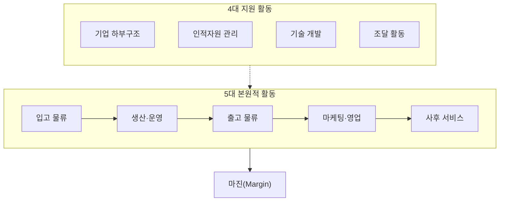

## 지식 로드맵 내 현재 위치
현재 위치: IT 전략·관리 → 가치사슬(Value Chain)

## 30초 인출

- 본질: 가치사슬은 기업 활동을 본원적 활동과 지원 활동으로 나눠 비용·차별화의 원천을 찾는 분석 틀.
- 메커니즘: 지원 활동의 본원 활동 뒷받침, 활동별 비용·차별화의 제품·서비스 **마진** 반영.
- 판정 기준: 활동별 비용·차별화 동인과 활동 간 인계 병목을 통한 전사 마진 개선 여부 확인.

핵심 용어

- **Value Chain(가치사슬)**: 제품·서비스를 만들고 전달하는 기업 활동을 분석해 비용과 차별화의 원천을 찾는 틀.
- **Primary Activities(본원적 활동)**: 입고물류·생산·출고물류·마케팅·서비스처럼 제품 제공에 직접 연결되는 활동.
- **Support Activities(지원 활동)**: 기업 인프라·인적자원·기술개발·조달처럼 본원적 활동을 지원하는 활동.
- **Margin(마진)**: 창출한 고객 가치와 활동에 투입한 비용의 차이.
- **Linkages(연계성)**: 한 활동의 방식이나 결과가 다른 활동의 비용·품질·속도에 영향을 주는 관계.

---

## 1교시 예상문제 (10점)

> 가치사슬의 본원적·지원 활동과 마진 형성 구조를 설명하시오. (예상·10점)

---

## 1교시 10점 답안

### Ⅰ. 개요

| 구분 | 핵심 |
|---|---|
| 정의 | **가치사슬(Value Chain)** 은 기업 활동을 본원적 활동과 지원 활동으로 구분해 비용·차별화의 원천과 마진을 분석하는 경영 전략 틀 |
| 목적 | 활동별 원가 동인 분석 · 차별화 기회 포착 · 프로세스 연계 최적화 |

### Ⅱ. 9대 활동과 마진 구조

### Ⅲ. 연계성 분석

| 분석 대상 | 확인할 내용 |
|---|---|
| **Linkages(연계성)** | 한 활동의 비용·품질·속도가 다른 활동에 주는 영향 |
| 원가·차별화 동인 | 활동별 원가와 고객이 지각하는 차별화 기여 |
| 개선 우선순위 | 연계 병목의 전사 마진 영향을 기준으로 결정 |

---

## 2~4교시 예상문제 (25점)

> 가치사슬(Value Chain)의 개념과 본원적·지원 활동을 설명하고, 활동 간 연계를 이용한 경쟁우위 확보 방안을 제시하시오. **(미출제 예상·25점)**

---

## 2~4교시 25점 답안

## Ⅰ. 경쟁 우위 분석의 프레임워크, 가치사슬의 개요

> 기업 활동을 본원적·지원 활동으로 나눠 **마진(Margin)** 을 분석하는 가치사슬, 경쟁 우위의 기반인 **활동 간 연계성(Linkages)의 최적화**.

| 구분 | 핵심 |
|---|---|
| 정의 | **가치사슬(Value Chain)** 은 기업 활동을 본원적 활동과 지원 활동으로 구분해 비용·차별화의 원천과 마진을 분석하는 경영 전략 틀 |
| 목적 | 활동별 원가 동인 분석 · 차별화 기회 포착 · 프로세스 연계 최적화 |

## Ⅱ. 5대 본원적 활동과 4대 지원 활동의 가치사슬 구조

> 공급자 원자재의 입고부터 가공·출하·판매·사후 관리까지 이어지는 흐름과 부가가치·마진의 형성.

**5대 본원적 활동**

| 활동 | 주요 역할 및 정보기술 |
|---|---|
| 입고 물류 | 원자재 수급, 검수, 재고관리 (WMS, SCM) |
| 생산·운영 | 가공, 조립, 패키징, 설비 제어 (MES, POP) |
| 출고 물류 | 완제품 보관, 주문 처리, 수송 배송 (TMS) |
| 마케팅·영업 | 판촉, 가격 책정, 채널 관리, 판매 (CRM) |
| 사후 서비스 | 설치, 수리, 고객지원, 부품 교체 (A/S 포털) |

**4대 지원 활동**

| 활동 | 주요 역할 및 정보기술 |
|---|---|
| 기업 하부구조 | 전사 기획, 재무회계, 법무, 품질경영 (ERP) |
| 인적자원 관리 | 채용, 교육훈련, 성과평가, 보상 (e-HR) |
| 기술 개발 | R&D, 제품 설계, 공정 개선 (PLM, CAD) |
| 조달 활동 | 원자재, 설비, 외주용역 구매 협상 (e-Procurement) |

## Ⅲ. 가치활동과 정보기술 활용

> 전문화된 정보시스템과 활동 간 데이터 연계를 통한 비용 절감·차별화.

| 적용축 | 정보기술 역할 | 판정 지표 |
|---|---|---|
| **본원 활동** | 주문·재고·생산·배송·고객정보 연결 | 리드타임 · 결품률 · 고객 유지율 |
| **지원 활동** | 재무·인력·기술·조달 데이터 표준화 | 단위당 원가 · 조달기간 · 개발기간 |
| **활동 간 연계** | 원인–결과 데이터 추적·병목 가시화 | 전체 흐름 개선과 마진 기여 |

## Ⅳ. 문제점·대응책

> 솔루션 목록보다 우선 확인할 활동별 비용·차별화 동인과 활동 간 연계.

| 위험 | 대책 | 효과 |
|---|---|---|
| **부서별 국소 최적화** | E2E 리드타임·원가 기준의 연계 분석 | 전체 마진 개선 |
| **기술 중심 투자** | 비용·차별화 동인과 투자안의 연결 | 불필요한 자동화 방지 |
| **측정 경계 누락** | 공급자·채널을 포함한 가치시스템 검토 | 외부 병목의 식별 |

## Ⅴ. 기술사적 제언

| 문제 | 해결 방안 |
|---|---|
| 전사 동시 디지털화에 따른 병목·마진과 무관한 연계의 시스템화 비용 | 비용·품질·납기 자료에 따른 우선 개선 연계 선정, 활동 책임자·전후 지표 지정, 개선 효과 확인 후 타 활동으로 확대 |

## 출제 이력과 검증 출처

- Harvard Business School Institute for Strategy and Competitiveness, [The Value Chain](https://www.isc.hbs.edu/strategy/business-strategy/Pages/the-value-chain.aspx)

## 연결 토픽

- 이전 토픽: [PLM](./071_plm.md)
- 연관 토픽: [SCM](./005_scm.md), [ERP](./068_erp.md), [CRM](./031_crm.md), [SWOT 분석](./034_swot_analysis.md)
- 다음 토픽: [정량적 위험분석](./073_quantitative_risk_analysis.md)
