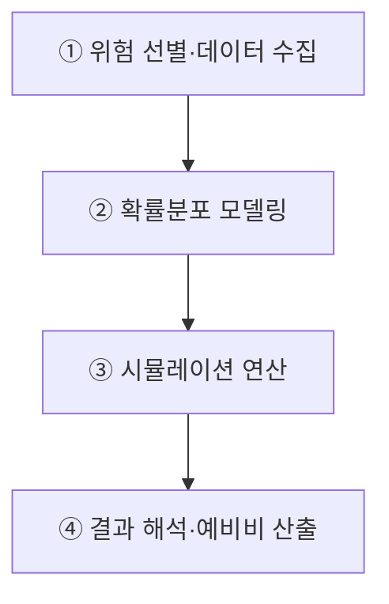
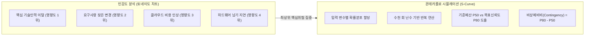
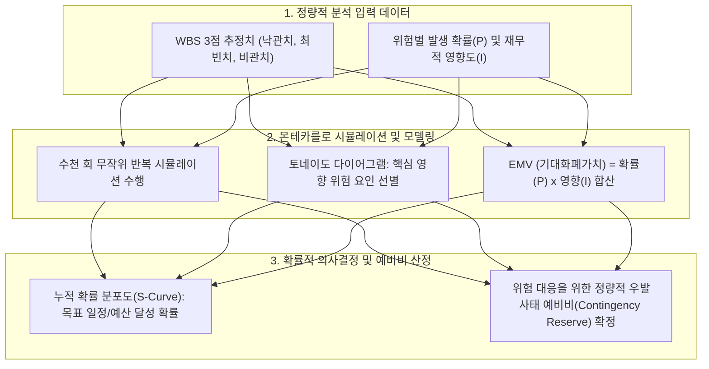

## 지식 로드맵 내 현재 위치
현재 위치: IT 전략·관리 → 정량적 위험분석

## 30초 인출

- 본질: 정량적 위험분석은 주요 위험이 프로젝트 비용·일정에 미칠 영향을 확률과 금액으로 추정하는 기법이다.
- 메커니즘: 위험선별/3점추정 → 확률분포 모델링 → 몬테카를로 시뮬레이션/ **EMV** 연산 → 누적확률곡선( **S-Curve** ) 도출한다.
- 판정 기준: 확률분포와 목표 신뢰수준을 근거로 예비비 산정과 위험 대응의 타당성을 검증한다.

핵심 용어

- **EMV(Expected Monetary Value)** : 발생 확률(P)과 영향 금액(I)을 곱해 미래 손익의 통계적 기대치를 산출하는 화폐기대값 기법
- **Monte Carlo Simulation** : 불확실 변수의 확률분포에 난수 연산을 반복 적용해 결과의 발생 확률 분포를 도출하는 시뮬레이션
- **Tornado Diagram** : 민감도 분석 결과를 변동 폭 크기 순으로 수평 정렬하여 핵심 리스크를 식별하는 시각화 다이어그램
- **Decision Tree** : 의사결정과 확률 분기별 기대 성과를 모델링하여 최적 대안을 비교·선택하는 의사결정나무 분석
- **Contingency Reserve(비상예비비)** : 식별된 잔여 리스크(Known-Unknowns) 대응을 위해 기준선 내에 배정한 예비비
- **S-Curve(누적 확률 곡선)** : 특정 예산이나 공기 내에 프로젝트를 완공할 가능성을 나타낸 누적 확률분포 곡선

---

## 1교시 예상문제 (10점)

> 정량적 위험분석의 주요 기법과 비용·일정 판단 절차를 설명하시오. (예상·10점)

---

## 1교시 10점 답안

### 1. 정의·목적

- 정의: 선별된 위험이 프로젝트 목표에 미치는 영향을 **확률적·수치적 기법** 으로 계량화하는 **위험 분석 활동**
- 목적: 목표 달성 가능성 추정 · 대응 우선순위와 예비비 근거 마련

### 2. 정량적 위험분석 실행 파이프라인

### 3. 핵심 기법 및 통제

- **민감도·EMV** : 최상위 변수 식별 및 기대 손익 산출
- **몬테카를로** : 조직 신뢰수준(P80) 기준 예비비(`Contingency Reserve = P80 - P50`) 과학적 책정

---

## 2~4교시 예상문제 (25점)

> 정량적 위험분석(Quantitative Risk Analysis)의 개념과 주요 기법을 설명하고, 프로젝트 비용·일정 의사결정에 적용하는 방안을 제시하시오. **(미출제 예상·25점)**

---

## 2~4교시 25점 답안

## Ⅰ. 불확실성의 통계적 계량화, 정량적 위험분석의 개요

> 정량적 위험분석의 신뢰성은 특정 신뢰수준을 고정하는 데 있지 않고 입력자료·분포·상관관계·가정을 투명하게 검증하는 데 있음.

- 정의: 선별된 위험이 프로젝트 목표에 미치는 영향을 **확률적·수치적 기법** 으로 계량화하는 **위험 분석 활동**
- 목적: **목표 달성 확률** 추정 · **핵심 위험** 식별 · **대응 우선순위** 결정

## Ⅱ. 정량적 위험분석 4단계 실행 파이프라인

> 고위험 선별에서 데이터 확률분포 모델링, 컴퓨터 시뮬레이션, 베이스라인 확정으로 이어지는 엄밀한 수학적 파이프라인으로 전개됨.

## Ⅲ. 정성적 위험분석 vs 정량적 위험분석 비교

> 정성 분석은 신속한 서열화에 적합하고, 정량 분석은 막대한 예산이 투입되는 의사결정에 필수적인 수치적 근거를 제공함.

| 비교 항목 | 정성적 위험분석 (Qualitative) | 정량적 위험분석 (Quantitative) |
|---|---|---|
| **분석 목적** | 위험의 빠른 우선순위 판정·스크리닝 | **전체 일정·비용의 복합적 재무 손실 수치화** |
| **적용 기법** | **P-I 매트릭스(확률-영향)** , 위험 분류체계(RBS) | **몬테카를로 시뮬레이션, EMV, 토네이도 차트** |
| **산출 결과** | 위험 우선순위 목록, 감시 목록(Watchlist) | **누적 확률 분포(S-Curve), 비상예비비 산출액** |

## Ⅳ. 정량적 위험분석 4대 핵심 기법

> 네 가지 기법은 상호 배타적인 것이 아니라, 민감도 분석으로 변수를 좁히고 EMV·의사결정나무로 대안을 평가하며 몬테카를로로 종합 예비비를 산정하는 보완 관계임.

| 분석 기법 | 핵심 메커니즘 | 실무 적용 역할 |
|---|---|---|
| **민감도 분석 (토네이도)** | 타 변수를 고정하고 특정 위험 변수의 변동 폭이 결과에 미치는 민감도 측정 | 프로젝트 성공을 좌우하는 최상위 핵심 리스크 식별 |
| **기대화폐가치 (EMV)** | 공식: `EMV = \sum (P_i \times I_i)` (확률 × 영향액) | 위협(-)과 기회(+)를 상계하여 순 기대 손익 계산 |
| **의사결정나무 분석** | 의사결정 노드(□)와 확률 노드(○)의 분기별 EMV 비교 | 자체 개발 vs 상용 패키지 도입 등 대안 선정 |
| **몬테카를로 시뮬레이션** | 입력 분포에서 반복 표본추출 후 결과 분포 도출 | 조직이 정한 신뢰수준의 비용·일정 목표 근거 제시 |

## Ⅴ. 문제점·대응책

> 계산 정밀도보다 입력자료·분포·상관관계의 타당성과 분석모형의 지속적 갱신이 우선임.

| 위험 | 대책 | 효과 |
|---|---|---|
| **낙관적 추정 편향** | 유사 사업 실적·전문가 판단 교차검증 | 입력 신뢰성 확보 |
| **상관관계 누락** | 공통 원인·연계 일정의 상관관계 모델링 | 위험 과소평가 방지 |
| **일회성 분석** | 마일스톤별 실적 반영·재분석 | 예비비 적정성 유지 |

## Ⅵ. 근거 기반 예비비 통제를 위한 기술사적 제언

> 확률분포 결과를 단일 숫자로 단정하지 않고 조직의 위험선호와 대응전략을 함께 제시해야 함.

### 실전 답안용 기술사적 제언

- 문제: 주관적 정성평가(High/Med/Low)에만 의존하여 위험 발생 시 실제 재무적 손실 규모와 프로젝트 완료 확률을 객관적으로 입증하지 못함.
- 해결 방안: 몬테카를로 시뮬레이션, 토네이도 다이어그램(민감도 분석), 기대화폐가치(EMV) 및 의사결정나무(Decision Tree)를 적용하여 일정·원가 초과 위험을 확률 분포로 정량 산출하고 적정 예비비(Contingency)를 산정함.

## 출제 이력과 검증 출처

- Project Management Institute, [Risk by the Numbers](https://www.pmi.org/learning/library/quantitative-risk-analysis-approaches-balance-2296)
- 참고 문항: 제117회 타 종목 문항으로 전해지나 Q-Net 정보관리 공식 문제지 원문은 미확보하여 출제 이력으로 단정하지 않음
- ISO, [IEC 31010:2019 Risk management — Risk assessment techniques](https://www.iso.org/standard/72140.html)

## 연결 토픽

- 이전 토픽: [가치사슬](./072_value_chain.md)
- 연관 토픽: [프로젝트 위험관리](./009_project_risk_management_negative.md), [위험 대응 전략](./040_negative_risk_response_strategy.md), [ISO 31000](./069_iso_31000.md), [EVM](./032_evm.md)
- 다음 토픽: [AHP](./075_ahp.md)
