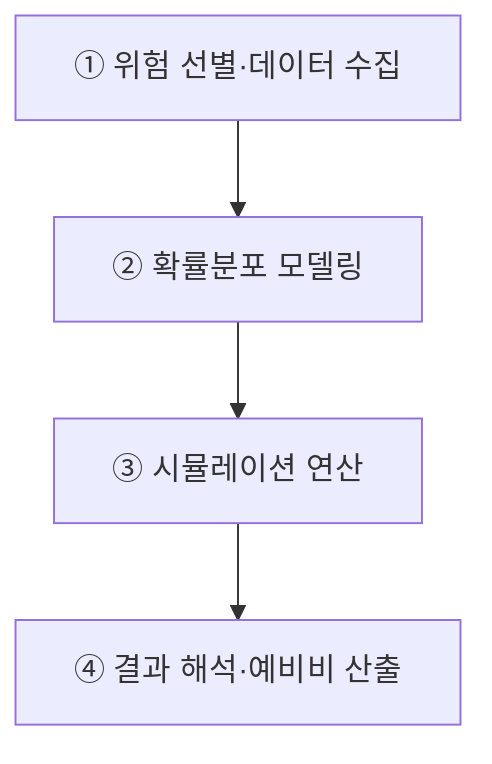
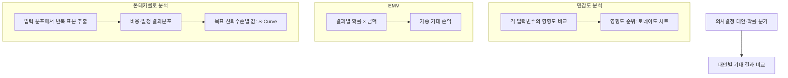

## 지식 로드맵 내 현재 위치
현재 위치: IT 전략·관리 → 정량적 위험분석

## 30초 인출

- 본질: 정량적 위험분석은 주요 위험이 프로젝트 비용·일정에 미치는 영향을 확률·수치 기법으로 추정하는 분석 활동.
- 메커니즘: 위험·불확실성 변수의 확률분포 모델링과 EMV·몬테카를로 분석을 통한 비용·일정 결과분포 추정.
- 판정 기준: 분석 가정·조직의 목표 신뢰수준을 바탕으로 한 대응 우선순위·예비비 결정.

핵심 용어

- **정량적 위험분석**: 선별된 위험이 프로젝트 목표에 미치는 영향을 확률·수치 기법으로 추정하는 분석 활동.
- **EMV(Expected Monetary Value, 기대화폐가치)**: 각 결과의 확률과 금액을 곱해 더한 기대 손익.
- **Monte Carlo Simulation(몬테카를로 시뮬레이션)**: 입력변수의 확률분포에서 반복 표본을 뽑아 결과분포를 추정하는 기법.
- **Tornado Diagram(토네이도 차트)**: 입력변수별 영향도를 큰 순서로 비교해 결과 민감도를 보여주는 차트.
- **Decision Tree(의사결정나무)**: 의사결정 대안과 불확실한 결과를 분기해 비교하는 분석 도구.
- **Contingency Reserve(비상예비비)**: 식별된 불확실성에 대응하기 위해 프로젝트 계획에 배정한 비용 또는 일정 여유.
- **S-Curve(누적확률곡선)**: 비용·일정 결과가 특정 값 이하일 누적확률을 보여주는 곡선.\n- **P-I Matrix(Probability-Impact Matrix)**: 위험 발생가능성과 영향을 조합해 정성적 우선순위를 분류하는 표.\n- **RBS(Risk Breakdown Structure)**: 위험 원인을 범주별로 계층화한 분류체계.

---

## 1교시 예상문제 (10점)

> 정량적 위험분석의 주요 기법과 비용·일정 판단 절차를 설명하시오. (예상·10점)

---

## 1교시 10점 답안

### Ⅰ. 개요

| 구분 | 핵심 |
|---|---|
| 정의 | **정량적 위험분석**은 선별된 위험이 프로젝트 목표에 미치는 영향을 확률·수치 기법으로 추정하는 분석 활동 |
| 목적 | **목표 달성 확률** 추정 · 대응 우선순위와 예비비 근거 마련 |

### Ⅱ. 정량적 위험분석 흐름

### Ⅲ. 기법과 판단

| 기법 | 판단에 쓰는 정보 |
|---|---|
| **Tornado Diagram(토네이도 차트)** | 결과를 좌우하는 입력변수의 상대 영향도 |
| **EMV(Expected Monetary Value, 기대화폐가치)** | 대안별 기대 손익 |
| **Decision Tree(의사결정나무)** | 대안별 불확실한 결과와 기대값 |
| **Monte Carlo Simulation(몬테카를로 시뮬레이션)** | 비용·일정 목표의 달성 확률과 결과분포 |
| 예비비 설정 | 기준예산, 목표 신뢰수준, 결과분포, 위험대응계획 |

**제언:** 시뮬레이션 결과를 예비비로 정할 때 목표 신뢰수준과 입력 가정을 함께 기록.

---

## 2~4교시 예상문제 (25점)

> 정량적 위험분석(Quantitative Risk Analysis)의 개념과 주요 기법을 설명하고, 프로젝트 비용·일정 의사결정에 적용하는 방안을 제시하시오. **(미출제 예상·25점)**

---

## 2~4교시 25점 답안

## Ⅰ. 불확실성의 통계적 계량화, 정량적 위험분석의 개요

> 특정 신뢰수준의 고정보다 입력자료·분포·상관관계·가정의 투명한 검증을 통한 분석 신뢰성 확보.

| 구분 | 핵심 |
|---|---|
| 정의 | **정량적 위험분석**은 선별된 위험이 프로젝트 목표에 미치는 영향을 확률·수치 기법으로 추정하는 분석 활동 |
| 목적 | **목표 달성 확률** 추정 · 대응 우선순위와 예비비 근거 마련 |

## Ⅱ. 정량적 위험분석 4단계 실행 파이프라인

> 위험 선별·입력자료 확인, 확률분포 모델링, 결과 해석과 입력 가정의 병행 검토.

## Ⅲ. 정성적 위험분석 vs 정량적 위험분석 비교

> 빠른 우선순위 선별에 적합한 정성 분석과 비용·일정 결과분포 판단에 적합한 정량 분석.

| 비교 항목 | 정성적 위험분석 (Qualitative) | 정량적 위험분석 (Quantitative) |
|---|---|---|
| **분석 목적** | 위험의 빠른 우선순위 판정·스크리닝 | **일정·비용 결과의 확률분포 추정** |
| **적용 기법** | **P-I 매트릭스(확률-영향)** , 위험 분류체계(RBS) | **몬테카를로 시뮬레이션, EMV, 토네이도 차트** |
| **산출 결과** | 위험 우선순위 목록, 감시 목록(Watchlist) | **누적 확률 분포(S-Curve), 비상예비비 산출액** |

## Ⅳ. 정량적 위험분석 4대 핵심 기법

> 민감도 분석의 영향 변수 비교, EMV·의사결정나무의 대안 비교, 몬테카를로 분석의 비용·일정 결과분포 추정.

| 분석 기법 | 핵심 메커니즘 | 실무 적용 역할 |
|---|---|---|
| **민감도 분석 (토네이도)** | 입력변수를 변화시켜 결과 민감도를 비교 | 결과에 큰 영향을 주는 변수 식별 |
| **기대화폐가치 (EMV)** | 공식: `EMV = Σ(P_i × I_i)` (확률 × 영향액) | 위협(-)과 기회(+)를 포함한 기대 손익 비교 |
| **의사결정나무 분석** | 대안별 불확실한 결과와 확률을 분기해 기대값 비교 | 대안의 기대 결과 비교·선택 |
| **몬테카를로 시뮬레이션** | 입력 분포에서 반복 표본추출 후 결과 분포 도출 | 조직이 정한 신뢰수준의 비용·일정 목표 근거 제시 |

## Ⅴ. 문제점·대응책

> 계산 정밀도보다 우선하는 입력자료·분포·상관관계의 타당성 및 분석모형의 지속적 갱신.

| 위험 | 대책 | 효과 |
|---|---|---|
| **낙관적 추정 편향** | 유사 사업 실적·전문가 판단 교차검증 | 입력 신뢰성 확보 |
| **상관관계 누락** | 공통 원인·연계 일정의 상관관계 모델링 | 위험 과소평가 방지 |
| **일회성 분석** | 마일스톤별 실적 반영·재분석 | 예비비 적정성 유지 |

## Ⅵ. 목표 신뢰수준과 예비비를 연결하는 기술사적 제언

| 문제 | 해결 방안 |
|---|---|
| 고정 비율 예비비 설정에 따른 프로젝트별 위험분포·조직 허용 위험수준 미반영 | 프로젝트 유형별 목표 신뢰수준 승인, 시뮬레이션 결과와 기준예산 간 차이의 예비비 근거화, 기준예산 정의·가정·위험대응 포함 여부 기록과 승인권자 검토 |

## 출제 이력과 검증 출처

- Project Management Institute, [Risk by the Numbers](https://www.pmi.org/learning/library/quantitative-risk-analysis-approaches-balance-2296)
- 참고 문항: 제117회 타 종목 문항으로 전해지나 Q-Net 정보관리 공식 문제지 원문은 미확보하여 출제 이력으로 단정하지 않음
- ISO, [IEC 31010:2019 Risk management — Risk assessment techniques](https://www.iso.org/standard/72140.html)

## 연결 토픽

- 이전 토픽: [가치사슬](./072_value_chain.md)
- 연관 토픽: [프로젝트 위험관리](./009_project_risk_management_negative.md), [위험 대응 전략](./040_negative_risk_response_strategy.md), [ISO 31000](./069_iso_31000.md), [EVM](./032_evm.md)
- 다음 토픽: [AHP](./075_ahp.md)
