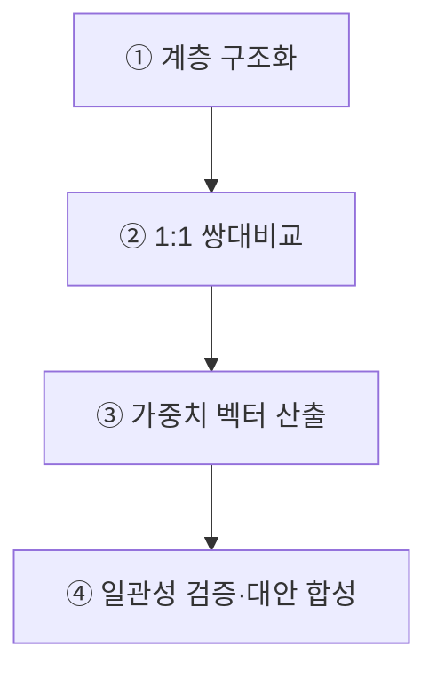
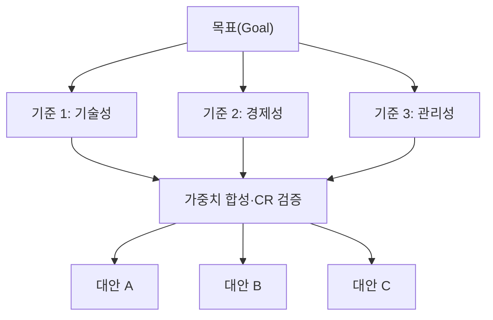
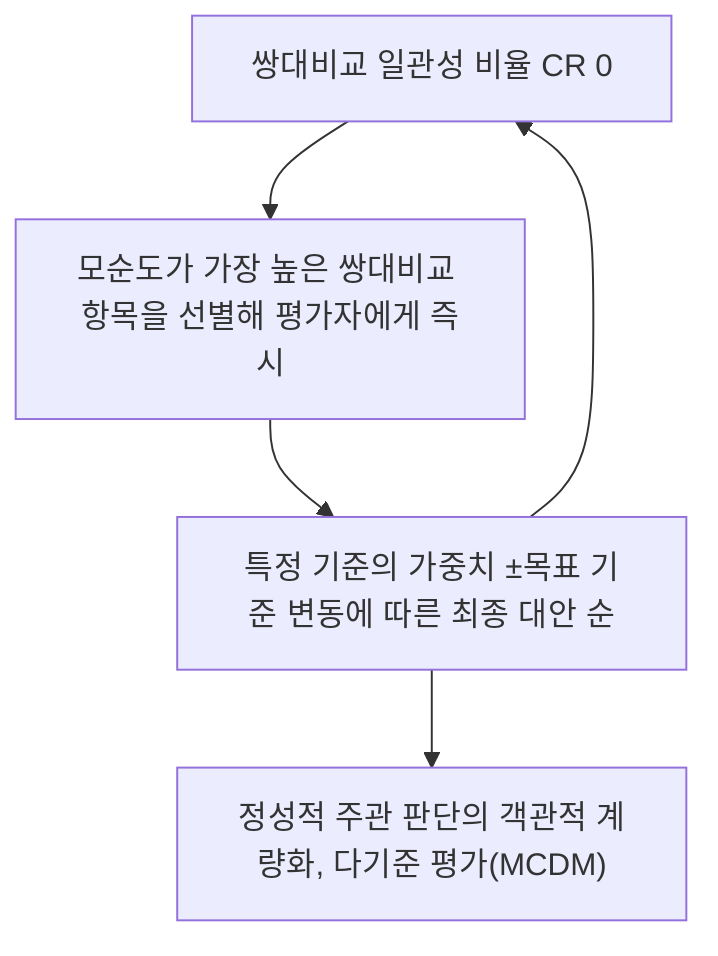

## 지식 로드맵 내 현재 위치
현재 위치: IT 전략·관리 → AHP(Analytic Hierarchy Process)

## 30초 인출

- 본질: 복잡한 다기준 의사결정 문제를 목표-기준-대안으로 계층화하고 1:1 쌍대비교로 우선순위를 도출하는 분석 기법이다.
- 메커니즘: 계층 구조화 → 1~9 척도 쌍대비교(역수행렬) → 정규화 고유벡터(가중치) 산출 → 일관성 비율(CR) 검증한다.
- 판정 기준: 쌍대비교의 일관성과 가중치 변화에 따른 순위 민감도를 함께 검증한다.

핵심 용어

- **AHP(Analytic Hierarchy Process)**: 토마스 사티(Thomas Saaty)가 고안한 다기준 의사결정(MCDM) 기법이다.
- **Pairwise Comparison(쌍대비교)**: 복잡한 다자간 비교 대신 두 요소를 1:1로 짝지어 상대적 중요도를 1~9 정수 척도로 평가하는 기법이다.
- **Eigenvector(고유벡터)**: 쌍대비교 행렬의 최대 고유치에 대응하는 정규화된 벡터로 각 요소의 상대적 가중치를 의미이다.
- **CI(Consistency Index)**: 평가자의 판단이 이상적 일관성($\lambda_{max} = n$)으로부터 벗어난 오차 크기를 나타내는 지표이다.
- **RI(Random Index)**: 무작위 생성 행렬로부터 얻은 난수 일관성 지수 평균값이다.
- **CR(Consistency Ratio)**: $CI / RI$로 계산하며, 통상 $CR \leq 0.1$이면 수용 가능하고 초과 시 판단행렬을 재검토하되 적용 지침의 기준을 우선이다.

## 예상문제

> AHP(Analytic Hierarchy Process)의 개념과 분석절차를 설명하고, 일관성 검증과 실무 적용 시 고려사항을 제시하시오. **(미출제 예상·25점)**

## Ⅰ. 합리적 다기준 의사결정의 수학적 기준, AHP의 개요

> AHP는 정성 판단을 쌍대비교 행렬로 구조화하며, CR은 판단 일관성을 점검할 뿐 기준 타당성이나 편향까지 보증하지 않음.

- 정의: 복잡한 다기준 의사결정 문제를 목표-기준-대안의 계층으로 구조화하고 **쌍대비교(Pairwise Comparison)** 행렬 연산을 통해 가중치를 도출하는 **계층화 분석법(Analytic Hierarchy Process)**
- 목적: **다기준 판단** 구조화 · **가중치** 산정 · **대안 우선순위** 도출

## Ⅱ. AHP 분석·일관성 검증 4단계 파이프라인

> 계층 분해에서 설문 작성, 고유벡터 가중치 산출, CR 검증으로 이어지는 정밀한 파이프라인으로 수행됨.

## Ⅲ. 쌍대비교 1~9 척도·일관성 검증 산식

> 사티의 기본척도는 상대적 중요도를 홀수 강도와 중간값으로 표현하고 반대 판단에는 역수를 적용함.

### 1. 사티(Saaty)의 1~9 척도 기준

| 척도 값 | 정의 | 공학적 의미 |
|---|---|---|
| **1** | 동등 중요 (Equal) | 두 평가 요소가 목표 달성에 동등하게 기여 |
| **2** | 중간값 | 1과 3 사이의 절충 판단 |
| **3** | 다소 중요 (Moderate) | 한 요소가 다른 요소보다 약간 더 중요함 |
| **4** | 중간값 | 3과 5 사이의 절충 판단 |
| **5** | 강하게 중요 (Strong) | 한 요소가 다른 요소보다 확고하게 우세함 |
| **6** | 중간값 | 5와 7 사이의 절충 판단 |
| **7** | 매우 강하게 중요 (Very Strong) | 한 요소의 우세성이 실증적으로 입증됨 |
| **8** | 중간값 | 7과 9 사이의 절충 판단 |
| **9** | 절대적 중요 (Extreme) | 한 요소가 타 요소 대비 압도적·절대적 우위 |
| **역수 ($1/a_{ij}$)** | 반대 비교치 | 요소 $i$가 $j$ 대비 $a$이면, 요소 $j$는 $i$ 대비 $1/a$ |

### 2. 일관성 지표(CI, CR) 산출 수식

| 지표 | 산출 수식 | 공학적 의미·판정 |
|---|---|---|
| **최대 고유치 ($\lambda_{max}$)** | $A \cdot W = \lambda_{max} \cdot W$ | 행렬 크기 $n$ 이상이며, $\lambda_{max} = n$일 때 이상적 일관성 |
| **일관성 지수 (CI)** | $CI = \frac{\lambda_{max} - n}{n - 1}$ | 이상적 일관성 상태로부터 벗어난 판단 편차의 평균 |
| **랜덤 지수 (RI)** | 난수 행렬 평균 CI 상수 | $n=3$일 때 0.58, $n=4$일 때 0.90, $n=5$일 때 1.12 |
| **일관성 비율 (CR)** | $CR = \frac{CI}{RI}$ | 통상 $CR \leq 0.1$이면 수용 가능, 초과 시 판단행렬 재검토 · 적용 지침 우선 |

## Ⅳ. 문제점·대응책

> 비교 항목이 많아지면 비교 횟수가 $n(n-1)/2$로 증가하므로 계층 구조와 설문 부담을 함께 검토해야 함.

| 위험 | 대책 | 효과 |
|---|---|---|
| **비교 횟수 증가** | 기준 중복 제거 · 계층 재구성 | 설문 부담·판단 오류 감소 |
| **CR 허용기준 초과** | 모순이 큰 쌍대비교·근거 재검토 | 일관성 개선·판단 이력 확보 |
| **집단 판단 차이** | 개인별 결과·기하평균 집계·민감도 병행 | 합의 수준·순위 안정성 확인 |
| **기준 간 독립성 한계** | 네트워크 피드백을 지원하는 **ANP(Analytic Network Process)** 전환 | 상호의존·피드백을 반영한 우선순위 산출 |

## Ⅴ. 판단 근거와 순위 안정성을 확보하기 위한 기술사적 제언

> CR과 판단 근거를 함께 제시하고 가중치 민감도를 검토하면 재검토 범위를 좁힐 수 있음.

### 학습자 통찰 메모 — 답안 밖

- [핵심 통찰]: CR 초과는 전체 응답의 자동 폐기 사유가 아니라 모순이 큰 판단과 근거를 재검토하라는 신호임.
- 나라면: 개인별 판단 근거와 CR을 제시하고, 집단 집계 결과의 민감도를 함께 공개하겠음.

### 실전 답안용 기술사적 제언

- **판정 기준 (Trigger)**: 쌍대비교 일관성 비율 CR > 0.1 초과(논리적 모순 발생) 또는 평가자 간 가중치 기하평균 편차가 목표 기준를 초과할 시 무효 판정.
- **대응 방안 (Action)**: 모순도가 가장 높은 쌍대비교 항목을 선별해 평가자에게 즉시 피드백(실시간 AHP 도구 활용)하고 재평가 수행, 기준 간 피드백 존재 시 ANP로 전환.
- **검증 체계 (Verification)**: 특정 기준의 가중치 ±목표 기준 변동에 따른 최종 대안 순위 역전 여부를 확인하는 가중치 민감도 분석(Sensitivity Analysis)을 필수 시행함.
- **기대 효과 (Impact)**: 정성적 주관 판단의 객관적 계량화, 다기준 평가(MCDM)의 논리적 무결성 확보, 입찰 및 ISP 우선순위 선정 시 탈락자 수용성 극대화를 달성함.

## 1교시 10점 답안 발췌

### 1. 정의·목적

- 정의: 복잡한 다기준 의사결정 문제를 목표-기준-대안으로 계층화하고 1:1 **쌍대비교(Pairwise Comparison)**를 통해 가중치를 산출하는 **계층화 분석법(Analytic Hierarchy Process)**
- 목적: 정성 판단 계량화 · 일관성 검토 · 대안 우선순위 도출

### 2. AHP 4단계 분석 절차

### 3. 핵심 판정 기준

- **일관성 비율**: $CR = CI / RI \leq 0.1$ 충족 필수
- **민감도 분석**: 주요 기준 가중치 변동 시 최종 순위 안정성 검증

## 출제 이력과 검증 출처

- 참고 문항: 제130회 KPC 자료는 Q-Net 정보관리 공식 문제지 원문 미확보 상태이므로 직접 기출로 보지 않음
- Thomas L. Saaty, [The Analytic Hierarchy Process—What It Is and How It Is Used](https://doi.org/10.1016/0270-0255(87)90473-8)

## 학습 체크

- [ ] Ⅰ·Ⅱ: 목표–기준·하위기준–대안 계층과 쌍대비교 절차를 재현할 수 있는가?
- [ ] Ⅲ: 1~9 기본척도·역수와 CI·CR 산식을 설명할 수 있는가?
- [ ] Ⅳ: 비교 횟수·불일치·집단 판단 차이의 위험과 대책을 대응시킬 수 있는가?
- [ ] Ⅴ: CR과 민감도를 함께 검토해 순위 안정성을 제언할 수 있는가?

## 연결 토픽

- 이전 토픽: [정량적 위험분석](./073_quantitative_risk_analysis.md)
- 연관 토픽: [IT 투자평가](./016_it_investment_evaluation.md), [협상에 의한 계약](./066_negotiated_contract_proposal_evaluation.md), [MECE](./045_mece.md)
- 다음 토픽: [SEM](./078_sem.md)
