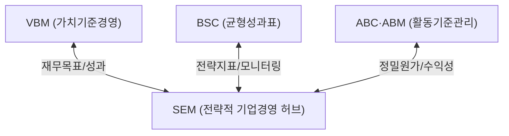

## 지식 로드맵 내 현재 위치
현재 위치: IT 전략·관리 → SEM(Strategic Enterprise Management)

## 30초 인출

- 본질: SEM은 기업 전략을 계획·성과측정·의사결정에 반영하는 전략경영 관리 방식.
- 메커니즘: 전략의 계획·시뮬레이션(BPS) 반영, 성과(CPM) 모니터링, VBM·BSC·ABM 관점에 따른 판단·실행 조정.
- 판정 기준: ERP 실적과 경영진 보고정보의 연결, What-If 시나리오 재계산 결과 확인.

핵심 용어

- **SEM(Strategic Enterprise Management, 전략적 기업경영)** : 전략을 계획·성과관리·의사결정과 연결하는 경영 접근.
- **SEM-BPS(Business Planning and Simulation)** : 사업계획과 대안 시나리오를 수립·분석하는 SAP SEM 구성요소.
- **SEM-CPM(Corporate Performance Monitor)** : 전략 성과를 지표와 scorecard로 모니터링하는 SAP SEM 구성요소.
- **SEM-BCS(Business Consolidation)** : 외부·관리 목적의 연결재무정보를 처리하는 SAP SEM 구성요소.
- **SEM-BIC(Business Information Collection)** : 전략경영에 필요한 내부·외부 정보를 수집하는 SAP SEM 구성요소.
- **SEM-SRM(Stakeholder Relationship Management)** : 이해관계자의 기대와 의견을 수집·관리하는 SAP SEM 구성요소.
- **VBM(Value Based Management, 가치기준경영)** : 자본비용을 고려해 기업가치 창출을 관리하는 관점.
- **EVA(Economic Value Added, 경제적 부가가치)** : NOPAT에서 투하자본비용을 차감한 가치 지표.
- **NOPAT(Net Operating Profit After Tax, 세후영업이익)** : 세금을 반영한 영업이익.
- **WACC(Weighted Average Cost of Capital, 가중평균자본비용)** : 자기자본·부채 조달비용을 자본구조에 따라 가중한 값.
- **ABC(Activity Based Costing, 활동기준원가계산)** : 활동과 원가동인을 바탕으로 간접비를 배부하는 원가계산 방법.
- **ABM(Activity Based Management, 활동기준관리)** : 활동·원가정보를 이용해 업무와 성과를 개선하는 관리 방식.
- **BSC(Balanced Scorecard, 균형성과표)** : 재무·고객·내부 프로세스·학습과 성장 관점으로 전략 실행을 측정하는 체계.
- **What-if analysis(가정 시나리오 분석)** : 입력 조건을 바꾸어 계획 결과가 어떻게 달라지는지 비교하는 분석.

---

## 1교시 예상문제 (10점)

> SEM의 주요 관리 관점과 전략·실행 연계 구조를 설명하시오. (예상·10점)

---

## 1교시 10점 답안

### Ⅰ. 개요

| 구분 | 핵심 |
|---|---|
| 정의 | **SEM(Strategic Enterprise Management, 전략적 기업경영)** 은 기업 전략을 계획·성과관리·의사결정과 연결하는 경영 접근 |
| 목적 | 전략–실행 정렬 · 목표–실적 환류 · 의사결정 근거 확보 |

### Ⅱ. 전략경영 관점의 연결

가치 관점의 **VBM(Value Based Management)** , 전략 실행지표의 **BSC(Balanced Scorecard)** , 활동원가의 **ABC(Activity Based Costing)** , 활동 개선의 **ABM(Activity Based Management)** .

### Ⅲ. 실행 환류 통제

- **폐쇄루프 환류** : 전략 목표 → **SEM-BPS(Business Planning and Simulation)** 계획 → **SEM-CPM(Corporate Performance Monitor)** 성과 모니터링 → 전략 조정
- **관리 지표 연계** : **EVA(Economic Value Added)** 재무성과와 BSC 실행지표·ABC 원가정보의 통합 해석.

**제언:** 전략목표 하나를 실행지표·원가정보·실적자료에 연결해 정기 검토.

---

## 2~4교시 예상문제 (25점)

> 전략적 기업경영(SEM, Strategic Enterprise Management)의 개념과 구성체계를 설명하고, 전략–실행 연계 방안을 제시하시오. **(미출제 예상·25점)**

---

## 2~4교시 25점 답안

## Ⅰ. 경영 전략과 실행의 유기적 통합, SEM의 개요

> 운영·시장 정보의 전략 계획 반영과 실적 확인, 계획·실적 차이의 원인 분석에 따른 전략 조정.

| 구분 | 핵심 |
|---|---|
| 정의 | **SEM(Strategic Enterprise Management, 전략적 기업경영)** 은 기업 전략을 계획·성과관리·의사결정과 연결하는 경영 접근 |
| 목적 | 전략–실행 정렬 · 목표–실적 환류 · 의사결정 근거 확보 |

## Ⅱ. SAP SEM 구성요소

> SAP Help 2025 FPS01 문서의 구성요소별 계획·성과·연결·정보수집·이해관계자 소통 기능.

| 기능 | 책임 | 산출 |
|---|---|---|
| **SEM-BPS** | 통합 계획 · 시뮬레이션 | 계획안 · 시나리오 |
| **SEM-CPM** | 성과 모니터링 | KPI · BSC |
| **SEM-BCS** | 외부·관리 목적 연결결산 | 연결 재무정보 |
| **SEM-BIC** | 내·외부 정보수집 | 경영 배경정보 |
| **SEM-SRM** | 이해관계자 기대·의견 관리 | 이해관계자 정보 |

- 성과 환류: 전략목표 → KPI·계획 → 실적 수집 → 차이 분석 → 전략·계획 조정

## Ⅲ. 학습용 관리 관점의 역할·상호작용

> SAP SEM 공식 기능 목록과 구분되는 VBM·ABM·BSC의 역할: 가치·원가·성과를 해석하는 상호보완 관리 관점이며 고정 순서는 없음.

가치 관점의 **VBM(Value Based Management)** , 전략 실행지표의 **BSC(Balanced Scorecard)** , 활동원가의 **ABC(Activity Based Costing)** , 활동 개선의 **ABM(Activity Based Management)** .

| 구성요소 | 개념·산출 | 연계 역할 |
|---|---|---|
| **VBM (가치기준경영)** | `EVA = NOPAT - (투하영업자본 × WACC)` | 기업 가치 증대를 위한 재무 목표선 제시 |
| **ABC/ABM (활동원가관리)** | 자원 동인(Resource Driver) · 활동 동인(Activity Driver) 분석 | 원가배부 근거 보완 · 수익성 분석 지원 |
| **BSC (균형성과표)** | 4대 관점 전략맵(Strategy Map) · 핵심성과지표(KPI) | 전략목표를 실행지표로 전개 |

## Ⅳ. SEM vs ERP 비교

> 제품을 OLTP·OLAP로 고정 분류하기보다 운영 실적·계획 결과의 양방향 연계를 중심으로 보는 ERP·SEM의 역할 차이.

| 비교 항목 | **ERP(Enterprise Resource Planning, 전사적 자원 관리)** | **SEM(Strategic Enterprise Management, 전략적 기업경영)** |
|---|---|---|
| **역할** | 운영 업무·재무 처리 | 전략 계획·성과 모니터링 |
| **데이터 형태** | 상세 건별 트랜잭션 데이터 (상세 원장) | 목표·계획·집계 성과정보 |
| **초점** | 업무 처리·원장 정합성 | 목표·계획·성과 분석 |

## Ⅴ. 한계·대응책

> 기능 도입에 앞선 전략목표·계획·성과지표·실적 간 추적 관계와 계획 가정의 품질 관리.

| 위험 | 대책 | 효과 |
|---|---|---|
| **전략–지표 단절** | 전략목표–KPI–계획 항목 매핑 | 실행 정렬 |
| **실적 중심 보고** | 계획 가정·시나리오·실적 통합 분석 | 선행 의사결정 지원 |
| **데이터 불일치** | ERP·재무·성과정보 기준 통합 | 결과 신뢰성 확보 |

## Ⅵ. 기술사적 제언

| 한계 | 해결 방안 |
|---|---|
| SEM 관점의 전사 동시 확장에 따른 지표·원가·가치 간 연계 검증 부담 | 전략목표 하나에 BSC 실행지표·ABC/ABM 활동원가·VBM 가치지표를 연결한 관리 사례의 시범 운영, 가정·책임자·실적 확인 후 적용 범위 확대 |

## 출제 이력과 검증 출처

- 참고 문항: 제131회 KPC 자료에 수록된 것으로 알려졌으나 Q-Net 정보관리 공식 문제지 원문은 미확보하여 직접 기출로 단정하지 않음
- Robert S. Kaplan & David P. Norton, [The Balanced Scorecard—Measures that Drive Performance](https://hbr.org/1992/01/the-balanced-scorecard-measures-that-drive-performance-2)
- SAP Help Portal, [SAP SEM components and functions, 2025 FPS01](https://help.sap.com/docs/SAP_S4HANA_ON-PREMISE/7bfcddc0957c41b7b18e3c5e12892549/619fcf535b804808e10000000a174cb4.html)
- SAP Help Portal, [SAP Strategic Enterprise Management, 2025 FPS01](https://help.sap.com/docs/SAP_S4HANA_ON-PREMISE/7bfcddc0957c41b7b18e3c5e12892549/8e9fcf535b804808e10000000a174cb4.html)

## 연결 토픽

- 이전 토픽: [AHP](./075_ahp.md)
- 연관 토픽: [BSC](./017_bsc.md), [ERP](./068_erp.md), [IT 투자평가](./016_it_investment_evaluation.md), [CPM](./081_cpm.md)
- 다음 토픽: [정보시스템 운영 성과관리](./079_information_system_operation_performance_management.md)
