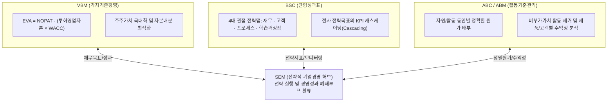
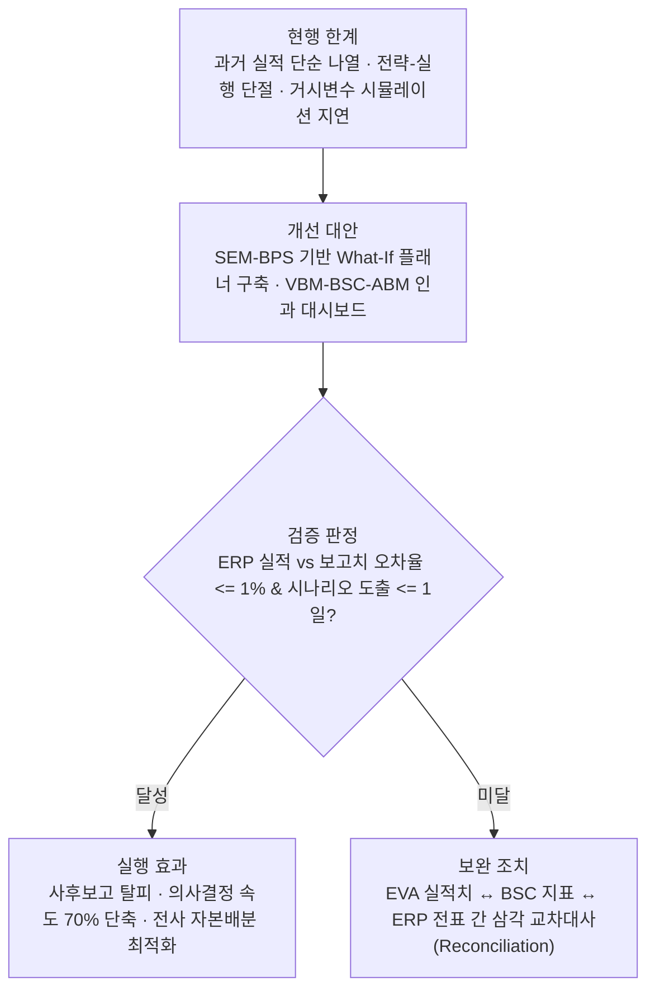

## 지식 로드맵 내 현재 위치

  IT 전략·관리
  기업 경영·전략 성과관리
  <strong>SEM(Strategic Enterprise Management)</strong>

## 30초 인출

- 본질: 기업 비전과 전략을 경영계획, 성과측정(KPI/BSC), 의사결정과 유기적으로 연결하는 전략경영 관리체계
- 메커니즘: 전략수립 → 계획/시뮬레이션(BPS) → 성과모니터링(CPM) → 가치기준경영(VBM/ABM/BSC) 환류
- 판정 기준: ERP 원장 실적과 경영진 보고치 간 오차율 <= 1% 및 What-If 시나리오 재도출 1일 이내

핵심 용어

- **SEM(Strategic Enterprise Management)**: 경영 전략 수립·실행·모니터링을 계획과 성과정보에 연결하는 관리체계
- **SEM-BPS(Strategic Enterprise Management-Business Planning and Simulation)**: 통합 계획·시나리오 분석 기능
- **SEM-CPM(Strategic Enterprise Management-Corporate Performance Monitor)**: 핵심성과지표·균형성과표 모니터링 기능
- **SEM-BCS(Strategic Enterprise Management-Business Consolidation)**: 법정·관리 연결 기능
- **SEM-BIC(Strategic Enterprise Management-Business Information Collection)**: 구조화·비정형 경영정보 수집 기능
- **SEM-SRM(Strategic Enterprise Management-Stakeholder Relationship Management)**: 전략·계획정보와 이해관계자 기대의 양방향 소통 기능
- **VBM(Value Based Management)**: 자본비용을 초과하는 실질적 부가가치 창출을 목표로 전사 자본을 배분하는 가치기준경영
- **EVA(Economic Value Added)**: 세후영업이익에서 투하영업자본에 대한 자본비용을 차감한 경제적 부가가치
- **NOPAT(Net Operating Profit After Tax)**: 세후영업이익
- **WACC(Weighted Average Cost of Capital)**: 가중평균자본비용
- **ABC(Activity Based Costing)**: 원가를 제품이 아닌 실제 자원을 소비한 '활동' 기준으로 추적 배부하는 정밀 원가계산
- **BSC(Balanced Scorecard)**: 재무, 고객, 내부 프로세스, 학습과 성장의 4대 관점으로 전략을 균형 측정하는 성과표

## 예상문제

> 전략적 기업경영(SEM, Strategic Enterprise Management)의 개념과 구성체계를 설명하고, 전략–실행 연계 방안을 제시하시오. **(미출제 예상·25점)**

## Ⅰ. 경영 전략과 실행의 유기적 통합, SEM의 개요

> SEM은 운영·시장 정보를 전략 계획과 성과 모니터링에 연결하며, 성패는 특정 분석기법의 순서가 아니라 계획–실적–전략의 환류로 판정함.

- 정의: 기업 전략을 계획·성과측정·경영 의사결정과 연결하는 **전략적 기업경영(Strategic Enterprise Management)** 체계
- 목적: 전략–실행 정렬 · 목표–실적 환류 · 의사결정 근거 확보

## Ⅱ. SAP SEM 공식 기능 구성

> SAP SEM의 공식 기능은 계획·성과·연결·정보수집·이해관계자 소통을 분담하고 공통 데이터·기능을 상호 활용함.

| 기능 | 책임 | 산출 |
|---|---|---|
| **SEM-BPS** | 통합 계획 · 시뮬레이션 | 계획안 · 시나리오 |
| **SEM-CPM** | 성과 시각화 · 평가 | KPI · BSC |
| **SEM-BCS** | 법정·관리 연결 | 연결 재무정보 |
| **SEM-BIC** | 내·외부 정보수집 | 경영 배경정보 |
| **SEM-SRM** | 이해관계자 소통 | 전략·기대 정보 |

- 성과 환류: 전략목표 → KPI·계획 → 실적 수집 → 차이 분석 → 전략·계획 조정

## Ⅲ. 학습용 관리 관점의 역할·상호작용

> VBM·ABM·BSC는 SAP SEM의 공식 기능 목록이 아니라 가치·원가·성과를 해석하는 상호보완 관리 관점이며 고정된 순서가 아님.

| 구성요소 | 개념·산출 | 연계 역할 |
|---|---|---|
| **VBM (가치기준경영)** | `EVA = NOPAT - (투하영업자본 × WACC)` | 기업 가치 증대를 위한 재무 목표선 제시 |
| **ABC/ABM (활동원가관리)** | 자원 동인(Resource Driver) · 활동 동인(Activity Driver) 분석 | 원가배부 근거 보완 · 수익성 분석 지원 |
| **BSC (균형성과표)** | 4대 관점 전략맵(Strategy Map) · 핵심성과지표(KPI) | 전략목표를 실행지표로 전개(Cascading) |

## Ⅳ. SEM vs ERP 비교

> ERP와 SEM은 제품을 OLTP·OLAP로 고정 분류하는 관계가 아니라, 운영 실적과 계획 결과를 양방향으로 연계하는 역할 차이로 비교함.

| 비교 항목 | ERP (전사적 자원 관리) | SEM (전략적 기업 경영) |
|---|---|---|
| **역할** | 운영 업무·재무 처리 | 전략 계획·성과 모니터링 |
| **데이터 형태** | 상세 건별 트랜잭션 데이터 (상세 원장) | 목표·계획·집계 성과정보 |
| **초점** | 업무 처리·원장 정합성 | 목표·계획·성과 분석 |

## Ⅴ. 문제점·대응책

> 기능 도입보다 전략목표·계획·성과지표·실적의 추적 관계와 계획 가정의 품질을 먼저 통제해야 함.

| 위험 | 대책 | 효과 |
|---|---|---|
| **전략–지표 단절** | 전략목표–KPI–계획 항목 매핑 | 실행 정렬 |
| **실적 중심 보고** | 계획 가정·시나리오·실적 통합 분석 | 선행 의사결정 지원 |
| **데이터 불일치** | ERP·재무·성과정보 기준 통합 | 결과 신뢰성 확보 |

## Ⅵ. What-If 시나리오 연계를 위한 기술사적 제언

> 과거 실적뿐 아니라 추적 가능한 가정에 따른 시나리오를 비교해 전략·계획 조정을 지원함.

### 학습자 통찰 메모 — 답안 밖

- [핵심 통찰]: SEM은 결산 보고서를 늘리는 시스템이 아니라 전략 목표·성과지표·경영계획을 같은 인과관계로 연결하는 관리체계임.
- 나라면: 계획 가정·원가 동인·성과지표의 추적 관계를 먼저 고정하고, 경영진이 가정을 바꾸어 결과를 비교하는 What-If 시뮬레이션을 구축하겠음.

### 실전 답안용 기술사적 제언

- **판정 기준 (Trigger)**: ERP 운영 실적 집계와 경영진 KPI 보고 수치 간 오차율 > 5% 초과, 또는 환율·유가 등 거시 변수 변동 시 연간 사업계획 재시뮬레이션 소요시간 > 1주일 지연 시 관리 결함 판정.
- **대응 방안 (Action)**: SEM-BPS 기반의 What-If 시나리오 플래너를 구축하여 변수별 민감도를 즉시 산출하고, VBM-BSC-ABM 지표 간 인과관계를 단일 대시보드로 통합.
- **검증 체계 (Verification)**: 분기별 EVA(경제적부가가치) 실적치 ↔ BSC 전략목표 달성도 ↔ ERP 원장 트랜잭션 전표 간의 삼각 교차 대사(Reconciliation)를 의무화함.
- **기대 효과 (Impact)**: 단순 과거 실적 사후보고 탈피, 선제적 경영 의사결정 속도 70% 단축, 부서별 이기주의를 배제한 전사 가치 극대화 자원 배분을 달성함.

## 1교시 10점 답안 발췌

### 1. 정의·목적

- 정의: 기업 전략을 계획·성과측정·경영 의사결정과 연결하는 **전략적 기업경영(Strategic Enterprise Management)** 체계
- 목적: 전략–실행 정렬 · 목표–실적 환류 · 의사결정 근거 확보

### 2. SEM 3대 관리 관점 통합 아키텍처

### 3. 핵심 통제

- **폐쇄루프 환류**: 전략 목표 → BPS 계획 수립 → CPM 성과 모니터링 → 전략 수정
- **지표 인과관계**: EVA(재무) ↔ BSC(균형) ↔ ABC(원가) 상호 연계

## 출제 이력과 검증 출처

- 참고 문항: 제131회 KPC 자료에 수록된 것으로 알려졌으나 Q-Net 정보관리 공식 문제지 원문은 미확보하여 직접 기출로 단정하지 않음
- Robert S. Kaplan & David P. Norton, [The Strategy-Focused Organization](https://www.hbs.edu)
- SAP Help Portal, [SEM Business Planning and Simulation](https://help.sap.com/docs/SAP_ERP/b216b6bc6d8843e9acd99baa92b65ea9/c49fcf535b804808e10000000a174cb4.html)
- SAP Help Portal, [SAP Strategic Enterprise Management](https://help.sap.com/docs/SAP_ERP_SPV/b216b6bc6d8843e9acd99baa92b65ea9/7c9fcf535b804808e10000000a174cb4.html)
- SAP Help Portal, [Balanced Scorecard](https://help.sap.com/docs/SAP_ERP_SPV/b216b6bc6d8843e9acd99baa92b65ea9/83a6cf535b804808e10000000a174cb4.html)

## 학습 체크

- [ ] Ⅰ: SEM의 정의·목적과 계획–실적–전략 환류를 설명할 수 있는가?
- [ ] Ⅱ: SAP SEM 5개 공식 기능의 책임·산출을 재현할 수 있는가?
- [ ] Ⅲ: VBM·ABM·BSC가 공식 기능 목록이 아닌 상호보완 관리 관점임을 설명할 수 있는가?
- [ ] Ⅳ: ERP와 SEM을 성격·데이터·초점의 3축으로 비교할 수 있는가?
- [ ] Ⅴ: 전략–지표 단절·실적 중심 보고·데이터 불일치의 대응책을 설명할 수 있는가?
- [ ] Ⅵ: 시나리오 가정·산식 추적성과 계획–실적 환류 방안을 제언할 수 있는가?

## 연결 토픽

- 이전 토픽: [AHP](./075_ahp.md)
- 연관 토픽: [BSC](./017_bsc.md), [ERP](./068_erp.md), [IT 투자평가](./016_it_investment_evaluation.md), [CPM](./081_cpm.md)
- 다음 토픽: [정보시스템 운영 성과관리](./079_information_system_operation_performance_management.md)
