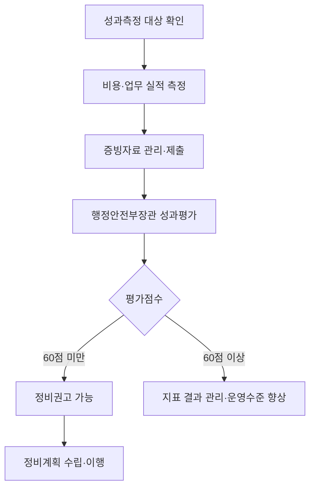

## 지식 로드맵 내 현재 위치
현재 위치: IT 전략·관리 → 정보시스템 운영 성과관리

## 30초 인출

- 본질: **정보시스템 운영 성과관리**는 공공 정보시스템의 운영성과를 측정·평가해 정비 필요성을 판단하는 제도다.
- 메커니즘: 대상 확인 → 비용·업무 성과 측정 → 증빙 검토와 점수 환산 → 정비 권고 및 정비계획으로 이어진다.
- 판정 기준: 60점 미만은 정비 권고 대상이 될 수 있고, 40점 미만은 폐기가 원칙이나 지침의 예외를 검토한다.

핵심 용어

- **정보시스템 운영 성과관리**: 운영 중인 정보시스템의 성과를 측정·평가해 정비 필요성을 판단하는 관리 제도.
- **성과측정**: 지침의 지표 정의와 산식에 따라 비용·업무 실적을 산출하는 절차.
- **성과평가**: 행정안전부장관이 성과측정 결과를 별표의 기준으로 평가하는 절차.
- **정비권고**: 낮은 평가점수에 따라 정보시스템을 폐기하거나 개선하도록 권고하는 조치.
- **정비계획**: 정비권고에 따라 폐기·개선 방안과 이용자 보호·정보 보존 조치를 정한 계획.

---

## 1교시 예상문제 (10점)

> 정보시스템 운영 성과관리의 대상, 측정·평가 절차와 정비 판정 체계를 설명하시오. (예상·10점)

---

## 1교시 10점 답안

### Ⅰ. 개요

| 구분 | 핵심 |
|---|---|
| 정의 | **정보시스템 운영 성과관리**는 운영 중인 정보시스템의 성과를 측정·평가해 정비 필요성을 판단하는 제도다. |
| 목적 | 운영성과 진단 · 정보시스템의 적정한 유지·정비 · 공공 정보자원의 효율적 활용 |

### Ⅱ. 측정·정비 절차

### Ⅲ. 정비 판정

| 평가점수 | 지침상 조치 |
|---:|---|
| 60점 이상 | 제26조상 정비권고 기준에 해당하지 않음 |
| 40점 이상 60점 미만 | 폐기 또는 통폐합·기능고도화·전면재개발 등 개선 권고 가능 |
| 40점 미만 | 폐기 권고 가능. 다만 제26조제2항의 예외 해당 여부를 검토 |

---

## 2~4교시 예상문제 (25점)

> 「전자정부 성과관리 지침」에 따른 정보시스템 운영 성과관리의 대상, 측정지표와 평가 절차, 점수별 정비 기준 및 정비계획의 고려사항을 설명하시오. (예상·25점)

---

## 2~4교시 25점 답안

## Ⅰ. 운영성과를 근거로 정비 필요성을 판단하는 제도

| 구분 | 핵심 |
|---|---|
| 정의 | **정보시스템 운영 성과관리**는 운영 중인 정보시스템의 성과를 측정·평가해 정비 필요성을 판단하는 제도다. |
| 목적 | 운영성과 진단 · 정보시스템의 적정한 유지·정비 · 공공 정보자원의 효율적 활용 |

이 제도는 운영 실적에 근거해 정비 대상을 찾고, 폐기 또는 개선 판단과 이용자 보호를 함께 다룬다.

## Ⅱ. 성과측정 대상과 측정 제외

| 구분 | 현행 지침의 기준 |
|---|---|
| 기본 대상 | 중앙행정기관등 및 지방자치단체등의 정보시스템 중 서비스 운영 개시 후 1년이 지난 시스템 |
| 제외 가능 | 해당 연도부터 2년 이내 폐기하기로 결정한 시스템, 매뉴얼의 제외유형에 해당하는 시스템 |
| 조기 측정 | 1년 미만 시스템도 필요하다고 판단하면 측정지표 변경 등을 행정안전부장관과 협의해 측정 가능 |
| 모바일 앱 | 별도 고시인 「모바일 전자정부 서비스 관리지침」 제4장을 적용 |

대상과 제외 여부는 매년 적용되는 지침·매뉴얼을 확인한다. 운영 개시 시점이나 시스템 유형을 잘못 분류하면 이후 점수 비교의 근거가 흔들린다.

## Ⅲ. 비용·업무 측면의 지표 구성

| 측면 | 측정지표 | 배점 | 측정 초점 |
|---|---|---:|---|
| 비용 | 운영의 적정성 | 10점 | 누적 유지보수비와 누적 개발비의 비율 |
| 비용 | 유지의 용이성 | 10점 | 전년 대비 운영유지비 증감 |
| 비용 | 비용의 효율성 | 20점 | 활용규모당 운영유지비 증감 |
| 업무 | 기능 활용도 | 20점 | 기능별 사용량 변화 |
| 업무 | 업무성과 달성도 | 40점 | 공통지표 10점과 고유지표 30점의 목표 달성도 |
| 합계 | 비용 40점 · 업무 60점 | 100점 | 별표의 지표별 점수 합산 |

세부 산식과 환산 구간은 지침 별표 및 해당 연도 매뉴얼에 따른다. 지표 정의가 바뀔 수 있으므로 과거 연도의 점수만으로 현재 측정치를 비교하지 않는다.

## Ⅳ. 연례 측정에서 평가까지의 흐름

같은 흐름도를 10점 답안에서도 사용한다. 기관은 매년 측정계획을 세우고 증빙을 1년 이상 관리하며, 평가자는 증빙의 적정성을 평가점수에 반영할 수 있다.

기관은 매년 성과측정 계획을 세우고 지표의 실적과 증빙을 관리한다. 행정안전부장관은 측정 결과를 별표 기준으로 평가하며, 제출 데이터와 증빙의 적정성도 평가점수에 반영할 수 있다.

## Ⅴ. 점수 구간별 정비 권고와 예외

| 평가점수 | 정비 기준 | 적용 시 확인사항 |
|---:|---|---|
| 60점 이상 | 제26조의 정비권고 기준에 해당하지 않음 | 지표별 결과값을 관리하고 운영·관리 수준을 향상 |
| 40점 이상 60점 미만 | 폐기 또는 통폐합·기능고도화·전면재개발 등 개선을 권고할 수 있음 | 특별한 사정이 없으면 기관은 정비권고를 따름 |
| 40점 미만 | 폐기를 권고할 수 있음 | 제26조제2항의 폐기 예외 해당 여부를 먼저 검토 |

폐기 예외에는 법령·국제협약상 근거, 생명·안보·치안 위험, 국가경제·국민생활의 중대한 영향, 대국민 서비스 지연, 사회적 약자의 편의, 표준 보급시스템, 운영 3년 미경과, 위원회가 인정한 폐기 곤란 사유가 포함된다. 예외가 적용되면 폐기 권고를 하지 않을 수 있다.

## Ⅵ. 정비계획에 이용자 보호와 서비스 연속성 반영

제26조의 점수 판정은 정비 방향을 제시하고, 제27조의 정비계획은 실제 이행 방법을 정한다. 정비계획에는 이용자 불편 방지, 정보의 이관 또는 보존, 전자정부서비스의 연속성 보장을 포함해야 한다.

| 문제 | 해결 방안 |
|---|---|
| 저성과 점수만 보고 폐기하면 법정 예외, 데이터 보존, 서비스 영향이 누락될 수 있다. | 폐기 전 예외 사유와 업무·데이터 의존성을 확인하고, 정비계획에 이용자 전환·정보 이관·서비스 연속성 조치를 명시한 뒤 이행 여부를 점검한다. |

## 출제 이력과 검증 출처

- 참고 문항: Q-Net 공식 문제지 원문으로 회차를 확인하지 못해 직접 기출로 단정하지 않음.
- 국가법령정보센터, [전자정부 성과관리 지침](https://www.law.go.kr/LSW/admRulLsInfoP.do?admRulId=61899&efYd=0) — 행정안전부고시 제2025-71호, 2025년 12월 19일 시행, 제23조~제27조.
- 국가법령정보센터, [정보시스템 운영 성과측정 지표별 배점 및 환산점수](https://www.law.go.kr/LSW/flDownload.do?bylClsCd=200201&flNm=%5B%EB%B3%84%ED%91%9C%5D+%EC%A0%95%EB%B3%B4%EC%8B%9C%EC%8A%A4%ED%85%9C+%EC%9A%B4%EC%98%81+%EC%84%B1%EA%B3%BC%EC%B8%A1%EC%A0%95+%EC%A7%80%ED%91%9C%EB%B3%84+%EB%B0%B0%EC%A0%90+%EB%B0%8F+%ED%99%98%EC%82%B0%EC%A0%90%EC%88%98%28%EC%A0%9C25%EC%A1%B0%EC%A0%9C1%ED%95%AD+%EA%B4%80%EB%A0%A8%29&flSeq=148844105) — 제25조제1항 관련 현행 별표.

## 연결 토픽

- 이전 토픽: [SEM](./078_sem.md)
- 연관 토픽: [시스템 운영 감리](./059_system_operation_audit.md), [IT 투자평가](./016_it_investment_evaluation.md), [공공 클라우드 네이티브 전환](./021_public_cloud_native_transition.md)
- 다음 토픽: [CPM](./081_cpm.md)
