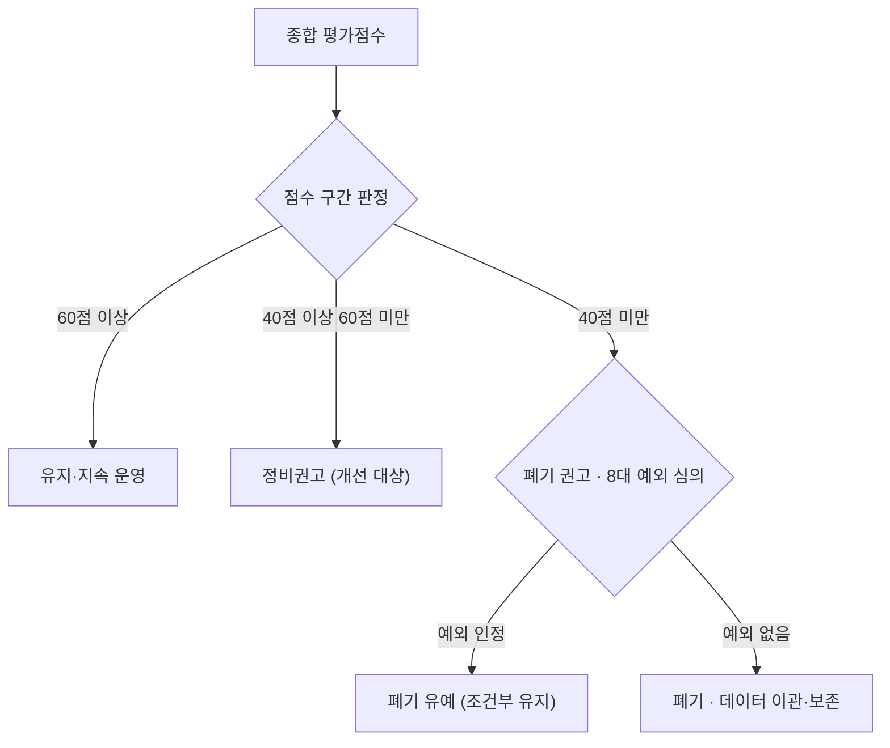
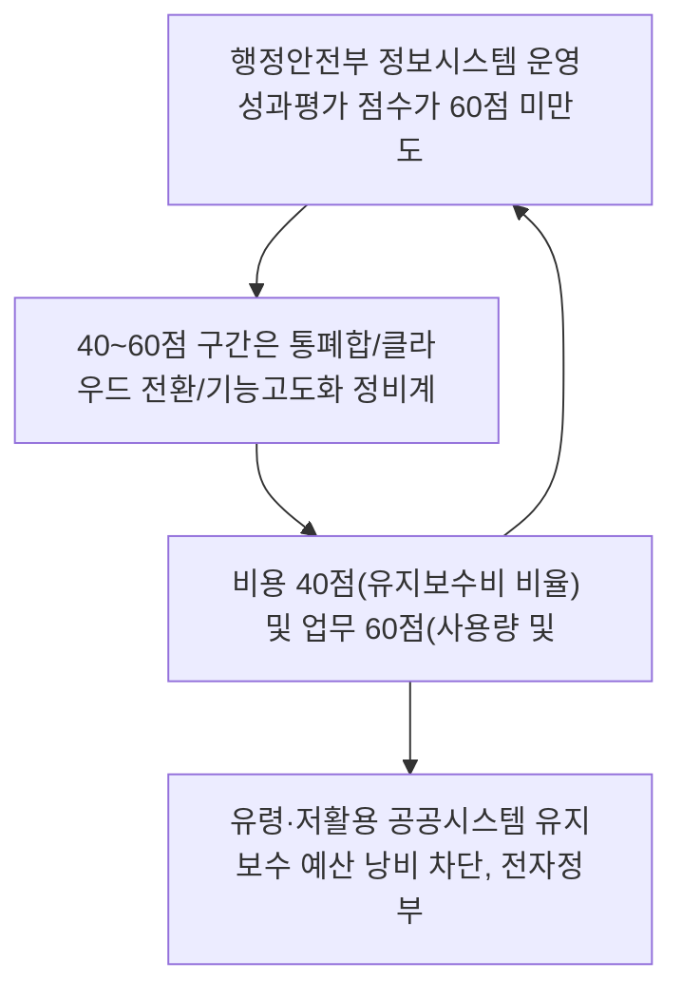

## 지식 로드맵 내 현재 위치
현재 위치: IT 전략·관리 → 정보시스템 운영 성과관리

## 30초 인출

- 본질: 공공 정보시스템의 지속 운영 가치를 객관적으로 평가하여 저성과 시스템을 폐기·정비하는 관리제도이다.
- 메커니즘: 법정 대상 선정 → 비용·업무 성과 측정 → 성과평가 → 유지·통합·재개발·폐기 등 정비 권고로 이어진다.
- 판정 기준: 비용·업무 성과평가 결과로 정비 필요성을 판단하고 법정 예외와 서비스 연속성을 심의한다.

핵심 용어

- **정보시스템 운영 성과관리**: 지속 운영 가치를 판단하기 위해 운영 성과측정·평가 결과에 따라 정비대상을 결정하고 업무·비용 성과를 높이는 활동이다.
- **성과측정**: 비용·업무 영역의 지표에 필요한 기초자료를 수집하고 운영 성과를 수치로 산출하는 활동이다.
- **성과평가**: 제출된 측정자료와 증적을 기준에 따라 검토해 시스템 운영 성과와 정비 필요성을 판단하는 활동이다.
- **정비**: 평가점수에 따라 폐기하거나 통폐합·기능고도화·전면재개발 등의 개선방안을 마련·시행하는 조치이다.

## 예상문제

> 「전자정부 성과관리 지침」에 따른 정보시스템 운영 성과관리의 개념·절차, 성과측정 지표와 정비 판정기준을 설명하시오. **(미출제 예상·25점)**

## Ⅰ. 지속 운영 가치와 정비대상을 결정하는 성과관리

> 성과측정·평가 결과를 근거로 저성과 정보시스템을 정비하되, 폐기 예외와 서비스 연속성을 함께 통제함.

- 정의: 정보시스템의 지속 운영 가치를 판단하기 위해 운영 성과측정·평가 결과에 따라 **정비대상**을 결정하여 업무·비용 성과를 높이는 활동
- 목적: **운영 성과 진단** · **저성과 시스템 정비** · **정보화 투자 효율화**

## Ⅱ. 현행 지침의 성과관리 조문 체계

| 단계 | 공식 근거 | 핵심 활동 | 산출 |
|---|---|---|---|
| **대상 선정** | 제23조 | 성과측정 대상·제외대상 식별 | 측정 대상 목록 |
| **성과측정** | 제24조 | 기관이 기초데이터·증빙자료를 수집하여 비용·업무 성과 측정 | 성과측정 결과 |
| **성과평가** | 제25조 | 행정안전부장관이 측정 결과를 검토·평가 | 평가점수 |
| **정보시스템 정비** | 제26조 | 60점 미만 시스템에 점수 구간별 정비권고 | 정비대상·정비권고 |
| **정비계획 수립** | 제27조 | 정비권고 시스템의 폐기·개선 계획 수립 | 정비계획 |

- 통제 원칙: 정비계획에 이용자 불편 방지 · 정보 이관 또는 보존 · 전자정부서비스 연속성 보장 포함

## Ⅲ. 성과측정 구성, 비용 40점·업무 60점

| 측면 | 지표 | 배점 | 측정 초점 |
|---|---|---:|---|
| **비용** | 운영의 적정성 | 10점 | 누적유지보수비÷누적개발비 |
| **비용** | 유지의 용이성 | 10점 | 전년 대비 운영유지비 증감률 |
| **비용** | 비용의 효율성 | 20점 | 전년 대비 활용규모당 운영유지비 증감률 |
| **업무** | 기능 활용도 | 20점 | 기능별 전년 대비 사용량 증감률 |
| **업무** | 업무 성과 달성도 | 40점 | 공통지표 10점 · 고유지표 30점 |
| **합계** | 비용 40점 · 업무 60점 | **100점** | 지표별 환산점수 합산 |

> 세부 구간·환산점수는 현행 지침 별표를 적용하며, 성과측정 데이터·증빙자료의 적정성 검토 결과가 평가점수에 반영될 수 있음.

## Ⅳ. 제26조 평가점수별 정비 판정

| 평가점수 | 제26조 판정 | 후속 조치 |
|---:|---|---|
| **60점 이상** | 제26조제1항의 정비권고 대상 아님 | 지표 결과값 관리 · 운영·관리 수준 향상 |
| **40점 이상 60점 미만** | 정비권고 가능 | 폐기 또는 통폐합·기능고도화·전면재개발 등 개선방안 마련·시행 |
| **40점 미만** | 폐기 정비권고 가능 | 제26조제2항 예외 검토 후 폐기 절차 수행 |

> 40점 미만이라도 법령상 구축·운영 근거, 생명·안보·치안, 국가경제·국민생활, 대국민 서비스, 사회적 약자, 표준 보급시스템, 운영 3년 미경과, 위원회 인정 사유에 해당하면 폐기권고를 하지 않을 수 있음.

## Ⅴ. 문제점·대응책

| 위험 | 대책 | 효과 |
|---|---|---|
| **기초데이터 오류** | 원천자료·산식·증빙자료 교차검증 | 평가 재현성 확보 |
| **점수만으로 기계적 폐기** | 제26조제2항 폐기 예외 검토 · 위원회 판단 근거 기록 | 필수 서비스 보호 |
| **정비 중 서비스 단절** | 이용자 불편 방지 · 정보 이관·보존 · 서비스 연속성 계획 | 안전한 정비 이행 |

## Ⅵ. 증빙과 서비스 연속성을 확보하기 위한 기술사적 제언

### 학습자 통찰 메모 — 답안 밖

- [핵심 통찰]: 현행 체계의 판정 단위는 업무·비용 2×2 유형이 아니라 **100점 평가점수와 60점·40점 구간**임.
- 나라면: 지표별 원천자료와 폐기 예외 검토 근거를 함께 보존하여 점수와 정비결정의 감사 추적성을 확보하겠음.

### 실전 답안용 기술사적 제언

- **판정 기준 (Trigger)**: 행정안전부 정보시스템 운영 성과평가 점수가 60점 미만 도출 시 즉시 정비권고 대상으로 지정, 40점 미만 시 폐기 원칙 적용.
- **대응 방안 (Action)**: 40~60점 구간은 통폐합/클라우드 전환/기능고도화 정비계획을 수립하고, 40점 미만은 8대 법정 예외(안보, 취약계층 등) 해당 여부를 위원회 심의 후 데이터 이관·보존 절차를 거쳐 안전 폐기.
- **검증 체계 (Verification)**: 비용 40점(유지보수비 비율) 및 업무 60점(사용량 및 공통/고유 성과지표)의 기초 증빙데이터(로그, 결산서)의 무결성을 전수 교차 감사함.
- **기대 효과 (Impact)**: 유령·저활용 공공시스템 유지보수 예산 낭비 차단, 전자정부 서비스 연속성 및 공공 데이터 안전 이관 보장을 달성함.

## 1교시 10점 답안 발췌

### 1. 정의·목적

- 정의: 운영 성과측정·평가 결과에 따라 정비대상을 결정하여 정보시스템의 업무·비용 성과를 높이는 활동
- 목적: 지속 운영 가치 판단 · 저성과 시스템 정비 · 정보화 투자 효율화

### 2. 점수 구간별 정비 판정 체계

### 3. 핵심 통제

- **비용(40점) + 업무(60점)**: 지표별 계량 평가 점수화
- **정비 및 예외 심의**: 60점 미만 정비권고, 40점 미만 8대 예외 심의 후 폐기

## 출제 이력과 검증 출처

- 국가법령정보센터, [전자정부 성과관리 지침](https://www.law.go.kr/LSW/admRulLsInfoP.do?admRulId=61899&efYd=0) — 2025년 12월 19일 시행, 행정안전부고시 제2025-71호, 제2조·제23조~제27조
- 국가법령정보센터, [정보시스템 운영 성과측정 지표별 배점 및 환산점수](https://www.law.go.kr/LSW/flDownload.do?bylClsCd=200201&flNm=%5B%EB%B3%84%ED%91%9C%5D+%EC%A0%95%EB%B3%B4%EC%8B%9C%EC%8A%A4%ED%85%9C+%EC%9A%B4%EC%98%81+%EC%84%B1%EA%B3%BC%EC%B8%A1%EC%A0%95+%EC%A7%80%ED%91%9C%EB%B3%84+%EB%B0%B0%EC%A0%90+%EB%B0%8F+%ED%99%98%EC%82%B0%EC%A0%90%EC%88%98%28%EC%A0%9C25%EC%A1%B0%EC%A0%9C1%ED%95%AD+%EA%B4%80%EB%A0%A8%29&flSeq=148844105) — 제25조제1항 관련 현행 별표

## 학습 체크

- [ ] Ⅰ: 정보시스템 운영 성과관리의 정의·목적을 설명할 수 있는가?
- [ ] Ⅱ: 제23조~제27조의 대상 선정 → 측정 → 평가 → 정비 → 정비계획 흐름을 재현할 수 있는가?
- [ ] Ⅲ: 비용 40점·업무 60점의 지표·배점을 설명할 수 있는가?
- [ ] Ⅳ: 60점·40점 구간별 정비 판정과 40점 미만 폐기 예외를 설명할 수 있는가?
- [ ] Ⅴ: 기초데이터·폐기판단·서비스 연속성 위험의 대책·효과를 제시할 수 있는가?
- [ ] Ⅵ: 평가점수부터 정비 이행까지 감사 추적성을 확보하는 방안을 제언할 수 있는가?

## 연결 토픽

- 이전 토픽: [SEM](./078_sem.md)
- 연관 토픽: [시스템 운영 감리](./059_system_operation_audit.md), [IT 투자평가](./016_it_investment_evaluation.md), [공공 클라우드 네이티브 전환](./021_public_cloud_native_transition.md)
- 다음 토픽: [CPM](./081_cpm.md)
