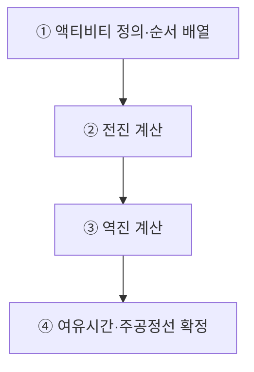
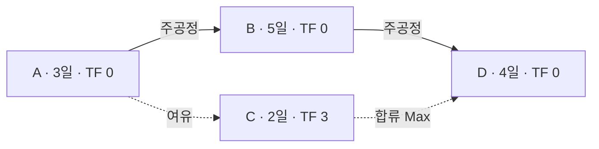
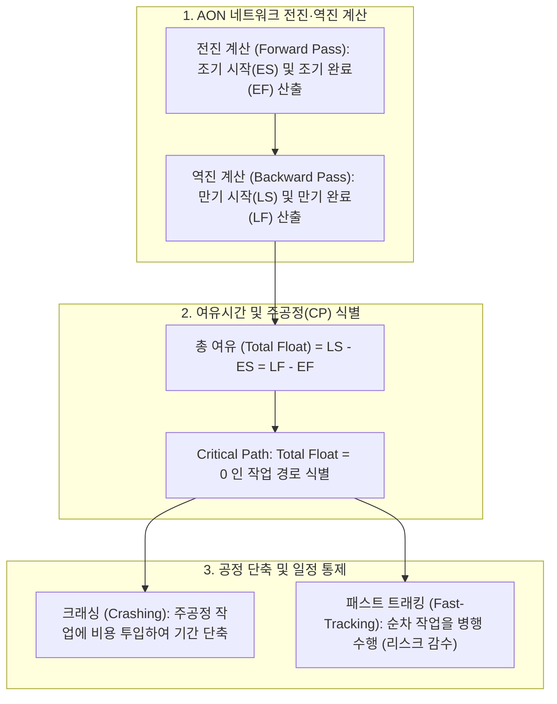

## 지식 로드맵 내 현재 위치
현재 위치: IT 전략·관리 → CPM(Critical Path Method)

## 30초 인출

- 본질: 네트워크 공정표의 최장 경로를 찾아 프로젝트 최단 완료기간과 일정 여유(Float)를 계산하는 기법이다.
- 메커니즘: 전진계산(ES/EF, 합류시 Max) → 역진계산(LS/LF, 분기시 Min) → 총여유(TF=LS-ES) 산출 → **주공정선**(TF=0) 도출한다.
- 판정 기준: 총여유가 작은 경로를 우선 감시하고 **비용 구배**와 납기 효과를 비교하여 크래싱을 결정한다.

핵심 용어

- **CPM(Critical Path Method)**: 단일 확정적 소요 기간을 바탕으로 프로젝트 최단 납기를 결정짓는 주공정선을 산출하는 기법이다.
- **Critical Path(주공정선)**: 프로젝트 시작부터 종료까지 가장 긴 경로로 최단 완료기간을 결정하며, 일정 제약에 따라 총 여유가 양수·0·음수일 수 있음이다.
- **Forward Pass(전진 계산)**: 시작 노드부터 종료 노드로 순방향 계산하여 조기착수일(ES)과 조기완료일(EF)을 도출하는 과정이다.
- **Backward Pass(역진 계산)**: 종료 노드부터 시작 노드로 역방향 계산하여 늦은완료일(LF)과 늦은착수일(LS)을 도출하는 과정이다.
- **Total Float(총 여유)**: 프로젝트 전체 납기를 지연시키지 않고 특정 작업이 늦어질 수 있는 최대 허용 시간이며, `$LS - ES$`로 계산한다.
- **Free Float(자유 여유)**: 바로 다음 후속 작업의 조기착수일(ES)을 지연시키지 않고 가질 수 있는 순수 여유 시간이다.
- **Cost Slope(비용 구배)**: 크래싱 수행 시 단축 일수(1일)당 추가로 투입되는 비용 비율 ($\Delta Cost / \Delta Time$)이다.

## 예상문제

> CPM(Critical Path Method)의 개념과 계산절차를 설명하고, 일정 단축기법과 적용 시 고려사항을 제시하시오. **(미출제 예상·25점)**

## Ⅰ. 프로젝트 최단 납기의 수학적 기준, CPM의 개요

> CPM은 네트워크 전진·역진 계산으로 프로젝트의 최장 경로와 일정 유연성을 도출하며, 제약조건에 따라 주공정선의 총 여유는 양수·0·음수가 될 수 있음.

- 정의: 작업 간 **선후행 관계**를 바탕으로 **전진·역진 계산**을 수행하여 프로젝트 최단 완료기간을 결정하는 **최장 경로**와 일정 여유를 식별하는 기법
- 목적: **최단 완료기간** 결정 · **일정 병목** 식별 · **공정 압축**을 통한 납기 준수

## Ⅱ. CPM 네트워크 공정 분석 4단계 파이프라인

> 작업 배열에서 전진 계산, 역진 계산, 주공정선 확정 및 공정 압축으로 이어지는 논리적 파이프라인으로 수행됨.

- **Critical Path**: 네트워크의 최장 경로로 프로젝트 최단 완료기간을 결정하며, 제약조건에 따라 총 여유는 양수·0·음수 가능

## Ⅲ. AON 노드 표기법 및 여유시간 산출 공식

> AON 노드는 단일 작업 내에 6대 핵심 시간 변수를 명시하여 일정 통제의 기준선 역할을 수행함.

### 1. AON 노드 구조 및 전진·역진 계산 메커니즘

| AON 노드 상단 | 조기착수일 (ES) | 작업 소요 기간 (Duration) | 조기완료일 (EF) |
|---|---|---|---|
| **AON 노드 하단** | **늦은착수일 (LS)** | **총 여유시간 (Total Float)** | **늦은완료일 (LF)** |

### 2. 전진·역진 계산 및 여유시간 공식

> 아래 식은 시작일과 완료일을 모두 포함하는 일 단위 관례이며, 시점 기반 모델에서는 `EF = ES + D`, `LS = LF - D`를 사용함.

| 구분 | 계산 공식 (일 단위) | 핵심 규칙 및 판정 |
|---|---|---|
| **전진 계산 (ES, EF)** | $EF = ES + D - 1$ $ES_{next} = \max(EF_{prev}) + 1$ | **합류(Merge)** 지점에서는 선행 작업의 EF 중 **최대값** 취합 |
| **역진 계산 (LS, LF)** | $LS = LF - D + 1$ $LF_{prev} = \min(LS_{next}) - 1$ | **분기(Burst)** 지점에서는 후속 작업의 LS 중 **최소값** 취합 |
| **총 여유 (Total Float)** | $TF = LS - ES = LF - EF$ | 전체 완공일 또는 일정 제약을 위반하지 않는 최대 여유 |
| **자유 여유 (Free Float)** | $FF = \min(ES_{next}) - EF - 1$ | 직후 후속 작업의 조기착수(ES)를 지연시키지 않는 고유 여유 |

## Ⅳ. 공정 압축 기법 비교: 크래싱 vs 패스트트래킹

> 크래싱은 비용을 투입하여 시간을 단축하고, 패스트트래킹은 선후행 작업을 겹쳐 병행 수행하되 리스크를 감수함.

| 비교 항목 | 크래싱 (Crashing, 공정 압축) | 패스트트래킹 (Fast Tracking, 공정 첩행) |
|---|---|---|
| **핵심 방식** | 주공정선 작업에 **추가 자원(인력, 장비) 투입** | 순차적 선후행 작업을 **동시에 병행 수행** |
| **트레이드오프** | **추가 비용 발생 (Cost Trade-off)** | **품질 리스크 및 재작업 증가 (Risk Trade-off)** |
| **대상 선정 기준** | 주공정선 상에서 **비용 구배(Cost Slope)**가 가장 낮은 작업 | 선후행 의존도가 낮고 인터페이스 분리가 가능한 작업 |
| **대표 사례** | 야간 특근, 핵심 개발자 추가 투입 | 상세 설계 완료 전 코딩 착수, 단위 시험 병행 |
| **한계 및 주의점** | 브룩스의 법칙(지연된 프로젝트에 인력 투입 시 지연 가중) | 설계 변경 발생 시 기개발 소스 폐기 및 대규모 재작업 |

## Ⅴ. 문제점·대응책

> 일정 단축은 주공정선 변화·자원 충돌·재작업을 함께 검토해야 하며, 단축 후 네트워크를 다시 계산해야 함.

| 위험 | 대책 | 효과 |
|---|---|---|
| **주공정선 전이** | 단축 후 전진·역진 재계산 | 신규 병목 식별 |
| **자원 충돌** | 자원 평준화·가용성 검토 | 실행 가능한 일정 확보 |
| **재작업 증가** | 병행 가능 범위·인터페이스 선확정 | 패스트트래킹 위험 완화 |

## Ⅵ. 주공정선 변화까지 통제하는 기술사적 제언

> 주공정선만 단축하다 보면 준주공정선(Sub-critical path)이 새로운 주공정으로 돌발 전이되므로, 전체 경로에 대한 동적 민감도 분석과 CCPM 버퍼 관리가 필수적임.

### 실전 답안용 기술사적 제언

- 문제: 작업 간 복잡한 선후행 의존성을 간과하여 주공정(Critical Path) 상의 작업 지연이 프로젝트 전체 납기 파행으로 직결됨.
- 해결 방안: AON(Activity on Node) 네트워크를 구성하여 전진 계산(ES, EF)과 역진 계산(LS, LF)을 수행하고, 총 여유(Total Float = 0)인 주공정을 식별하여 자원을 집중 배분하며 필요 시 공정 단축(Crashing, Fast-Tracking)을 단행함.

## 1교시 10점 답안 발췌

### 1. 정의·목적

- 정의: 작업 간 의존 관계와 기간을 바탕으로 전진·역진 계산을 수행하여 프로젝트 최단 완료기간을 결정하는 **최장 경로**와 일정 여유를 식별하는 기법
- 목적: 최단 납기 확정, 일정 병목 식별 및 납기 준수

### 2. CPM 네트워크 공정 분석 4단계 절차

### 3. 핵심 통제

- **비용 구배(Cost Slope) 산정**: 단축 일수당 추가 비용이 가장 낮은 작업을 크래싱 대상으로 선정
- **준주공정선 모니터링**: 여유시간이 근소한 경로가 새 주공정선으로 전이되는 위험 사전 방지

## 출제 이력과 검증 출처

- 참고 문항: 회차별 출제 정보는 Q-Net 공식 문제지 원문 확인 전까지 직접 기출로 단정하지 않음
- Project Management Institute, [PMBOK Guide—Eighth Edition](https://www.pmi.org/standards/pmbok)
- Project Management Institute, [Critical Path Method Calculations](https://www.pmi.org/learning/library/critical-path-method-calculations-scheduling-8040)

## 학습 체크

- [ ] Ⅰ·Ⅱ: CPM 정의와 AON → 전진·역진 계산 → 주공정선 판정 흐름을 재현할 수 있는가?
- [ ] Ⅲ: 계산 관례를 밝히고 ES·EF·LS·LF·TF·FF를 계산할 수 있는가?
- [ ] Ⅳ: Crashing과 Fast Tracking의 비용·위험 트레이드오프를 비교할 수 있는가?
- [ ] Ⅴ·Ⅵ: 주공정선 전이·자원 충돌·재작업의 대응과 재계산 방안을 제언할 수 있는가?

## 연결 토픽

- 이전 토픽: [정보시스템 운영 성과관리](./079_information_system_operation_performance_management.md)
- 연관 토픽: [WBS](./007_wbs.md), [EVM](./032_evm.md), [CCPM](./112_critical_chain_toc.md)
- 다음 토픽: [CoE](./082_coe.md)
