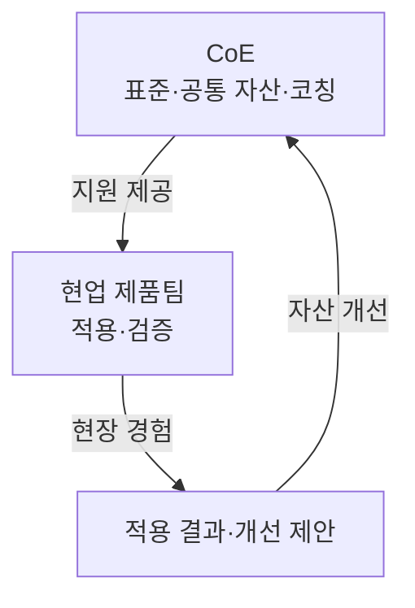

## 지식 로드맵 내 현재 위치

지식 위치: IT 전략·관리 → 기술 역량·거버넌스 → **CoE**

## 30초 인출

- 본질: **CoE**: 특정 기술의 전문성·표준·재사용 자산을 모아 현업팀의 적용을 돕는 조직.
- 메커니즘: CoE의 지침·공통자산·코칭 제공, 현업팀 적용결과를 반영한 개선.

핵심 용어

- **CoE(Center of Excellence)** : 특정 분야의 전문 지식·공통자산을 모아 조직 전반의 활용을 돕는 조직
- **CCoE(Cloud Center of Excellence)** : 클라우드 전략·거버넌스·도입을 지원하는 CoE
- **Hub & Spoke** : 중앙 전문조직의 공통역량 제공과 현업팀의 적용을 결합한 협업 구조
- **InnerSource** : 사내에서 오픈소스 방식으로 코드·문서에 기여하고 재사용하는 협업 방식
- **PMO(Project Management Office)** : 프로젝트 일정·비용·위험 관리기준과 관리활동 지원을 맡는 조직

---

## 1교시 예상문제 (10점)

> CoE의 개념과 현업 지원 방식, PMO와의 차이를 설명하시오. (예상·10점)

---

## 1교시 10점 답안

### Ⅰ. CoE의 개요

| 구분 | 핵심 |
|---|---|
| 정의 | **CoE**: 특정 기술의 전문 지식·공통자산을 모아 현업팀의 적용을 돕는 조직 |
| 목적 | 기술 적용 중복 감소와 현업팀의 활용역량 향상 |

### Ⅱ. 현업 지원 구조

### Ⅲ. PMO와의 구분

| 구분 | CoE | PMO |
|---|---|---|
| 주된 역할 | 기술 표준·공통 자산·현업 코칭 | 일정·비용·위험 등 프로젝트 관리 지원 |
| 확인 결과 | 자산 활용과 현업팀의 자립 | 프로젝트 관리 목표와 보고의 일치 |

**제언:** 현업팀의 적용 경험을 표준·공통자산 개선에 반영하는 CoE 운영.

---

## 2~4교시 예상문제 (25점)

> CoE의 운영모델과 PMO와의 차이를 설명하고, 운영상 문제점과 개선방안을 제시하시오. (예상·25점)

---

## 2~4교시 25점 답안

## Ⅰ. CoE의 개요

| 구분 | 핵심 |
|---|---|
| 정의 | **CoE**: 특정 기술의 전문 지식·공통자산을 모아 현업팀의 적용을 돕는 조직 |
| 목적 | 기술 적용 중복 감소와 현업팀의 활용역량 향상 |

## Ⅱ. CoE와 현업팀의 협업 구조

CoE의 제공역할: 클라우드·AI 등 분야별 지침·재사용 구성요소·교육·코칭. 현업팀의 역할: 적용 과정의 제약을 공유해 표준과 현장 간 차이를 줄이는 것. 특정 조직도·4단계 절차는 CoE의 필수 형태가 아님.

## Ⅲ. PMO와 역할 비교

| 구분 | CoE | PMO |
|---|---|---|
| 주된 역할 | 기술 표준·공통 자산·현업 코칭 | 일정·비용·위험 등 프로젝트 관리 지원 |
| 확인 결과 | 자산 활용과 현업팀의 자립 | 프로젝트 관리 목표와 보고의 일치 |

CoE·PMO 간 협업 가능, 기술 선택·지원과 사업관리·보고 책임의 구분.

## Ⅳ. 운영 문제와 대응

| 문제 | 원인 | 대응 |
|---|---|---|
| 표준의 현장 부적합 | 현업팀의 제약과 적용 경험이 반영되지 않음 | 제품팀과 시범 적용하고 예외·피드백을 검토 |
| 승인 병목 | 모든 기술 결정을 중앙 조직에 집중 | 필수 통제와 자율 선택 범위를 나눔 |
| CoE 의존 | 현업팀이 적용 방법을 배우지 못함 | 공동 구현·교육 후 운영 책임을 현업팀에 이전 |

## Ⅴ. 기술사적 제언 — 지원 효과 검증

| 확인 단계 | 확인할 증거 | 후속 판단 |
|---|---|---|
| 시범 적용 | 현업팀이 공통 자산을 적용하며 기록한 문제 | 표준·자산 보완 |
| 확산 | 다른 팀의 재사용과 예외 요청 이력 | 공통화 범위 조정 |
| 자립 | CoE 지원 없이 현업팀이 유지·개선한 사례 | 코칭 방식과 책임 이전 결정 |

CoE 성과기준: 표준 문서의 수가 아닌 현업팀의 공통자산 재사용과 자체 개선 역량.

## 출제 이력과 검증 출처

- 공식 문제지로 확인한 직접 기출 없음. 위 문항은 예상문제다.
- [AWS Prescriptive Guidance, Building a Cloud Center of Excellence within your organization](https://docs.aws.amazon.com/prescriptive-guidance/latest/cloud-center-of-excellence/introduction.html)
- [Microsoft Cloud Adoption Framework, Cloud center of excellence functions](https://learn.microsoft.com/en-us/azure/cloud-adoption-framework/organize/cloud-center-of-excellence)

## 연결 토픽

- 비교: [PMO](./004_pmo.md)
- 연계: [공공 클라우드 네이티브 전환](./021_public_cloud_native_transition.md)
