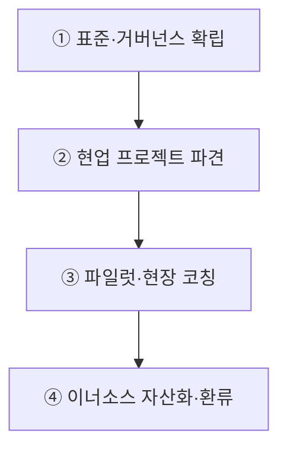
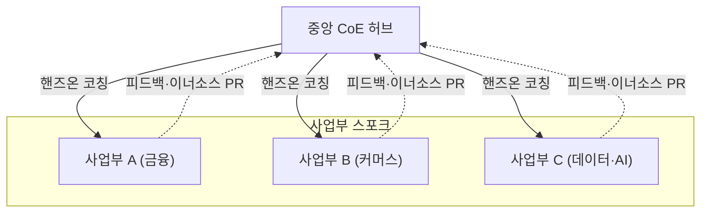
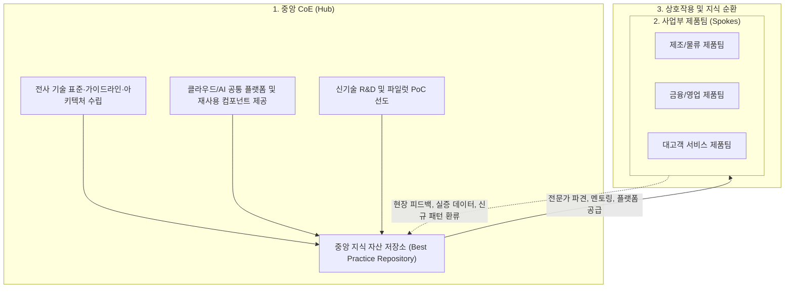

## 지식 로드맵 내 현재 위치
현재 위치: IT 전략·관리 → CoE(Center of Excellence)

## 30초 인출

- 본질: 핵심 기술(클라우드·AI 등)의 전사 표준과 아키텍처를 수립하고 현장 기술 내재화를 주도하는 전사 역량 센터이다.
- 메커니즘: 중앙 **CoE** 허브(아키텍처/ **IaC** ) → 사업부 스포크 파견(핸즈온 코칭) → 이너소스(공통모듈) 자산화 → 역량 상향 평준화한다.
- 판정 기준: 표준 준수 예외와 공통 모듈 재사용 현황을 프로젝트 증적으로 검증한다.

핵심 용어

- **CoE(Center of Excellence)** : 핵심 기술 전문성을 조직 전반에 내재화하고 확산하는 전사 역량 센터 조직
- **Hub & Spoke** : 중앙 허브가 표준과 자산을 총괄하고 현업 스포크로 지식과 인력을 파견하는 조직 모델
- **CCoE(Cloud Center of Excellence)** : 클라우드 거버넌스·인프라·보안 표준을 수립하고 전사 전환을 주도하는 전문 조직
- **Hands-on Coaching** : 실무 프로젝트 현장에 투입되어 아키텍처 구현과 코딩을 함께 수행하는 밀착 기술 지원 방식
- **InnerSource** : 사내에 오픈소스 개발 방식과 협업 문화를 적용해 공통 소프트웨어 자산을 공유·재사용하는 체계
- **IaC(Infrastructure as Code)** : 인프라 구성 요소를 코드로 정의하여 버전 관리와 자동 프로비저닝을 수행하는 기술

## 예상문제

> CoE(Center of Excellence)의 개념과 운영모델을 설명하고, PMO와의 차이 및 운영상 문제점·대응책을 제시하시오. **(미출제 예상·25점)**

## Ⅰ. 기술 전문성 내재화와 전사 확산의 구심점, CoE의 개요

> CoE는 사업부별 파편화된 기술 중복 투자를 방지하고 핵심 역량을 결집하며, 성공 여부는 단순 표준 문서 하달이 아닌 **현장 핸즈온 코칭** 과 **자생적 이너소스 생태계 조성** 으로 판정함.

- 정의: 클라우드, AI, 데이터 등 핵심 전략 기술 분야에서 **전사 레퍼런스 아키텍처** 를 수립하고 현업 프로젝트에 직접 참여하여 기술 전파를 주도하는 **전사 역량 센터(Center of Excellence)** 조직
- 목적: 부서별 기술 중복 투자 방지, SW 자산화 및 기술 도입 리드타임 단축

## Ⅱ. CoE 허브 앤 스포크 운영 4단계 파이프라인

> 표준 수립에서 현업 프로젝트 파견, 파일럿 검증, 이너소스 자산화로 이어지는 선순환 파이프라인으로 운영됨.

- **Hub & Spoke** : 중앙 CoE 허브에서 자산을 축적하고 사업부 스포크가 자생적으로 혁신을 주도하는 구조

## Ⅲ. CoE 허브 앤 스포크 아키텍처 및 4대 핵심 기능

> 단순 자문에 그치지 않고 거버넌스, 현장 코칭, 공통 자산화, 교육 생태계를 종합적으로 수행함.

### 1. Hub & Spoke 지식 순환 아키텍처

### 2. CoE 4대 핵심 기능

| 핵심 기능 | 세부 수행 활동 | 대표 산출물 |
|---|---|---|
| **1. 거버넌스 및 표준화** | 전사 표준 기술 스택 승인, IaC 골든 템플릿 제정, 아키텍처 가이드 | 레퍼런스 아키텍처 정의서, 골든 이미지 |
| **2. 핸즈온 자문 및 코칭** | 고난도 시스템 프로젝트 직접 파견, 페어 프로그래밍, 성능 트러블슈팅 | 아키텍처 검토서, 성능 튜닝 리포트 |
| **3. 공통 자산화 (InnerSource)** | 공통 인증/로깅 모듈 개발, 테라폼 인프라 모듈 패키징 및 사내 배포 | 사내 패키지 저장소, 이너소스 모듈 |
| **4. 교육 및 커뮤니티 조성** | 사내 테크 톡 운영, 신기술 핸즈온 워크숍, 사내 커뮤니티 퍼실리테이션 | 교육 커리큘럼, 테크 위키 지식베이스 |

## Ⅳ. CoE vs PMO 비교

> CoE는 기술적 수월성(Technical Excellence)을 지향하고, PMO는 프로젝트 공정 거버넌스(Management Governance)를 통제함.

| 비교 항목 | CoE (Center of Excellence) | PMO (Project Management Office) |
|---|---|---|
| **핵심 초점** | **기술 도메인 전문성 (Technical Excellence)** | **사업 관리 거버넌스 (Management Governance)** |
| **핵심 질문** | "기술적으로 어떻게 올바르게 구축할 것인가(How)?" | "일정과 예산 범위 내에서 정상 추진되는가(When/Cost)?" |
| **핵심 활동** | 기술 표준화, 레퍼런스 아키텍처, 핸즈온 코딩, 모듈 자산화 | WBS 공정 관리, 이슈/위험 통제, 예산 집행, 발주자 보고 |
| **조직 구성원** | 수석 소프트웨어 아키텍트, 기술 스페셜리스트, 엔지니어 | PMP, 기술사, 프로젝트 관리자, 사업 관리 전문가 |
| **성과 기준** | 공통 자산 재사용 · 현업 자립 · 도입 리드타임 | 일정 · 비용 · 범위 · 위험 통제 |

## Ⅴ. 문제점·대응책

> 중앙 표준이 현업의 선택과 학습을 막지 않도록 강제 통제와 지원 서비스의 경계를 분명히 해야 함.

| 위험 | 대책 | 효과 |
|---|---|---|
| **상아탑화** | 현업 임베딩·공동 구현 | 실무 적합성 확보 |
| **승인 병목** | 필수 가드레일과 권고 패턴 분리 | 자율성과 통제 균형 |
| **CoE 의존** | 챔피언 육성·공통자산 운영권 이관 | 현업 자립·확산 |

## Ⅵ. 지원형 CoE 정착을 위한 기술사적 제언

> CoE가 기술 감사관처럼 군림하면 현업과의 마찰로 고립되므로, 현장 코딩 지원과 참여형 이너소스 생태계 조성이 필수적임.

### 실전 답안용 기술사적 제언

- 문제: 부서별 독자적 신기술 도입으로 중복 투자가 발생하고 검증되지 않은 기술 도입으로 보안 사고 및 아키텍처 실패가 반복됨.
- 해결 방안: Hub & Spoke 모델의 전담 CoE(Center of Excellence) 조직을 설치하여 전사 기술 표준 및 거버넌스를 정립하고, 전문가를 일선 현업 제품팀에 파견·멘토링하며 검증된 모범 사례와 프레임워크를 중앙 저장소로 자산화함.

## 1교시 10점 답안 발췌

### 1. 정의·목적

- 정의: 핵심 기술 분야에서 **전사 레퍼런스 아키텍처** 를 수립하고 현업 프로젝트에 직접 참여하여 기술 내재화를 주도하는 **전사 역량 센터(Center of Excellence)** 조직
- 목적: 중복 투자 방지, 기술 역량 결집 및 SW 자산화

### 2. CoE 운영 및 전사 역량 내재화 파이프라인

### 3. 핵심 통제

- **CoE vs PMO 분리** : CoE(How 기술 전문성)와 PMO(When/Cost 공정 관리)의 명확한 R&R 정립
- **이너소스 거버넌스** : 일방적 하달을 탈피하고 사내 개발자의 오픈소스형 기여를 유도하여 최신성 유지

## 출제 이력과 검증 출처

- 참고 문항: 회차별 출제 정보는 Q-Net 공식 문제지 원문 확인 전까지 직접 기출로 단정하지 않음
- AWS Prescriptive Guidance, [Building a Cloud Center of Excellence within your organization](https://docs.aws.amazon.com/prescriptive-guidance/latest/cloud-center-of-excellence/introduction.html)
- Microsoft Cloud Adoption Framework, [Cloud center of excellence functions](https://learn.microsoft.com/en-us/azure/cloud-adoption-framework/organize/cloud-center-of-excellence)

## 학습 체크

- [ ] Ⅰ·Ⅱ: CoE의 정의와 표준 → 파견 → 공동 구현 → 자산화 흐름을 재현할 수 있는가?
- [ ] Ⅲ: 거버넌스·코칭·자산화·커뮤니티의 활동과 산출물을 설명할 수 있는가?
- [ ] Ⅳ: CoE와 PMO를 초점·활동·성과 기준으로 비교할 수 있는가?
- [ ] Ⅴ·Ⅵ: 상아탑화·승인 병목·CoE 의존의 대응과 현업 자립 방안을 제언할 수 있는가?

## 연결 토픽

- 이전 토픽: [CPM](./081_cpm.md)
- 연관 토픽: [PMO](./004_pmo.md), [공공 클라우드 네이티브 전환](./021_public_cloud_native_transition.md), [프로젝트 관리](./065_project_management.md)
- 다음 토픽: [IT서비스 산업 특수성](./086_it_service_industry_characteristics.md)
