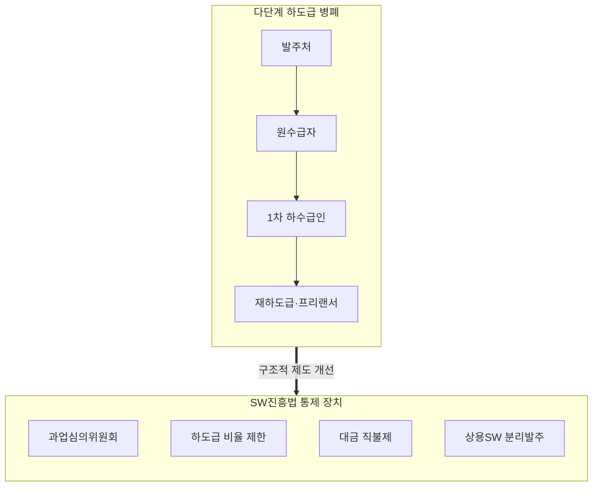
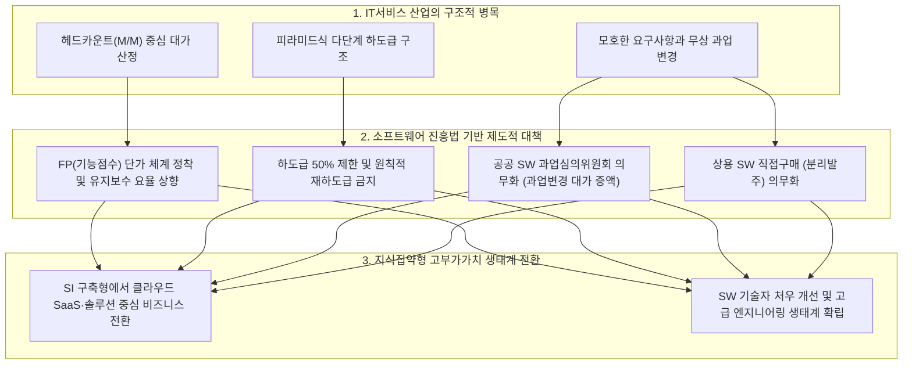

## 지식 로드맵 내 현재 위치
현재 위치: IT 전략·관리 → IT서비스 산업 특수성

## 30초 인출

- 본질: IT서비스 산업은 고객 요구에 따라 무형의 소프트웨어와 서비스를 만드는 산업이다. 작업 범위와 성과 측정이 어려워 계약·하도급 관리가 중요하다.
- 메커니즘: 모호한 발주 → 원수급자 마진 취득 및 외주화 → 다단계 하도급 전이 → SW진흥법(하도급제한/과업심의)으로 통제한다.
- 판정 기준: 하도급 계약과 과업 변경 승인 기록을 검토하여 공정한 수행과 대가 조정을 검증한다.

핵심 용어

- **IT서비스(SI/SM)** : 정보시스템 기획·구축(SI) 및 운영·유지보수(SM)를 제공하는 지식 집약 산업
- **Intangibility(무형성)** : 완성 전까지 물리적 실체와 작동 품질을 육안으로 확인하기 어려운 소프트웨어 고유 특성
- **Headcounting(헤드카운팅)** : 산출물 가치 대신 투입 인력 수와 기간(M/M)을 기준으로 대가를 산정하는 관행
- **과업심의위원회** : 공공 SW 사업의 과업 변경 및 기간 연장을 심의하여 계약금액을 조정하는 법정 기구
- **하도급 제한** : 원수급자의 과도한 외주 위탁과 재하도급을 방지하여 프로젝트 품질과 책임을 확보하는 규정
- **Composable IT** : 검증된 패키지와 SaaS 모듈을 API로 유연하게 조립해 시스템을 신속 구축하는 방식
- **하도급대금 직불제** : 원수급자를 거치지 않고 발주기관이 하수급인에게 용역 대금을 직접 지급하는 제도
- **상용SW 직접구매** : 시스템 통합(SI) 일괄발주 대신 상용 소프트웨어를 발주처가 분리하여 직접 구매하는 조달 방식

---

## 1교시 예상문제 (10점)

> IT서비스 산업의 특성과 다단계 하도급 구조를 설명하시오. (예상·10점)

---

## 1교시 10점 답안

### 1. 정의·목적

- 정의: 소프트웨어의 **무형성** , **비분리성** , **주문생산성** 으로 인해 발주자-수주자 간 정보 비대칭이 크고, 다단계 하도급과 헤드카운팅(M/M) 관행이 발생하는 **국내 IT서비스(SI/SM) 산업의 구조적 특성**
- 목적: 불공정 관행 개선, 엔지니어 권익 보호 및 산업 고부가가치화

### 2. 다단계 하도급 구조 및 SW진흥법 통제 체계

### 3. 핵심 통제

- **하도급지킴이 연계** : 조달청 관리 시스템을 통한 하도급 대금 직불제 검증
- **상용SW 직접구매 검토** : 직접구매 대상과 제외사유를 확인하고 맞춤개발 범위를 최소화

---

## 2~4교시 예상문제 (25점)

> IT서비스 산업의 특성과 구조적 문제점을 설명하고, 공공 소프트웨어사업의 공정한 계약·수행을 위한 대응책을 제시하시오. **(미출제 예상·25점)**

---

## 2~4교시 25점 답안

## Ⅰ. 인적 지식 집약과 주문 생산의 딜레마, IT서비스 산업의 개요

> IT서비스 산업은 소프트웨어의 무형성과 주문생산성으로 인해 심각한 정보 비대칭을 내포하며, 생태계 정상화의 성패는 단순 인력 관리가 아닌 **과업의 명확한 상세화** 와 **결과물 가치 기반 대가 지급** 으로 판정함.

| 구분 | 핵심 |
|---|---|
| 정의 | 일반 제조업과 달리 **무형성(Intangibility)** , **비가시성** , **주문생산성** 과 높은 인적 의존성을 지녀 다단계 하도급과 헤드카운팅 관행이 발생하기 쉬운 **국내 IT서비스(SI/SM) 산업의 구조적 특성** |
| 목적 | 불공정 거래 관행 개선, 엔지니어 처우 보장 및 SW 생태계 고부가가치화 |

## Ⅱ. IT서비스 다단계 하도급 악순환과 제도적 통제 구조

> 과업 확정·하도급 관리·대금 지급·상용SW 구매 검토를 통해 계약과 수행의 위험을 통제함.

### 1. 피라미드식 하도급 구조와 제도적 정상화 메커니즘

- **악순환의 고리** : 저가 수주 ↔ 중간 마진 누수 ↔ 개발자 처우 악화 ↔ 시스템 품질 저하의 구조적 반복

## Ⅲ. 서비스의 4대 속성과 IT서비스의 주문생산성

> 서비스 마케팅의 4대 속성이 IT 프로젝트에 투영되며 품질 통제와 대가 산정의 난제를 야기함.

| 서비스 고유 속성 | 공학적·산업적 세부 내용 | 파생되는 구조적 문제점 |
|---|---|---|
| **무형성 (Intangibility)** | 개발 완료 전까지 물리적 실체 확인 불가 (비가시성) | 발주자와 수주자 간 요구사항 해석 차이 및 분쟁 빈발 |
| **비분리성 (Inseparability)** | 서비스의 생산과 소비가 현장에서 동시에 진행 | 발주자의 잦은 개입, 상주 개발 강요, 현장 구두 과업 추가 |
| **이질성 (Heterogeneity)** | 투입 인력의 숙련도에 따라 소프트웨어 품질 편차 극심 | 생산성의 불확실성 증대 및 객관적 품질 표준화 한계 |
| **소멸성 (Perishability)** | 유휴 인력의 생산 능력을 재고로 보관 불가 | 비가동 인력 유지비 부담 및 프로젝트성 고용 불안정 심화 |
| **주문생산성 (Customization)** | 특정 고객만을 위한 단일 1회성 맞춤 시스템 구축 | 재사용성 결여 및 복제에 따른 한계비용 체감 법칙 미작동 |

## Ⅳ. 제조업 vs 패키지 SW vs IT서비스 산업 비교

> 패키지 SW가 한계비용 0의 무한 복제 확장성을 갖는 반면, IT서비스는 인력 비례형 용역 구조에 머묾.

| 비교 항목 | 전통 제조업 (H/W) | 패키지 소프트웨어 (COTS / SaaS) | IT서비스 산업 (SI / SM) |
|---|---|---|---|
| **생산 방식** | 공장 설비 기반 대량 물리 생산 | 디지털 코드 일회 제작 후 복제 배포 | 고객 맞춤형 1회성 주문 용역 개발 |
| **한계 비용** | 원자재 및 조립 물류비 지속 소요 | **거의 0에 수렴 (Zero Marginal Cost)** | **인력 투입(M/M)에 정비례하여 증가** |
| **수익 모델** | 제품 판매 단가 × 판매 수량 | 라이선스 판매 또는 클라우드 정기 구독료 | 투입공수(M/M) 또는 고정가 턴키 계약 |
| **글로벌 확장성** | 생산 설비 및 공급망 구축 필요 | **글로벌 시장 대상 무한 확장 가능** | 물리적 투입 가능 인력 풀(Pool)에 종속 |
| **가치 동인** | 원가 절감, 생산 수율, SCM 최적화 | 사용자 경험(UX), 제품 완성도, PMF | 프로젝트 관리(PM), 개발 역량, 발주처 관리 |

## Ⅴ. 문제점·대응책

> 법제도적 강제를 통해 다단계 하도급을 차단하고 기능점수 기반의 정당한 대가 지급 체계를 정착시킴.

| 문제 | 대응책 | 효과 |
|---|---|---|
| **다단계 하도급** | 법 제51조의 50% 초과 하도급 제한·사전승인·재하도급 제한 적용 | 원수급자 책임 강화 |
| **과업 범위 불명확** | 상세 요구사항 작성·과업심의위원회 확정 | 분쟁 예방 |
| **무상 과업 변경** | 변경 심의 후 계약금액·기간 조정 | 정당한 대가·기간 확보 |
| **상용SW 일괄구축** | 직접구매 대상 검토·분리발주 | 전문기업 참여·제품 선택권 확보 |

> 하도급 비율·재하도급에는 법정 예외가 있으므로 사업유형과 승인 요건을 함께 확인함.

## Ⅵ. 맞춤개발 범위를 통제하는 기술사적 제언

> 민간·상용 소프트웨어 활용 가능성을 먼저 검토하고 차별 업무만 맞춤개발하여 과업·비용 위험을 줄임.

### 실전 답안용 기술사적 제언

- 문제: 다단계 하도급 관행, 인력 투입 중심(M/M) 단가 산정, 불명확한 요구사항으로 인한 잦은 무상 과업 변경으로 SW 기업의 수익성이 악화되고 품질 저하가 악순환됨.
- 해결 방안: 소프트웨어 진흥법을 엄격히 준수하여 하도급 50% 제한 및 재하도급을 금지하고, 기능점수(FP) 기반 적정 대가 지급, 공공 SW 과업심의위원회를 통한 정당한 과업변경 대가 보장 및 상용SW 분리발주를 의무화함.

## 출제 이력과 검증 출처

- 참고 문항: 회차별 출제 정보는 Q-Net 공식 문제지 원문 확인 전까지 직접 기출로 단정하지 않음
- 국가법령정보센터, [소프트웨어 진흥법](https://www.law.go.kr/lsInfoP.do?lsId=000751) — 제50조 과업심의위원회·제51조 하도급 제한
- 국가법령정보센터, [소프트웨어사업 계약 및 관리감독에 관한 지침](https://www.law.go.kr/LSW/admRulLsInfoP.do?admRulSeq=2100000223356&chrClsCd=)

## 연결 토픽

- 이전 토픽: [CoE](./082_coe.md)
- 연관 토픽: [SW 사업 대가산정](./026_software_cost_estimation.md), [과업심의 기준](./091_public_sw_cost_and_scope_change_criteria.md), [하도급 구조](./097_software_industry_subcontracting_structure.md)
- 다음 토픽: [IT 역량체계(ITS-NCS)](./087_it_job_competency_system.md)
