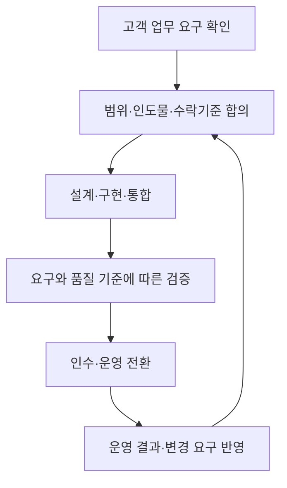

## 지식 로드맵 내 현재 위치

지식 위치: IT 전략·관리 → IT서비스 사업관리 → **IT서비스 산업 특수성**

## 30초 인출

- 본질: **IT서비스 산업** 은 고객의 업무 문제를 소프트웨어와 정보기술 서비스로 해결하는 산업
- 메커니즘: 고객별 요구를 합의된 범위·인도물로 구체화하고, 개발·검증·운영 과정에서 변경과 서비스 품질을 관리

핵심 용어

- **IT서비스 산업** : 소프트웨어·정보기술을 활용해 고객의 시스템 구축·통합·운영 요구를 해결하는 산업
- **SI(System Integration)** : 여러 시스템·소프트웨어·기술 요소를 결합해 고객 정보시스템을 구축하는 사업
- **SM(System Management)** : 정보시스템의 운영·유지관리 서비스를 제공하는 사업
- **서비스 수락기준** : 인도물이 계약·요구사항에 맞는지 검증하는 기준
- **서비스 수준(Service Level)** : 서비스 제공자와 이용자가 합의한 품질·응답·가용성 등 성과 기준

---

## 1교시 예상문제 (10점)

> IT서비스 산업의 정의와 특성, 사업관리 시 고려사항을 설명하시오. (예상·10점)

---

## 1교시 10점 답안

### Ⅰ. IT서비스 산업의 개요

| 구분 | 핵심 |
|---|---|
| 정의 | **IT서비스 산업** : 고객의 업무 문제를 소프트웨어와 정보기술 서비스로 해결하는 산업 |
| 목적 | 고객별 요구에 맞는 정보시스템 가치와 지속 가능한 서비스 제공 |

### Ⅱ. 산업의 주요 특성

| 특성 | 사업에서 나타나는 모습 | 관리 초점 |
|---|---|---|
| 무형의 산출물 | 기능·품질을 사용 전 완전히 확인하기 어려움 | 인도물·시험·수락기준의 명확화 |
| 고객별 맞춤성 | 업무·기존 시스템·제약에 따라 범위가 다름 | 요구사항 기준선과 변경 영향 관리 |
| 전문인력 의존 | 역량·지식이 분석·설계·구현 품질에 영향 | 핵심 역할·지식 이전·인력 연속성 |
| 지속적 서비스 | 구축 이후에도 운영·유지관리 필요 | 서비스 수준·장애·변경관리 |

### Ⅲ. 사업관리 핵심

| 관리 시점 | 핵심 확인 |
|---|---|
| 계약·착수 | 요구·범위·인도물·수락기준 |
| 개발·변경 | 변경 근거·비용·일정·품질 영향 |
| 인수·운영 | 시험 증거·전환 준비·서비스 책임 |

**제언:** 계약 범위부터 운영 수락까지 요구·변경·검증 근거를 이어 관리.

---

## 2~4교시 예상문제 (25점)

> IT서비스 산업의 특성과 정보시스템 구축·운영 사업에 미치는 영향을 설명하고, 사업관리 방안을 제시하시오. (예상·25점)

---

## 2~4교시 25점 답안

## Ⅰ. IT서비스 산업의 개요

| 구분 | 핵심 |
|---|---|
| 정의 | **IT서비스 산업** : 고객의 업무 문제를 소프트웨어와 정보기술 서비스로 해결하는 산업 |
| 목적 | 고객별 요구에 맞는 정보시스템 가치와 지속 가능한 서비스 제공 |

## Ⅱ. 산업 특성과 관리 영향

| 산업 특성 | 정보시스템 사업에서의 영향 | 관리 항목 |
|---|---|---|
| 무형성 | 기능과 품질은 시험·운영 전 완전히 확인하기 어려움 | 요구사항·품질속성·수락기준의 구체화 |
| 맞춤성 | 고객 업무·기존 시스템에 따라 범위와 통합조건이 달라짐 | 현행분석·인터페이스·변경기준 |
| 공동생산 | 고객의 요구 설명·의사결정·검증 참여가 결과에 영향 | 책임자·결정기한·검토·승인 경로 |
| 지식집약 | 결과가 팀의 전문성·협업·지식유지에 좌우됨 | 역할·핵심지식·인수인계 |
| 서비스 지속성 | 인도 후에도 장애대응·운영·개선이 이어짐 | 운영전환·서비스 수준·변경관리 |

## Ⅲ. 요구에서 서비스 운영까지

산출물 확인에 그치지 않고 운영 결과와 변경 요구를 후속 범위·기준에 반영하는 사업 순환.

## Ⅳ. 사업관리 통제와 증거

| 관리영역 | 핵심 통제 | 검증 증거 |
|---|---|---|
| 범위 | 요구사항 기준선·변경승인 | 요구 추적표·변경 기록 |
| 품질 | 요구별 시험·수락기준 | 시험결과·결함 조치·검수 기록 |
| 인력 | 역할과 의사결정 책임 명확화 | 담당자 배정·지식 이전 기록 |
| 운영전환 | 서비스·데이터·장애대응 준비 | 전환 점검·운영 절차·서비스 수준 합의 |

## Ⅴ. 기술사적 제언 — 수락과 운영의 단절 방지

| 한계 | 해결 방안 |
|---|---|
| 계약상 산출물 검수와 실제 업무·운영 성과 사이의 단절 | 요구사항별 수락 증거를 운영 지표·책임·전환 항목에 연결하고 인수 후 초기 운영에서 미충족 항목을 추적 |

## 출제 이력과 검증 출처

- [ISO/IEC 20000-1:2018, Service management system requirements](https://committee.iso.org/cms/live/live/en/sites/isoorg/contents/data/standard/07/06/70636.html?browse=tc) — 계획·설계·전환·제공·개선의 서비스 관리 요구
- [IEEE Computer Society, SWEBOK Guide v4.0](https://www.computer.org/education/bodies-of-knowledge/software-engineering) — 소프트웨어 운영·유지관리의 지식 영역

## 연결 토픽

- 연계: [적정 사업기간·과업심의](./091_public_sw_cost_and_scope_change_criteria.md), [공공 SW 사업 하도급 제한](./097_software_industry_subcontracting_structure.md)
