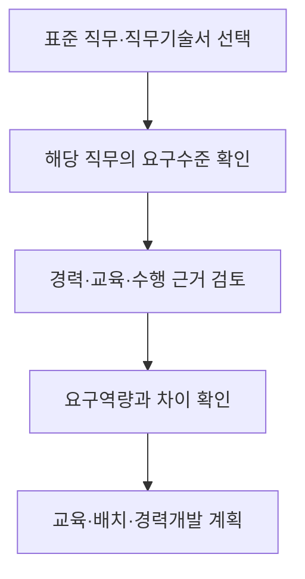

## 지식 로드맵 내 현재 위치

지식 위치: IT 전략·관리 → IT 인적자원·역량관리 → **ITSQF**

## 30초 인출

- 본질: ITSQF는 IT 분야에서 어떤 직무를 어떤 수준으로 수행해야 하는지 정리한 산업별 역량체계다.
- 메커니즘: 직무기술서의 요구역량과 개인의 수행 근거를 비교해 교육·배치·경력개발에 활용한다.

핵심 용어

- **ITSQF(IT Sectoral Qualifications Framework)** : IT 분야의 표준 직무와 직무수준별 요구역량을 정리한 산업별 역량체계다.
- **NCS(National Competency Standards)** : 산업 현장에서 직무 수행에 필요한 지식·기술·태도를 표준화한 국가직무능력표준이다.
- **SQF(Sectoral Qualifications Framework)** : NCS를 토대로 산업 특성에 맞는 직무·수준과 역량 인정 기준을 구성한 체계다.
- **직무기술서** : 해당 직무의 수행 업무와 수준별 요구역량을 기술한 문서다.
- **직무수준 진단** : 직무별 요구수준과 개인의 경력·교육·수행 근거를 비교해 현재 수준을 살피는 절차다.

---

## 1교시 예상문제 (10점)

> ITSQF의 개념과 직무수준 진단의 활용 방안을 설명하시오. (예상·10점)

---

## 1교시 10점 답안

### Ⅰ. ITSQF의 개요

| 구분 | 핵심 |
|---|---|
| 정의 | **ITSQF** 는 IT 분야의 표준 직무와 직무수준별 요구역량을 정리한 산업별 역량체계다. |
| 목적 | 직무 요구와 개인 역량을 비교해 채용·배치·교육·경력개발에 활용한다. |

### Ⅱ. 직무수준 진단과 활용

2026년 IT 분야 직무기술서는 38개 직무를 제시한다. 직무 수와 세부 요구역량은 해당 연도 자료로 확인한다.

**제언:** 직함이나 근속연수만으로 수준을 정하지 말고 실제 수행 업무와 근거를 함께 검토한다.

---

## 2~4교시 예상문제 (25점)

> ITSQF의 구성과 직무수준 진단 절차를 설명하고, 인력관리 활용 시 유의점을 제시하시오. (예상·25점)

---

## 2~4교시 25점 답안

## Ⅰ. ITSQF의 개요

| 구분 | 핵심 |
|---|---|
| 정의 | **ITSQF** 는 IT 분야의 표준 직무와 직무수준별 요구역량을 정리한 산업별 역량체계다. |
| 목적 | 직무 요구와 개인 역량을 비교해 채용·배치·교육·경력개발에 활용한다. |

## Ⅱ. 체계의 구성

| 구성요소 | 담는 내용 | 활용 |
|---|---|---|
| 표준 직무 | 산업에서 구분하는 업무 유형 | 직무 명칭과 수행 범위 비교 |
| 직무수준 | 직무별 수행 난이도·자율성·책임 | 요구수준 설정 |
| 직무기술서 | 수행 업무와 수준별 요구역량 | 채용·교육·배치 기준 |

한국인공지능·소프트웨어산업협회의 2026년 IT 분야 자료는 38개 직무의 직무기술서를 제시한다. 새 융합산업 분야의 9개 직무는 별도 자료이므로 단순히 47개 IT 직무로 합산하지 않는다.

## Ⅲ. 직무수준 진단과 활용

2025년 공개된 ITSQF 기반 직무수준 진단 가이드는 실제 직무별 수준을 확인해 인사·교육 등에서 활용하는 방법을 제시한다. 특정 수준이 임금이나 직위를 자동으로 결정하는 것은 아니다.

## Ⅳ. 적용 위험과 대응

| 위험 | 원인 | 대응 |
|---|---|---|
| 직무 매핑 오류 | 직함만 보고 표준 직무에 대응 | 실제 수행 업무와 직무기술서 비교 |
| 진단의 근거 부족 | 근속연수만으로 수준 추정 | 경력·교육·프로젝트 수행 근거 함께 확인 |
| 수준의 기계적 사용 | 진단 결과를 보상·서열로 곧바로 연결 | 활용 목적과 별도 인사 기준 명시 |
| 기준의 노후화 | 개정된 직무기술서를 반영하지 않음 | 적용 연도와 판본 기록 |

## Ⅴ. 기술사적 제언 — 역량 차이의 해소 확인

| 단계 | 확인할 증거 | 후속 조치 |
|---|---|---|
| 현재 직무 확인 | 실제 수행 업무와 해당 직무기술서 | 잘못된 매핑 수정 |
| 역량 개발 | 요구수준 대비 부족한 수행역량 | 교육·현장 경험 계획 |
| 재진단 | 교육 후 맡은 업무와 결과물 | 배치·경력개발 계획 조정 |

진단 결과를 고정 등급처럼 쓰지 말고, 직무가 바뀌거나 새 업무를 수행하면 근거를 갱신한다.

## 출제 이력과 검증 출처

- 공식 문제지로 확인한 직접 기출 없음. 위 문항은 예상문제다.
- [한국인공지능·소프트웨어산업협회, 2026년 IT 분야·융합산업분야 SQF 직무기술서](https://www.sw.or.kr/site/kipa/ex/board/View.do?bcIdx=53300&cbIdx=308&gubun=G)
- [한국인공지능·소프트웨어산업협회, ITSQF 기반 직무수준 진단체계](https://www.sw.or.kr/site/kipa/ex/board/View.do?bcIdx=64583&cbIdx=292&searchExt1=)

## 연결 토픽

- 선행: [IT서비스 산업 특수성](./086_it_service_industry_characteristics.md)
- 연계: [SW 사업 대가산정](./026_software_cost_estimation.md)
