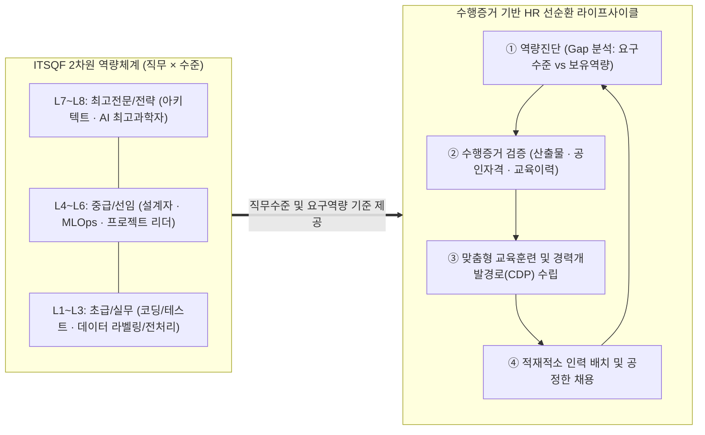
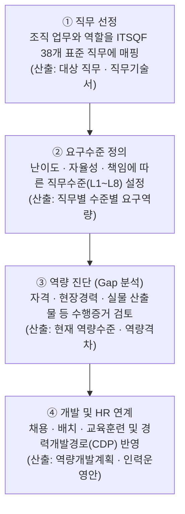
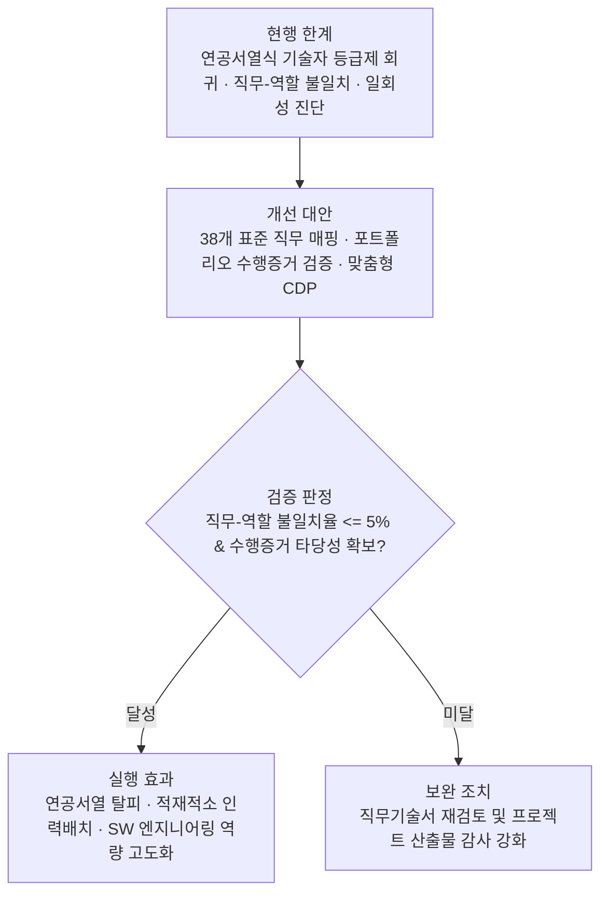

## 지식 로드맵 내 현재 위치

  IT 전략·관리
  SW 인력정책·직무역량관리
  <strong>ITSQF</strong>

## 30초 인출

- 본질: NCS 기반으로 IT 산업의 표준 직무와 직무수준별 요구역량을 정의한 산업별 역량체계(SQF)
- 메커니즘: 표준 직무 매핑(38개) → 직무수준 정의(L1~L8) → 수행증거 기반 역량진단(Gap) → 채용·CDP·교육 환류
- 판정 기준: 직무기술서 요구수준 대비 산출물 증빙 100% 매핑 및 직무-역할 불일치율 <= 5%

핵심 용어

- **ITSQF(IT Sectoral Qualifications Framework)**: IT 산업의 표준 직무와 직무수준별 요구역량을 정리한 산업별역량체계
- **NCS(National Competency Standards)**: 산업현장의 직무 수행에 필요한 지식·기술·태도를 국가가 체계화한 기준
- **SQF(Sectoral Qualifications Framework)**: NCS를 기반으로 산업 특성을 반영하여 직무·교육훈련·자격·경력의 연계를 지원하는 체계
- **직무기술서**: 직무 정의, 주요 업무, 직무수준, 필요 지식·기술 등을 정리한 문서
- **직무수준**: 직무의 수행범위·난이도·자율성·책임을 기준으로 요구역량의 깊이를 구분한 단계

## 예상문제

> ITSQF(IT Sectoral Qualifications Framework)의 개념과 구성체계를 설명하고, 소프트웨어 인적자원관리에 활용하는 방안과 고려사항을 제시하시오. **(미출제 예상·25점)**

## Ⅰ. 직무 중심 IT 역량관리 기준, ITSQF의 개요

> ITSQF는 개인을 과거의 단일 기술자 등급으로 고정하는 제도가 아니라, 수행 직무와 수준별 요구역량을 연결하는 산업 공통 참조체계임.

- 정의: **NCS(National Competency Standards)**를 기반으로 IT 산업의 표준 직무와 직무수준별 요구역량을 체계화한 **산업별역량체계**
- 목적: 직무 용어 표준화 · 역량 미스매치 완화 · 채용·교육·경력개발 연계

## Ⅱ. ITSQF 프레임워크 아키텍처 및 활용 절차

> 표준 직무와 8단계 직무수준 매트릭스를 기반으로 역량 진단 및 HR 라이프사이클을 순환함.

### 1. ITSQF 2차원 매트릭스 및 역량 연계 구조

### 2. ITSQF 구성체계·활용 절차

## Ⅲ. ITSQF 핵심 구성요소

| 구성요소 | 내용 | 활용 |
|---|---|---|
| **직무분류** | 2026 IT 분야 38개 표준 직무 | 역할·채용 명칭 정렬 |
| **직무기술서** | 직무 정의 · 주요 업무 · 필요역량 | 직무 요구사항 명세 |
| **직무수준** | 수행범위 · 난이도 · 자율성 · 책임 | 목표 수준·경력경로 설정 |
| **수행증거** | 교육훈련 · 자격 · 현장경력 등 | 개인·조직 역량 진단 |

> 직무 수와 내용은 개정될 수 있으므로 해당 연도 공식 직무기술서를 기준으로 적용함.

## Ⅳ. 과거 기술자 등급제 vs ITSQF 비교

| 기준 | 과거 기술자 등급제 | ITSQF |
|---|---|---|
| **분류축** | 학력·자격·경력연수 | 직무·직무수준·수행역량 |
| **표현** | 초급·중급·고급·특급 | 직무별 수준과 요구역량 |
| **활용** | 기술자 구분·대가 참고 | 채용·배치·교육·경력개발 참고 |
| **한계** | 실제 수행직무 반영 부족 | 진단근거·조직별 적용기준 필요 |

## Ⅴ. 문제점·대응책

| 위험 | 대책 | 효과 |
|---|---|---|
| **직함과 직무 불일치** | 실제 업무를 표준 직무에 매핑 | 역할 명확화 |
| **연차 중심 판정** | 현장경력·수행증거 종합 검토 | 역량 타당성 향상 |
| **일회성 진단** | 프로젝트 종료·직무 변경 시 갱신 | 최신성 유지 |
| **수준의 보상 자동연계** | 시장임금·성과·조직정책 별도 검토 | 기계적 서열화 방지 |

## Ⅵ. 증거 기반 역량관리 정착을 위한 기술사적 제언

> ITSQF 수준을 새로운 신분등급으로 사용하지 않고, 직무 요구와 수행증거의 차이를 줄이는 개발도구로 활용해야 함.

### 학습자 통찰 메모 — 답안 밖

- [핵심 통찰]: 등급 명칭만 바꾸면 연공서열이 반복됨. 핵심은 직무마다 요구수준을 정하고 실제 수행증거로 역량격차를 설명하는 데 있음.
- 나라면: 채용 시점의 단일 판정보다 프로젝트 산출물·문제해결 기록·교육 이력을 누적하여 직무 변경과 성장 경로에 반영하겠음.

### 실전 답안용 기술사적 제언

- **판정 기준**: 직무–실제역할 불일치율, 수행증거(산출물/자격) 타당성 및 정기 갱신 주기 준수 여부 판정
- **대응 방안**: 38개 표준 직무기술서 매핑, 다면 포트폴리오 기반 증거 중심 진단 및 맞춤형 CDP 수립
- **검증 체계**: 직무 요구역량과 개인 수행증거 간 추적성 검증, 프로젝트 수행 후 역량 수준 갱신 감사
- **기대 효과**: 연공서열식 인력 관리 탈피, 적재적소 인력 배치 및 SW 엔지니어링 역량 고도화 유도

## 1교시 10점 답안 발췌

### 1. 정의·목적

- 정의: NCS를 기반으로 IT 산업의 **표준 직무**와 **직무수준별 요구역량**을 체계화한 산업별역량체계
- 목적: 직무 표준화 · 역량 미스매치 완화 · 채용·교육·경력개발 연계

### 2. ITSQF 구성체계 및 활용 절차

### 3. 핵심 통제

- **NCS 기반 38개 직무**: 수행범위·난이도에 따른 8단계 수준 정의
- **수행증거 기반 진단**: 단순 연차 탈피, 실물 산출물 포트폴리오 검증

## 출제 이력과 검증 출처

- 참고 문항: 회차별 출제 정보는 Q-Net 공식 문제지 원문 확인 전까지 직접 기출로 단정하지 않음
- 한국인공지능·소프트웨어산업협회, [2026년 IT 분야 SQF 직무기술서](https://www.sw.or.kr/site/kipa/ex/board/View.do?bcIdx=53300&cbIdx=308&gubun=G)
- 한국인공지능·소프트웨어산업협회, [ITSQF 기반 직무수준 진단체계](https://www.sw.or.kr/site/sw/ex/board/View.do?bcIdx=64583&cbIdx=292&searchExt1=)

## 학습 체크

- [ ] Ⅰ: ITSQF의 정의·목적과 NCS·SQF의 관계를 설명할 수 있는가?
- [ ] Ⅱ: 직무 선정 → 요구수준 → 역량 진단 → 개발·활용 절차를 재현할 수 있는가?
- [ ] Ⅲ·Ⅳ: 구성요소와 과거 기술자 등급제의 차이를 설명할 수 있는가?
- [ ] Ⅴ·Ⅵ: 연차 중심 판정과 수준의 기계적 서열화를 방지하는 방안을 제언할 수 있는가?

## 연결 토픽

- 이전 토픽: [IT서비스 산업 특수성](./086_it_service_industry_characteristics.md)
- 연관 토픽: [소프트웨어산업 하도급 구조](./097_software_industry_subcontracting_structure.md), [소프트웨어 비용 산정](./113_software_cost_estimation.md)
- 다음 토픽: [경영환경 분석(SWOT·3C·PEST)](./088_swot_3c_pest.md)
