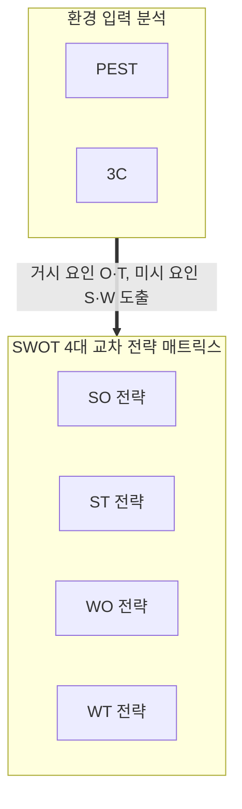
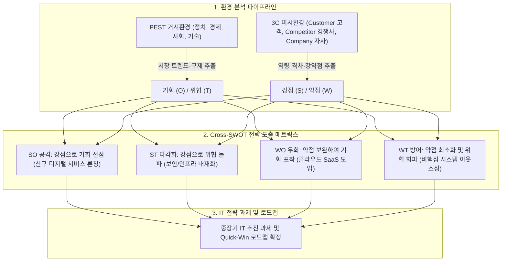

## 지식 로드맵 내 현재 위치
현재 위치: IT 전략·관리 → 경영환경 분석(SWOT·3C·PEST)

## 30초 인출

- 본질: 거시 외생환경( **PEST** )과 미시 경쟁역학( **3C** )을 진단하고, 내부 역량과 외부 요인을 **SWOT** 으로 교차하여 전략대안을 도출하는 분석도구이다.
- 메커니즘: **PEST** 거시 탐색(O/T 도출) → **3C** 미시 검증(S/W 도출) → **SWOT** 매트릭스 교차 → 4대 전략(SO/ST/WO/WT) 수립한다.
- 판정 기준: **PEST** · **3C** 분석 결과가 **SWOT** 요인과 실행 과제로 추적되고 내부·외부 요인이 구분되는지 확인한다.

핵심 용어

- **PEST(Political, Economic, Social, Technological)** : 기업이 통제 불가능한 거시 환경을 4대 축으로 진단하여 외생적 기회와 위협을 식별하는 기법이다.
- **3C(Customer, Competitor, Company)** : 오마에 겐이치가 제시한 고객·경쟁사·자사 간의 3각 상호작용을 통해 미시적 경쟁 우위를 분석하는 모델이다.
- **SWOT(Strengths, Weaknesses, Opportunities, Threats)** : 기업의 내부 역량(강점·약점)과 외부 환경(기회·위협)을 2x2 매트릭스로 결합하는 전략 프레임워크이다.
- **SO 전략** : 내부 강점(S)을 바탕으로 외부 기회(O)를 극대화하는 공격적 확장 전략이다.
- **ST 전략** : 내부 강점(S)을 무기 삼아 외부 위협(T)을 방어하고 차별화를 꾀하는 전략이다.
- **WO 전략** : 외부 기회(O)를 레버리지하여 내부 약점(W)을 개선·보완하는 국면 전환 전략이다.
- **WT 전략** : 외부 위협(T)을 회피하고 내부 약점(W)을 최소화하는 방어·축소·철수 전략이다.
- **AHP(Analytic Hierarchy Process)** : 도출된 전략 과제의 다차원 평가 기준을 계층화하여 우선순위를 정량 산출하는 의사결정 기법이다.

## 예상문제

> PEST·3C·SWOT 분석의 개념과 특성을 비교하고, 세 도구의 연계 절차와 실무 적용 시 고려사항을 설명하시오. **(미출제 예상·25점)**

## Ⅰ. 통합 경영환경 분석 체계의 개요

> 거시 외생 요인( **PEST** )과 미시 경쟁 역학( **3C** )을 정제하여 **SWOT 매트릭스** 로 교차 매핑함으로써 실행 가능한 **4대 교차 전략** 을 도출함.

- 정의: 통제 불가능한 거시 환경( **PEST** )과 시장 내 미시 경쟁 관계( **3C** )를 진단하여, 내부 역량과 외부 환경을 2x2 **SWOT** 매트릭스로 교차하는 **통합 경영환경 분석 프레임워크**
- 목적: 내·외부 전략적 정합성(Strategic Fit) 확보 및 실행 가능한 4대 교차 전략(SO/ST/WO/WT) 도출

## Ⅱ. PEST, 3C, SWOT 핵심 특성 및 비교

> 거시 외생(통제 불가)에서 시장 경쟁(상대적 통제), 종합 전략(실행 통제 가능)으로 분석 단위를 좁혀가는 깔때기 구조를 형성함.

| 비교 항목 | PEST 분석 | 3C 분석 | SWOT 분석 |
|---|---|---|---|
| **분석 범위** | **거시 환경(Macro)** : 정치·경제·사회·기술 외생 변수 | **미시 환경(Micro)** : 고객·경쟁사·자사 3각 역학 | **종합 전략(Synthesis)** : 내부 역량 × 외부 환경 교차 |
| **핵심 산출물** | 거시 변화요인 | 고객 요구·경쟁구도·자사역량 | S/W/O/T 요인·전략대안 |

## Ⅲ. PEST-3C-SWOT 연계 구성체계 및 4대 교차 매트릭스

> 각 분석 도구가 독립적으로 머물지 않고 이전 단계의 산출물이 다음 단계의 입력값으로 정합성을 갖추어야 전략의 모순이 차단됨.

### 1. PEST-3C 입력 파이프라인 및 SWOT 4대 교차 매트릭스

- 연계 절차: PEST 거시 탐색(O/T 도출) → 3C 미시 검증(S/W 도출) → 통제 가능성 기준 SWOT 요인 정제 → 4대 교차 전략 도출 및 AHP 연계

### 2. SWOT 4대 교차 전략 매트릭스

| 교차 전략 | 결합 축 | 전략 방향성 | 실무 IT 전략 적용 사례 |
|---|---|---|---|
| **SO 전략 (공격·성장)** | Strengths × Opportunities | 자사 핵심 강점으로 시장 기회 선점 | 방대한 금융 데이터(S)와 생성형 AI 기술(O)을 결합한 초개인화 자산관리 플랫폼 출시 |
| **ST 전략 (차별화·수비)** | Strengths × Threats | 자사 강점을 방패 삼아 시장 위협 극복 | 금융 라이선스 및 컴플라이언스 신뢰도(S)로 빅테크 핀테크(T)의 금융 시장 잠식 방어 |
| **WO 전략 (국면전환·보완)** | Weaknesses × Opportunities | 외부 기회를 지렛대 삼아 내부 약점 만회 | 공공 클라우드 전환 지원 정책(O)을 활용하여 노후 레거시 코어뱅킹(W) 현대화 추진 |
| **WT 전략 (철수·축소)** | Weaknesses × Threats | 위협을 회피하고 내부 취약점 선제 제거 | 적자 지속 비핵심 IT 서비스(W)를 철수·매각하고 신종 랜섬웨어 위협(T) 대상 보안 투자 집중 |

## Ⅳ. 문제점·대응책

> 작성 주체 분리로 인한 도구 간 단절과 나열식 요약 문제를 극복하기 위해 통제 가능성 기준과 단일 템플릿 검증을 강제해야 함.

| 위험 | 대책 | 효과 |
|---|---|---|
| **도구 간 단절** | 환경요인–근거–SWOT–과제 추적 | 논리적 정합성 확보 |
| **단순 요인 나열** | SO/ST/WO/WT 교차 전략과 실행책임 연결 | 실행 가능성 확보 |
| **내부 약점과 외부 위협 혼동** | **통제 가능성 기준(내부 통제 가능=S/W, 통제 불가=O/T)** 판정 게이트 운영 | 정확한 원인 진단 및 전략 왜곡 차단 |
| **WT(철수) 전략 외면** | 사업 포트폴리오 차원의 Exit Criteria(철수 기준선) 사전 수립 | 자원 낭비 방지 및 생존력 확보 |

## Ⅴ. 근거와 변화시점을 관리하는 기술사적 제언

> 연례 1회성 파워포인트 분석을 탈피하고 외부 데이터 API와 내부 운영 지표를 연계한 동적 전략 레이더를 구축해야 함.

### 실전 답안용 기술사적 제언

- 문제: PEST(거시), 3C(미시), SWOT(전략 도출) 분석이 상호 유기적 연결 없이 개별 보고서에 파편화되어 실행력 있는 IT 전략 수립에 실패함.
- 해결 방안: PEST 거시환경과 3C 미시환경 분석 결과를 SWOT의 외부 기회(O)/위협(T) 및 내부 강점(S)/약점(W)으로 공급하는 파이프라인을 구축하고, Cross-SWOT 4대 매트릭스(SO, ST, WO, WT)를 통해 구체적인 실행 로드맵을 도출함.

## 1교시 10점 답안 발췌

### 1. 정의·목적

- 정의: 거시 외생환경( **PEST** )과 미시 경쟁관계( **3C** )를 진단하여 내·외부 요인을 **SWOT** 매트릭스로 교차함으로써 4대 실행 전략(SO, ST, WO, WT)을 도출하는 **통합 경영환경 분석 프레임워크**
- 목적: 환경 변화 대응 및 내부 역량 결합 통한 지속 가능한 경쟁 우위 확보

### 2. 구성체계 및 방법론

### 3. 핵심 통제

- **통제 가능성 기준** : 내부 통제 가능 요인은 강점/약점(S/W), 외부 통제 불가 요인은 기회/위협(O/T)으로 엄격 분리
- **AHP 연계** : 4대 교차 전략 과제의 다기준 정량 가중치 산출 및 최적 자원 배분

## 출제 이력과 검증 출처

- 참고 문항: 제133회 출제 자료로 알려져 있으나 Q-Net 정보관리 공식 문제지 원문 확인 전까지 직접 기출로 단정하지 않음
- Michael E. Porter, *Competitive Strategy: Techniques for Analyzing Industries and Competitors*
- Kenichi Ohmae, *The Mind of the Strategist*

## 학습 체크

- [ ] Ⅰ·Ⅱ: PEST·3C·SWOT의 분석대상과 산출물을 비교할 수 있는가?
- [ ] Ⅲ: 환경요인 → 경쟁 검증 → SWOT → 교차 전략 흐름을 재현할 수 있는가?
- [ ] Ⅳ: 도구 단절·요인 혼동·단순 나열의 대응책을 설명할 수 있는가?
- [ ] Ⅴ: 요인 근거와 재검토 조건을 관리하는 방안을 제언할 수 있는가?

## 연결 토픽

- 이전 토픽: [소프트웨어 기술자 구분(등급제·IT직무제)](./087_it_job_competency_system.md)
- 연관 토픽: [TAM-SAM-SOM](./089_tam_sam_som.md), [ISP](./003_isp.md)
- 다음 토픽: [TAM-SAM-SOM](./089_tam_sam_som.md)
