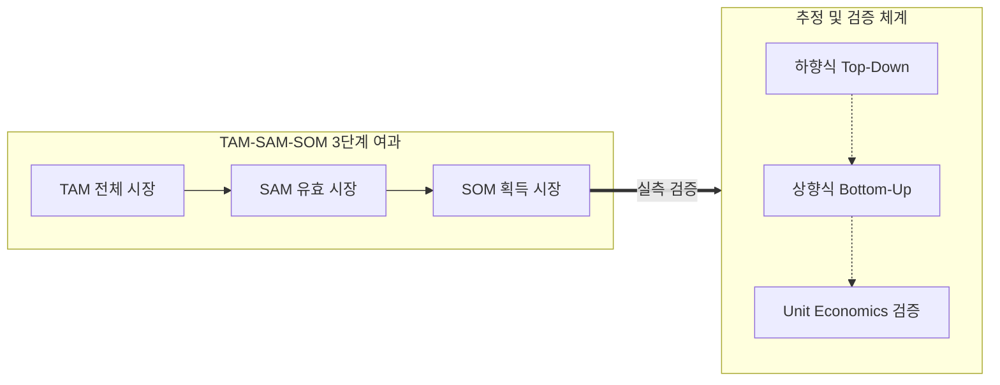
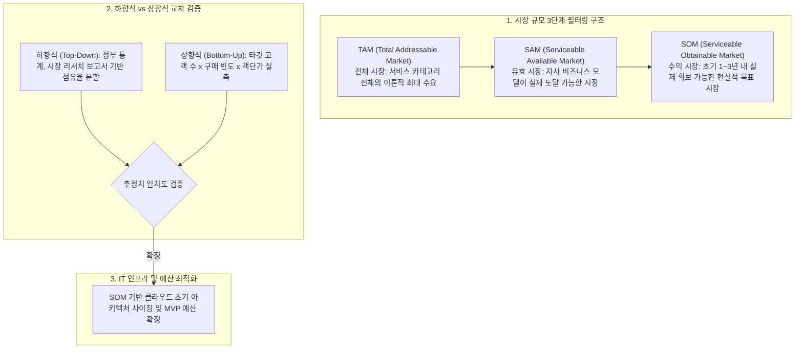

## 지식 로드맵 내 현재 위치
현재 위치: IT 전략·관리 → TAM-SAM-SOM

## 30초 인출

- 본질: TAM·SAM·SOM은 전체 시장에서 실제로 제공하고 점유할 수 있는 시장까지 범위를 좁혀 추정하는 모델이다.
- 메커니즘: 전체 수요 정의( **TAM** ) → 제품·지역·채널 제약 반영( **SAM** ) → 자원·경쟁·영업역량 반영( **SOM** ) → 상향식·하향식 교차검증한다.
- 판정 기준: **TAM** · **SAM** · **SOM** 산정 근거와 고객 단위 수익성 가정을 상향식·하향식으로 교차검증한다.

핵심 용어

- **TAM(Total Addressable Market)** : 제품·서비스가 도달 가능한 전체 시장의 이론적 최대 수요 규모
- **SAM(Serviceable Addressable Market)** : 자사 비즈니스 모델과 타깃 영역 내에서 실제 서비스 가능한 유효 시장
- **SOM(Serviceable Obtainable Market)** : 초기 자원과 영업 역량을 고려하여 현실적으로 점유 가능한 수익 시장
- **ARPU(Average Revenue Per User)** : 고객 또는 가입자당 일정 기간 동안 발생하는 평균 결제 매출액
- **CAC(Customer Acquisition Cost)** : 신규 고객 1인을 확보하기 위해 투입되는 마케팅 및 영업 총비용
- **LTV(Customer Lifetime Value)** : 고객 1인이 거래 기간 동안 기업에 기여할 것으로 기대되는 누적 생애 가치
- **Unit Economics** : 고객 1인당 수익과 비용 구조를 분석하여 수익성을 검증하는 단위 경제성 지표
- **BEP(Break-Even Point)** : 총매출과 총비용이 일치하여 영업이익이 0이 되는 손익분기점

---

## 1교시 예상문제 (10점)

> TAM·SAM·SOM의 범위와 시장 규모 추정 방식을 설명하시오. (예상·10점)

---

## 1교시 10점 답안

### 1. 정의·목적

- 정의: 신규 IT 사업 기획 시 전체 시장( **TAM** ), 서비스 가능 유효 시장( **SAM** ), 조기 실현 가능한 수익 시장( **SOM** )으로 시장 규모를 3단계 동심원으로 여과 추정하는 **사업 타당성 분석 프레임워크**
- 목적: 거대 시장 착시 배제 및 Unit Economics 기반 손익분기점(BEP) 달성

### 2. 구성체계 및 방법론

### 3. 핵심 통제

- **추정 기법 교차 검증** : Top-down(잠재력 파악)과 Bottom-up(실행력 검증)의 상호 역대조
- **단위 경제성 통제** : CAC·LTV·서비스원가·해지율을 함께 검토하여 사업성 확인
- **SOM 산출 수식** : $\text{SOM} = \text{타깃 고객 수} \times \text{ARPU} \times \text{획득률}$

---

## 2~4교시 예상문제 (25점)

> TAM·SAM·SOM의 개념과 추정방법을 설명하고, 시장규모 과대추정을 방지하기 위한 검증방안을 제시하시오. **(미출제 예상·25점)**

---

## 2~4교시 25점 답안

## Ⅰ. 시장 기획의 3단계 여과기, TAM-SAM-SOM의 개요

> 거대 시장의 착시를 걷어내고 **TAM(전체 시장)** 에서 **SAM(유효 시장)** 을 거쳐 **SOM(수익 시장)** 으로 좁혀 단기 실행력을 확보함.

- 정의: 신규 IT 제품 및 디지털 서비스 기획 시 **TAM(Total Addressable Market)** , **SAM(Serviceable Addressable Market)** , **SOM(Serviceable Obtainable Market)** 의 3단계 동심원으로 시장 규모를 단계별 여과 추정하는 **사업 타당성 분석 프레임워크**
- 목적: 시장 경계 명확화 · 과대추정 방지 · 실행 가능한 매출가설 수립

## Ⅱ. TAM-SAM-SOM 3단계 계층 구조 및 추정 체계

> 거시 통계에서 비즈니스 모델 제약, 영업 파이프라인 실측치로 좁혀가는 3단계 계층 파이프라인을 운영함.

### 1. 3단계 시장 여과 구조 및 추정 방식 교차검증

### 2. 3단계 계층 상세 비교

| 계층 | 범위 | 산출 근거 |
|---|---|---|
| **TAM** | 제품군의 전체 잠재 수요 | 산업통계 · 잠재 고객 수 × 지출액 |
| **SAM** | 제품·지역·채널로 서비스 가능한 수요 | 타깃 고객 수 × 적용 가능한 단가 |
| **SOM** | 경쟁·자원 조건에서 획득 가능한 수요 | 영업 파이프라인 · 전환근거 · 단가 |

## Ⅲ. 하향식(Top-down) vs 상향식(Bottom-up) 추정 방법 비교

> 하향식으로 잠재 성장 한계선을 설정하고 상향식으로 즉시 실행 가능한 고객 단가를 도출해 교차 검증해야 함.

| 기준 | 하향식(Top-down) | 상향식(Bottom-up) |
|---|---|---|
| **입력** | 산업통계 · 시장보고서 | 고객 수 · 단가 · 전환근거 |
| **활용** | TAM·SAM의 잠재 범위 추정 | SOM의 실행 가능성 추정 |
| **한계** | 실제 획득역량 과대평가 | 초기 표본으로 시장 과소평가 |
| **보완** | 상향식 결과와 점유율 역검증 | 하향식 시장 경계와 교차검증 |

## Ⅳ. 문제점·대응책

> 단순 비율 곱셈을 금지하고 경쟁사 전환 장벽과 고객 획득 비용을 반영한 실증 모델을 구축해야 함.

| 위험 | 대책 | 효과 |
|---|---|---|
| **TAM 착시·부풀리기** | 제품·지역·채널 제약으로 SAM·SOM 범위 재산정 | 현실적 사업 목표 수립 |
| **고객 획득 비용 과소평가** | CAC·서비스원가·해지율을 함께 검토 | 수익성 왜곡 방지 |
| **정적 추정** | 실제 영업·전환 데이터를 반영해 주기적 갱신 | 예측 정확도 향상 |

## Ⅴ. 근거 기반 시장규모 검증을 위한 기술사적 제언

> SOM은 TAM의 임의 비율이 아니라 고객 목록·단가·채널·전환근거로 설명할 수 있어야 함.

### 실전 답안용 기술사적 제언

- 문제: 시장 규모 추정 시 객관적 필터링 없이 막연한 상향식 추정에만 의존하여 과잉 IT 인프라 투자 및 사업 조기 부실화를 초래함.
- 해결 방안: 전체 시장(TAM)에서 유효 시장(SAM)과 초기 실제 획득 가능 시장(SOM)으로 이어지는 3단계 깔때기 구조를 적용하고, 하향식(거시 통계)과 상향식(타깃 고객 x 단가) 추정을 교차 검증하여 적정 IT 투자 규모를 산정함.

## 출제 이력과 검증 출처

- 참고 문항: 제134회 출제 자료로 알려져 있으나 Q-Net 정보관리 공식 문제지 원문 확인 전까지 직접 기출로 단정하지 않음
- Steve Blank & Bob Dorf, *The Startup Owner's Manual*

## 연결 토픽

- 이전 토픽: [경영환경 분석(SWOT·3C·PEST)](./088_swot_3c_pest.md)
- 연관 토픽: [기술수용모델(TAM)](./092_technology_acceptance_model.md), [SW 비용 산정](./113_software_cost_estimation.md)
- 다음 토픽: [과업심의(과업변경·사업기간 적정성)](./091_public_sw_cost_and_scope_change_criteria.md)
