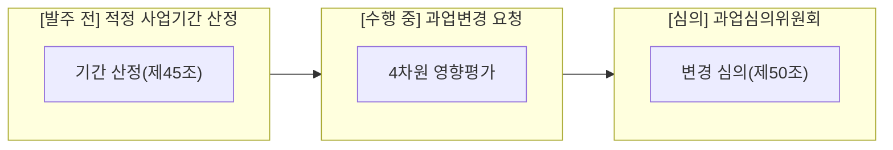
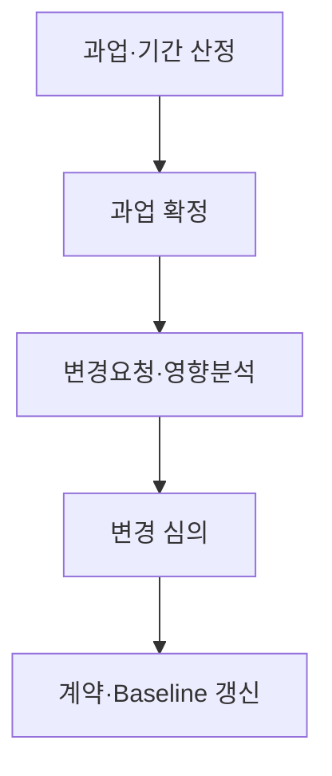
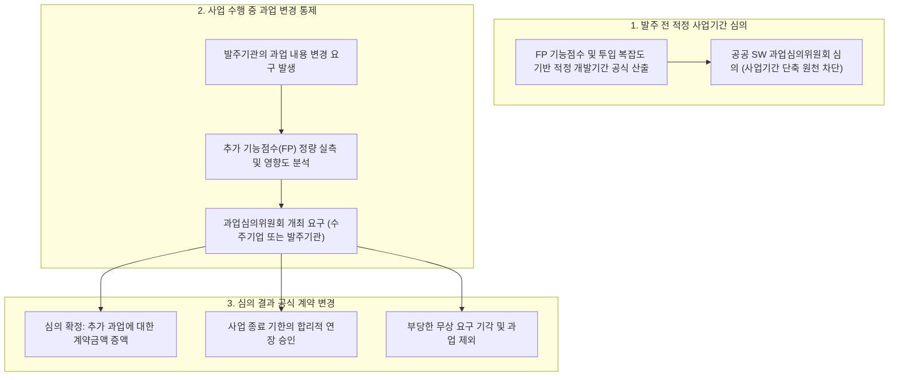

## 지식 로드맵 내 현재 위치

현재 위치: IT 전략·관리 → **적정 사업기간** · **과업심의**

## 30초 인출

- 본질: 적정 사업기간·과업심의는 공공 SW 사업의 무리한 납기와 무상 과업 추가를 막기 위한 기간 산정·변경 심의 제도다.
- 메커니즘: **FP** /유사통계 기반 기간 산정 → 발주 전 과업 확정 → 수행 중 변경요청 시 4차원 영향평가 → **과업심의** 위 심의 → 계약/ **Baseline** 갱신한다.
- 판정 기준: 소프트웨어진흥법 제45조/50조 부합성, 4차원(범위·비용·일정·품질) 영향분석 타당성 및 계약금액·공기 조정 여부를 확인한다.

핵심 용어

- **SW(Software)** : 발주 요구사항을 구현하여 공공 업무를 처리하는 소프트웨어 최종 인도물
- **FP(Function Point)** : 사용자 관점의 논리적 기능 규모를 정량 측정하는 기능점수 단위
- **RTM(Requirements Traceability Matrix)** : 요구사항과 설계·구현·테스트 산출물 간 대응 관계를 추적하는 관리 표
- **Baseline** : 공식 승인을 거쳐 변경통제의 기준점이 되는 범위·일정·원가 기준선
- **과업심의위원회** : 공공 SW 사업의 과업 확정·변경과 계약금액·사업기간 조정을 심의·의결하는 법정 기구

---

## 1교시 예상문제 (10점)

> 공공 SW 사업의 적정 사업기간과 과업심의 통제를 설명하시오. (예상·10점)

---

## 1교시 10점 답안

### 1. 정의·목적

- 정의: 공공 SW 사업의 품질 확보와 수주기업 권익 보호를 위해 발주 전 적정 사업기간을 사전 심의하고, 수행 중 과업 변경 발생 시 타당성을 심의하여 계약금액과 기간을 조정하는 법정 거버넌스 제도
- 목적: 비현실적 단기 개발로 인한 SW 품질 부실 방지 · 부당한 무상 과업 추가 관행 근절 · 공정한 공공 SW 계약 생태계 확립

- **정의** : 공공 SW 사업의 수행기간을 산정하고 과업 확정·변경과 계약 조정을 심의하는 제도.
- **목적** : 무리한 일정·무상 과업 확대·계약 분쟁 예방.

### 2. 구성체계 및 거버넌스

### 3. 핵심 통제

- **발주 전 통제** : **적정 사업기간** 산정(소프트웨어진흥법 제45조) 통한 공기 확보.
- **수행 중 통제** : **과업심의** 위원회(소프트웨어진흥법 제50조) 심의 통한 무상 추가 방지.
- **사후 통제** : 심의 의결 후 변경 계약 체결 및 WBS, RTM 베이스라인 동기화.

---

## 2~4교시 예상문제 (25점)

> **(미출제 예상·25점)** 공공 SW 사업의 **적정 사업기간** 산정과 **과업심의** 제도를 설명하고, 수행 중 과업 변경을 통제하는 방안을 제시하시오.

---

## 2~4교시 25점 답안

## Ⅰ. 적정 사업기간·과업심의 개요

| 구분 | 핵심 |
|---|---|
| 정의 | 공공 SW 사업의 **적정 사업기간** 을 산정하고 **과업심의** 와 계약 조정을 수행하는 **변경통제** 제도 |
| 목적 | 무리한 일정·무상 **과업** 확대·계약 분쟁 예방 |

## Ⅱ. 과업 확정·변경 통제 절차 및 거버넌스 메커니즘

> 발주 전 기간 산정부터 수행 중 변경 심의, 법적 계약 및 베이스라인 갱신으로 이어지는 전주기 통제를 구축함.

### 1. 적정 사업기간 산정 및 과업심의 거버넌스 구조도

### 2. 과업 확정·변경 통제 파이프라인

- 활동: 요구사항·FP·유사사업 통계 검토 → 범위·산출물·검수기준 확정 → 범위·비용·일정·품질 영향평가 → 승인·조건부·불가 판정 → 변경계약 체결 및 WBS·RTM 동기화
- 산출: 과업내용서·사업기간 산정서 → 확정 과업 → 영향평가서 → 심의 의결서 → 변경계약· **Baseline**

## Ⅲ. 적정 사업기간과 과업심의 비교

> **적정 사업기간** 은 발주 전 일정의 현실성을, **과업심의** 는 과업과 계약 변경의 정당성을 통제함.

| 구분 | **적정 사업기간** | **과업심의** |
|---|---|---|
| 근거 | 소프트웨어진흥법 제45조 | 소프트웨어진흥법 제50조 |
| 시점 | 발주·계약 전 | 과업 확정·변경 시 |
| 판단 | 과업 대비 수행기간 적정성 | 과업·금액·기간 조정 필요성 |
| 산출 | 사업기간 산정서 | 심의 결과·조치계획 |

:::note[시행시점 확인]
2026년 9월 현재 시행 조문과 2027년 2월 12일 시행 예정 개정 조문을 구분해야 함.
:::

## Ⅳ. 과업 변경 영향분석

> 변경 여부보다 변경이 범위·비용·일정·품질에 미치는 영향을 함께 판단하는 것이 핵심임.

| 영향축 | 확인 항목 | 반영 대상 |
|---|---|---|
| 범위 | 요구사항·산출물·검수기준 | 과업내용서·RTM |
| 규모·비용 | 기능 규모·인프라·운영비 | 산정서·계약금액 |
| 일정 | 선후행 작업·임계경로·인력 | 일정 **Baseline** |
| 품질·위험 | 시험 범위·보안·운영 영향 | 품질계획·위험등록부 |

과업을 임의로 경미·중대로 나누거나 FP 증감만으로 유상·무상을 단정하지 않고, 계약조건과 관련 법령에 따라 종합 판단함.

## Ⅴ. 문제점·대응책

> 과업 변경을 문서·심의·계약으로 연결하지 않으면 수행 현장의 합의가 분쟁으로 전환됨.

| 위험 | 대책 | 효과 |
|---|---|---|
| 구두 변경 | 변경요청 서면화 | 책임·근거 확보 |
| 영향 누락 | 범위·비용·일정·품질 통합 분석 | 연쇄 영향 조기 식별 |
| 심의 후 미반영 | 계약· **Baseline** ·RTM 동시 갱신 | 승인 내용과 수행 일치 |
| 시행시점 혼동 | 현행·시행 예정 조문 분리 확인 | 법적용 오류 예방 |

## Ⅵ. 계약 Baseline과 직결되는 기술사적 제언

> **과업심의** 의 성패는 단순 회의 개최가 아니라, 심의 결과가 법적 효력을 갖는 변경 계약 체결과 WBS/RTM 베이스라인 갱신으로 이어지는가에 달려 있음.

### 실전 답안용 기술사적 제언

- 문제: 공공 SW 사업에서 발주자의 부당한 무상 과업 추가 강요와 비현실적 사업 기간 책정으로 인해 SW 결함 급증 및 납기 지연이 만연함.
- 해결 방안: 소프트웨어 진흥법에 따라 발주 전 적정 사업기간 산정 산식을 의무 적용하고, 사업 수행 중 과업 변경 발생 시 공공 SW 과업심의위원회를 의무 개최하여 증분 기능점수에 대한 정당한 계약금액 및 납기 연장을 공식 집행함.

## 출제 이력과 검증 출처

- 공식 문제지 원문 확인 전까지 직접 기출로 단정하지 않음
- [국가법령정보센터, 소프트웨어진흥법](https://www.law.go.kr/LSW/lsInfoP.do?lsId=000751)
- [국가법령정보센터, 소프트웨어진흥법 시행령](https://www.law.go.kr/LSW/lsInfoP.do?lsId=003989)
- [국가법령정보센터, 소프트웨어사업 계약 및 관리감독에 관한 지침](https://www.law.go.kr/LSW/admRulLsInfoP.do?admRulSeq=2100000223356&chrClsCd=)
- [국가법령정보센터, 행정기관 및 공공기관 정보시스템 구축·운영 지침](https://www.law.go.kr/LSW/admRulLsInfoP.do?admRulId=33489&efYd=0)

## 연결 토픽

- 이전 토픽: [TAM-SAM-SOM](./089_tam_sam_som.md)
- 연관 토픽: [ISMP](./001_ismp.md), [공공 SW 계약](./039_public_sw_contract.md), [SW 비용 산정](./113_software_cost_estimation.md)
- 다음 토픽: [기술수용모델(TAM)](./092_technology_acceptance_model.md)
