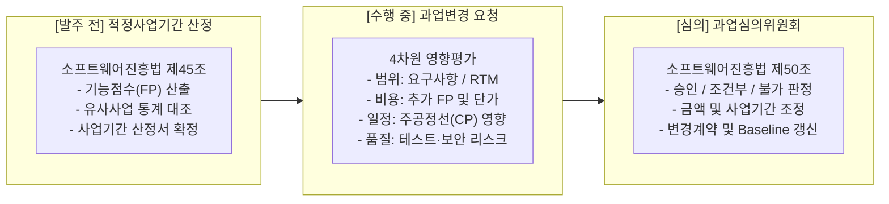
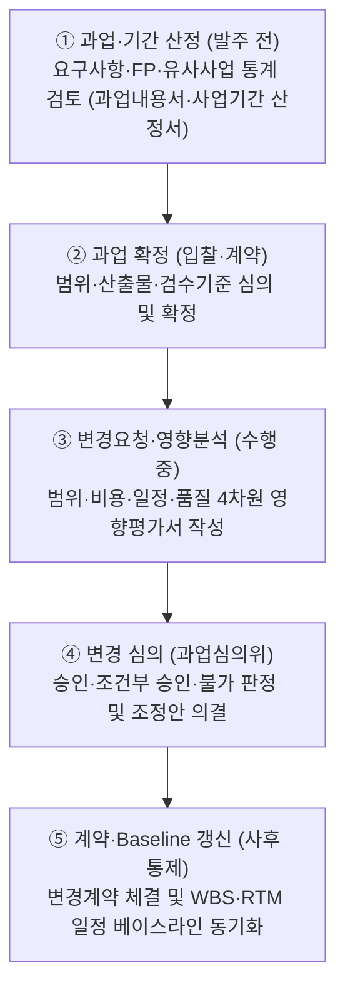
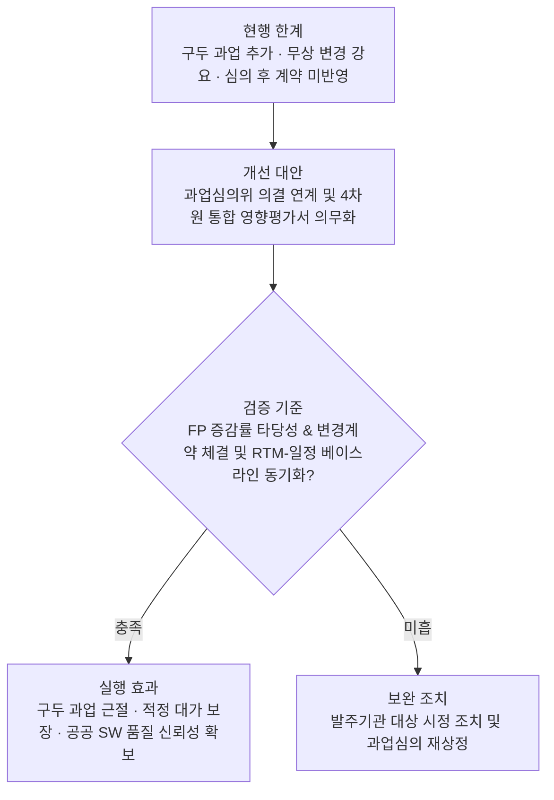

## 지식 로드맵 내 현재 위치

## 30초 인출

- 본질: 무리한 납기 방지를 위한 발주 전 '적정 사업기간' 산정과 수행 중 무상 과업 추가 방지를 위한 '과업심의' 통제 제도
- 메커니즘: FP/유사통계 기반 기간 산정 → 발주 전 과업 확정 → 수행 중 변경요청 시 4차원 영향평가 → 과업심의위 심의 → 계약/Baseline 갱신
- 판정 기준: 소프트웨어진흥법 제45조/50조 부합성, 4차원(범위·비용·일정·품질) 영향분석 타당성 및 계약금액·공기 조정 여부

약어·전문용어

- **SW(Software)**: 소프트웨어
- **FP(Function Point)**: 사용자 관점의 기능 규모 측정 단위
- **RTM(Requirements Traceability Matrix)**: 요구사항과 설계·구현·시험·계약 산출물의 추적표
- **Baseline**: 승인 후 변경통제 대상이 되는 기준 상태
- **과업심의위원회**: 공공 SW 사업의 과업 확정·변경 등을 심의하는 위원회

## 예상문제

> **(미출제 예상·25점)** 공공 SW 사업의 적정 사업기간 산정과 과업심의 제도를 설명하고, 수행 중 과업 변경을 통제하는 방안을 제시하시오.

## Ⅰ. 적정 사업기간·과업심의 개요

> 발주 전에는 **적정 사업기간**을 계약에 반영하고, 수행 중에는 **과업심의위원회**를 통해 범위 변경과 계약 영향을 통제함.

- **정의**: 공공 SW 사업의 수행기간을 합리적으로 산정하고, 과업 확정·변경과 계약 조정을 심의하는 제도
- **목적**: 무리한 일정·무상 과업 확대·계약 분쟁 예방

## Ⅱ. 과업 확정·변경 통제 절차 및 거버넌스 메커니즘

> 발주 전 기간 산정부터 수행 중 변경 심의, 법적 계약 및 베이스라인 갱신으로 이어지는 전주기 통제를 구축함.

### 1. 적정 사업기간 산정 및 과업심의 거버넌스 구조도

### 2. 과업 확정·변경 통제 파이프라인

## Ⅲ. 적정 사업기간과 과업심의 비교

> 적정 사업기간은 발주 전 일정의 현실성을, 과업심의는 과업과 계약 변경의 정당성을 통제함.

| 구분 | 적정 사업기간 | 과업심의 |
|---|---|---|
| 근거 | 소프트웨어진흥법 제45조 | 소프트웨어진흥법 제50조 |
| 시점 | 발주·계약 전 | 과업 확정·변경 시 |
| 판단 | 과업 대비 수행기간 적정성 | 과업·금액·기간 조정 필요성 |
| 산출 | 사업기간 산정서 | 심의 결과·조치계획 |

:::note[시행시점 확인]
2026년 9월 현재 시행 조문과 2027년 2월 12일 시행 예정 개정 조문을 구분해야 함.
:::

## Ⅳ. 과업 변경 영향분석

> 변경 여부보다 변경이 범위·비용·일정·품질에 미치는 영향을 함께 판단하는 것이 핵심임.

| 영향축 | 확인 항목 | 반영 대상 |
|---|---|---|
| 범위 | 요구사항·산출물·검수기준 | 과업내용서·RTM |
| 규모·비용 | 기능 규모·인프라·운영비 | 산정서·계약금액 |
| 일정 | 선후행 작업·임계경로·인력 | 일정 Baseline |
| 품질·위험 | 시험 범위·보안·운영 영향 | 품질계획·위험등록부 |

과업을 임의로 경미·중대로 나누거나 FP 증감만으로 유상·무상을 단정하지 않고, 계약조건과 관련 법령에 따라 종합 판단함.

## Ⅴ. 문제점·대응책

> 과업 변경을 문서·심의·계약으로 연결하지 않으면 수행 현장의 합의가 분쟁으로 전환됨.

| 위험 | 대책 | 효과 |
|---|---|---|
| 구두 변경 | 변경요청 서면화 | 책임·근거 확보 |
| 영향 누락 | 범위·비용·일정·품질 통합 분석 | 연쇄 영향 조기 식별 |
| 심의 후 미반영 | 계약·Baseline·RTM 동시 갱신 | 승인 내용과 수행 일치 |
| 시행시점 혼동 | 현행·시행 예정 조문 분리 확인 | 법적용 오류 예방 |

## Ⅵ. 계약 Baseline과 직결되는 기술사적 제언

> 과업심의의 성패는 단순 회의 개최가 아니라, 심의 결과가 법적 효력을 갖는 변경 계약 체결과 WBS/RTM 베이스라인 갱신으로 이어지는가에 달려 있음.

### 학습자 통찰 메모 — 답안 밖

- [핵심 통찰]: 과업심의위원회 의결서는 권고사항이 아닌 행정 처분적 성격을 가짐. 발주자의 구두 요구에 따른 무상 과업 확대를 원천 차단하고 정당한 대가(FP)와 기간 연장을 관철하는 법적 보호막임.
- 나라면: 변경요청서 접수 즉시 범위·비용·일정·품질 4차원 영향평가서를 첨부하고, 심의 의결 즉시 변경계약서 체결 및 RTM-일정 베이스라인을 동기화하겠음.

### 실전 답안용 기술사적 제언

- **판정 기준**: 과업 변경 규모(FP 증감률), 적정 사업기간 산정 기준 부합성 및 계약금액·공기 조정 필요성 판정
- **대응 방안**: 소프트웨어진흥법 제50조 기반 과업심의위원회 가동, 4차원(범위·비용·일정·품질) 통합 영향분석 실시
- **검증 체계**: 심의 의결서와 변경 계약서 간 추적성 검증, RTM(요구사항추적표) 및 WBS 일정 베이스라인 동시 갱신
- **기대 효과**: 구두 과업 추가 근절, 수주 기업의 적정 이윤 및 개발자 야근 예방, 공공 SW 품질 신뢰성 확보

## 1교시 10점 답안 발췌

### 1. 정의·목적

- **정의**: 공공 SW 사업의 수행기간을 산정하고 과업 확정·변경과 계약 조정을 심의하는 제도
- **목적**: 무리한 일정·무상 과업 확대·계약 분쟁 예방

### 2. 구성체계 및 거버넌스

### 3. 핵심 통제

- **발주 전 통제**: 적정 사업기간 산정(소프트웨어진흥법 제45조) 통한 공기 확보
- **수행 중 통제**: 과업심의위원회(소프트웨어진흥법 제50조) 심의 통한 무상 추가 방지
- **사후 통제**: 심의 의결 후 변경 계약 체결 및 WBS, RTM 베이스라인 동기화

## 출제 이력과 검증 출처

- 공식 문제지 원문 확인 전까지 직접 기출로 단정하지 않음
- [국가법령정보센터, 소프트웨어진흥법](https://www.law.go.kr/LSW/lsInfoP.do?lsId=000751)
- [국가법령정보센터, 소프트웨어진흥법 시행령](https://www.law.go.kr/LSW/lsInfoP.do?lsId=003989)
- [국가법령정보센터, 소프트웨어사업 계약 및 관리감독에 관한 지침](https://www.law.go.kr/LSW/admRulLsInfoP.do?admRulSeq=2100000223356&chrClsCd=)
- [국가법령정보센터, 행정기관 및 공공기관 정보시스템 구축·운영 지침](https://www.law.go.kr/LSW/admRulLsInfoP.do?admRulId=33489&efYd=0)

## 학습 체크

- [ ] Ⅰ: 적정 사업기간과 과업심의의 목적을 설명할 수 있는가?
- [ ] Ⅱ: 과업 확정·변경 5단계의 활동과 산출을 연결할 수 있는가?
- [ ] Ⅲ: 두 제도의 시점·판단·산출 차이를 비교할 수 있는가?
- [ ] Ⅳ: 변경 영향을 범위·비용·일정·품질로 분석할 수 있는가?
- [ ] Ⅴ: 과업 변경 위험에 대한 대책·효과를 제시할 수 있는가?
- [ ] Ⅵ: 심의 결과를 계약 Baseline까지 연결하는 통제안을 제시할 수 있는가?

## 연결 토픽

- 이전 토픽: [TAM-SAM-SOM](./089_tam_sam_som.md)
- 연관 토픽: [ISMP](./001_ismp.md), [공공 SW 계약](./039_public_sw_contract.md), [SW 비용 산정](./113_software_cost_estimation.md)
- 다음 토픽: [기술수용모델(TAM)](./092_technology_acceptance_model.md)
