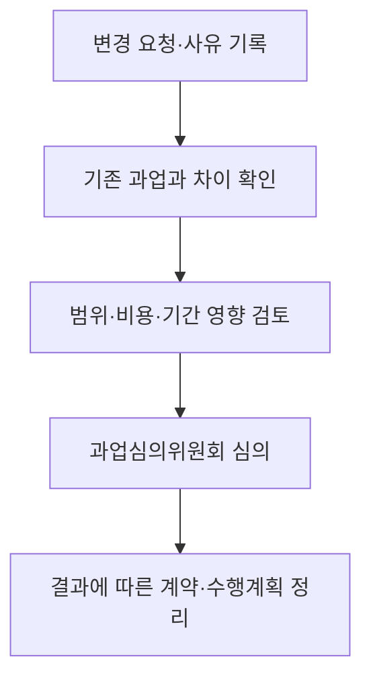

## 지식 로드맵 내 현재 위치

지식 위치: IT 전략·관리 → 공공 SW 사업 관리 → **적정 사업기간·과업심의**

## 30초 인출

- 본질: 발주 전에 수행 가능한 사업기간을 정하고, 과업 확정·변경은 과업심의위원회에서 심의한다.
- 메커니즘: 기간 산정·계약 반영 → 과업 확정 → 변경 필요 시 심의 → 심의 결과와 계약 조건 반영.

핵심 용어

- **적정 사업기간·과업심의** : 공공 소프트웨어사업의 수행기간을 산정하고 과업 확정·변경을 심의하는 제도다.
- **적정 사업기간** : 사업 수행에 필요한 기간을 정해 계약에 반영한 기간이다.
- **과업심의위원회** : 공공 소프트웨어사업의 과업 확정·변경과 관련 사항을 심의하는 법정 위원회다.
- **과업 변경** : 확정한 과업의 내용이나 범위를 바꾸는 것이다.
- **기준선(Baseline)** : 변경 여부를 판단할 때 기준이 되는 승인된 범위·일정·비용이다.
- **WBS(Work Breakdown Structure)** : 인도물을 중심으로 프로젝트 전체 작업을 분해한 구조다.
- **RTM(Requirements Traceability Matrix)** : 요구사항이 설계·구현·시험에 반영됐는지 추적하는 표다.

---

## 1교시 예상문제 (10점)

> 공공 소프트웨어사업의 적정 사업기간 산정과 과업심의의 역할을 설명하시오. (예상·10점)

---

## 1교시 10점 답안

### Ⅰ. 적정 사업기간·과업심의 개요

| 구분 | 핵심 |
|---|---|
| 정의 | **적정 사업기간·과업심의** 는 공공 소프트웨어사업의 수행기간을 산정하고 과업 확정·변경을 심의하는 제도다. |
| 목적 | 실현 가능한 일정과 명확한 과업 범위를 정해 무리한 납기와 계약 분쟁을 줄인다. |

### Ⅱ. 두 제도의 역할

| 구분 | 적정 사업기간 | 과업심의 |
|---|---|---|
| 법적 근거 | 소프트웨어 진흥법 제45조 | 같은 법 제50조 |
| 핵심 판단 | 수행에 필요한 기간과 계약 반영 | 과업 확정·변경, 변경에 따른 조정 사항 |
| 시점 | 사업 추진·계약 단계 | 최초 과업 확정 및 변경 필요 시 |

### Ⅲ. 과업 변경 시 관리

| 확인 | 후속 조치 |
|---|---|
| 변경 전·후 범위, 비용, 일정의 영향 | 과업심의 결과와 계약 조건을 확인하고 승인된 **기준선** 갱신 |

**제언:** 과업 변경을 구두 지시로 처리하지 말고 변경 내용과 심의 결과를 계약·수행 문서에 남긴다.

---

## 2~4교시 예상문제 (25점)

> 공공 소프트웨어사업의 적정 사업기간 산정과 과업심의 제도를 설명하고, 과업 변경 시 범위·기간·비용의 통제 방안을 제시하시오. (예상·25점)

---

## 2~4교시 25점 답안

## Ⅰ. 적정 사업기간·과업심의 개요

| 구분 | 핵심 |
|---|---|
| 정의 | **적정 사업기간·과업심의** 는 공공 소프트웨어사업의 수행기간을 산정하고 과업 확정·변경을 심의하는 제도다. |
| 목적 | 실현 가능한 일정과 명확한 과업 범위를 정해 무리한 납기와 계약 분쟁을 줄인다. |

## Ⅱ. 법적 역할과 판단 대상

| 구분 | 적정 사업기간 | 과업심의 |
|---|---|---|
| 법적 근거 | 소프트웨어 진흥법 제45조 | 같은 법 제50조 |
| 핵심 판단 | 수행에 필요한 기간과 계약 반영 | 과업 확정·변경, 변경에 따른 조정 사항 |
| 시점 | 사업 추진·계약 단계 | 최초 과업 확정 및 변경 필요 시 |

제45조는 사업기간 산정과 계약 반영을 요구한다. 제50조는 과업 확정·변경 및 변경에 따른 계약금액·사업기간 조정 사항을 심의 대상으로 정한다. **기간 산정**과 **과업심의**는 각각 다른 판단을 맡으며, 과업 변경이 있을 때 다시 연결된다.

## Ⅲ. 과업 변경 처리 절차

사업자는 과업내용 변경에 따른 계약내용 변경이 필요할 때 위원회 개최를 요청할 수 있다. 심의만으로 계약금액이나 기간이 자동 변경되는 것은 아니므로, 결과에 따른 계약 절차를 별도로 확인한다.

## Ⅳ. 영향 분석과 기준선 관리

| 확인 영역 | 판단할 증거 | 반영 문서 |
|---|---|---|
| 범위 | 변경 요구사항·인도물·수락기준 | 과업내용서·**RTM** |
| 비용 | 추가·삭제 작업량과 산정 근거 | 비용 산정서·계약 |
| 일정 | 선후행 작업·시험 기간·인력 투입 | 일정표·**WBS** |
| 품질 | 시험 범위·운영 전환 영향 | 시험계획·수락기준 |

변경 전후를 비교할 때 **기준선**을 사용한다. 기능점수 등 한 가지 수치만으로 금액·기간의 자동 증감을 단정하지 않고 계약 조건과 실제 영향 근거를 함께 확인한다.

## Ⅴ. 기술사적 제언 — 변경 이력의 추적 가능성

| 기록할 연결 | 남길 근거 | 확인 시점 |
|---|---|---|
| 요구 → 판단 | 변경 요청·영향 분석·심의 결과 | 심의 직후 |
| 판단 → 계약 | 결정된 범위·금액·기간과 계약 반영 여부 | 계약 변경 시 |
| 계약 → 검수 | 갱신한 요구사항·작업·시험·수락기준 | 중간 점검·검수 시 |

과업 변경 건마다 위 세 연결을 한 묶음으로 남기면, 이후 검수에서 어떤 결정이 어떤 인도물에 반영됐는지 확인할 수 있다.

## 출제 이력과 검증 출처

- 공식 문제지로 확인한 직접 기출 없음. 위 문항은 예상문제다.
- [국가법령정보센터, 소프트웨어 진흥법 제45조](https://law.go.kr/LSW/lsLinkCommonInfo.do?lsJoLnkSeq=1027884467)
- [국가법령정보센터, 소프트웨어 진흥법 제50조](https://www.law.go.kr/lsLinkCommonInfo.do?lsJoLnkSeq=1031614471)
- [국가법령정보센터, 소프트웨어사업 계약 및 관리감독에 관한 지침](https://www.law.go.kr/LSW/admRulLsInfoP.do?admRulSeq=2100000223356)

## 연결 토픽

- 연계: [공공 SW 계약](./039_public_sw_contract.md), [SW 비용 산정](./113_software_cost_estimation.md)
