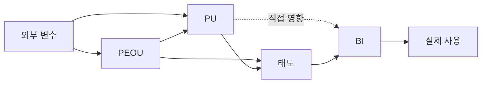
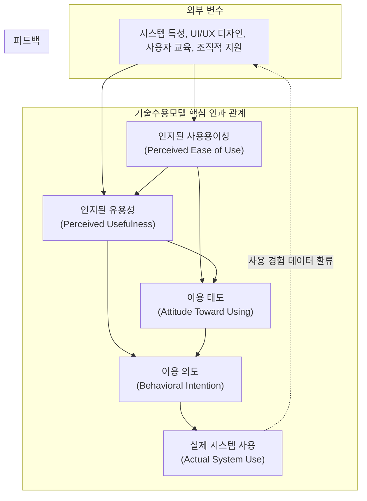

## 지식 로드맵 내 현재 위치
현재 위치: IT 전략·관리 → 기술수용모델(**TAM**)

## 30초 인출

- 본질: 사용자가 기술을 유용하고 쉽게 느끼는지(**PU**·**PEOU**)가 수용 태도와 사용 의도(**BI**)를 형성해 실제 사용을 결정한다는 모델이다.
- 메커니즘: 외부 변수가 **PEOU**와 **PU**에 영향을 주고, 두 신념이 태도·이용의도를 거쳐 실제 사용으로 이어지는 인과관계를 설명한다.
- 판정 기준: **PU**·**PEOU** 지수, 시스템 사용 로그(접속률·기능도달률) 및 업무 KPI 달성도의 삼각 검증(Triangulation) 통과 여부를 확인한다.

핵심 용어

- **TAM(Technology Acceptance Model)**: 지각된 유용성과 사용 용이성이 태도·사용 의도·실제 사용에 미치는 관계로 기술 수용을 설명하는 모델이다.
- **PU(Perceived Usefulness)**: 해당 기술을 사용하면 직무 성과가 높아진다고 사용자가 믿는 정도이다.
- **PEOU(Perceived Ease of Use)**: 해당 기술을 배우고 사용하는 데 큰 노력이 들지 않는다고 사용자가 믿는 정도이다.
- **BI(Behavioral Intention)**: 기술을 사용하려는 행동 의도이다.
- **UTAUT(Unified Theory of Acceptance and Use of Technology)**: 성과기대·노력기대·사회적 영향·촉진조건을 통합한 수용 모델이다.

## 예상문제

> **(미출제 예상·25점)** 기술수용모델의 개념과 인과구조를 설명하고, 한계와 조직의 신기술 수용 촉진방안을 제시하시오.

## Ⅰ. **TAM** 개요

- 정의: **정보기술 수용**을 **PU**와 **PEOU** 중심의 신념·태도·의도·사용 관계로 설명하는 모델
- 목적: 사용자 수용 저해요인 진단·실제 사용 촉진

## Ⅱ. **TAM** 인과구조 및 변화관리 매핑

> **PEOU**는 직접 경로뿐 아니라 **PU**를 높이는 경로로도 수용 의도에 영향을 줌.

### 1. **TAM** 상세 인과 메커니즘 및 피드백 루프

### 2. 인과단계별 분석 및 개선방안

| 단계 | 분석 | 개선 |
|---|---|---|
| 외부 변수 | 시스템 품질·교육·지원 | UX·성능·지원체계 |
| **PEOU** | 학습·조작 부담 | 절차 단순화·온보딩 |
| **PU** | 업무 성과 기여 | 업무 연계·성과 가시화 |
| 태도·BI | 선호·사용 의도 | 파일럿·사용자 참여 |
| 실제 사용 | 빈도·기능·지속성 | 로그·인터뷰 기반 개선 |

:::note[모델 해석]
원형 **TAM**은 태도를 포함하며, 후속 연구·실무 모형은 **PU**에서 BI로 가는 직접 경로를 강조하거나 태도를 생략하기도 함. 답안에서는 적용한 경로를 명확히 표시함.
:::

## Ⅲ. **TAM** vs UTAUT 비교

> **TAM**은 핵심 신념을 간결하게 진단하고, UTAUT는 조직·사회적 조건까지 넓혀 설명함.

| 기준 | **TAM** | UTAUT |
|---|---|---|
| 중심 | **PU**·**PEOU** | 성과기대·노력기대·사회적 영향·촉진조건 |
| 강점 | 간결한 인과구조 | 조직 맥락·조절요인 반영 |
| 적용 | 초기 수용성 진단 | 전사 확산·정착 분석 |

## Ⅳ. 문제점·대응책

> 설문 의도만 측정하면 실제 사용과 업무성과를 과대평가할 수 있음.

| 위험 | 대책 | 효과 |
|---|---|---|
| 자기보고 편향 | 설문·사용 로그 교차검증 | 의도와 행동 구분 |
| 조직 맥락 누락 | 사회적 영향·지원조건 보완 | 현장 설명력 강화 |
| 단기 수용만 측정 | 도입 전·후 반복 측정 | 수용 변화 추적 |
| 사용량을 성과로 오인 | 업무 KPI·품질과 연계 | 가치 실현 검증 |

## Ⅴ. 다차원 수용성 검증을 위한 기술사적 제언

> 사용 빈도는 수용의 결과일 뿐 가치의 증거가 아님. **PU**·**PEOU** 개선이 업무성과로 이어지는지 함께 검증해야 함.

### 실전 답안용 기술사적 제언

- 문제: 수백억 원을 투입한 신규 시스템이 사용자 저항(User Resistance)에 부딪혀 실제 사용되지 않고 방치되는 실패가 반복됨.
- 해결 방안: 데이비스(Davis)의 기술수용모델(TAM)에 따라 인지된 유용성(PU)과 인지된 사용용이성(PEOU)을 설계 핵심 지표로 설정하고, 사용자 중심 UI/UX 디자인, 프로토타입 기반 반복 검증 및 체계적 변화관리를 결합함.

## 1교시 10점 답안 발췌

### 1. 정의·목적

- 정의: 새로운 정보기술이 사용자에게 수용되고 실제 활용되기까지의 심리적 의사결정 과정을 인지된 유용성(PU)과 인지된 사용용이성(PEOU)을 중심으로 설명하는 행동과학 모델
- 목적: 신규 정보시스템에 대한 사용자 저항 요인 규명 · 사용성 극대화 UI/UX 설계 · 신기술의 조직 내 성공적 정착 및 활용률 제고

- **정의**: 정보기술 수용을 인지된 유용성(**PU**)과 인지된 용이성(**PEOU**) 중심의 신념·태도·의도·사용 인과관계로 설명하는 **행동과학 기반 기술수용 프레임워크**.
- **목적**: 신기술 도입 저해요인 조기 식별 및 변화관리를 통한 전사 정착(Shelfware 방지).

### 2. 인과구조 및 구성체계

### 3. 핵심 요소 및 실무 통제

| 요소 | 의미 | 실무 통제 방안 |
|---|---|---|
| **PU** | 업무 성과에 도움이 되는가 | 핵심 KPI 연동 및 성과 가시화 |
| **PEOU** | 쉽게 배워 사용할 수 있는가 | 직관적 UX 리디자인 및 온보딩 지원 |
| **BI·사용** | 사용할 의도와 실제 행동 | 사용 로그(DAU/MAU)와 삼각 검증 |

## 출제 이력과 검증 출처

- 공식 문제지 원문 확인 전까지 직접 기출로 단정하지 않음
- [Davis, Perceived Usefulness, Perceived Ease of Use, and User Acceptance of Information Technology](https://doi.org/10.2307/249008)
- [Davis·Bagozzi·Warshaw, User Acceptance of Com**PU**ter Technology](https://doi.org/10.1287/mnsc.35.8.982)
- [Venkatesh et al., User Acceptance of Information Technology: Toward a Unified View](https://doi.org/10.2307/30036540)

## 학습 체크

- [ ] Ⅰ: **TAM**의 정의·목적을 **PU**·**PEOU**로 설명할 수 있는가?
- [ ] Ⅱ: 외부 변수에서 실제 사용까지의 인과경로를 그릴 수 있는가?
- [ ] Ⅲ: **TAM**과 UTAUT의 적용 차이를 비교할 수 있는가?
- [ ] Ⅳ: 설문 편향·조직 맥락·성과 오인의 대책을 제시할 수 있는가?
- [ ] Ⅴ: 설문·로그·업무성과를 결합한 검증안을 제시할 수 있는가?

## 연결 토픽

- 이전 토픽: [적정 사업기간·과업심의](./091_public_sw_cost_and_scope_change_criteria.md)
- 연관 토픽: [디자인 씽킹](./047_design_thinking.md), [TAM-SAM-SOM](./089_tam_sam_som.md)
- 다음 토픽: [SW 사업 하도급 구조](./097_software_industry_subcontracting_structure.md)
