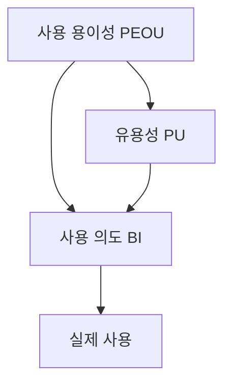

## 지식 로드맵 내 현재 위치

지식 위치: IT 전략·관리 → 사용자 수용 → **기술수용모델(TAM)**

## 30초 인출

- 본질: **기술수용모델(TAM)**은 기술의 유용성과 사용 용이성에 대한 인식으로 사용 의도를 설명하는 모델.
- 메커니즘: 사용 용이성에서 유용성·사용 의도로 이어지는 영향 관계와 사용 의도에서 실제 사용으로 이어지는 관계.

핵심 용어

- **기술수용모델(TAM, Technology Acceptance Model)** : 지각된 유용성과 사용 용이성을 중심으로 기술 사용 의도를 설명하는 모델.
- **PU(Perceived Usefulness)** : 기술이 업무 성과에 도움이 된다고 사용자가 믿는 정도.
- **PEOU(Perceived Ease of Use)** : 기술을 사용하는 데 드는 노력이 적다고 사용자가 믿는 정도.
- **BI(Behavioral Intention)** : 기술을 사용하려는 의향.
- **UTAUT(Unified Theory of Acceptance and Use of Technology)** : 성과·노력 기대 등 여러 요인을 함께 다루는 기술수용 통합 이론.

---

## 1교시 예상문제 (10점)

> 기술수용모델(TAM)의 핵심 변수와 사용 의도의 관계를 설명하시오. (예상·10점)

---

## 1교시 10점 답안

### Ⅰ. 기술수용모델의 개요

| 구분 | 핵심 |
|---|---|
| 정의 | **기술수용모델(TAM)**은 지각된 유용성과 사용 용이성으로 기술 사용 의도를 설명하는 모델 |
| 목적 | 기술 수용 이유 파악을 통한 도입·개선 방향 설정 |

### Ⅱ. 핵심 변수의 관계

### Ⅲ. 도입 시 확인 사항

| 측면 | 질문 | 확인 방법 |
|---|---|---|
| **PU** | 실제 업무에 도움이 되는가 | 사용자 조사·업무 성과 |
| **PEOU** | 배우고 쓰기 쉬운가 | 사용성 평가·이탈 지점 |
| 의도·행동 | 쓰겠다는 응답이 사용으로 이어지는가 | 의도 조사·사용 기록 비교 |

**제언:** 설문상 수용 의도와 실제 사용을 구분하는 도입 효과 평가.

---

## 2~4교시 예상문제 (25점)

> 기술수용모델의 변수와 관계를 설명하고, 신기술 도입 시 분석 방법과 한계를 제시하시오. (예상·25점)

---

## 2~4교시 25점 답안

## Ⅰ. 기술수용모델의 개요

| 구분 | 핵심 |
|---|---|
| 정의 | **기술수용모델(TAM)**은 지각된 유용성과 사용 용이성으로 기술 사용 의도를 설명하는 모델 |
| 목적 | 기술 수용 이유 파악을 통한 도입·개선 방향 설정 |

## Ⅱ. 핵심 변수의 관계

기본 구조는 **PEOU**에서 **PU**와 사용 의도로 이어지고, **PU**가 사용 의도를 설명하는 관계. 연구에 따라 태도 등 매개 변수를 포함하므로 모든 도입 사례에 동일한 경로와 효과 크기를 적용하지 않음.

## Ⅲ. 변수별 진단과 개선

| 변수 | 관찰할 문제 | 개선 방향 |
|---|---|---|
| **PU** | 업무에 도움이 되지 않는다고 인식 | 실제 과업에 필요한 기능·성과 제시 |
| **PEOU** | 학습·조작 부담 | 업무 흐름 단순화·교육 |
| **BI** | 사용 의지는 있으나 실제 사용 저조 | 접근 권한·지원·업무 제약 확인 |

설문 문항의 측정 대상은 인식과 의도. 이용 로그가 보여주는 것은 행동이며 사용 이유는 인터뷰를 통한 보완 확인.

## Ⅳ. 적용 범위와 한계

| 한계 | 이유 | 보완 자료 |
|---|---|---|
| 의도와 사용의 차이 | 조직의 의무 사용·접근 제한 | 실제 사용 기록·제도 확인 |
| 개인 인식 중심 | 비용·조직문화·보안 등 외부 요인 | 조직·환경 분석, 필요 시 **UTAUT** |
| 도입 초기 편향 | 경험 후 평가가 달라짐 | 초기·정착 이후 반복 측정 |

## Ⅴ. 기술사적 제언 — 수용과 업무 효과의 분리 평가

| 평가 단계 | 질문 | 근거 |
|---|---|---|
| 수용 | 사용자가 유용하고 쉽다고 느끼는가 | PU·PEOU 설문 |
| 사용 | 실제로 지속 사용되는가 | 사용 빈도·핵심 기능 활용 |
| 효과 | 목표 업무가 나아졌는가 | 처리 시간·오류·품질 |

수용 지표 개선에도 업무 성과 변화가 없는 경우의 재검토 항목은 기능 적합성과 업무 절차.

## 출제 이력과 검증 출처

- 공식 문제지로 확인한 직접 기출 없음. 위 문항은 예상문제다.
- [Davis, Perceived Usefulness, Perceived Ease of Use, and User Acceptance of Information Technology](https://aisel.aisnet.org/misq/vol13/iss3/6/)

## 연결 토픽

- 연계: [TAM·SAM·SOM](./089_tam_sam_som.md), [CoE](./082_coe.md)
