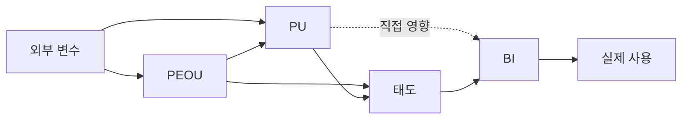

## 지식 로드맵 내 현재 위치

  IT 전략·관리
  변화관리·사용자 수용
  <strong>기술수용모델(TAM)</strong>

## 30초 인출

- 본질: 사용자가 기술을 유용하고 쉽게 느끼는지(PU·PEOU)가 수용 태도와 사용 의도(BI)를 형성해 실제 사용을 결정한다는 모델
- 메커니즘: 외부 변수(품질·교육·환경) → 인지된 용이성(PEOU) & 인지된 유용성(PU) → 태도(Attitude) → 이용의도(BI) → 실제 사용(Actual Use)
- 판정 기준: PU·PEOU 지수, 시스템 사용 로그(접속률·기능도달률) 및 업무 KPI 달성도의 삼각 검증(Triangulation) 통과 여부

약어·전문용어

- **TAM(Technology Acceptance Model)**: 기술 수용을 신념·태도·의도·사용 관계로 설명하는 모델
- **PU(Perceived Usefulness)**: 사용이 직무 성과를 높인다고 믿는 정도
- **PEOU(Perceived Ease of Use)**: 사용에 큰 노력이 들지 않는다고 믿는 정도
- **BI(Behavioral Intention)**: 기술을 사용하려는 행동 의도
- **UTAUT(Unified Theory of Acceptance and Use of Technology)**: 성과기대·노력기대·사회적 영향·촉진조건을 통합한 수용 모델

## 예상문제

> **(미출제 예상·25점)** 기술수용모델의 개념과 인과구조를 설명하고, 한계와 조직의 신기술 수용 촉진방안을 제시하시오.

## Ⅰ. TAM 개요

> 기술 자체의 우수성보다 사용자가 느끼는 유용성·용이성이 수용 행동을 좌우함.

- **정의**: 정보기술 수용을 PU와 PEOU 중심의 신념·태도·의도·사용 관계로 설명하는 모델
- **목적**: 사용자 수용 저해요인 진단·실제 사용 촉진

## Ⅱ. TAM 인과구조 및 변화관리 매핑

> PEOU는 직접 경로뿐 아니라 PU를 높이는 경로로도 수용 의도에 영향을 줌.

### 1. TAM 상세 인과 메커니즘 및 피드백 루프

### 2. 인과단계별 분석 및 개선방안

| 단계 | 분석 | 개선 |
|---|---|---|
| 외부 변수 | 시스템 품질·교육·지원 | UX·성능·지원체계 |
| PEOU | 학습·조작 부담 | 절차 단순화·온보딩 |
| PU | 업무 성과 기여 | 업무 연계·성과 가시화 |
| 태도·BI | 선호·사용 의도 | 파일럿·사용자 참여 |
| 실제 사용 | 빈도·기능·지속성 | 로그·인터뷰 기반 개선 |

:::note[모델 해석]
원형 TAM은 태도를 포함하며, 후속 연구·실무 모형은 PU에서 BI로 가는 직접 경로를 강조하거나 태도를 생략하기도 함. 답안에서는 적용한 경로를 명확히 표시함.
:::

## Ⅲ. TAM vs UTAUT 비교

> TAM은 핵심 신념을 간결하게 진단하고, UTAUT는 조직·사회적 조건까지 넓혀 설명함.

| 기준 | TAM | UTAUT |
|---|---|---|
| 중심 | PU·PEOU | 성과기대·노력기대·사회적 영향·촉진조건 |
| 강점 | 간결한 인과구조 | 조직 맥락·조절요인 반영 |
| 적용 | 초기 수용성 진단 | 전사 확산·정착 분석 |

## Ⅳ. 문제점·대응책

> 설문 의도만 측정하면 실제 사용과 업무성과를 과대평가할 수 있음.

| 위험 | 대책 | 효과 |
|---|---|---|
| 자기보고 편향 | 설문·사용 로그 교차검증 | 의도와 행동 구분 |
| 조직 맥락 누락 | 사회적 영향·지원조건 보완 | 현장 설명력 강화 |
| 단기 수용만 측정 | 도입 전·후 반복 측정 | 수용 변화 추적 |
| 사용량을 성과로 오인 | 업무 KPI·품질과 연계 | 가치 실현 검증 |

## Ⅴ. 다차원 수용성 검증을 위한 기술사적 제언

> 사용 빈도는 수용의 결과일 뿐 가치의 증거가 아님. PU·PEOU 개선이 업무성과로 이어지는지 함께 검증해야 함.

### 학습자 통찰 메모 — 답안 밖

- [핵심 통찰]: 사용자의 '사용 의도(BI)' 설문은 사회적 바람직성 편향이 개입하기 쉬움. 따라서 정량적 시스템 로그(DAU, MAU, 세션 유지시간, 주요 기능 사용률)와 업무 KPI 개선액을 결합한 객관적 증거 중심의 변화관리가 필수적임.
- 나라면: 파일럿 단계에서 설문·로그·업무성과를 삼각 측정(Triangulation)하고, 수용성 Quality Gate를 통과한 부서부터 단계적으로 전사 확산하겠음.

### 실전 답안용 기술사적 제언

- **판정 기준**: 인지된 유용성(PU) 및 용이성(PEOU) 지수, 실제 사용 로그(접속률/기능도달률) 및 업무 KPI 달성도 판정
- **대응 방안**: 사용자 중심 UX 리디자인, 현업 챔피언 중심의 단계별 온보딩 교육 및 촉진조건(기술지원 핫라인) 마련
- **검증 체계**: 설문조사–시스템 로그–업무 성과 간 삼각 검증(Triangulation), 도입 전·중·후 3단계 시계열 추적
- **기대 효과**: 막대한 SI/ERP 투자 후 방치되는 사장화(Shelfware) 리스크 방지 및 디지털 전환 투자 대비 가치(ROI) 극대화

## 1교시 10점 답안 발췌

### 1. 정의·목적

- **정의**: 정보기술 수용을 인지된 유용성(PU)과 인지된 용이성(PEOU) 중심의 신념·태도·의도·사용 인과관계로 설명하는 **행동과학 기반 기술수용 프레임워크**
- **목적**: 신기술 도입 저해요인 조기 식별 및 변화관리를 통한 전사 정착(Shelfware 방지)

### 2. 인과구조 및 구성체계

### 3. 핵심 요소 및 실무 통제

| 요소 | 의미 | 실무 통제 방안 |
|---|---|---|
| **PU** | 업무 성과에 도움이 되는가 | 핵심 KPI 연동 및 성과 가시화 |
| **PEOU** | 쉽게 배워 사용할 수 있는가 | 직관적 UX 리디자인 및 온보딩 지원 |
| **BI·사용** | 사용할 의도와 실제 행동 | 사용 로그(DAU/MAU)와 삼각 검증 |

## 출제 이력과 검증 출처

- 공식 문제지 원문 확인 전까지 직접 기출로 단정하지 않음
- [Davis, Perceived Usefulness, Perceived Ease of Use, and User Acceptance of Information Technology](https://doi.org/10.2307/249008)
- [Davis·Bagozzi·Warshaw, User Acceptance of Computer Technology](https://doi.org/10.1287/mnsc.35.8.982)
- [Venkatesh et al., User Acceptance of Information Technology: Toward a Unified View](https://doi.org/10.2307/30036540)

## 학습 체크

- [ ] Ⅰ: TAM의 정의·목적을 PU·PEOU로 설명할 수 있는가?
- [ ] Ⅱ: 외부 변수에서 실제 사용까지의 인과경로를 그릴 수 있는가?
- [ ] Ⅲ: TAM과 UTAUT의 적용 차이를 비교할 수 있는가?
- [ ] Ⅳ: 설문 편향·조직 맥락·성과 오인의 대책을 제시할 수 있는가?
- [ ] Ⅴ: 설문·로그·업무성과를 결합한 검증안을 제시할 수 있는가?

## 연결 토픽

- 이전 토픽: [적정 사업기간·과업심의](./091_public_sw_cost_and_scope_change_criteria.md)
- 연관 토픽: [디자인 씽킹](./047_design_thinking.md), [TAM-SAM-SOM](./089_tam_sam_som.md)
- 다음 토픽: [SW 사업 하도급 구조](./097_software_industry_subcontracting_structure.md)
