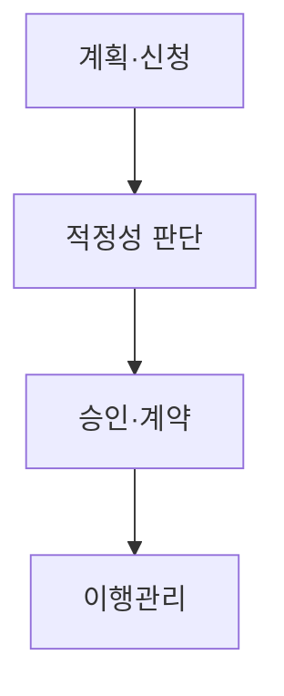
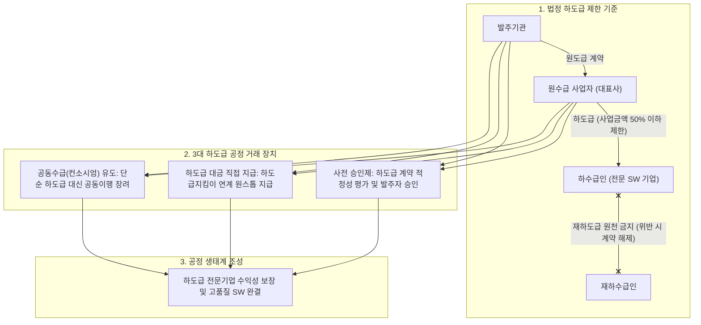

## 지식 로드맵 내 현재 위치
현재 위치: IT 전략·관리 → 공공 SW 사업 **하도급** 제한

## 30초 인출

- 본질: 공공 **SW** 사업에서 원수급인의 직접수행 책임을 강화하고 다단계 **하도급** 폐해를 방지하기 위한 제도적 통제 장치이다.
- 메커니즘: 물품 구매금액 제외 순수 **SW** 50% 초과 **하도급** 제한 → **재하도급** 원칙적 금지 → 발주기관 **사전승인** → 이행 점검 및 대금 직불한다.
- 판정 기준: 소프트웨어진흥법 제51조 준수 여부(50% 상한, 법정 예외 사유 타당성) 및 **WBS** -형상관리 기반 실체 일치성이다.

핵심 용어

- **SW(Software)** : 발주 요구사항에 따라 공공 업무를 수행하는 소프트웨어 인도물
- **하도급** : 원수급인이 도급받은 사업의 일부를 제3의 사업자에게 위탁하여 수행시키는 계약 방식
- **재하도급** : 하수급인이 위탁받은 사업의 일부를 다시 제3자에게 위탁하는 계약 형태(원칙적 금지)
- **사전승인** : 하도급 계약 체결 전 발주기관으로부터 적법성과 타당성을 심사받는 승인 절차
- **WBS(Work Breakdown Structure)** : 사업 범위를 계층적으로 분해하여 하도급 경계를 통제하는 작업분류체계
- **RTM(Requirements Traceability Matrix)** : 발주 요구사항과 하도급 과업 간의 이행 관계를 추적하는 관리 표
- **하도급지킴이** : 하도급 대금 체불을 방지하고 지급 과정을 실시간 모니터링하는 전자대금시스템

## 예상문제

> **(미출제 예상·25점)** 소프트웨어진흥법상 공공 SW 사업의 **하도급** 제한 원칙·예외·승인 절차를 설명하고, 관리상 문제점과 대응책을 제시하시오.

## Ⅰ. 공공 SW 사업 하도급 제한 개요

- 정의: **소프트웨어진흥법** 제51조에 따라 공공 SW 사업의 **하도급** 비율· **재하도급** · **사전승인** 을 통제하는 제도
- 목적: **원수급인 책임** 강화·다단계 **하도급** 방지· **사업 품질** 보호

## Ⅱ. 제한 원칙·예외 및 산정 메커니즘

> 50%는 직접수행 비율을 일률적으로 선언하는 표현보다 산정 기준과 법정 예외를 함께 제시해야 정확함.

### 1. 하도급 50% 제한 산정 기준 및 승인 메커니즘

### 2. 제한 원칙 및 예외 상세 비교

| 구분 | 원칙 | 예외·통제 |
|---|---|---|
| **하도급** | 물품 구매금액 제외 SW 사업금액의 50% 초과 제한 | 물품 설치·유지관리, 신기술·전문기술 등 |
| **재하도급** | 하수급인의 **재하도급** 제한 | 법정 사유·절차에 따른 예외 |
| 승인 | 계약 전 **사전승인** | 승인 내용대로 이행·관리 |

## Ⅲ. 하도급 승인·관리 절차

> 신청서의 계약 구조와 실제 수행 구조가 일치하는지를 승인 전·후로 확인함.

- 활동: 범위·금액·하수급인 수행계획 작성 → 계약·대금·수행능력 타당성 심의 → 승인 통보·표준 **하도급** 계약 체결 → 승인 범위·투입인력·대금 직불( **하도급** 지킴이) 점검
- 산출: 승인신청서·계약서안 → 적정성 심의 결과 → 표준 **하도급** 계약 → 이행 점검 기록

## Ⅳ. 문제점·대응책

> 승인서만 확인하면 무단 **재하도급** ·수행주체 변경·대금 지연을 발견하기 어려움.

| 위험 | 대책 | 효과 |
|---|---|---|
| 무단 **하도급** · **재하도급** | 계약·투입조직·산출물 교차점검 | 실제 수행주체 확인 |
| 형식적 승인 | 범위·대금·역량 중심 판단 | 승인 실효성 확보 |
| 승인 후 구조 변경 | 변경 **사전승인** ·정기점검 | 계약·현장 일치 |
| 대금 지연 | 지급계획·증빙 추적 | 하수급인 보호 |

## Ⅴ. 산출물 일치성 검증을 위한 기술사적 제언

> **하도급** 비율 준수만으로 품질이 보장되지 않으며, 승인된 역할과 실제 산출물 책임의 일치가 핵심임.

### 실전 답안용 기술사적 제언

- 문제: 공공 SW 사업에서 3차, 4차 다단계 하도급으로 인해 개발자 처우가 악화되고, 중간 마진 착취로 최종 SW 품질이 심각하게 저하됨.
- 해결 방안: 소프트웨어 진흥법 제51조에 따라 원칙적으로 사업금액의 50%를 초과하는 하도급을 금지하고 재하도급을 원천 차단하며, 발주자 사전 승인제도와 하도급 대금 직접지급제(하도급지킴이)를 통해 투명성을 통제함.

## 1교시 10점 답안 발췌

### 1. 정의·목적

- 정의: 공공 SW 사업의 부실을 방지하고 중소 SW 기업을 보호하기 위해 다단계 하도급을 엄격히 규제하고 대금 지급을 투명화하는 법정 거래 질서 통제 체계
- 목적: 다단계 하도급으로 인한 개발자 임금 착취 및 부실 방지 · SW 전문 중소기업의 자생력 보호 · 공공 정보시스템 품질 및 신뢰성 확보

- **정의** : 공공 SW 사업의 **하도급** 비율· **재하도급** · **사전승인** 을 통제하는 제도.
- **목적** : 원수급인 책임 강화·다단계 **하도급** 방지·사업 품질 보호.

### 2. 하도급 50% 제한 및 승인 체계

### 3. 핵심 통제

| 통제 | 핵심 |
|---|---|
| **하도급 한도** | 물품 구매금액 제외 SW 사업금액의 50% 초과 제한 |
| **재하도급** | 원칙적 제한·법정 예외 한정 |
| **승인 관리** | 계약 전 **사전승인** 및 **하도급** 지킴이 직불 관리 |

## 출제 이력과 검증 출처

- 공식 문제지 원문 확인 전까지 직접 기출로 단정하지 않음
- [국가법령정보센터, 소프트웨어진흥법 제51조](https://www.law.go.kr/법령/소프트웨어진흥법/제51조)
- [국가법령정보센터, 소프트웨어진흥법 시행령 제48조](https://www.law.go.kr/법령/소프트웨어진흥법시행령/제48조)
- [국가법령정보센터, 소프트웨어사업 계약 및 관리감독에 관한 지침](https://www.law.go.kr/LSW/admRulLsInfoP.do?admRulId=33440&efYd=0)

## 학습 체크

- [ ] Ⅰ: **하도급** 제한의 정의·목적을 설명할 수 있는가?
- [ ] Ⅱ: 50% 초과 제한의 산정 기준과 예외를 구분할 수 있는가?
- [ ] Ⅲ: 신청부터 이행관리까지 활동·산출을 연결할 수 있는가?
- [ ] Ⅳ: 무단 **하도급** ·형식적 승인에 대한 대책을 제시할 수 있는가?
- [ ] Ⅴ: 승인 내용과 실제 수행을 검증하는 통제안을 제시할 수 있는가?

## 연결 토픽

- 이전 토픽: [기술수용모델(TAM)](./092_technology_acceptance_model.md)
- 연관 토픽: [공공 SW 계약](./039_public_sw_contract.md), [적정 사업기간·과업심의](./091_public_sw_cost_and_scope_change_criteria.md)
- 다음 토픽: [전문성의 민주화](./098_democratization_of_expertise.md)
