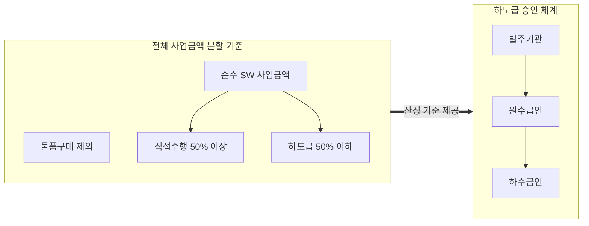
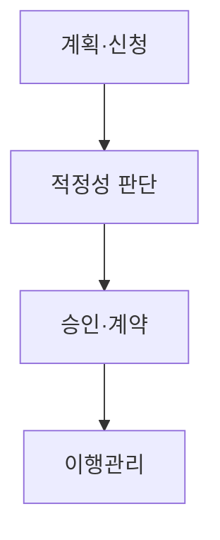

## 지식 로드맵 내 현재 위치

  IT 전략·관리
  공공 SW 사업 제도
  <strong>하도급 제한</strong>

## 30초 인출

- 본질: 공공 SW 사업에서 원수급인의 직접수행 책임을 강화하고 다단계 하도급 폐해를 방지하기 위한 제도적 통제 장치
- 메커니즘: 물품 구매금액 제외 순수 SW 50% 초과 하도급 제한 → 재하도급 원칙적 금지 → 발주기관 사전승인 → 이행 점검 및 대금 직불
- 판정 기준: 소프트웨어진흥법 제51조 준수 여부(50% 상한, 법정 예외 사유 타당성) 및 WBS-형상관리 기반 실체 일치성

약어·전문용어

- **SW(Software)**: 소프트웨어
- **하도급**: 원수급인이 도급받은 사업의 일부를 제3자에게 수행시키는 계약
- **재하도급**: 하수급인이 도급받은 사업을 다시 제3자에게 하도급하는 계약
- **사전승인**: 하도급·재하도급 계약 전에 국가기관 등의 장에게 받는 승인
- **WBS(Work Breakdown Structure)**: 사업 범위를 관리 가능한 작업으로 분해한 구조
- **RTM(Requirements Traceability Matrix)**: 요구사항과 산출물의 추적 관계를 기록한 표
- **하도급지킴이**: 조달청이 운영하는 하도급 대금 지급 정보 관리 시스템

## 예상문제

> **(미출제 예상·25점)** 소프트웨어진흥법상 공공 SW 사업의 하도급 제한 원칙·예외·승인 절차를 설명하고, 관리상 문제점과 대응책을 제시하시오.

## Ⅰ. 공공 SW 사업 하도급 제한 개요

> 원수급인의 수행 책임을 확보하고 다단계 하도급에 따른 품질·대금 위험을 통제하는 제도.

- **정의**: 소프트웨어진흥법 제51조에 따라 공공 SW 사업의 하도급 비율·재하도급·사전승인을 통제하는 제도
- **목적**: 원수급인 책임 강화·다단계 하도급 방지·사업 품질 보호

## Ⅱ. 제한 원칙·예외 및 산정 메커니즘

> 50%는 직접수행 비율을 일률적으로 선언하는 표현보다 산정 기준과 법정 예외를 함께 제시해야 정확함.

### 1. 하도급 50% 제한 산정 기준 및 승인 메커니즘

### 2. 제한 원칙 및 예외 상세 비교

| 구분 | 원칙 | 예외·통제 |
|---|---|---|
| 하도급 | 물품 구매금액 제외 SW 사업금액의 50% 초과 제한 | 물품 설치·유지관리, 신기술·전문기술 등 |
| 재하도급 | 하수급인의 재하도급 제한 | 법정 사유·절차에 따른 예외 |
| 승인 | 계약 전 사전승인 | 승인 내용대로 이행·관리 |

## Ⅲ. 하도급 승인·관리 절차

> 신청서의 계약 구조와 실제 수행 구조가 일치하는지를 승인 전·후로 확인함.

- 활동: 범위·금액·하수급인 수행계획 작성 → 계약·대금·수행능력 타당성 심의 → 승인 통보·표준하도급계약 체결 → 승인 범위·투입인력·대금 직불(하도급지킴이) 점검
- 산출: 승인신청서·계약서안 → 적정성 심의 결과 → 표준하도급계약 → 이행 점검 기록

## Ⅳ. 문제점·대응책

> 승인서만 확인하면 무단 재하도급·수행주체 변경·대금 지연을 발견하기 어려움.

| 위험 | 대책 | 효과 |
|---|---|---|
| 무단 하도급·재하도급 | 계약·투입조직·산출물 교차점검 | 실제 수행주체 확인 |
| 형식적 승인 | 범위·대금·역량 중심 판단 | 승인 실효성 확보 |
| 승인 후 구조 변경 | 변경 사전승인·정기점검 | 계약·현장 일치 |
| 대금 지연 | 지급계획·증빙 추적 | 하수급인 보호 |

## Ⅴ. 산출물 일치성 검증을 위한 기술사적 제언

> 하도급 비율 준수만으로 품질이 보장되지 않으며, 승인된 역할과 실제 산출물 책임의 일치가 핵심임.

### 학습자 통찰 메모 — 답안 밖

- [핵심 통찰]: 하도급 계약 승인은 서류 절차에 불과할 수 있음. 실무에서 빈번한 '외주 인력 파견 위장'이나 '무단 2차 재하도급'을 방지하려면 형상관리 시스템(Git 커밋 로그, 작성자 서명)과 WBS 작업 패키지의 담당자를 실시간 매핑 검증해야 함.
- 나라면: 승인 범위·담당 조직·산출물 책임을 WBS와 RTM에 연결하고, 하도급지킴이를 통한 노임 직불 체계를 의무화하겠음.

### 실전 답안용 기술사적 제언

- **판정 기준**: 물품 제외 순수 SW 금액 기준 50% 초과 여부, 법정 재하도급 예외 요건 충족 및 사전승인 신청 적시성 판정
- **대응 방안**: 소프트웨어진흥법 제51조 기반 사전승인제 준수, 표준하도급계약서 작성 및 조달청 하도급지킴이 직불제 가동
- **검증 체계**: WBS 작업 패키지-형상관리 커밋 기록 간 실제 수행주체 교차 검증, 분기별 정기 현장 감리 점검
- **기대 효과**: 다단계 하도급 마진 누수 차단, 원수급자의 책임 완수 유도 및 중소 전문 SW 개발자의 정당한 처우 보장

## 1교시 10점 답안 발췌

### 1. 정의·목적

- **정의**: 공공 SW 사업의 하도급 비율·재하도급·사전승인을 통제하는 제도
- **목적**: 원수급인 책임 강화·다단계 하도급 방지·사업 품질 보호

### 2. 하도급 50% 제한 및 승인 체계

### 3. 핵심 통제

| 통제 | 핵심 |
|---|---|
| **하도급 한도** | 물품 구매금액 제외 SW 사업금액의 50% 초과 제한 |
| **재하도급** | 원칙적 제한·법정 예외 한정 |
| **승인 관리** | 계약 전 사전승인 및 하도급지킴이 직불 관리 |

## 출제 이력과 검증 출처

- 공식 문제지 원문 확인 전까지 직접 기출로 단정하지 않음
- [국가법령정보센터, 소프트웨어진흥법 제51조](https://www.law.go.kr/법령/소프트웨어진흥법/제51조)
- [국가법령정보센터, 소프트웨어진흥법 시행령 제48조](https://www.law.go.kr/법령/소프트웨어진흥법시행령/제48조)
- [국가법령정보센터, 소프트웨어사업 계약 및 관리감독에 관한 지침](https://www.law.go.kr/LSW/admRulLsInfoP.do?admRulId=33440&efYd=0)

## 학습 체크

- [ ] Ⅰ: 하도급 제한의 정의·목적을 설명할 수 있는가?
- [ ] Ⅱ: 50% 초과 제한의 산정 기준과 예외를 구분할 수 있는가?
- [ ] Ⅲ: 신청부터 이행관리까지 활동·산출을 연결할 수 있는가?
- [ ] Ⅳ: 무단 하도급·형식적 승인에 대한 대책을 제시할 수 있는가?
- [ ] Ⅴ: 승인 내용과 실제 수행을 검증하는 통제안을 제시할 수 있는가?

## 연결 토픽

- 이전 토픽: [기술수용모델(TAM)](./092_technology_acceptance_model.md)
- 연관 토픽: [공공 SW 계약](./039_public_sw_contract.md), [적정 사업기간·과업심의](./091_public_sw_cost_and_scope_change_criteria.md)
- 다음 토픽: [전문성의 민주화](./098_democratization_of_expertise.md)
